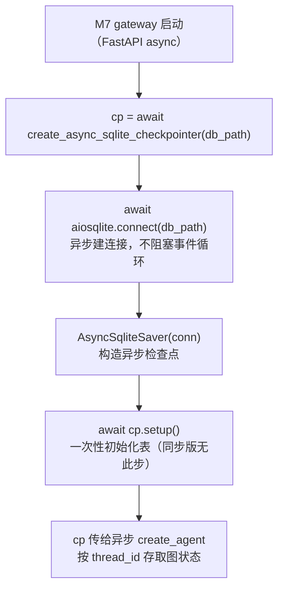

# agents/checkpointer/async_provider.py — async_provider.py

> **文件路径**: `backend/packages/harness/agentflow/agents/checkpointer/async_provider.py`
> **目录位置**: agents → checkpointer → async_provider.py
> **职责**: 异步 SQLite 检查点

## 📑 目录

- [📋 结构图](#📋-结构图)
- [📤 关键导出](#📤-关键导出)
- [💡 设计思想](#💡-设计思想)
- [🎯 实用场景](#🎯-实用场景)
- [📊 顺序执行链流程图](#📊-顺序执行链流程图)
- [🧩 代码解析（成块对照 async_provider.py）](#🧩-代码解析成块对照-async_providerpy)
- [❓ Q&A / 知识点](#❓-qa--知识点)
- [⚠️ 风险点](#⚠️-风险点)

## 📋 结构图

```text
┌──────────────────────────────────────────────┐
│ async create_async_sqlite_checkpointer(     │
│         db_path) → AsyncSqliteSaver         │
│   conn = await aiosqlite.connect(db_path)   │
│   return AsyncSqliteSaver(conn)             │
│                                              │
│ 用法（M7 FastAPI）:                          │
│   cp = await create_async_sqlite_checkpointer│
│   await cp.setup()  （一次性初始化表）        │
└──────────────────────────────────────────────┘
```

## 📤 关键导出

（无顶层导出，见结构图）

## 💡 设计思想

1. 异步检查点基于 aiosqlite，为 M7 gateway（FastAPI async 端点）预留。
2. 与 provider.py 同步版并存：CLI 用同步，gateway 用异步，互不干扰。

## 🎯 实用场景

1. 异步检查点：AsyncSqliteSaver（未来 gateway 异步场景用）

## 📊 顺序执行链流程图

```text
M7 gateway（FastAPI async 端点）启动（request）
│
▼
cp = await create_async_sqlite_checkpointer(db_path)
│                              ← async 工厂函数，必须 await
▼
await aiosqlite.connect(db_path)
│                              ← 异步建连接（不阻塞事件循环）
▼
AsyncSqliteSaver(conn)        ← 用异步连接构造 langgraph 异步检查点
│
▼
await cp.setup()              ← 一次性初始化检查点表（同步版无需，本步独有）
│
▼
把 cp 传给异步版 create_agent → 图在 async 端点按 thread_id 存取状态
```

**Mermaid 版（GitHub / 飞书渲染；VSCode 需装插件）**：



## 🧩 代码解析（成块对照 async_provider.py）

> 读法：每块先贴**完整代码**，再看块下方的整块解析。代码与文件一致，仅省略头部规范注释。

### 块 1：imports —— 异步依赖

```python
from __future__ import annotations

import aiosqlite

# AsyncSqliteSaver: langgraph 官方异步检查点（基于 aiosqlite）
from langgraph.checkpoint.sqlite.aio import AsyncSqliteSaver
```

**整块解析**：与同步版（provider.py）的对称关系——标准库 `sqlite3` 换成 `aiosqlite`（异步 SQLite 驱动），`SqliteSaver` 换成 `langgraph.checkpoint.sqlite.aio` 子模块里的 `AsyncSqliteSaver`。包路径多了一层 `.aio`。CLI 用不到这两个 import（M1-M6 走同步版），仅为 M7 gateway 预留。

### 块 2：`async create_async_sqlite_checkpointer()` —— 异步工厂

```python
async def create_async_sqlite_checkpointer(db_path: str) -> AsyncSqliteSaver:
    """创建异步 SQLite 检查点（M7 gateway 用）。

    参数:
        db_path: SQLite 文件路径

    返回:
        AsyncSqliteSaver（调用方需 await cp.setup() 完成初始化）
    """
    conn = await aiosqlite.connect(db_path)
    return AsyncSqliteSaver(conn)
```

**整块解析**：与同步版函数体同构，但处处 `await`——① `await aiosqlite.connect(db_path)` 异步建连接（不阻塞事件循环）；② `AsyncSqliteSaver(conn)` 构造并返回。与同步版的关键差异写在 docstring 返回段：**调用方拿到 saver 后必须再 `await cp.setup()` 一次性建好检查点表**，同步版 `SqliteSaver` 无需这步。这是 M1-M6 不能在 CLI 误用本文件的原因——漏了 setup 会缺表。

## ❓ Q&A / 知识点

### 为什么同步版不用 `setup()`，异步版却要？

**一句话**：`AsyncSqliteSaver` 首次使用前需显式 `await setup()` 建 checkpoint 相关表；同步版 `SqliteSaver(conn)` 构造时表结构由连接/首次操作隐式处理。docstring 明确要求调用方（M7 gateway）在拿到 saver 后先 `await cp.setup()`，否则读写状态会报表不存在。

### M1-M6 为什么不能用这个异步检查点？

**一句话**：一是 CLI 是同步阻塞模型（`agent.stream` 同步跑），异步 saver 要在事件循环里 await 才能用；二是漏了 `await cp.setup()` 初始化步骤会缺表。同步场景统一用 `provider.py` 的 `create_sqlite_checkpointer`，异步 gateway（M7）才走本文件——两份并存、互不干扰。

## ⚠️ 风险点

1. 返回的 saver 需 await setup() 初始化表（同步版无需）
2. M1-M6 不使用此文件，勿在 CLI 误用（会缺初始化步骤）

---
_自动生成于 doc-code 规范落地（2026-09-28）。来源：async_provider.py 头部注释 + 顶层符号。_
_2026-09-30 补齐：目录 + 顺序执行链流程图 + 成块代码解析（+Q&A）。_
