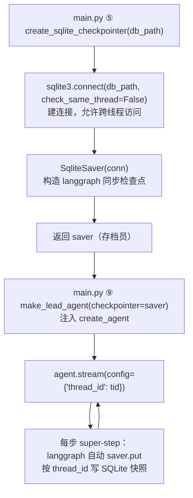

# agents/checkpointer/provider.py — provider.py

> **文件路径**: `backend/packages/harness/agentflow/agents/checkpointer/provider.py`
> **目录位置**: agents → checkpointer → provider.py
> **职责**: 同步 SQLite 检查点

## 📑 目录

- [📋 结构图](#📋-结构图)
- [📤 关键导出](#📤-关键导出)
- [💡 设计思想](#💡-设计思想)
- [🎯 实用场景](#🎯-实用场景)
- [📊 顺序执行链流程图](#📊-顺序执行链流程图)
- [🧩 代码解析（成块对照 provider.py）](#🧩-代码解析成块对照-providerpy)
- [❓ Q&A / 知识点](#❓-qa--知识点)
- [⚠️ 风险点](#⚠️-风险点)

## 📋 结构图

```text
┌──────────────────────────────────────────────┐
│ create_sqlite_checkpointer(db_path)          │
│   conn = sqlite3.connect(db_path,            │
│           check_same_thread=False)           │
│   return SqliteSaver(conn)                   │
│                                              │
│ 用法（agent.py）:                             │
│   create_agent(..., checkpointer=checkpointer)│
└──────────────────────────────────────────────┘
```

## 📤 关键导出

**函数**

- `create_sqlite_checkpointer()`

## 💡 设计思想

1. 3.x 的 from_conn_string() 返回上下文管理器（with 才拿到实例），
   不适合这里；直接构造 SqliteSaver(conn) 更简单（P-010 教训）。
2. 每步自动把图状态序列化存入 SQLite（无需手写存取）。

## 🎯 实用场景

1. SQLite 检查点工厂：SqliteSaver 连接封装（thread_id 维度持久化）

## 📊 顺序执行链流程图

```text
cli/main.py ⑤ create_sqlite_checkpointer(db_path)（request）
│
▼
sqlite3.connect(db_path, check_same_thread=False)
│                              ← 建连接；check_same_thread=False 允许跨线程用
▼
SqliteSaver(conn)             ← 用连接构造 langgraph 官方同步检查点
│
▼
返回 saver（存档员）            ← 持有 SQLite 连接，本函数到此结束
│
▼
main.py ⑨ make_lead_agent(checkpointer=saver, ...)
│                              ← 注入 create_agent（见 lead_agent/agent.md）
▼
agent.stream(config={"configurable": {"thread_id": tid}})
│                              ← 图每走完一步：langgraph 自动调 saver.put
▼
按 thread_id 把图状态快照序列化写 SQLite（会话可恢复的核心）
```

**Mermaid 版（GitHub / 飞书渲染；VSCode 需装插件）**：



## 🧩 代码解析（成块对照 provider.py）

> 读法：每块先贴**完整代码**，再看块下方的整块解析。代码与文件一致，仅省略头部规范注释。

### 块 1：imports —— 两个依赖

```python
from __future__ import annotations

import sqlite3

# SqliteSaver: langgraph-checkpoint-sqlite 官方同步检查点实现
# 每步自动把图状态序列化存入 SQLite（无需手写存取）
from langgraph.checkpoint.sqlite import SqliteSaver
```

**整块解析**：依赖极简——标准库 `sqlite3`（建连接）+ langgraph 官方包 `SqliteSaver`（同步检查点实现）。`from __future__ import annotations` 让类型注解延迟求值。本文件不手写任何存取 SQL：`SqliteSaver` 内部负责把图状态序列化、建表、按 thread_id 读写。

### 块 2：`create_sqlite_checkpointer()` —— 工厂函数

```python
def create_sqlite_checkpointer(db_path: str) -> SqliteSaver:
    """创建同步 SQLite 检查点。

    参数:
        db_path: SQLite 文件路径（建议与业务库同一个 data/agentflow.db）

    返回:
        SqliteSaver: 传给 create_agent 的 checkpointer

    实现说明:
        - 直接 SqliteSaver(conn) 构造（3.x 的 from_conn_string 返回
          上下文管理器，需 with 才能用，不适合这里）
        - check_same_thread=False: langgraph 内部线程池可能跨线程
          访问连接，SQLite 串行化由 WAL + 短事务保证
    """
    conn = sqlite3.connect(db_path, check_same_thread=False)
    return SqliteSaver(conn)
```

**整块解析**：函数体只有两行——① `sqlite3.connect(db_path, check_same_thread=False)` 打开数据库文件；② 把连接交给 `SqliteSaver(conn)` 构造并返回。两个关键设计：

| 关键点 | 为什么 |
|---|---|
| 直接构造 `SqliteSaver(conn)`，不用 `from_conn_string()` | 3.x 的 `from_conn_string` 返回上下文管理器，要 `with` 才拿得到实例；这里是装配阶段，直接构造更简单（P-010 教训） |
| `check_same_thread=False` | CLI 虽单线程跑，但 langgraph 内部线程池可能跨线程访问连接；SQLite 的串行化由 WAL + 短事务保证 |

返回值类型标注为 `SqliteSaver`，调用方（agent.py）把它直接传给 `create_agent(checkpointer=...)`。

## ❓ Q&A / 知识点

### 为什么用 `SqliteSaver(conn)` 而不是 `from_conn_string()`？

**一句话**：langgraph-checkpoint-sqlite 3.x 的 `from_conn_string()` 返回的是**上下文管理器**，必须 `with` 语句才能拿到 `SqliteSaver` 实例；本文件在装配函数里要**立刻返回一个 saver 给 create_agent**，没有 `with` 块可用，所以直接 `sqlite3.connect(...)` 建连接后 `SqliteSaver(conn)` 构造更顺手（P-010 教训）。

### `check_same_thread=False` 危险吗？

**一句话**：SQLite 默认禁止跨线程用同一个连接（`check_same_thread=True` 会抛错）。这里设 False 是因为 langgraph 内部线程池可能在别的线程访问该连接；并发安全不靠 SQLite 默认锁，而由 WAL 模式 + 短事务串行化保证。CLI 单线程跑，但工具节点可能在后台线程执行（P-018），必须放行。

## ⚠️ 风险点

1. check_same_thread=False 是必须的（CLI 单线程跑，但 langgraph 内部可能跨线程）
2. 换异步场景用 async_provider.py，不要改本文件

---
_自动生成于 doc-code 规范落地（2026-09-28）。来源：provider.py 头部注释 + 顶层符号。_
_2026-09-30 补齐：目录 + 顺序执行链流程图 + 成块代码解析（+Q&A）。_
