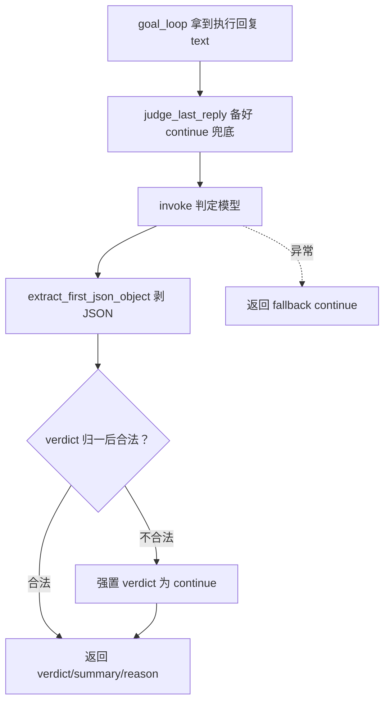

# agents/goal/goal_judge.py — goal_judge.py

> **文件路径**: `backend/packages/harness/agentflow/agents/goal/goal_judge.py`
> **目录位置**: agents → goal → goal_judge.py
> **职责**: 步骤完成判定器（独立判定模型，M5）——只分 continue/complete 两路

## 📑 目录

- [📋 结构图](#📋-结构图)
- [📤 关键导出](#📤-关键导出)
- [💡 设计思想](#💡-设计思想)
- [🎯 实用场景](#🎯-实用场景)
- [📊 顺序执行链流程图](#📊-顺序执行链流程图)
- [🧩 代码解析（成块对照 goal_judge.py）](#🧩-代码解析成块对照-goal_judgepy)
- [❓ Q&A / 知识点](#❓-qa--知识点)
- [⚠️ 风险点](#⚠️-风险点)

## 📋 结构图

```text
┌────────────────────────────────────────────────────────────┐
│ _JUDGE_PROMPT（判定器提示词：强制 JSON，只分两路）          │
│                                                           │
│ judge_last_reply(model, last_text) -> dict               │
│   {"verdict":"continue|complete","summary":...,"reason":...} │
│   解析失败 / 异常 -> verdict="continue" 兜底                │
└────────────────────────────────────────────────────────────┘
```

**调用链（Grep 自 agentflow. 核实）**：

- **谁调用它**：`agents/goal/goal_loop.py` —— `_run` 每圈 `verdict = judge_last_reply(self._model, text)`
  （line 209）；测试里该函数被 monkeypatch 替换为假判定器。
- **它调用谁**：`langchain_core.messages.HumanMessage`（拼判定输入）、
  `agentflow.plans.types.extract_first_json_object`（容错剥判定模型回复里的 JSON）。

## 📤 关键导出

**常量**

- `_JUDGE_PROMPT`（模块内部）

**函数**

- `judge_last_reply()`

## 💡 设计思想

1. 判定模型与主 Agent 解耦：专门喂一段"你是判定器"的提示词，强制 JSON 输出——不让执行模型
   自己说自己完成（自评不可靠）。
2. 容错即安全：任何解析失败/异常都判 `continue`（宁可多跑一轮，不误判完工）；连续 continue
   由 goal_loop 的 `fallback_streak≥3` 熔断 paused（R1）。
3. M5 砍掉 evoflow 原版的 `wait_user` 死路：判定只分 continue/complete 两路，不等人。

## 🎯 实用场景

1. 逐步验收：`_run` 每圈拿到模型执行回复后调 `judge_last_reply`，决定收步还是再 nudge 一轮。
2. 测试替身：测试 monkeypatch 本函数，喂固定 verdict，无需真起判定模型。

## 📊 顺序执行链流程图（判定一轮执行回复）

```text
goal_loop._run 拿到模型执行回复 text（request：这步做完没？）
│
▼
judge_last_reply(model, text)
│   fallback = {"verdict":"continue",...} 先备好兜底
▼
model.invoke([HumanMessage(_JUDGE_PROMPT + text[:2000])])
│
▼
取 resp.content；extract_first_json_object 截 JSON；json.loads
│
▼
verdict 归一：strip().lower()；不在 (complete,continue) -> 强置 continue
│
▼
返回 {"verdict","summary","reason"}
│   任何异常 -> 直接返回 fallback（verdict=continue）
▼
goal_loop：verdict==complete 或文本含 <completed> -> 收步；否则步回落 pending + fallback_streak+=1
```

**Mermaid 版（GitHub / 飞书渲染；VSCode 需装插件）**：



## 🧩 代码解析（成块对照 goal_judge.py）

> 读法：每块先贴**完整代码**，再看块下方的整块解析。代码与文件逐字一致。

### 块 1：imports + _JUDGE_PROMPT 判定器提示词

```python
from __future__ import annotations

from langchain_core.messages import HumanMessage

from agentflow.plans.types import extract_first_json_object

_JUDGE_PROMPT = (
    "你是任务完成判定器。下面是执行 Agent 针对某一步骤给出的回复。"
    "请判断【该步骤是否已经完成】，只输出一个严格 JSON 对象，不要任何其他文字：\n"
    '{"verdict":"complete"|"continue","summary":"一句话总结本步成果","reason":"判断理由"}\n'
    "判定规则：\n"
    "- verdict=complete：本步骤目标已达成；\n"
    "- verdict=continue：还没做完，需要继续；\n"
    "- summary/reason 都用中文短句；拿不准时判 continue。\n\n"
    "执行 Agent 的回复如下：\n"
)
```

**结构简析**：imports 引入 `HumanMessage`（拼判定输入）与 `extract_first_json_object`（容错剥 JSON）；
随后定义模块内部常量 `_JUDGE_PROMPT`——角色隔离的判定器提示词，强制严格 JSON，只分 continue/complete 两路。

**函数参数逐条解释**：本块无函数，仅定义模块内部提示词常量 `_JUDGE_PROMPT`。

**落库要点**：提示词定死 JSON 形状 `{"verdict":"complete"|"continue","summary","reason"}`，
并明说"拿不准时判 continue"——与函数体兜底策略一致（宁可多跑不误判）。判定模型回复同样可能带废话，
故复用 `extract_first_json_object`，与计划解析共用同一套容错。

### 块 2：judge_last_reply —— 判定主函数（全程兜底）

```python
def judge_last_reply(model, last_text: str) -> dict:
    """调判定模型，返回 {verdict, summary, reason}。

    任何异常 / JSON 解析失败 → verdict="continue"，summary/reason 兜底空串。
    """
    fallback = {"verdict": "continue", "summary": "", "reason": ""}
    try:
        resp = model.invoke([HumanMessage(_JUDGE_PROMPT + str(last_text)[:2000])])
        content = getattr(resp, "content", resp)
        if not isinstance(content, str):
            content = str(content)
        blob = extract_first_json_object(content)
        import json

        data = json.loads(blob)
        verdict = str(data.get("verdict", "")).strip().lower()
        if verdict not in ("complete", "continue"):
            verdict = "continue"
        return {
            "verdict": verdict,
            "summary": str(data.get("summary", "") or ""),
            "reason": str(data.get("reason", "") or ""),
        }
    except Exception:  # noqa: BLE001 —— 判定输出不可控，任何解析失败都回退（fallback streak 计数）
        return fallback
```

**结构简析**：整个函数包在一个 `try/except Exception` 里，先备好 `fallback={"verdict":"continue",...}`——
判定器是"旁路安全网"，它自己出问题时必须 fail-safe 到 continue，而不是抛错崩掉整个长任务。

**`judge_last_reply()` 参数逐条解释**：

| 参数 | 类型 | 默认值 | 含义 |
|---|---|---|---|
| `model` | （langchain chat model） | 必填 | 判定模型实例；函数以 `[HumanMessage(_JUDGE_PROMPT + str(last_text)[:2000])]` 调 `model.invoke`；`getattr(resp,"content",resp)` 兼容返回是 AIMessage 还是裸字符串 |
| `last_text` | `str` | 必填 | 执行 Agent 针对当前步的回复原文；函数 `str(last_text)[:2000]` 硬截断防长回复撑爆判定上下文 |

**落库要点**：解析走 `extract_first_json_object(content)` + `json.loads`；`verdict` 经
`strip().lower()` 归一后**不在 `("complete","continue")` 两路里就强置 continue**；
任何异常（模型挂、JSON 崩、字段缺）都落到 `except` 返回 fallback。连续 continue 由 goal_loop
的 `fallback_streak≥3` 熔断 paused（R1），所以"一直判 continue"不会无限空转。

## ❓ Q&A / 知识点

### 1. 判定解析失败时为什么默认 verdict=continue，而不是 complete 或抛错？

**一句话**：continue 是"多跑一轮"的安全默认——误判 complete 会提前收步丢工作，抛错会崩掉闭环；fail-safe 到 continue 最保守。

判定器本身可能挂（超时、JSON 解析失败、verdict 字段缺失）。此时若判 complete，会把"其实没做完"的
步标记完成，整条任务提前收工丢工作；若直接抛异常，goal_loop 的 while 闭环会崩。返回 continue
意味着"这步没收，下圈再 nudge 一次"——代价是多跑一轮，但不会误收。而连续 continue 会累计进
goal_loop 的 `fallback_streak`，≥3 就熔断 paused，所以"一直判 continue"不会无限空转，最终会被
goal_loop 兜底熔断（R1）。这正是"判定器容错即安全"的闭环。


### 2. judge_last_reply 返回的 verdict / summary / reason 各是什么意思？

**一句话**：判定模型对"这一步做完了没有"下结论的**三字段 JSON 契约**——
`verdict` = 结论（主循环真正消费的），`summary` = 一步成果的一句话总结，`reason` = 下这个结论的理由。

```python
def judge_last_reply(model, last_text: str) -> dict:
    # 返回 {"verdict": "complete|continue", "summary": "...", "reason": "..."}
```

**逐字段解释**：

| 字段 | 取值 | 含义 | 谁消费 |
|---|---|---|---|
| `verdict` | `"complete"` / `"continue"` | 判定结论：本步骤目标是否已达成 | **goal_loop 主循环**（唯一被消费的字段） |
| `summary` | 中文短句 | 一句话总结本步成果（模型生成） | 判定输出契约的一部分：留痕/可观测/后续汇总扩展 |
| `reason` | 中文短句 | 模型给出该结论的判断理由 | 同左：可解释性 / 调试 / 审计依据 |

**verdict 两路如何驱动主循环**（goal_loop.py:207-223）：

```
verdict == "complete"（或文本带 <completed> 标签）
   → step 标 COMPLETED → complete_step 落库 → fallback_streak 清零 → 下圈 while 捡下一步
verdict == "continue"
   → step 回落 pending → fallback_streak += 1 → 下圈 while 重新捡起【同一步】再 nudge
      （fallback_streak >= 3 → 熔断 pause，守卫③）
```

**为什么三字段齐全**：提示词强制判定器"只输出一个严格 JSON 对象"，三字段是**输出格式契约**——
即使主循环当前只读 verdict，summary/reason 也保证判定可解释、可留痕（审计"为什么这一步被跳过/重跑"），
不会出现"模型判了但没人知道依据"的黑盒。

**兜底语义**（对应 Q&A 1）：解析失败/异常时三字段整体回落
`{"verdict": "continue", "summary": "", "reason": ""}`——宁可多跑一轮，不误判完工。

## ⚠️ 风险点

1. `except Exception` 兜底过宽：吞掉所有错误（含编程错误），排查时看不到真实异常栈——测试/调试时
   注意它会把 bug 静默变成 continue。
2. `import json` 写在函数体内：每次判定都重复 import（虽有缓存），风格上应提到模块顶部。
3. `last_text[:2000]` 硬截断：超长回复后半段的关键成果描述会被截掉，判定可能基于不完整信息。
4. 判定质量依赖模型：verdict 错判 complete 会误收步——这是用模型做验收的固有风险，靠 `<completed>`
   标签双通道和 fallback_streak 熔断缓解，不能根除。

---
_2026-10-02 新建：M5 文档（目录 + 流程图 + 成块代码解析 + Q&A）。_
_2026-10-03 重构：代码解析段按「结构简析 + 参数逐条表格 + 落库要点」规范化（代码块零改动）。_
