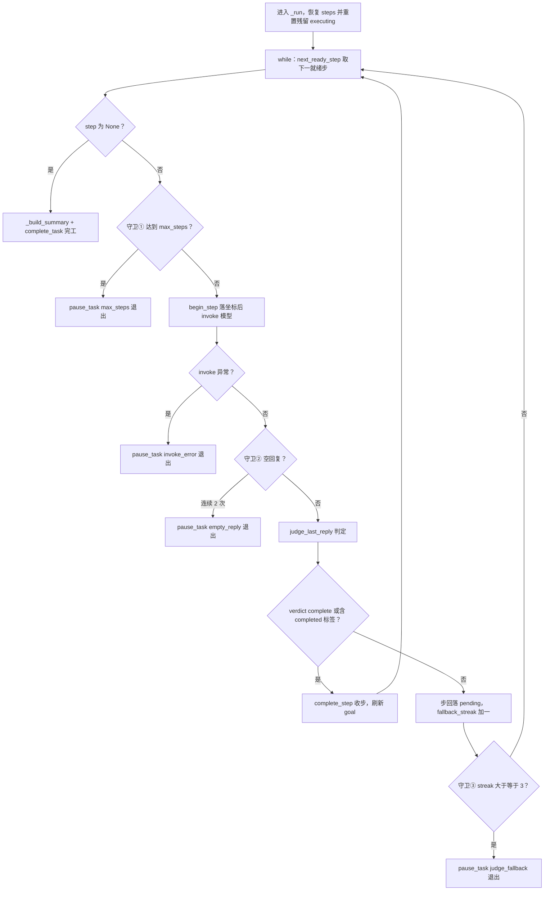

# agents/goal/goal_loop.py — goal_loop.py

> **文件路径**: `backend/packages/harness/agentflow/agents/goal/goal_loop.py`
> **目录位置**: agents → goal → goal_loop.py
> **职责**: 长任务外部 while 闭环引擎（M5）——计划生成 → 拓扑排序 → 逐步执行 → 汇总报告（同步）

## 📑 目录

- [📋 结构图](#📋-结构图)
- [📤 关键导出](#📤-关键导出)
- [💡 设计思想](#💡-设计思想)
- [🎯 实用场景](#🎯-实用场景)
- [📊 顺序执行链流程图](#📊-顺序执行链流程图)
- [🧩 代码解析（成块对照 goal_loop.py）](#🧩-代码解析成块对照-goal_looppy)
- [❓ Q&A / 知识点](#❓-qa--知识点)
- [⚠️ 风险点](#⚠️-风险点)

## 📋 结构图

```text
┌──────────────────────────────────────────────────────────────┐
│ _ai_text(resp) -> str        取 invoke 返回最后一条消息文本    │
│                                                             │
│ GoalEngine(agent, model, goal_repo, service=None)           │
│   __init__   service 缺省自动包 GoalStateService(goal_repo)  │
│   start(thread_id, goal_text, max_steps=12)                 │
│     建 goal 行 -> begin_planning -> preamble invoke ->       │
│     parse+topo_sort -> finalize_plan -> begin_execution -> _run │
│   resume(thread_id)                                         │
│     get_active_by_thread -> 恢复 steps -> paused 则 resume_task -> _run │
│   _run(thread_id, goal)                                     │
│     while: next_ready_step -> None 则 complete_task          │
│     三守卫：max_steps / 空回复×2 / fallback_streak≥3 -> paused │
│   _build_summary(goal, steps)  完工汇总字符串                │
└──────────────────────────────────────────────────────────────┘
```

**调用链（Grep 自 agentflow. 核实）**：

- **谁调用它**：`cli/main.py` —— try/except 双路径导入（规范路径 `agentflow.agents.goal.goal_loop`，
  except 回退 `agentflow.goal.goal_loop`，line 122-125）；line 347 `GoalEngine(agent, model, goal_repo)`
  构造，line 379 `engine.resume(thread_id)`（--thread 断点恢复），line 383 `engine.start(thread_id, args.goal)`
  （--goal 入口）。测试 `tests/test_goal_resume.py` / `test_goal_graph.py` 也直接构造 GoalEngine。
- **它调用谁**：`plans.service.GoalStateService`（状态迁移）、`plans.resolver`（topo_sort/next_ready_step/
  PlanCycleError）、`plans.types`（parse_steps_json/steps_to_json/steps_from_json/PlanStep）、
  `goal_prompts`（build_goal_mode_preamble/build_continue_nudge）、`goal_judge.judge_last_reply`、
  `goal_state`（STEP_STATUS_*、GoalRow、goal_row_from_row）、`GoalRepository`（create/get/begin_step/
  update_plan/complete_step/complete_goal/get_active_by_thread）。

## 📤 关键导出

**函数（内部）**

- `_ai_text()`

**类**

- `GoalEngine`

## 💡 设计思想

1. 外部 while 闭环：M5 砍掉 evoflow 原版的 goal_graph/middleware after_model 钩子 jump_to 伪图，
   改同步外部 while——对齐 CLI 同步主循环，逻辑直白可调试。
2. 写序固定（R3）：先 `agent.invoke`（checkpointer 落消息）→ 再写步状态 SQL；恢复以 SQL 的
   completed_steps/current_step 为坐标，checkpointer 只管消息，两者职责不混。
3. 断点重跑幂等：resume 时把 plan_steps_json 里残留 `executing` 的步重置回 `pending`——杀进程最坏
   发生在"步已开跑未落完成"，幂等 nudge 重跑该步可接受。
4. 三守卫熔断 paused：步数上限 / 空回复×2 / fallback_streak≥3，任一命中都 pause_task 退出，
   --thread 可续跑，绝不崩 CLI。

## 🎯 实用场景

1. 新长任务：`--goal "写一份周报"` → start 自动拆计划、逐步执行、汇总完工再进 REPL。
2. 断点续跑：进程被杀/熔断后，`--thread <id>` 重启 → resume 从下一步接着跑，已完成步不重跑。

## 📊 顺序执行链流程图（_run 逐步闭环一圈）

```text
_resume/start 进入 _run(thread_id, goal)（request：逐步执行直到完工或熔断）
│
▼
steps = steps_from_json(plan_steps_json)；把残留 executing 的步重置 pending（断点重跑）
│
▼
while True: step = next_ready_step(steps)
│   step is None -> _build_summary + complete_task 完工，return
▼
守卫①：goal.completed_steps >= max_steps -> pause_task("max_steps")，return
│
▼
step.status=executing -> repo.begin_step 落坐标（current_step + plan_steps_json）
│
▼
nudge = build_continue_nudge(step) -> agent.invoke（先 invoke，R3 写序）
│   invoke 抛异常 -> pause_task("invoke_error:...")，return
▼
text = _ai_text(resp)
│
▼
守卫②：text 空 -> empty_retries+=1；步回落 pending；>=2 次 pause_task("empty_reply")，return
│
▼
verdict = judge_last_reply(model, text)
│   verdict==complete 或文本含 <completed> -> step.status=completed
│       service.complete_step 落库；fallback_streak=0；刷新 goal
│   否则 -> step.status=pending；fallback_streak+=1
│       守卫③：>=3 -> pause_task("judge_fallback")，return
▼
回到 while 顶部，取下一就绪步
```

**Mermaid 版（GitHub / 飞书渲染；VSCode 需装插件）**：



## 🧩 代码解析（成块对照 goal_loop.py）

> 读法：每块先贴**完整代码**，再看块下方的整块解析。代码与文件逐字一致。

### 块 1：imports —— 拼装 M5 全部子模块

```python
from __future__ import annotations

import os

from langchain_core.messages import HumanMessage

from agentflow.agents.goal.goal_judge import judge_last_reply
from agentflow.agents.goal.goal_prompts import (
    build_continue_nudge,
    build_goal_mode_preamble,
)
from agentflow.agents.goal.goal_state import (
    STEP_STATUS_COMPLETED,
    STEP_STATUS_EXECUTING,
    STEP_STATUS_PENDING,
    GoalRow,
    goal_row_from_row,
)
from agentflow.plans.resolver import PlanCycleError, next_ready_step, topo_sort
from agentflow.plans.service import GoalStateService
from agentflow.plans.types import (
    PlanStep,
    parse_steps_json,
    steps_from_json,
    steps_to_json,
)
```

**结构简析**：goal_loop 是 M5 的"装配中心"——import 了 plans 包（types/resolver/service）和
agents.goal 包（prompts/judge/state）的几乎全部对外符号；`os` 用于 `os.urandom` 生成 goal_id。
这份 import 清单本身就是 M5 长任务域的依赖拓扑。

**函数参数逐条解释**：本块无函数，仅拼装 imports。

**落库要点**：loop 在依赖最顶层，向下依赖计划域与判定域，不被其他业务模块反向依赖（只被 cli 入口调用）。

### 块 2：_ai_text —— 从 invoke 返回取最后一条消息文本

```python
def _ai_text(resp: dict) -> str:
    """从 agent.invoke 返回里取最后一条消息的文本内容。"""
    messages = (resp or {}).get("messages") or []
    if not messages:
        return ""
    last = messages[-1]
    content = getattr(last, "content", last)
    if isinstance(content, str):
        return content
    # 多模态块列表：拼成文本
    return str(content)
```

**结构简析**：纯工具函数——invoke 返回是带 `messages` 键的 dict（checkpointer 累积的消息链），
取 `messages[-1]` 即模型最新回复；三层空值兜底 + content 类型兼容。

**`_ai_text()` 参数逐条解释**：

| 参数 | 类型 | 默认值 | 含义 |
|---|---|---|---|
| `resp` | `dict` | 必填 | `agent.invoke` 的返回；函数 `(resp or {}).get("messages") or []` 三层空值兜底（resp 为 None / messages 键缺失 / 空列表都安全返回空串），取 `messages[-1]` 后 `getattr(last,"content",last)` 兼容 AIMessage 对象与裸字符串；content 非 str（多模态块列表）则 `str()` 强转 |

**落库要点**：空串会被 `_run` 的守卫②（空回复累计）接住——本函数本身不判错，只负责"安全取文本"。

### 块 3：GoalEngine.__init__ —— 装配与 service 自动建立

```python
class GoalEngine:
    """长任务引擎：计划生成 → 拓扑排序 → 逐步执行 → 汇总报告（同步）。"""

    def __init__(self, agent, model, goal_repo, service: GoalStateService | None = None):
        """装配：agent=主 Agent（sync invoke），model=判定模型，goal_repo=落库。

        service 缺省时自动建一个包 goal_repo 的 GoalStateService——
        goal_loop 一律经 service 走迁移（服务层守卫，repo 原语）。
        """
        self._agent = agent
        self._model = model
        self._repo = goal_repo
        self._service: GoalStateService = service or GoalStateService(goal_repo)
```

**结构简析**：`GoalEngine` 四件套装配——`agent`（主 Agent，sync invoke）、`model`（判定模型）、
`goal_repo`（落库原语）、`service`（可选注入）。关键是 `service or GoalStateService(goal_repo)`：
调用方不传时自动包一个，强制所有状态迁移都过 service 守卫。

**`__init__()` 参数逐条解释**：

| 参数 | 类型 | 默认值 | 含义 |
|---|---|---|---|
| `agent` | （sync compiled graph） | 必填 | 主 Agent；引擎内 `self._agent` 用于 preamble / nudge 的 sync invoke（勿改 async，与 CLI 同步主循环对齐） |
| `model` | （langchain chat model） | 必填 | 判定模型；引擎内 `self._model` 喂给 `judge_last_reply` 做逐步验收 |
| `goal_repo` | `GoalRepository` | 必填 | 落库原语；引擎内 `self._repo` 调 `create`/`get`/`begin_step`/`get_active_by_thread` 等 SQL |
| `service` | `GoalStateService \| None` | `None` | 状态迁移服务层；缺省时自动 `GoalStateService(goal_repo)`——goal_loop 一律经 service 走迁移（服务层守卫，repo 原语）。测试会显式注入假 service 断言迁移路径 |

**落库要点**：cli 只传前三个参数，靠自动建的 service；状态迁移（begin_planning/finalize_plan/
begin_execution/complete_step/complete_task/pause_task/resume_task/fail_task）全部走 service，
引擎里没有一处裸 patch。

### 块 4：start —— 新长任务入口

```python
    # ---------- 入口 ----------
    def start(self, thread_id: str, goal_text: str, max_steps: int = 12) -> None:
        """启动一个新长任务（全程同步跑完或断点 paused 退出）。"""
        goal_id = "g_" + os.urandom(6).hex()
        self._repo.create(
            goal_id,
            thread_id,
            goal_text,
            goal_status="pending",
            plan_steps_json="[]",
            max_steps=max_steps,
            completed_steps=0,
        )
        self._service.begin_planning(goal_id)  # pending → planning

        # ① 首转：preamble 引导模型吐 JSON 计划
        preamble = build_goal_mode_preamble(goal_text)
        resp = self._agent.invoke(
            {"messages": [HumanMessage(preamble)]},
            config={"configurable": {"thread_id": thread_id}},
        )
        last_ai_text = _ai_text(resp)

        # ② 解析 + 拓扑校验
        try:
            steps = parse_steps_json(last_ai_text)
            steps = topo_sort(steps)
        except (ValueError, PlanCycleError) as exc:
            self._service.fail_task(goal_id, last_error=f"计划解析失败: {exc}"[:300])
            print(f"[长任务] 计划生成失败: {exc}")
            return

        # ③ 落计划 → 自动授权执行
        self._service.finalize_plan(goal_id, steps_to_json(steps))  # planning → planned
        self._service.begin_execution(goal_id)  # planned → executing（M5 自动授权）

        row = self._repo.get(goal_id)
        self._run(thread_id, goal_row_from_row(row))
```

**结构简析**：start 三段式——①建 goal 行（`g_`+6 字节随机 hex，初始 pending、plan_steps_json="[]"）
后 `begin_planning`；②preamble invoke 首转 → `parse_steps_json`+`topo_sort`，**任何
ValueError/PlanCycleError 都 catch 住 `fail_task` 并 return**（计划生成失败不进执行）；③
`finalize_plan` 落计划 JSON（planning→planned）后 `begin_execution`（planned→executing，M5 自动授权
不等用户）。最后 `repo.get` 重读行转 GoalRow 进 `_run`。

**`start()` 参数逐条解释**：

| 参数 | 类型 | 默认值 | 含义 |
|---|---|---|---|
| `thread_id` | `str` | 必填 | 会话 thread ID；invoke 时塞进 `config={"configurable":{"thread_id": thread_id}}`，checkpointer 据此把消息落进该 thread 的历史 |
| `goal_text` | `str` | 必填 | 用户原始长任务描述；先 `build_goal_mode_preamble(goal_text)` 拼首转引导词，再 `repo.create` 落库为 `goal_text` 列 |
| `max_steps` | `int` | `12` | 步数上限；`repo.create` 落 `max_steps` 列，`_run` 守卫①据此判定 `completed_steps >= max_steps` 熔断 paused |

**落库要点**：状态迁移全走 service（begin_planning → finalize_plan → begin_execution），
没有一处裸 patch；计划解析失败时 `fail_task(goal_id, last_error=f"计划解析失败: {exc}"[:300])`，
错误信息截断 300 字落 `last_error` 列。

### 块 5：resume —— 断点恢复入口

```python
    def resume(self, thread_id: str) -> None:
        """按 thread_id 恢复未完成长任务（--thread 断点续跑）。"""
        row = self._repo.get_active_by_thread(thread_id)
        if row is None:
            return
        goal = goal_row_from_row(row)
        if not goal.plan_steps_json or goal.plan_steps_json == "[]":
            return  # 计划尚未生成完，无可恢复步骤
        if goal.goal_status == "paused":
            self._service.resume_task(goal.goal_id)  # paused → executing
            goal.goal_status = "executing"
        self._run(thread_id, goal)
```

**结构简析**：resume 三重前置——`get_active_by_thread` 捞行（None 直接 return，无活动任务）；
`plan_steps_json` 为空/"[]" 说明计划都没生成完，无可恢复步骤 return；**只有 paused 态才走
`resume_task`（paused→executing）并同步内存里的 goal_status**——planning/planned/executing
态（进程被杀在中途）不需要迁移动作，直接进 _run（_run 开头会把残留 executing 步重置 pending）。

**`resume()` 参数逐条解释**：

| 参数 | 类型 | 默认值 | 含义 |
|---|---|---|---|
| `thread_id` | `str` | 必填 | 要恢复的会话 thread ID；`repo.get_active_by_thread(thread_id)` 在 `OPEN_GOAL_STATUSES` 集合内捞活动 goal 行；返回 None 直接 return |

**落库要点**：断点坐标 = SQL 的 `current_step` + `plan_steps_json` + `completed_steps`（见
goal_repositories 文档），checkpointer 只管消息；paused→executing 的迁移只在显式 paused 态发生，
executing 态被 SIGKILL 后重进 resume 不重复迁移。

### 块 6：_run —— 外部 while 闭环 + 三守卫（核心）

```python
    # ---------- 逐步执行闭环 ----------
    def _run(self, thread_id: str, goal: GoalRow) -> None:
        """外部 while 闭环：next_ready_step → nudge → invoke → judge。"""
        steps = steps_from_json(goal.plan_steps_json)
        # R3：恢复时把"开跑未落完成"的步重置回 pending（断点重跑最后一步）
        for s in steps:
            if s.status == STEP_STATUS_EXECUTING:
                s.status = STEP_STATUS_PENDING

        empty_retries = 0
        fallback_streak = 0
        while True:
            step = next_ready_step(steps)
            if step is None:
                # 全部走完 → 汇总完工
                summary = self._build_summary(goal, steps)
                self._service.complete_task(goal.goal_id, summary=summary, outcome="done")
                print(f"\n[长任务完成] {summary}")
                return

            # 守卫①：步数上限
            if goal.completed_steps >= goal.max_steps:
                self._service.pause_task(goal.goal_id, stop_reason="max_steps")
                print(f"\n[长任务暂停] 达到步数上限 {goal.max_steps}，--thread 可续跑")
                return

            # 开跑该步：先标记 executing 落坐标（消息在 invoke 内落，R3 写序）
            step.status = STEP_STATUS_EXECUTING
            self._repo.begin_step(
                goal.goal_id,
                current_step=step.ref,
                plan_steps_json=steps_to_json(steps),
            )
            nudge = build_continue_nudge(step)
            try:
                resp = self._agent.invoke(
                    {"messages": [HumanMessage(nudge)]},
                    config={"configurable": {"thread_id": thread_id}},
                )
                text = _ai_text(resp)
            except Exception as exc:  # noqa: BLE001 —— 模型/工具异常 → paused 断点，不崩 CLI
                self._service.pause_task(
                    goal.goal_id, stop_reason=f"invoke_error:{type(exc).__name__}"[:200]
                )
                print(f"\n[长任务暂停] 执行异常 {type(exc).__name__}: {exc}")
                return

            # 守卫②：空回复（重试 ≤2 次后 paused）
            if not text.strip():
                empty_retries += 1
                step.status = STEP_STATUS_PENDING
                if empty_retries >= 2:
                    self._service.pause_task(goal.goal_id, stop_reason="empty_reply")
                    print("\n[长任务暂停] 连续空回复，--thread 可续跑")
                    return
                continue
            empty_retries = 0

            # 判定：verdict=complete 或文本带 <completed> → 收步
            verdict = judge_last_reply(self._model, text)
            if verdict.get("verdict") == "complete" or "<completed>" in text:
                step.status = STEP_STATUS_COMPLETED
                self._service.complete_step(
                    goal.goal_id, step.ref, plan_steps_json=steps_to_json(steps)
                )
                fallback_streak = 0
                row = self._repo.get(goal.goal_id)  # 刷新 completed_steps
                goal = goal_row_from_row(row)
            else:
                # 没收尾：步回落 pending，下圈 while 重新捡起（同一步再 nudge）
                step.status = STEP_STATUS_PENDING
                fallback_streak += 1
                if fallback_streak >= 3:  # 守卫③：判定熔断
                    self._service.pause_task(goal.goal_id, stop_reason="judge_fallback")
                    print("\n[长任务暂停] 判定连续未收尾，--thread 可手动续跑")
                    return
```

**结构简析**：这是 M5 的心脏。开头先 `steps_from_json` 恢复进度，并把残留 executing 步重置 pending
（断点重跑）。然后 `while True`：`next_ready_step` 返回 None 即全部走完 → `_build_summary` +
`complete_task` 完工；三守卫任一命中都 `pause_task` 退出（--thread 可续跑，绝不崩 CLI）。

**`_run()` 参数逐条解释**：

| 参数 | 类型 | 默认值 | 含义 |
|---|---|---|---|
| `thread_id` | `str` | 必填 | 会话 thread ID；每圈 nudge invoke 时塞进 `config={"configurable":{"thread_id": thread_id}}`，checkpointer 把这一轮消息落进该 thread |
| `goal` | `GoalRow` | 必填 | 从 repo 读出的 goal 行（数据类镜像）；函数读 `goal.plan_steps_json`/`goal.completed_steps`/`goal.max_steps`/`goal.goal_id` 驱动闭环；收步后 `repo.get` 重读行刷新 `completed_steps` |

**写序 R3（必须体现）**：步完成态的写序是**先 `agent.invoke`（checkpointer 落这一轮消息）→ 再
`complete_step` 写 completed**；`begin_step`（写 executing 开跑坐标）虽然在 invoke 之前，但那是
"开跑坐标"不是"完成坐标"——恢复时 SQL 的 `completed_steps/current_step` 是进度坐标，checkpointer
的消息链是对话历史，二者职责不混。

**三守卫（任一命中都 pause_task 退出）**：

| 守卫 | 触发条件 | stop_reason |
|---|---|---|
| ① 步数上限 | `goal.completed_steps >= goal.max_steps` | `"max_steps"` |
| ② 空回复 | `text.strip()` 空，累计 `empty_retries >= 2`（步先回落 pending） | `"empty_reply"` |
| ③ 判定熔断 | verdict 非 complete 且文本无 `<completed>`，累计 `fallback_streak >= 3` | `"judge_fallback"` |

另：invoke 本身抛异常 → `pause_task(stop_reason=f"invoke_error:{type(exc).__name__}"[:200])`，
不崩 CLI。三个计数器 `empty_retries`/`fallback_streak` 在正常路径都被清零，只有连续异常才累积熔断；
它们是内存局部变量，paused 后随进程销毁，resume 时从 0 重计。

### 块 7：_build_summary —— 完工汇总

```python
    # ---------- 汇总 ----------
    def _build_summary(self, goal: GoalRow, steps: list[PlanStep]) -> str:
        """完工汇总：列出已完成步骤名。"""
        names = "、".join(
            f"{s.ref}:{s.short_name or s.description[:12]}"
            for s in steps
            if s.status == STEP_STATUS_COMPLETED
        )
        return f"长任务「{goal.goal_text[:40]}」完成：共 {len(steps)} 步（{names}）"
```

**结构简析**：纯字符串汇总——遍历 steps，把 `status=completed` 的步拼成 `"ref:短名、..."`
（short_name 空时退用 description 前 12 字），外面包 `长任务「goal_text[:40]」完成：共 N 步（...）`。

**`_build_summary()` 参数逐条解释**：

| 参数 | 类型 | 默认值 | 含义 |
|---|---|---|---|
| `goal` | `GoalRow` | 必填 | goal 行；函数取 `goal.goal_text[:40]` 截前 40 字做标题 |
| `steps` | `list[PlanStep]` | 必填 | 当前步骤列表；函数筛 `s.status == STEP_STATUS_COMPLETED` 的步，按 `f"{s.ref}:{s.short_name or s.description[:12]}"` 拼接（short_name 空时退用 description 前 12 字） |

**落库要点**：这份 summary 经 `complete_task(goal_id, summary=..., outcome="done")` 写进
`goals.summary` 列，是完工后用户 / 恢复时看到的成果记录。

## ❓ Q&A / 知识点

### 1. 写序为什么是"先 invoke 后写 SQL"（R3）？为什么 begin_step 又在 invoke 前面？

**一句话**：R3 指的是"消息落库"与"步完成状态落库"的次序——恢复坐标靠 SQL，消息靠 checkpointer，二者分工；begin_step 落的是"开跑坐标"不是"完成坐标"。

容易混淆：块 6 里 `begin_step`（写 executing 坐标）确实在 invoke 之前。但 R3 约束的是**完成态写序**——
步完成时必须先 invoke（让 checkpointer 把这一轮消息落进历史），再 `complete_step` 写 completed。
这样恢复时：SQL 的 completed_steps/current_step 是"进度坐标"，checkpointer 的消息链是"对话历史"，
两者不互相覆盖。若先写 SQL 完成再 invoke，进程崩在中间就会出现"SQL 说完成了但消息没落"的不一致。

### 2. 断点重跑为什么要把残留 executing 的步重置回 pending？

**一句话**：杀进程最坏发生在"步已开跑、坐标已落 executing、但完成消息还没落"——不重置的话该步永远卡 executing，next_ready_step 永远跳过它。

`_run` 开头那段 `for s in steps: if s.status==executing: s.status=pending` 是幂等设计。进程可能在
`begin_step` 之后、`complete_step` 之前被 SIGKILL（测试 test_goal_resume.py 就是模拟这个）。此时
SQL 里该步是 executing。若不重置，`next_ready_step` 只挑 pending 步，这个 executing 步既不被
重新捡起也不算完成，计划永远差一步。重置成 pending 后，下圈 while 重新 nudge 这步——代价是这步
可能被多跑一次（幂等可接受），但不会卡死闭环。

### 3. fallback_streak≥3 为什么熔断 paused，而不是直接 completed？

**一句话**：判定连续 3 轮都说"没做完"，说明模型卡住/跑偏了，该停下来等人介入，而不是硬收工或无限空转。

`judge_last_reply` 解析失败默认 continue（见 goal_judge 文档），模型真没做完也 continue。如果连续
3 圈都 continue，要么模型在原地打转、要么判定器一直 fail-safe。此时既不能判 completed（工作没做完），
也不能 while 无限跑下去（烧 token、卡 CLI）——`pause_task("judge_fallback")` 熔断退出，留个
stop_reason，用户 `--thread` 看一眼再决定续跑。这就是 R1 熔断：把"异常的连续"变成"可恢复的断点"。

## ⚠️ 风险点

1. 全程同步 invoke：lead_agent 是 sync compiled graph，勿改 async——改成 async 会和 CLI 同步主循环冲突。
2. 写序 R3 是隐式契约：改 _run 时若把"完成态 SQL"移到 invoke 之前，断点一致性会破坏（见 Q1）。
3. fallback_streak/empty_retries 是内存局部变量：熔断 paused 后这些计数随进程销毁，resume 时从 0 重计
   ——意味着"上一轮卡了 2 圈"的状态不会跨进程继承，可能在恢复后多绕一圈才再熔断。
4. `except Exception` 兜 invoke：吞掉模型/工具的真实异常类型到 stop_reason（截断 200 字），
   调试时需看打印的 exc 全文。
5. 触发 `next_ready_step` 返回 None 即完工：若某步依赖被永久阻塞（脏数据），会被误当"全部完成"走
   complete_task——计划期 topo_sort 已拦非法依赖，恢复路径依赖这个前提。

---
_2026-10-02 新建：M5 文档（目录 + 流程图 + 成块代码解析 + Q&A）。_
_2026-10-03 重构：代码解析段按「结构简析 + 参数逐条表格 + 落库要点」规范化（代码块零改动）。_
