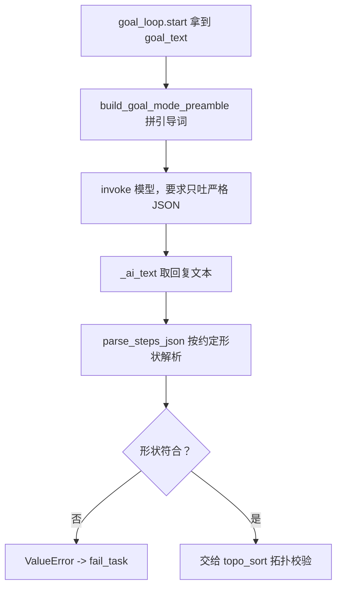

# agents/goal/goal_prompts.py — goal_prompts.py

> **文件路径**: `backend/packages/harness/agentflow/agents/goal/goal_prompts.py`
> **目录位置**: agents → goal → goal_prompts.py
> **职责**: 长任务提示词构造（规划阶段 preamble + 单步执行 nudge）

## 📑 目录

- [📋 结构图](#📋-结构图)
- [📤 关键导出](#📤-关键导出)
- [💡 设计思想](#💡-设计思想)
- [🎯 实用场景](#🎯-实用场景)
- [📊 顺序执行链流程图](#📊-顺序执行链流程图)
- [🧩 代码解析（成块对照 goal_prompts.py）](#🧩-代码解析成块对照-goal_promptspy)
- [❓ Q&A / 知识点](#❓-qa--知识点)
- [⚠️ 风险点](#⚠️-风险点)

## 📋 结构图

```text
┌──────────────────────────────────────────────────────────┐
│ build_goal_mode_preamble(goal_text) -> str               │
│   首转：要求模型吐严格 JSON steps 计划，暂不动手执行      │
│                                                         │
│ build_continue_nudge(step: PlanStep) -> str             │
│   续跑：执行指定步，完成后用 <completed> 标签收尾          │
└──────────────────────────────────────────────────────────┘
preamble 序言；开场白  nudge：轻微提示；引导
```

**调用链（Grep 自 agentflow. 核实）**：

- **谁调用它**：`agents/goal/goal_loop.py` —— `start` 调 `build_goal_mode_preamble(goal_text)`
  （line 114）；`_run` 每圈调 `build_continue_nudge(step)`（line 183）作为下一轮 HumanMessage。
- **它调用谁**：`from agentflow.plans.types import PlanStep`（仅类型标注 nudge 的入参）。

## 📤 关键导出

**函数**

- `build_goal_mode_preamble()`
- `build_continue_nudge()`

## 💡 设计思想

1. 提示词 = 契约：preamble 定死 JSON 形状（`plans/types.parse_steps_json` 按此解析），
   nudge 定死收尾标签（goal_loop 判 `<completed>`）。提示词格式和解析器必须严格配套。
2. M5 裁成纯字符串模板：对标 evoflow 原版含远程流与 langgraph_sdk 注解，本版只拼字符串，
   无远程调用、无状态。

## 🎯 实用场景

1. 长任务首转：`start` 用 preamble 把复杂任务喂给模型，要求先拆 JSON 计划而非直接动手。
2. 逐步续跑：`_run` 用 nudge 告诉模型"现在执行 step.ref 这一步，做完加 `<completed>`"。

## 📊 顺序执行链流程图（preamble 引导首转计划）

```text
goal_loop.start() 拿到用户 goal_text（request：先拆计划，不动手）
│
▼
preamble = build_goal_mode_preamble(goal_text)
│   拼入 goal_text（三引号包裹）+ 严格 JSON 形状要求 + 5 条规则
▼
agent.invoke({"messages":[HumanMessage(preamble)]})
│   config 带 thread_id（checkpointer 落消息）
▼
模型回复 -> _ai_text 取最后一条文本 -> parse_steps_json 解析
│   形状不符（preamble 没遵守）-> ValueError -> fail_task
```

**Mermaid 版（GitHub / 飞书渲染；VSCode 需装插件）**：



## 🧩 代码解析（成块对照 goal_prompts.py）

> 读法：每块先贴**完整代码**，再看块下方的整块解析。代码与文件逐字一致。

### 块 1：import + build_goal_mode_preamble —— 规划阶段引导词

```python
from __future__ import annotations

from agentflow.plans.types import PlanStep


def build_goal_mode_preamble(goal_text: str) -> str:
    """首转引导词：让主 Agent 先把长任务拆成 JSON 步骤计划，暂不动手执行。"""
    return (
        "你现在进入【长任务规划模式】。下面是用户的一个复杂长任务：\n"
        f'\n"""\n{goal_text}\n"""\n\n'
        "请先不要直接动手执行，而是把它拆成一组有序的执行步骤，"
        "只输出一个严格的 JSON 对象（不要任何解释、不要 markdown 代码块围栏），"
        "形状如下：\n"
        '{"steps":[{"ref":"s1","short_name":"短名","description":"该步骤要做什么",'
        '"depends_refs":[]}]}\n'
        "要求：\n"
        "1. ref 形如 s1/s2/s3……每个步骤唯一；\n"
        "2. depends_refs 填写本步依赖的前置步骤 ref 数组（无依赖填 []）；\n"
        "3. short_name 是不超过 15 字的短名；description 写清本步目标；\n"
        "4. 步骤总数控制在 3~12 步；\n"
        "5. 直接输出 JSON 对象本身。"
    )
```

**结构简析**：`from agentflow.plans.types import PlanStep` 仅供块 2 类型标注；
`build_goal_mode_preamble` 是纯 f-string 拼接——首转引导词，让模型先拆 JSON 计划而非直接动手。

**`build_goal_mode_preamble()` 参数逐条解释**：

| 参数 | 类型 | 默认值 | 含义 |
|---|---|---|---|
| `goal_text` | `str` | 必填 | 用户原始长任务描述；函数用 `\"\"\"` 三引号把它包进任务段落，并明确"先不要直接动手执行"（划清规划与执行边界） |

**落库要点**：函数在返回串里**定死 JSON 形状** `{"steps":[{"ref","short_name","description","depends_refs"}]}`，
并要求"不要解释、不要 markdown 围栏"；5 条规则约束 ref 唯一、依赖数组、短名 ≤15 字、总步数 3~12。
这份形状必须与 `plans/types.parse_steps_json` 期望字段逐一对齐，否则解析必挂（`extract_first_json_object` 仅作容错兜底）。

### 块 2：build_continue_nudge —— 单步执行引导词

```python
def build_continue_nudge(step: PlanStep) -> str:
    """续跑引导词：让 Agent 执行指定步骤，并用 <completed> 标签声明本步完成。"""
    return (
        f"【执行步骤 {step.ref}】{step.short_name} —— {step.description}\n"
        "请完成这一步。完成后，请在回复末尾单独加上标签 <completed> 收尾，"
        "表示本步骤已完成；若尚未完成则不要加该标签。"
    )
```

**结构简析**：`build_continue_nudge` 是纯 f-string 拼接——把 `PlanStep` 的 ref/short_name/description
嵌进一句指令，告诉模型现在执行哪一步、做完打 `<completed>` 标签收尾。

**`build_continue_nudge()` 参数逐条解释**：

| 参数 | 类型 | 默认值 | 含义 |
|---|---|---|---|
| `step` | `PlanStep` | 必填 | 当前要执行的步骤；函数读取其 `.ref` / `.short_name` / `.description` 拼进 `【执行步骤 {ref}】{short_name} —— {description}` |

**落库要点**：核心契约是**末尾加 `<completed>` 标签收尾**——这是 goal_loop 收步"双通道"之一
（`_run` 里 `verdict=="complete" or "<completed>" in text`）。提示词明确"没完成就别加"，
防止模型敷衍性提前打标签误收步。

## ❓ Q&A / 知识点

### 1. preamble 为什么要强制模型输出"严格 JSON、不要围栏"？

**一句话**：parse_steps_json 按定死形状解析，模型越守规矩，解析失败率越低（虽然有 extract_first_json_object 容错兜底）。

types.parse_steps_json 期望的顶层形状是 `{"steps":[...]}`，每个元素要有 ref。preamble 里直接把
这个形状样例贴给模型，并要求"不要解释、不要 markdown 围栏"——模型照做就是纯 JSON，解析一次过。
extract_first_json_object 虽能容错剥掉前后废话和围栏，但那是"兜底"，不是"依赖"：要求模型别加
围栏，等于把错误消灭在生成端，减少 fail_task 的概率。

### 2. nudge 为什么要求用 `<completed>` 标签收尾？这和判定模型是什么关系？

**一句话**：标签是"模型自报完成"的硬通道，和判定模型的 verdict 组成双通道，任一命中即收步。

goal_loop._run 的收步条件是 `verdict.get("verdict")=="complete" or "<completed>" in text`——
判定模型（judge_last_reply）是一路，文本里有没有 `<completed>` 是另一路。模型如果听话打了
标签，甚至不用等判定模型裁决就能收步；标签也给了用户一个可读的"我做完了"信号。要求"没完成别加"
是防止模型敷衍性提前收尾。

## ⚠️ 风险点

1. preamble 的 JSON 形状是和 types.parse_steps_json 的隐式契约：改一边不改另一边，解析必失败。
2. `<completed>` 标签是裸字符串匹配：模型若输出 `<completed/>`、`</completed>` 等变体不会命中
   （靠判定模型兜底）；若模型正文里恰好写了这串字符会误判完成。
3. 提示词是静态模板，模型偶尔不遵守"不要围栏"——靠 extract_first_json_object 容错，别假设每次都纯 JSON。

---
_2026-10-02 新建：M5 文档（目录 + 流程图 + 成块代码解析 + Q&A）。_
_2026-10-03 重构：代码解析段按「结构简析 + 参数逐条表格 + 落库要点」规范化（代码块零改动）。_
