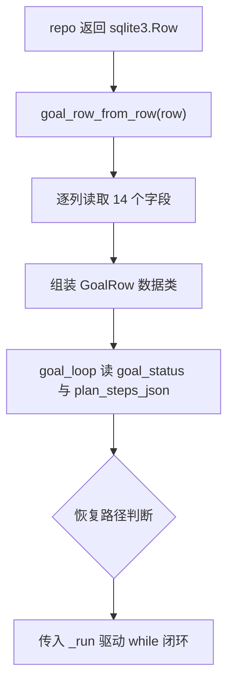

# agents/goal/goal_state.py — goal_state.py

> **文件路径**: `backend/packages/harness/agentflow/agents/goal/goal_state.py`
> **目录位置**: agents → goal → goal_state.py
> **职责**: 长任务状态常量集中定义 + GoalRow 内存镜像（M5）

## 📑 目录

- [📋 结构图](#📋-结构图)
- [📤 关键导出](#📤-关键导出)
- [💡 设计思想](#💡-设计思想)
- [🎯 实用场景](#🎯-实用场景)
- [📊 顺序执行链流程图](#📊-顺序执行链流程图)
- [🧩 代码解析（成块对照 goal_state.py）](#🧩-代码解析成块对照-goal_statepy)
- [❓ Q&A / 知识点](#❓-qa--知识点)
- [⚠️ 风险点](#⚠️-风险点)

## 📋 结构图

```text
┌──────────────────────────────────────────────────────────┐
│ GOAL_STATUS_*（goal 级 8 态常量）                         │
│   pending/planning/planned/executing/paused/             │
│   completed/failed/cancelled                             │
│ STEP_STATUS_*（步骤级 4 态常量）                          │
│   pending/executing/completed/failed                      │
│                                                         │
│ OPEN_GOAL_STATUSES      可恢复态 4 态（get_active WHERE）│
│ TERMINAL_GOAL_STATUSES 终态 3 态                          │
│ PATCHABLE_GOAL_STATUSES patch 可写态 5 态（含 pending） │
│                                                         │
│ GoalRow(dataclass)            goals 表列的内存镜像        │
│ goal_row_from_row(sqlite3.Row) -> GoalRow                │
└──────────────────────────────────────────────────────────┘
```

**调用链（Grep 自 agentflow. 核实）**：

> **读法**：这个括弧是**证据链标注**——下面的"谁调用它 / 它调用谁"不是推测，是拿 **Grep 命令**
> 在 `backend/packages/harness/agentflow/` 源码里按关键词**搜出来核实**的事实（有文件、有行号）。
>
> | 部分 | 意思 |
> |---|---|
> | Grep | 命令行搜索工具（全局正则搜索），按关键词搜出"哪个文件第几行用到了它" |
> | 自 agentflow. | 搜索范围 = 整个 agentflow 包（不是全盘，也不是只看本文件） |
> | 核实 | 结论有源码依据、可复验，不是凭印象写 |
>
> **实际做法**：在 agentflow 包目录下执行——

```bash
grep -rn "goal_state" backend/packages/harness/agentflow/
```

> 按搜出的引用点写。doc-code 每个文件的调用链段都带这个标注，目的：**可追溯、防编造**。

- **谁调用它**：`agents/goal/goal_loop.py` —— import `STEP_STATUS_COMPLETED/EXECUTING/PENDING`
  （_run 里步状态机）、`GoalRow`、`goal_row_from_row`（把 sqlite3.Row 转数据类）。
- **它调用谁**：仅标准库 `sqlite3`（类型标注）+ `dataclasses`；不碰模型/其他业务模块。

## 📤 关键导出

**常量**

- `GOAL_STATUS_PENDING/PLANNING/PLANNED/EXECUTING/PAUSED/COMPLETED/FAILED/CANCELLED`
- `STEP_STATUS_PENDING/EXECUTING/COMPLETED/FAILED`
- `OPEN_GOAL_STATUSES` / `TERMINAL_GOAL_STATUSES` / `PATCHABLE_GOAL_STATUSES`

**数据类 / 函数**

- `GoalRow`
- `goal_row_from_row()`

## 💡 设计思想

1. 状态字符串集中在此定义为常量，散模块（service/loop/repo）不裸写 `"executing"` 等字面量——
   防漂移：改状态名只改一处。
2. 三个 frozenset 集合各有语义：OPEN=可恢复、TERMINAL=终态、PATCHABLE=SQL patch 守卫可写态，
   面向"恢复/完工判定/写守卫"三种不同用途分开定义。
3. GoalRow 字段 = goals 表 DDL 列（见 persistence/schema.py M5 段），引擎内部用数据类替代裸
   sqlite3.Row，字段访问带类型、可读性强。

## 🎯 实用场景

1. 步状态机：goal_loop._run 用 `STEP_STATUS_*` 做 pending/executing/completed 切换。
2. 行转换：repo 读出来的 sqlite3.Row 经 `goal_row_from_row` 变成 GoalRow 再进引擎逻辑。
3. 集合判定：repo 的 `get_active_by_thread` 用 OPEN_GOAL_STATUSES 做 WHERE 集合；
   patch 守卫用 PATCHABLE_GOAL_STATUSES。

## 📊 顺序执行链流程图（repo 行 -> GoalRow 的转换）

```text
repo.get / get_active_by_thread 返回 sqlite3.Row（request：引擎需要结构化 goal 行）
│
▼
goal_row_from_row(row) 被调用
│
▼
逐列读 row["goal_id"]/row["thread_id"]/.../row["updated_at"]
│   （14 列与 DDL 一一对应）
▼
组装成 GoalRow(dataclass) 返回
│
▼
goal_loop 拿到 GoalRow：读 goal_status/current_step/plan_steps_json/completed_steps...
│   决定 start/resume/_run 走向
```

**Mermaid 版（GitHub / 飞书渲染；VSCode 需装插件）**：



## 🧩 代码解析（成块对照 goal_state.py）

> 读法：每块先贴**完整代码**，再看块下方的整块解析。代码与文件逐字一致。

### 块 1：imports + 状态常量（goal 8 态 + step 4 态）

```python
from __future__ import annotations

import sqlite3
from dataclasses import dataclass

# ---------- goal_status 8 态 ----------
GOAL_STATUS_PENDING = "pending"
GOAL_STATUS_PLANNING = "planning"
GOAL_STATUS_PLANNED = "planned"
GOAL_STATUS_EXECUTING = "executing"
GOAL_STATUS_PAUSED = "paused"
GOAL_STATUS_COMPLETED = "completed"
GOAL_STATUS_FAILED = "failed"
GOAL_STATUS_CANCELLED = "cancelled"

# ---------- step status 4 态 ----------
STEP_STATUS_PENDING = "pending"
STEP_STATUS_EXECUTING = "executing"
STEP_STATUS_COMPLETED = "completed"
STEP_STATUS_FAILED = "failed"
```

**结构简析**：`import sqlite3` 仅作类型标注、`from dataclasses import dataclass` 供块 3 用；
随后把 goal 级 8 态、step 级 4 态的状态字符串全部提为模块级常量，散模块不裸写字面量（防漂移）。

**函数参数逐条解释**：本块无函数，仅定义模块级常量——goal 级 `GOAL_STATUS_*` 8 个、
step 级 `STEP_STATUS_*` 4 个。

**落库要点**：goal 与 step 状态字符串有重叠（都有 `pending`/`executing`/`completed`），
但分属两套命名前缀（`GOAL_STATUS_*` vs `STEP_STATUS_*`）——常量名区分层次，避免引擎里
混用"这是 goal 的 executing 还是 step 的 executing"。

### 块 2：三个语义集合 OPEN / TERMINAL / PATCHABLE

```python
# 可恢复态（4 态）：get_active_by_thread 的 WHERE 集合。
# pending 无步骤可恢复（plan_steps_json 还是 "[]"），不算可恢复态。
OPEN_GOAL_STATUSES = frozenset(
    {
        GOAL_STATUS_PLANNING,
        GOAL_STATUS_PLANNED,
        GOAL_STATUS_EXECUTING,
        GOAL_STATUS_PAUSED,
    }
)

# 终态：infer_lifecycle_stage 映射 done
TERMINAL_GOAL_STATUSES = frozenset(
    {GOAL_STATUS_COMPLETED, GOAL_STATUS_FAILED, GOAL_STATUS_CANCELLED}
)

# patch 守卫可写态：全部非终态（含 pending）。
# patch() 的 WHERE 守卫语义 = "防终态覆盖"：终态行（completed/failed/cancelled）
# 不允许被原子补丁覆写；pending 行（刚 create、尚未开跑规划）必须可 patch——
# 否则 service.begin_planning()（pending→planning）命中 0 行静默无写入。
PATCHABLE_GOAL_STATUSES = frozenset(
    {
        GOAL_STATUS_PENDING,
        GOAL_STATUS_PLANNING,
        GOAL_STATUS_PLANNED,
        GOAL_STATUS_EXECUTING,
        GOAL_STATUS_PAUSED,
    }
)
```

**结构简析**：三个 `frozenset` 用途互斥——`OPEN`=可恢复态、`TERMINAL`=终态、`PATCHABLE`=SQL patch
守卫白名单，均复用块 1 的常量定义（防大小写漂移）；用 `frozenset` 防运行期篡改。

**函数参数逐条解释**：本块无函数，仅定义三个语义集合常量——

| 常量 | 成员 | 用途 |
|---|---|---|
| `OPEN_GOAL_STATUSES` | planning / planned / executing / paused（4 态，**故意不含 pending**） | `get_active_by_thread` 的 WHERE 集合：这条 goal 还活着、可被捞起来恢复；pending 还没计划（`plan_steps_json` 还是 `"[]"`），恢复无意义 |
| `TERMINAL_GOAL_STATUSES` | completed / failed / cancelled（3 态） | 终态：`infer_lifecycle_stage` 映射 done |
| `PATCHABLE_GOAL_STATUSES` | OPEN 四态 **+ pending**（5 态） | `patch()` 的 WHERE 守卫白名单：防终态覆盖 |

**落库要点**：`PATCHABLE` 含 pending 是关键设计——`service.begin_planning()` 要把刚 create 的
pending 行 patch 成 planning，若排除 pending 会静默命中 0 行无写入。同一个 pending，
从"写"角度必须放行、从"恢复"角度要排除——两个集合就是这个差异的显式建模。

### 块 3：GoalRow 数据类 + goal_row_from_row 转换函数

```python
@dataclass
class GoalRow:
    """goals 表行的内存镜像（字段与 DDL 列逐一对齐）。"""

    goal_id: str
    thread_id: str
    goal_text: str
    goal_status: str
    current_step: str
    plan_steps_json: str
    max_steps: int
    completed_steps: int
    last_error: str
    stop_reason: str
    summary: str
    outcome: str
    created_at: str
    updated_at: str


def goal_row_from_row(row: sqlite3.Row) -> GoalRow:
    """sqlite3.Row → GoalRow（引擎内部用数据类替代裸 Row）。"""
    return GoalRow(
        goal_id=row["goal_id"],
        thread_id=row["thread_id"],
        goal_text=row["goal_text"],
        goal_status=row["goal_status"],
        current_step=row["current_step"],
        plan_steps_json=row["plan_steps_json"],
        max_steps=row["max_steps"],
        completed_steps=row["completed_steps"],
        last_error=row["last_error"],
        stop_reason=row["stop_reason"],
        summary=row["summary"],
        outcome=row["outcome"],
        created_at=row["created_at"],
        updated_at=row["updated_at"],
    )
```

**结构简析**：`@dataclass GoalRow` 是 `goals` 表 14 列的内存镜像（含 `max_steps`/`completed_steps`/
`last_error`/`stop_reason`/`summary`/`outcome` 等 M5 长任务专用列）；`goal_row_from_row` 是纯转换——
把 repo 返回的弱类型 `sqlite3.Row` 逐列拷进数据类，引擎内部一律操作 GoalRow 而非裸 Row。

**`goal_row_from_row()` 参数逐条解释**：

| 参数 | 类型 | 默认值 | 含义 |
|---|---|---|---|
| `row` | `sqlite3.Row` | 必填 | repo `get` / `get_active_by_thread` 返回的原始行；函数按列名 `row["goal_id"]`…逐列读取（14 列与 DDL 一一对应），组装成 `GoalRow` 返回 |

**落库要点**：GoalRow 14 列与 DDL 强绑定——改 schema 列名必须同步改本数据类与转换函数，
否则 `row["..."]` 取列遇缺列旧库会 KeyError。引擎里 `goal.plan_steps_json`、`goal.completed_steps`
带字段补全、可读，且不再散布 `row["..."]` 魔法字符串。

## ❓ Q&A / 知识点

### 1. 状态字符串为什么要集中成常量，而不是各模块直接写字面量？

**一句话**：防漂移——状态名一旦改动，裸写字面量散落在 loop/service/repo/prompts 里会漏改。

如果 goal_loop 写 `"executing"`、service 写 `"executing"`、repo 守卫也写 `"executing"`，将来想
把状态改成 `"running"` 就要全局搜索替换，漏一处就出现"状态机判定对不上"的隐蔽 bug。集中成
`GOAL_STATUS_EXECUTING = "executing"` 后，引用方 import 常量，改字符串只动这一行。这也让
三个 frozenset 集合能复用同一批常量定义，不会出现集合里写 `"Executing"`（大小写漂移）这类错。

### 2. PATCHABLE 和 OPEN 两个集合只差一个 pending，语义差异到底在哪？

**一句话**：PATCHABLE 面向"SQL 能不能写这一行"，OPEN 面向"这条 goal 该不该被捞起来恢复"，两者对 pending 的处理相反。

| 集合 | 含 pending？ | 用途 |
|---|---|---|
| PATCHABLE | 含 | patch 的 WHERE 守卫：pending 行必须可写，否则 begin_planning 写不进去 |
| OPEN | 不含 | get_active_by_thread 的恢复集合：pending 还没计划，恢复它没步骤可跑 |

同一个 pending，从"写"的角度必须放行（刚 create 要立刻转 planning），从"恢复"的角度要排除
（没有 plan_steps_json 可续跑）。两个集合就是这个差异的显式建模。

### 3. frozenset 是什么？为什么状态集合用 frozenset？

**一句话**：frozenset 是**不可变的 set（集合）**——`set` 的只读版本，创建后不能增/删/改元素。

和 set 的区别：

| 特性 | `set` | `frozenset` |
|---|---|---|
| 可变（add/remove） | ✅ | ❌（改了报错） |
| 无序 + 自动去重 | ✅ | ✅ |
| 哈希查找（in 判断 O(1)） | ✅ | ✅ |
| 可作字典的 key / 塞进另一个集合 | ❌（不可哈希） | ✅（可哈希） |

```python
s = frozenset({"a", "b", "c"})
s.add("d")   # ❌ AttributeError: 'frozenset' object has no attribute 'add'
"a" in s     # ✅ True（查找照样快）
```

为什么状态集合（PATCHABLE / OPEN / TERMINAL）用 frozenset：

1. **它们是"程序常量"**：状态集合是状态机的规则本身——运行中绝不允许任何代码 add/remove 改它们。
   用 set 万一某处不小心 `statuses.add("xxx")`，守卫规则悄悄变了；frozenset 从语法层面强制不可改。
2. **可哈希**：若以后做"状态 → 处理器"的字典映射，frozenset 可直接当 key（set 不行）。
3. **语义自解释**：看到 frozenset 读者立刻知道"这是一组固定的值"，不会被误当临时集合。

类比：set 像便利贴（可贴可撕），frozenset 像刻在石碑上的名单（内容定死，只能查不能改）——
状态机规则就是"石碑"。

### 4. goal 生命周期主路径是怎样的？

**一句话**：主路径 = `create() → pending → planning → planned → executing → completed`——
"刚登记 → 开始规划 → 计划就绪 → 逐步执行 → 完成"。

```
create() ──→ pending ──→ planning ──→ planned ──→ executing ──→ completed
             (刚登记)   (开始规划)    (计划就绪)   (逐步执行)      (完成)
```

**各态时刻做了什么**：

| 状态 | 含义 | 关键事实 |
|---|---|---|
| pending | 任务已登记 | 刚 create 占行：goal_id/goal_text/max_steps 已落库；plan_steps_json 为空；未调模型 |
| planning | 开始规划 | begin_planning 迁入；调模型生成步骤计划 JSON（preamble → parse_steps_json → topo_sort） |
| planned | 计划就绪 | finalize_plan 落 plan_steps_json + status |
| executing | 逐步执行 | begin_execution（M5 自动授权）；_run 按拓扑序逐步跑 |
| completed | 完成 | complete_goal 切终态；summary/outcome 定稿 |

**主路径之外（完整状态机 8 态）**：
- `paused`：守卫触发（空回复超限 / 异常 / fallback 熔断）→ 断点暂停，可 resume 续跑
- `failed`：计划解析失败 / 致命错误 → fail_task 切终态
- `cancelled`：取消 → 终态

即完整集合 = 主路径 5 态 + paused（可恢复分支）+ failed/cancelled（终态分支），
`PATCHABLE`（5 态）与 `OPEN`（4 态）都是从这条生命周期里截取的语义子集。

## ⚠️ 风险点

1. service.py 的迁移白名单仍用字符串字面量（"pending"/"executing"…），未 import 本文件常量——
   两处字符串需人工保持一致，存在漂移风险。
2. GoalRow 14 列与 DDL 强绑定：改 schema 列名必须同步改本数据类与转换函数，否则 KeyError。
3. `goal_row_from_row` 直接 `row["..."]` 取列，遇到缺列的旧库会 KeyError（迁移时需建表版本校验）。

---
_2026-10-02 新建：M5 文档（目录 + 流程图 + 成块代码解析 + Q&A）。_
_2026-10-03 重构：代码解析段按「结构简析 + 参数逐条表格 + 落库要点」规范化（代码块零改动）。_

_2026-10-07 追加：调用链标注读法（Grep 自 agentflow. 核实 = 证据链标注，含三部分含义表）。_

_2026-10-07 改：读法段命令示例改为独立 bash 代码块。_
