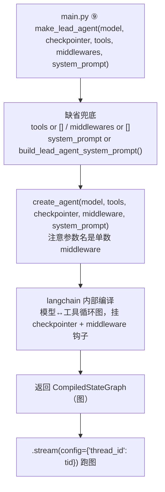

# agents/lead_agent/agent.py — agent.py

> **文件路径**: `backend/packages/harness/agentflow/agents/lead_agent/agent.py`
> **目录位置**: agents → lead_agent → agent.py
> **职责**: 主 Agent 构建

## 📑 目录

- [📋 结构图](#📋-结构图)
- [📤 关键导出](#📤-关键导出)
- [💡 设计思想](#💡-设计思想)
- [🎯 实用场景](#🎯-实用场景)
- [📊 顺序执行链流程图](#📊-顺序执行链流程图)
- [🧩 代码解析（成块对照 agent.py）](#🧩-代码解析成块对照-agentpy)
- [⚠️ 风险点](#⚠️-风险点)
- [❓ Q&A / 知识点（问答自动归档区）](#❓-qa--知识点问答自动归档区)

## 📋 结构图

```text
┌──────────────────────────────────────────────────────┐
│ make_lead_agent(                                     │
│     model: BaseChatModel,                            │
│     checkpointer: Checkpointer,                      │
│     tools: list[BaseTool] = [],                      │
│     middlewares: list[AgentMiddleware] = [],         │
│     system_prompt: str | None = None,                │
│ ) → CompiledStateGraph                               │
│                                                      │
│   create_agent(model, tools, checkpointer,           │
│                middleware)                           │
│   = langchain 官方"模型↔工具"循环 Agent:              │
│     模型 → 想调工具? → 调 → 结果回填 → 再想 → 回复    │
│     每步状态自动过 checkpointer 存 SQLite            │
│     middleware 挂横向能力（标题/线程目录等）          │
│                                                      │
│ 调用方: cli/main.py（stream 时传 thread_id）         │
└──────────────────────────────────────────────────────┘
```

## 📤 关键导出

**函数**

- `make_lead_agent()`

## 💡 设计思想

1. 参考文档：doc/doc-dev/01-里程碑/M2-工具与中间件.md §2
2. 状态类型默认用 create_agent 内置（messages + 中间件扩展字段），
   自定义 ThreadState 在工具复杂化后再接入。
3. checkpointer 依赖注入：CLI 可换同步/异步，测试可换内存检查点。
4. 系统提示词默认由 prompt.py 构建（原版思想：时间/技能/工具段
   都在 prompt 侧拼装，不散在调用处）。

## 🎯 实用场景

1. 主 Agent 构建：make_lead_agent 装配模型+检查点+工具+中间件
2. 会话持久化：create_agent checkpointer 参数让每步状态落 SQLite
3. M2 扩展点：tools/middlewares 参数挂工具目录与横向能力

## 📊 顺序执行链流程图

```text
main.py ⑨ make_lead_agent(model, checkpointer, tools, middlewares, system_prompt)（request）
│
▼
缺省兜底                     ← tools or [] / middlewares or []
│                              system_prompt or build_lead_agent_system_prompt()
▼
create_agent(                ← 注意中间件参数名是【单数 middleware】（P-017）
    model=model,
    tools=tools or [],
    checkpointer=checkpointer,
    middleware=middlewares or [],
    system_prompt=...,
)
│
▼
langchain 内部编译           ← 模型↔工具循环图；挂 checkpointer + middleware 钩子
│
▼
返回 CompiledStateGraph（"图"）
│
▼
调用方 .stream(config={"configurable": {"thread_id": tid}}) 跑图
```

**Mermaid 版（GitHub / 飞书渲染；VSCode 需装插件）**：



## 🧩 代码解析（成块对照 agent.py）

> 读法：每块先贴**完整代码**，再看块下方的整块解析。代码与文件一致，仅省略头部规范注释。

### 块 1：imports —— 从哪来

```python
from __future__ import annotations

# create_agent: langchain 的官方 Agent 构造器（与原版同款 API）
# 注意: 不要 from langgraph.prebuilt import create_agent——
#       prebuilt 1.0.8（锁定版）只有 create_react_agent；
#       langchain.agents.create_agent 在内部做了正确封装（含 checkpointer 支持）
from langchain.agents import create_agent
from langchain.agents.middleware import AgentMiddleware
from langchain_core.language_models import BaseChatModel
from langchain_core.tools import BaseTool
from langgraph.checkpoint.base import BaseCheckpointSaver

# 提示词域（同包）：系统提示词构建（含当前时间注入，对齐原版 prompt.py）
from agentflow.agents.lead_agent.prompt import build_lead_agent_system_prompt
```

**整块解析**：五类依赖——① `create_agent`（langchain.agents，**不是** langgraph.prebuilt，注释明确警告：prebuilt 1.0.8 锁定版只有 `create_react_agent`，langchain 版才正确封装了 checkpointer 支持）；② `AgentMiddleware`（中间件基类）；③ `BaseChatModel` / `BaseTool`（类型标注）；④ `BaseCheckpointSaver`（检查点基类，参数类型）；⑤ 同包 `build_lead_agent_system_prompt`（系统提示词构建，缺省时调用）。

### 块 2：`make_lead_agent` 签名 + docstring —— 装配入口

```python
def make_lead_agent(
    model: BaseChatModel,
    checkpointer: BaseCheckpointSaver,
    tools: list[BaseTool] | None = None,
    middlewares: list[AgentMiddleware] | None = None,
    system_prompt: str | None = None,
):
    """构建主 Agent（M1 入口：模型 + 检查点 + 工具 + 中间件 + 系统提示词）。

    参数:
        model: 对话模型（factory.create_chat_model 产出）
        checkpointer: SQLite 检查点（thread_id 维度持久化状态）
        tools: 工具列表（M1 为空；M2 传 get_builtin_tools()）
        middlewares: 中间件列表（M2: TitleMiddleware / ThreadDataMiddleware）
        system_prompt: 系统提示词；缺省用 prompt.build_lead_agent_system_prompt()
                       （内含当前时间注入，学原版 prompt.py 的做法）

    返回:
        CompiledStateGraph: 已编译的 LangGraph，可 .stream() 调用

    设计说明:
        - 状态类型默认用 create_agent 内置（messages + 中间件扩展字段），
          自定义 ThreadState 在工具复杂化后再接入
        - checkpointer 传进来而不是在里面建——依赖注入，
          CLI 可换同步/异步，测试可换内存检查点
        - 系统提示词默认由 prompt.py 构建（原版思想：时间/技能/工具段
          都在 prompt 侧拼装，而不是散在调用处）
    """
```

**整块解析**：五个参数里前两个（model、checkpointer）必填，后三个 `= None` 可缺省。docstring 点明三条设计决策：① 状态类型先用 create_agent 内置的，自定义 `ThreadState`（thread_state.py）以后再接；② **checkpointer 依赖注入**——不在函数里建，由调用方传入，CLI 传 SQLite、测试传内存版；③ 系统提示词缺省走 prompt.py 统一拼装，不散在调用处。

### 块 3：函数体 —— 一行委托 create_agent

```python
    return create_agent(
        model=model,
        tools=tools or [],
        checkpointer=checkpointer,  # 每步状态落盘（会话可恢复的核心）
        middleware=middlewares or [],  # M2：挂横向能力中间件（参数名是单数 middleware）
        system_prompt=system_prompt or build_lead_agent_system_prompt(),
    )
```

**整块解析**：函数体就是一次 `create_agent(...)` 调用并原样 return。三个 `or` 兜底：

| 表达式 | 作用 |
|---|---|
| `tools or []` | 调用方不传（None）→ 空工具列表 = 纯对话 Agent（M1 形态） |
| `middleware=middlewares or []` | 注意 create_agent 的形参名是**单数 `middleware`**（P-017 踩过）；传入的仍是 `middlewares` 列表 |
| `system_prompt or build_lead_agent_system_prompt()` | 不传系统提示词时，自动用 prompt.py 构建（含当前时间注入） |

`checkpointer=checkpointer` 直接透传——这就是 checkpointer 注入 langgraph 的挂载点（详见本文件 Q&A 归档区）。

## ⚠️ 风险点

1. create_agent 的中间件参数名是【单数 middleware】（P-017）
2. tools/middlewares 列表为空时行为 = 纯对话 Agent（M1 形态），勿改默认
3. 系统提示词缺省走 prompt.py；直接传 system_prompt 会覆盖默认注入

## ❓ Q&A / 知识点（问答自动归档区）

### checkpointer 是如何注入 langgraph 的？（2026-09-30 用户提问）

**链路**（注入点就在 `create_agent`）：

```text
main.py ⑤  create_sqlite_checkpointer(db_path)
              └─ 返回 SqliteSaver（langgraph 的 SQLite 存档员，持连接）
main.py ⑨  make_lead_agent(checkpointer=checkpointer, ...)
              └─ 本文件 return create_agent(
                     model=model,
                     tools=tools or [],
                     checkpointer=checkpointer,   ← 注入点
                     middleware=middlewares or [],
                     system_prompt=...,
                 )
              └─ langchain 内部：create_agent → langgraph 编译
                 → 返回 CompiledStateGraph（"图"）
                 → checkpointer 挂到图的 checkpointer 属性上
```

**"图"指什么**：`create_agent` 返回的 `CompiledStateGraph`——编译好的可执行图（模型↔工具循环）。图状态（graph state）= 运行中的 `messages` 列表 + 中间件扩展字段（如 `title`）。

**注入后 langgraph 内部做什么**（checkpointer 是被动对象，图主动用它）：

```text
agent.stream(config={"configurable": {"thread_id": "abc"}})
  │ 每执行完一步（super-step），图自动调存档员：
  saver.put(config, checkpoint, metadata, new_versions)
  │   → 图状态序列化 → 写 SQLite，按 thread_id 分档
  ▼
同一 thread_id 再跑 → 图初始化时：
  saver.get_tuple(config)
  │   → 按 thread_id 读回最近快照 → 填充图状态 → 上轮对话恢复
  ▼
继续 stream
```

**为什么不在 create_agent 里自己建 checkpointer（依赖注入）**：
CLI 传 SQLite 版（真实持久化），测试可传内存版（InMemorySaver 跑完自动清）——同一份 agent 代码不用改。

**一句话**：`create_sqlite_checkpointer(db_path)` 造存档员 → `create_agent(checkpointer=...)` 挂到图上 → langgraph 每步自动 `put`、按 `thread_id` `get_tuple`——这就是"同一 thread_id 恢复对话"的完整机制。

---
_自动生成于 doc-code 规范落地（2026-09-28）。来源：agent.py 头部注释 + 顶层符号。_
_2026-09-30 追加：Q&A 归档区（checkpointer 注入机制，用户提问自动归纳）。_
_2026-09-30 补齐：目录 + 顺序执行链流程图 + 成块代码解析（+Q&A）。_
