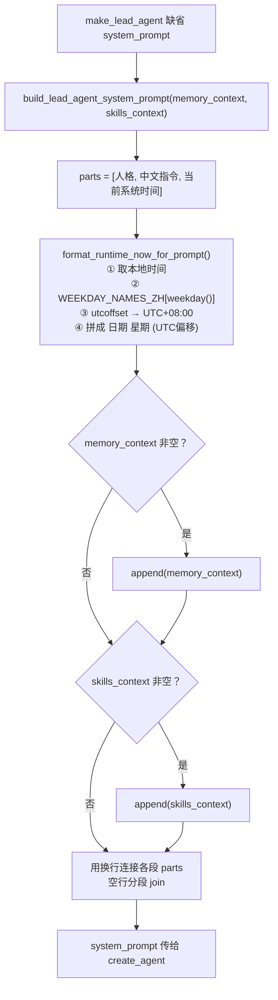

# agents/lead_agent/prompt.py — prompt.py

> **文件路径**: `backend/packages/harness/agentflow/agents/lead_agent/prompt.py`
> **目录位置**: agents → lead_agent → prompt.py
> **职责**: 系统提示词构建

## 📑 目录

- [📋 结构图](#📋-结构图)
- [📤 关键导出](#📤-关键导出)
- [💡 设计思想](#💡-设计思想)
- [🎯 实用场景](#🎯-实用场景)
- [📊 顺序执行链流程图](#📊-顺序执行链流程图)
- [🧩 代码解析（成块对照 prompt.py）](#🧩-代码解析成块对照-promptpy)
- [❓ Q&A / 知识点](#❓-qa--知识点)
- [⚠️ 风险点](#⚠️-风险点)

## 📋 结构图

```text
┌──────────────────────────────────────────────────────┐
│ prompt.py（提示词构建）                               │
│   format_runtime_now_for_prompt(dt=None) → str       │
│     "2026-09-28 周一 (UTC+08:00)"                    │
│     （本地时间 + 中文星期 + UTC 偏移，原版同款格式）  │
│   build_lead_agent_system_prompt() → str             │
│     人格说明 + 【当前系统时间】注入                   │
└──────────────────────────────────────────────────────┘
```

## 📤 关键导出

**函数**

- `format_runtime_now_for_prompt()`
- `build_lead_agent_system_prompt()`

**常量**

- `WEEKDAY_NAMES_ZH`

## 💡 设计思想

1. 用"注入"而非"时间工具"：模型从 system prompt 直接读到当前时间，
   无需工具调用，省一轮往返（原版没有独立 datetime 工具）。
2. 提示词集中管理：不散在调用处，改提示词只改这一处。

## 🎯 实用场景

1. 系统提示词构建：时间注入（Agent 知道"今天"，不必调工具，P-011）
2. 提示词集中管理：不散在调用处，改提示词只改这一处

## 📊 顺序执行链流程图

```text
make_lead_agent 缺省 system_prompt（request）
│
▼
build_lead_agent_system_prompt(memory_context, skills_context)
│
├───────────────┬────────────────┐
▼               ▼                │
parts 固定三段   memory_context   skills_context
[人格, 中文指令,  非空则 append    非空则 append
 当前系统时间]   （空则不出现）    （空则不出现）
│               │                │
└───────────────┴────────────────┘
│
▼
format_runtime_now_for_prompt()
│                         ← 被"当前系统时间"段调用
├─ ① dt 缺省 → datetime.now().astimezone()（补本地时区）
├─ ② weekday_zh = WEEKDAY_NAMES_ZH[dt.weekday()]（周一=0…周日=6）
├─ ③ utcoffset → "UTC+08:00"（正负号 + HH:MM）
└─ ④ 拼装 → "2026-09-28 周一 (UTC+08:00)"
│
▼
"\n\n".join(parts)      ← 空行分段拼成最终系统提示词
│
▼
system_prompt 传给 create_agent → 注入模型
```

**Mermaid 版（GitHub / 飞书渲染；VSCode 需装插件）**：



## 🧩 代码解析（成块对照 prompt.py）

> 读法：每块先贴**完整代码**，再看块下方的整块解析。代码与文件一致，仅省略头部规范注释。

### 块 1：imports + 中文星期常量

```python
from __future__ import annotations

from datetime import datetime, timedelta, timezone

# 中文星期名（Monday=0 ... Sunday=6，与原版 WEEKDAY_NAMES 对齐）
WEEKDAY_NAMES_ZH = ["周一", "周二", "周三", "周四", "周五", "周六", "周日"]
```

**结构简析**：只依赖标准库 `datetime` 三个对象（datetime 本体、timedelta 算偏移、timezone 带时区）。`WEEKDAY_NAMES_ZH` 是模块级常量。

**补充**：列表顺序严格对齐 `datetime.weekday()` 的返回值（Monday=0 … Sunday=6），索引直接取中文星期名，顺序错一天就错位。

### 块 2：`format_runtime_now_for_prompt()` —— 时间格式化

```python
def format_runtime_now_for_prompt(
    dt: datetime | None = None, *, prompt_language: str | None = None
) -> str:
    """把"当前时间"格式化为适合注入提示词的字符串（原版同款函数）。

    格式: "2026-09-28 周一 (UTC+08:00)"
        - 日期: YYYY-MM-DD（本地时区）
        - 星期: 中文（周一到周日）
        - 时区: UTC 偏移（+/-HH:MM），括号包裹

    参数:
        dt: 指定时刻；缺省取当前本地时间
        prompt_language: 原版用于切换中英文星期名；M1 固定中文，
                         保留该参数以对齐原版签名（后续扩展）

    为什么有 UTC 偏移: 模型推理无本地时区概念，显式偏移
    才能正确换算"还有几小时到期"这类相对时间问题。
    """
    # ① 取本地时间（缺省时 astimezone 自动补本地时区）
    if dt is None:
        dt = datetime.now().astimezone()
    if dt.tzinfo is None:
        # 无时区信息时按 UTC 0 处理再转本地（与原版一致）
        dt = dt.replace(tzinfo=timezone(timedelta(0))).astimezone()

    # ② 星期（Monday=0 → 列表索引）
    weekday_zh = WEEKDAY_NAMES_ZH[dt.weekday()]

    # ③ UTC 偏移 → "+08:00" / "-05:00"
    offset = dt.utcoffset() or timedelta(0)
    total_minutes = int(offset.total_seconds() // 60)
    sign = "+" if total_minutes >= 0 else "-"
    hh, mm = divmod(abs(total_minutes), 60)
    utc_part = f"UTC{sign}{hh:02d}:{mm:02d}"

    # ④ 拼装
    return f"{dt.strftime('%Y-%m-%d')} {weekday_zh} ({utc_part})"
```

**结构简析**：四步——① 时区兜底：`dt` 缺省取 `datetime.now().astimezone()`；若传入的 dt 没带时区（`tzinfo is None`），先按 UTC 0 标上再转本地（与原版一致）。② 星期：`dt.weekday()` 0=周一，直接索引 `WEEKDAY_NAMES_ZH`。③ 偏移：`utcoffset()` 转分钟数，`divmod(abs, 60)` 拆出 HH/MM，正负号单独判，`f"{hh:02d}:{mm:02d}"` 补零两位。④ 拼成 `"2026-09-28 周一 (UTC+08:00)"`。

**`format_runtime_now_for_prompt()` 参数逐条解释**：

| 参数 | 类型 | 默认值 | 含义 |
|---|---|---|---|
| `dt` | `datetime \| None` | `None` | 指定时刻；缺省取 `datetime.now().astimezone()`（自动补本地时区）；若 `dt.tzinfo is None` 则先按 UTC 0 标注再转本地 |
| `prompt_language` | `str \| None` | `None` | **关键字-only 参数**（`*` 之后）；原版用于切换中英文星期名，M1 固定中文，保留仅为对齐原版签名，当前不影响输出 |

**落库要点**：返回格式 `"YYYY-MM-DD 周X (UTC+HH:MM)"`；**为什么要 UTC 偏移**——模型无本地时区概念，显式偏移才能算"还有几小时到期"这类相对时间。

### 块 3：`build_lead_agent_system_prompt()` —— 拼装系统提示词

```python
def build_lead_agent_system_prompt(
    memory_context: str = "",
    skills_context: str = "",
) -> str:
    """系统提示词：人格 + 当前时间 + （可选）记忆 / 技能段。

    M1 只有时间注入；M3 增加:
        - memory_context: 记忆召回段落（跨会话用户事实，由 CLI 注入）
        - skills_context: 可用技能说明（SKILL.md 列表，由 CLI 注入）
    记忆/技能为空时对应段落不出现（提示词保持干净）。
    """
    parts = [
        "你是 AgentFlow 的助手（仿写 EvoFlow 的 M3 最小实现）。",
        "请用中文简洁回答；需要准确日期/时间时，直接使用下面注入的当前时间。",
        f"当前系统时间：{format_runtime_now_for_prompt()}",
    ]
    if memory_context:
        parts.append(memory_context)
    if skills_context:
        parts.append(skills_context)
    return "\n\n".join(parts)
```

**结构简析**：固定三段 + 可选两段——parts 初始必含：人格定位、中文回答指令、**当前系统时间（当场调用 `format_runtime_now_for_prompt()` 生成）**。`memory_context` / `skills_context` 默认空串，**非空才 append**。最后 `"\n\n".join(parts)` 用空行分段。

**`build_lead_agent_system_prompt()` 参数逐条解释**：

| 参数 | 类型 | 默认值 | 含义 |
|---|---|---|---|
| `memory_context` | `str` | `""` | 记忆召回段落（跨会话用户事实，由 CLI 注入）；空串则对应段落不出现，非空才 `parts.append` |
| `skills_context` | `str` | `""` | 可用技能说明（SKILL.md 列表，由 CLI 注入）；空串则不出现，非空才 `parts.append` |

**落库要点**：这就是"时间注入而非时间工具"的落点——模型读 system prompt 直接看到今天是周几、几点、UTC 偏移多少，省掉一次 datetime 工具往返（P-011）。

## ❓ Q&A / 知识点

### 1. 为什么把时间"注入 system prompt"而不是做一个 datetime 工具？

**一句话**：做时间工具要让模型先决定调工具、等工具返回、再继续——多一轮模型往返，慢且费 token。直接把 `当前系统时间：2026-09-28 周一 (UTC+08:00)` 写进 system prompt，模型第一轮就知道"今天"，零工具调用。这就是 P-011 删 datetime 工具改注入的原因（原版也没有独立时间工具）。

### 2. `WEEKDAY_NAMES_ZH` 为什么顺序不能动？

**一句话**：`datetime.weekday()` 返回 0=周一、6=周日，列表索引和返回值一一对应。`WEEKDAY_NAMES_ZH[0]` 必须是"周一"、`[6]` 必须是"周日"——顺序一旦调换，周二就会显示成周三这类整体错位。这也是风险点 1 的来源。

## ⚠️ 风险点

1. WEEKDAY_NAMES_ZH 顺序 = 周一(0)…周日(6)，与 datetime.weekday() 对齐
2. 时间格式是契约：Agent 靠它判断"今天"，改格式需同步测试

---
_自动生成于 doc-code 规范落地（2026-09-28）。来源：prompt.py 头部注释 + 顶层符号。_
_2026-09-30 补齐：目录 + 顺序执行链流程图 + 成块代码解析（+Q&A）。_
_2026-10-03 重构：代码解析段按「结构简析 + 参数逐条表格 + 落库要点」规范化（代码块零改动）。_
