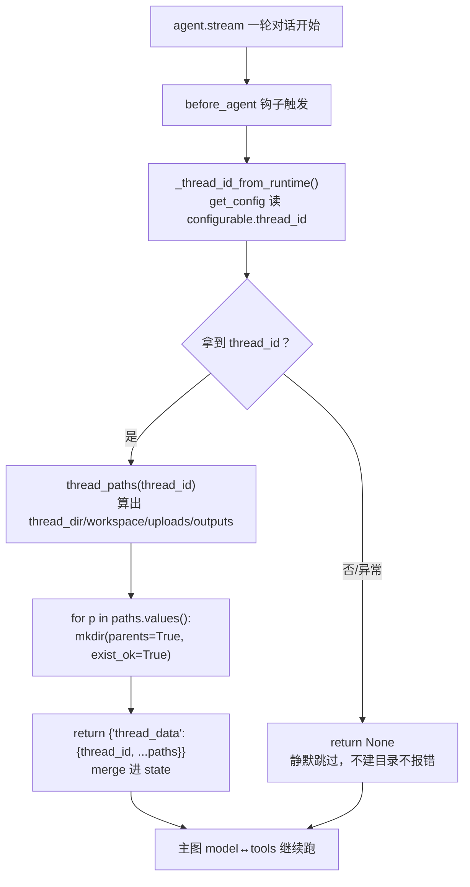

# agents/middlewares/thread_data_middleware.py — thread_data_middleware.py

> **文件路径**: `backend/packages/harness/agentflow/agents/middlewares/thread_data_middleware.py`
> **目录位置**: agents → middlewares → thread_data_middleware.py
> **职责**: 线程数据目录中间件

## 📑 目录

- [📋 结构图](#📋-结构图)
- [📤 关键导出](#📤-关键导出)
- [💡 设计思想](#💡-设计思想)
- [🎯 实用场景](#🎯-实用场景)
- [📊 顺序执行链流程图](#📊-顺序执行链流程图)
- [🧩 代码解析（成块对照 thread_data_middleware.py）](#🧩-代码解析成块对照-thread_data_middlewarepy)
- [❓ Q&A](#❓-qa)
- [⚠️ 风险点](#⚠️-风险点)

## 📋 结构图

```text
┌────────────────────────────────────────────────────────────┐
│ ThreadDataMiddlewareState(AgentState)                       │
│   thread_data: NotRequired[dict | None]                     │
│                                                             │
│ ThreadDataMiddleware(AgentMiddleware)                       │
│   before_agent(state, runtime) → dict | None                │
│     ① 从 runtime 取 thread_id（get_config）                 │
│     ② 路径 = {base}/threads/{thread_id}/user-data/          │
│              workspace / uploads / outputs                   │
│     ③ 同步 mkdir（M2 eager；原版 lazy 按需创建）             │
│     ④ 返回 {"thread_data": {...}} → merge 进 state          │
└────────────────────────────────────────────────────────────┘
```

## 📤 关键导出

**类**

- `ThreadDataMiddlewareState`
- `ThreadDataMiddleware`

**常量**

- `_DEFAULT_BASE_DIR`

## 💡 设计思想

1. 参考文档：doc/doc-dev/01-里程碑/M2-工具与中间件.md §2
2. 原版思想：每个会话有独立工作目录（文件类工具的输出落这里），
   是后续文件读写工具（M3+）的"地盘"。目录结构对齐原版命名。
3. M2 简化：去掉 Paths 解析，直接用 data/ 相对路径；
   建目录用 eager（一次建好）而非 lazy（按需创建），代码更简单。

## 🎯 实用场景

1. 会话工作区隔离：每个 thread 独立 user-data/{workspace,uploads,outputs}
2. M3 文件工具的地盘：文件读写工具的输出落这里，会话间不串扰
3. 上传/输出目录规划：uploads 收用户上传，outputs 放 Agent 生成物

## 📊 顺序执行链流程图

```text
agent.stream 一轮对话开始（request）
│
▼
before_agent 钩子触发        ← 图跑起来之前，所有中间件 before_agent 正序执行
│
▼
_thread_id_from_runtime()   ← get_config() 读 configurable.thread_id
│
├──────────────┬──────────────┐
▼              ▼              │
拿到 thread_id  拿不到/异常     │
│              │              │
▼              ▼              │
thread_paths() return None     │
算出 4 个路径   （静默跳过，    │
│               不建目录不报错）│
▼              │              │
for p in paths.values():      │
  mkdir(parents=True,          │
        exist_ok=True)         │
│              │              │
▼              │              │
return {"thread_data": {...}}  │
→ merge 进 state              │
│              │              │
└──────────────┴──────────────┘
│
▼
主图（model↔tools 循环）继续跑，文件工具按 state.thread_data 落盘
```

**Mermaid 版（GitHub / 飞书渲染；VSCode 需装插件）**：



## 🧩 代码解析（成块对照 thread_data_middleware.py）

> 读法：每块先贴**完整代码**，再看块下方的整块解析。代码与文件一致，仅省略头部规范注释。

### 块 1：imports + 默认根目录常量

```python
from __future__ import annotations

from pathlib import Path
from typing import Any, NotRequired

from langchain.agents import AgentState
from langchain.agents.middleware import AgentMiddleware
from langgraph.config import get_config

# 默认线程数据根（相对项目 data 目录；对齐原版 base_dir 语义）
_DEFAULT_BASE_DIR = "data"
```

**结构简析**：依赖——`Path`（路径拼接/建目录）、`NotRequired`（TypedDict 可选字段）、langchain 的 `AgentState` 基类 + `AgentMiddleware` 中间件基类、`get_config`（在中间件里拿 langgraph 运行时配置）。

**补充**：`_DEFAULT_BASE_DIR = "data"` 是相对项目根的线程数据根，可被构造参数 `base_dir` 覆盖。

### 块 2：`ThreadDataMiddlewareState` —— 挂 thread_data 字段

```python
class ThreadDataMiddlewareState(AgentState):
    """与 ThreadState 兼容：额外挂 thread_data 字段。"""

    thread_data: NotRequired[dict[str, Any] | None]
```

**结构简析**：继承 `AgentState`，只扩一个可选字段 `thread_data`（`NotRequired` = 可有可无）。

**字段说明**：`thread_data: NotRequired[dict[str, Any] | None]`——中间件 `before_agent` 返回 `{"thread_data": {...}}` 就会 merge 进图状态。

**补充**：后续文件类工具从 state 里读这个 dict 拿到自己的工作目录。

### 块 3：`ThreadDataMiddleware` 构造 + 取 thread_id

```python
class ThreadDataMiddleware(AgentMiddleware[ThreadDataMiddlewareState]):
    """为每个线程创建独立数据目录（workspace/uploads/outputs）。"""

    state_schema = ThreadDataMiddlewareState

    def __init__(self, base_dir: str = _DEFAULT_BASE_DIR) -> None:
        """初始化。

        Args:
            base_dir: 线程数据根目录（默认 data/）。
        """
        self.base_dir = base_dir

    @staticmethod
    def _thread_id_from_runtime(runtime) -> str | None:
        """从 langgraph 运行时配置取 thread_id。"""
        try:
            config = get_config()
            return str((config.get("configurable") or {}).get("thread_id") or "")
        except Exception:  # noqa: BLE001 —— 拿不到 thread_id 时静默跳过
            return None
```

**结构简析**：① `state_schema = ThreadDataMiddlewareState` 告诉 langgraph 这个中间件扩展了哪些状态字段。② `__init__` 存 `base_dir`（可注入）。③ `_thread_id_from_runtime` 是静态方法——用 `get_config()` 在运行时上下文里掏 `configurable.thread_id`；两层 `or {}` / `or ""` 兜底，整个包在 `try/except` 里，**任何异常都返回 None**。

**`ThreadDataMiddleware.__init__()` / `_thread_id_from_runtime()` 参数逐条解释**：

| 参数 | 类型 | 默认值 | 含义 |
|---|---|---|---|
| `base_dir`（`__init__`） | `str` | `_DEFAULT_BASE_DIR`（`"data"`） | 线程数据根目录，存为 `self.base_dir`；构造 `ThreadDataMiddleware(base_dir=...)` 可覆盖默认根 |
| `runtime`（`_thread_id_from_runtime`，静态方法） | 未标注 | 必填 | langgraph 运行时对象；函数内用 `get_config()` 读 `config["configurable"]["thread_id"]`，空串/异常都返回 `None`（拿不到就静默跳过） |

**补充**：拿不到 thread_id 时返回 None 而不抛错，不打断图的执行。

### 块 4：`thread_paths()` 算路径 + `before_agent()` 建目录

```python
    def thread_paths(self, thread_id: str) -> dict[str, str]:
        """计算线程数据目录（不建目录，供调用方决定）。"""
        root = Path(self.base_dir) / "threads" / thread_id / "user-data"
        return {
            "thread_dir": str(root),
            "workspace": str(root / "workspace"),
            "uploads": str(root / "uploads"),
            "outputs": str(root / "outputs"),
        }

    def before_agent(self, state: ThreadDataMiddlewareState, runtime) -> dict[str, Any] | None:
        """图开始前建好线程目录（M2 eager 模式），路径信息写入 state。"""
        thread_id = self._thread_id_from_runtime(runtime)
        if not thread_id:
            return None
        paths = self.thread_paths(thread_id)
        # M2：直接建目录（原版 lazy 按需，简化版 eager 一次建好）
        for p in paths.values():
            Path(p).mkdir(parents=True, exist_ok=True)
        return {"thread_data": {"thread_id": thread_id, **paths}}
```

**结构简析**：两个方法职责分离——`thread_paths` 只**算**路径不建（便于单测）；`before_agent` 是钩子：取 thread_id → 空则 return None → 算路径 → 一次性建好四级目录 → 返回 `{"thread_data": {...}}` merge 进 state。

**`thread_paths()` / `before_agent()` 参数逐条解释**：

| 参数 | 类型 | 默认值 | 含义 |
|---|---|---|---|
| `thread_id`（`thread_paths`） | `str` | 必填 | 会话 ID；拼出 `root = Path(base_dir)/"threads"/thread_id/"user-data"`，返回四键 dict：`thread_dir`/`workspace`/`uploads`/`outputs`（不建目录） |
| `state`（`before_agent`） | `ThreadDataMiddlewareState` | 必填 | 当前图状态；本钩子不读它，仅按 AgentMiddleware 签名要求传入 |
| `runtime`（`before_agent`） | 未标注 | 必填 | langgraph 运行时；透传给 `_thread_id_from_runtime(runtime)` 取 thread_id |

**落库要点**：`mkdir(parents=True, exist_ok=True)`——parents 连父目录一起建、exist_ok 已存在不报错（**幂等**）；返回 `{"thread_data": {"thread_id": tid, **paths}}`。M2 是 eager（进图就建好），原版是 lazy（按需）。

## ❓ Q&A

**Q: 目录在哪？**

A: data/threads/{thread_id}/user-data/{workspace,uploads,outputs}

**Q: 为什么 eager 建目录？**

A: M2 简化：一次建好；原版 lazy 按需创建，M3 文件工具可改回

## ⚠️ 风险点

1. _DEFAULT_BASE_DIR="data" 是线程数据根；改它会让会话工作区整体迁移
2. 拿不到 thread_id 时静默跳过（before_agent 返回 None），不报错
3. M2 为 eager 建目录；改回 lazy 需同步调整 M3 文件工具的调用时机

---
_自动生成于 doc-code 规范落地（2026-09-28）。来源：thread_data_middleware.py 头部注释 + 顶层符号。_
_2026-09-30 补齐：目录 + 顺序执行链流程图 + 成块代码解析（+Q&A）。_
_2026-10-03 重构：代码解析段按「结构简析 + 参数逐条表格 + 落库要点」规范化（代码块零改动）。_
