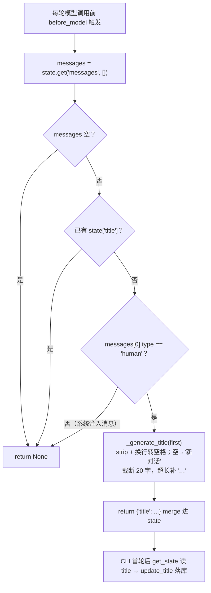

# agents/middlewares/title_middleware.py — title_middleware.py

> **文件路径**: `backend/packages/harness/agentflow/agents/middlewares/title_middleware.py`
> **目录位置**: agents → middlewares → title_middleware.py
> **职责**: 自动标题中间件

## 📑 目录

- [📋 结构图](#📋-结构图)
- [📤 关键导出](#📤-关键导出)
- [💡 设计思想](#💡-设计思想)
- [🎯 实用场景](#🎯-实用场景)
- [📊 顺序执行链流程图](#📊-顺序执行链流程图)
- [🧩 代码解析（成块对照 title_middleware.py）](#🧩-代码解析成块对照-title_middlewarepy)
- [❓ Q&A](#❓-qa)
- [⚠️ 风险点](#⚠️-风险点)

## 📋 结构图

```text
┌────────────────────────────────────────────────────────────┐
│ TitleMiddlewareState(AgentState)                           │
│   title: NotRequired[str | None]                            │
│                                                             │
│ TitleMiddleware(AgentMiddleware)                            │
│   state_schema = TitleMiddlewareState                       │
│   before_model(state, runtime) → dict | None                │
│     ① 取 messages 列表                                      │
│     ② 仅"首条消息 + 尚无标题"时生成标题                     │
│        title = 首条 user 消息前 20 字（规则截断）            │
│     ③ 返回 {"title": title} → merge 进图状态                │
│   （CLI 首轮对话后 get_state 读 title → 落库 sessions.title）│
└────────────────────────────────────────────────────────────┘
```

## 📤 关键导出

**类**

- `TitleMiddlewareState`
- `TitleMiddleware`

**常量**

- `_TITLE_MAX_CHARS`

## 💡 设计思想

1. 参考文档：doc/doc-dev/01-里程碑/M2-工具与中间件.md §2
2. 原版思想：标题是"横向能力"，挂在 AgentMiddleware 上，不进主图逻辑；
   标题生成只做一次（首条消息），避免重复 LLM 调用。
3. M2 简化：用规则截断而非 LLM（免费模型限流会挂，P-015）；
   后续想换 LLM 生成只需替换 _generate_title 内部实现。

## 🎯 实用场景

1. 会话列表显示：首条消息自动生成标题（截断 20 字），sessions.title 落库后列表可读
2. 免 LLM 稳定方案：规则截断不调模型，避开免费模型高峰限流（P-015）
3. 换 LLM 生成：后续想升级为智能标题只改 _generate_title 内部实现

## 📊 顺序执行链流程图

```text
每轮模型调用前，before_model 钩子触发（request）
│
▼
messages = state.get("messages", [])
│
├──────────────┬──────────────┬──────────────┐
▼              ▼              ▼              │
messages 空    已有 title      messages[0]    │
│              │              .type != "human"│
▼              ▼              ▼              │
return None    return None    return None     │
（不生成）     （幂等不重复）  （系统注入消息  │
│              │              不触发）       │
└──────────────┴──────────────┴──────────────┘
│
▼ 首条是 human 且无 title
_generate_title(first)       ← strip + 换行转空格；空→"新对话"
│                              截断 20 字，超长补 "…"
▼
return {"title": ...}        ← merge 进图状态
│
▼
（后续轮次 before_model 再触发：已有 title → return None，不重复）
│
▼
CLI 首轮对话后 agent.get_state 读 state["title"] → sessions.update_title 落库
```

**Mermaid 版（GitHub / 飞书渲染；VSCode 需装插件）**：



## 🧩 代码解析（成块对照 title_middleware.py）

> 读法：每块先贴**完整代码**，再看块下方的整块解析。代码与文件一致，仅省略头部规范注释。

### 块 1：imports + 标题长度常量

```python
from __future__ import annotations

from typing import Any, NotRequired

from langchain.agents import AgentState
from langchain.agents.middleware import AgentMiddleware
from langchain_core.messages import AnyMessage

# 标题最长字数（CLI 显示美观 + 原版也控制长度）
_TITLE_MAX_CHARS = 20
```

**整块解析**：依赖——`Any`/`NotRequired`（TypedDict 标注）、langchain 的 `AgentState` + `AgentMiddleware`、`AnyMessage`（消息基类）。`_TITLE_MAX_CHARS = 20` 是模块级常量：标题最多 20 字，改它会同时影响 CLI 显示与落库标题长度。

### 块 2：`TitleMiddlewareState` —— 挂 title 字段

```python
class TitleMiddlewareState(AgentState):
    """与 ThreadState 兼容：额外挂一个 title 字段。"""

    title: NotRequired[str | None]
```

**整块解析**：继承 `AgentState`，扩一个可选字段 `title`（`NotRequired[str | None]`）。中间件返回 `{"title": ...}` 就 merge 进图状态；CLI 首轮后 `agent.get_state` 读的就是这个键。

### 块 3：`TitleMiddleware` + `_generate_title()` —— 规则截断

```python
class TitleMiddleware(AgentMiddleware[TitleMiddlewareState]):
    """第一条用户消息后自动生成会话标题（写 state，CLI 落库）。"""

    state_schema = TitleMiddlewareState

    def _generate_title(self, first_message: AnyMessage) -> str:
        """生成标题：规则截断首条用户消息（M2 简化；原版用 LLM）。

        为什么不用 LLM：免费模型高峰限流（P-015）会让标题生成挂掉、
        拖慢首轮对话；规则截断 100% 稳定且足够可用。
        """
        content = str(getattr(first_message, "content", "") or "").strip()
        content = content.replace("\n", " ")
        if not content:
            return "新对话"
        return content[:_TITLE_MAX_CHARS] + ("…" if len(content) > _TITLE_MAX_CHARS else "")
```

**整块解析**：`state_schema = TitleMiddlewareState` 注册扩展字段。`_generate_title` 四步：① `getattr(first_message, "content", "")` 安全取内容，`or ""` + `strip()` 兜底空白；② `replace("\n", " ")` 换行压成空格（标题单行）；③ 空内容返回 `"新对话"`；④ 截断 `[:_TITLE_MAX_CHARS]`（20 字），超长时尾部补 `"…"`。**为什么不用 LLM**（docstring 明说）：免费模型高峰限流（P-015）会让标题生成挂掉、拖慢首轮；规则截断 100% 稳定。未来换 LLM 只改这个方法内部。

### 块 4：`before_model()` —— 幂等钩子

```python
    def before_model(self, state: TitleMiddlewareState, runtime) -> dict[str, Any] | None:
        """仅首条消息时生成一次标题（幂等：已有 title 则不重复）。"""
        messages: list[AnyMessage] = list(state.get("messages", []) or [])
        if not messages:
            return None
        if state.get("title"):
            return None  # 已有标题，不重复生成
        # 首条消息 = 用户的第一句话（human）
        first = messages[0]
        if getattr(first, "type", "") != "human":
            return None
        return {"title": self._generate_title(first)}
```

**整块解析**：`before_model` 在**每轮模型调用前**都跑，靠三个守卫保证只生成一次：① messages 空 → None；② `state.get("title")` 已有 → None（**幂等核心**——首轮写完 title，后续轮次直接跳过）；③ `messages[0].type != "human"` → None（只认用户第一句话，系统注入类消息不触发）。三个守卫都过才调 `_generate_title` 并返回 `{"title": ...}`。

## ❓ Q&A

**Q: 为什么不用 LLM 生成标题？**

A: 免费模型高峰限流（P-015）会让标题生成挂掉、拖慢首轮对话；规则截断 100% 稳定

**Q: 标题会重复生成吗？**

A: 不会——已有 title 时 before_model 直接返回 None，幂等

## ⚠️ 风险点

1. _TITLE_MAX_CHARS=20 是标题长度上限，调整影响 CLI 显示与落库标题
2. 幂等保证：已有 title 时 before_model 返回 None，不会重复生成
3. 只认 messages[0] 为 human 才生成；系统注入类消息（type!=human）不触发

---
_自动生成于 doc-code 规范落地（2026-09-28）。来源：title_middleware.py 头部注释 + 顶层符号。_
_2026-09-30 补齐：目录 + 顺序执行链流程图 + 成块代码解析（+Q&A）。_
