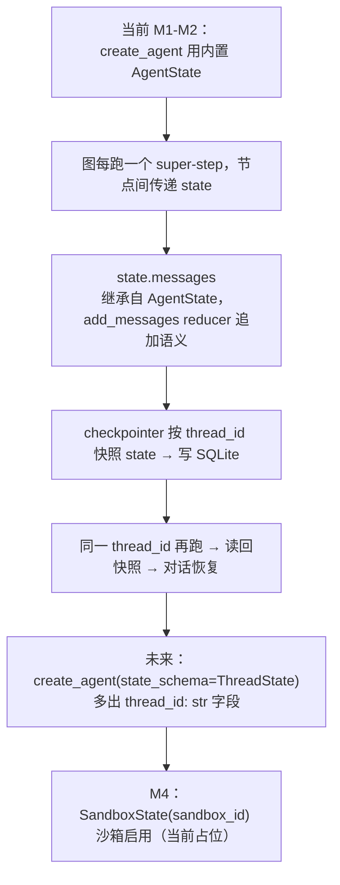

# agents/thread_state.py — thread_state.py

> **文件路径**: `backend/packages/harness/agentflow/agents/thread_state.py`
> **目录位置**: agents → thread_state.py
> **职责**: 图状态定义

## 📑 目录

- [📋 结构图](#📋-结构图)
- [📤 关键导出](#📤-关键导出)
- [💡 设计思想](#💡-设计思想)
- [🎯 实用场景](#🎯-实用场景)
- [📊 顺序执行链流程图](#📊-顺序执行链流程图)
- [🧩 代码解析（成块对照 thread_state.py）](#🧩-代码解析成块对照-thread_statepy)
- [❓ Q&A / 知识点](#❓-qa--知识点)
- [⚠️ 风险点](#⚠️-风险点)

## 📋 结构图

```text
┌──────────────────────────────────────────────────────┐
│ class ThreadState(AgentState)                         │
│   └─ AgentState（langchain 内置）自带:                │
│       messages: Annotated[list[AnyMessage],          │
│                              add_messages]           │
│       → "更新 = 追加" reducer，多轮上下文靠它累积     │
│   └─ M1 增加: thread_id: str                         │
│       → checkpointer 按它在 SQLite 定位历史状态      │
└──────────────────────────────────────────────────────┘
```

## 📤 关键导出

**类**

- `ThreadState`
- `SandboxState`

## 💡 设计思想

1. 继承 AgentState（而非自己写 TypedDict）= 原版做法，
   reducer 语义由官方维护，不重复造轮子。
2. thread_id 作为状态字段，检查点按它分桶存储/恢复。

## 🎯 实用场景

1. 自定义图状态：AgentState 子类，为后续复杂状态预留

## 📊 顺序执行链流程图

```text
当前 M1-M2：create_agent 用内置 AgentState（未接本文件 ThreadState）（request）
│
▼
图每跑一个 super-step，节点间传递 state（dict）
│
▼
state.messages               ← 继承自 AgentState：Annotated[list, add_messages]
│                              更新语义 = 追加（多轮上下文累积靠它）
▼
checkpointer 按 thread_id 快照整个 state → 写 SQLite
│
▼
同一 thread_id 再跑 → 快照读回 state → 上轮对话恢复
│
▼
（未来接入 ThreadState：create_agent(state_schema=ThreadState)）
  → state 多出 thread_id: str 自有字段
  → SandboxState(sandbox_id) M4 沙箱启用时再用（当前仅占位）
```

**Mermaid 版（GitHub / 飞书渲染；VSCode 需装插件）**：



## 🧩 代码解析（成块对照 thread_state.py）

> 读法：每块先贴**完整代码**，再看块下方的整块解析。代码与文件一致，仅省略头部规范注释。

### 块 1：imports —— 状态类型基类

```python
from __future__ import annotations

from typing import NotRequired

# AgentState: langchain 官方 Agent 状态基类
# 自带 messages + add_messages reducer（追加语义）——与 LangGraph 图天然契合
from langchain.agents import AgentState
from typing_extensions import TypedDict
```

**结构简析**：四个 import——`NotRequired`（可选字段标注）、langchain 官方 `AgentState`（状态基类，**自带 messages + add_messages 追加 reducer**）、`TypedDict`（typing_extensions，SandboxState 用）。

**补充**：继承 `AgentState` 而不是自己从零写 TypedDict，是为了白嫖官方维护好的 messages reducer 语义。

### 块 2：`ThreadState` —— 图共享状态

```python
class ThreadState(AgentState):
    """LangGraph 图的共享状态（每轮对话在节点间传递）。

    M1 只有一个自有字段:
        thread_id: 会话标识。checkpointer 用它在 SQLite 里定位
                   对应线程的历史状态（恢复会话的依据）

    继承 AgentState 说明:
        messages 字段（含追加 reducer）由官方基类提供，
        不用自己写 TypedDict——这是原版的做法。
    """

    thread_id: str
```

**结构简析**：`ThreadState(AgentState)` 继承官方基类，白嫖 `messages`（带 `add_messages` 追加 reducer），只加一个自有字段 `thread_id: str`。docstring 明确：messages 的 reducer 语义由基类维护，不重复造轮子。

**字段说明**：`thread_id: str`——会话标识，checkpointer 按它在 SQLite 分桶存/取历史状态，是恢复会话的依据。

**补充**：M1-M2 实际 create_agent 用的是内置 messages 状态，本类是为工具复杂化后预留的自定义状态（见风险点 1）。

### 块 3：`SandboxState` —— M4 占位

```python
class SandboxState(TypedDict):
    """沙箱状态（对齐原版结构，M4 沙箱用；M1 只占位不启用）。"""

    sandbox_id: NotRequired[str | None]
```

**结构简析**：独立的 `TypedDict`（不继承 AgentState），只有一个可选字段 `sandbox_id: NotRequired[str \| None]`。

**字段说明**：`sandbox_id: NotRequired[str | None]`——沙箱实例 ID，`NotRequired` 表示构造该 dict 时可缺省。

**补充**：docstring 明说对齐原版结构、**M4 沙箱功能才用，M1 只占位不启用**——当前没有任何代码消费它，提前放着是为了结构对齐原版。

## ❓ Q&A / 知识点

### 1. 为什么继承 `AgentState` 而不是自己写 TypedDict？

**一句话**：`AgentState` 自带 `messages: Annotated[list[AnyMessage], add_messages]`——`add_messages` 是"追加" reducer：节点写 messages 时是往列表里加，不是覆盖，多轮对话上下文才能累积。自己写 TypedDict 得自己声明这个 reducer，容易写错；继承官方基类直接白嫖这套语义（原版做法）。

### 2. `thread_id` 为什么要做成状态字段？

**一句话**：checkpointer 是按 `thread_id` 分桶存图状态的（恢复会话的钥匙）。把 `thread_id: str` 放进 ThreadState，状态类型就显式声明了"这是哪条会话"——未来接自定义 `state_schema` 时，thread_id 随 state 一起被快照、恢复。注意当前 M1-M2 实际用 create_agent 内置状态，thread_id 走运行时 config（`config={"configurable": {"thread_id": ...}}`）传，不是 state 字段。

## ⚠️ 风险点

1. M2 实际 create_agent 未用此状态（内置 messages 状态）；
   接入自定义状态时同步改 create_agent 的 state_schema

---
_自动生成于 doc-code 规范落地（2026-09-28）。来源：thread_state.py 头部注释 + 顶层符号。_
_2026-09-30 补齐：目录 + 顺序执行链流程图 + 成块代码解析（+Q&A）。_
_2026-10-03 重构：代码解析段按「结构简析 + 参数逐条表格 + 落库要点」规范化（代码块零改动）。_
