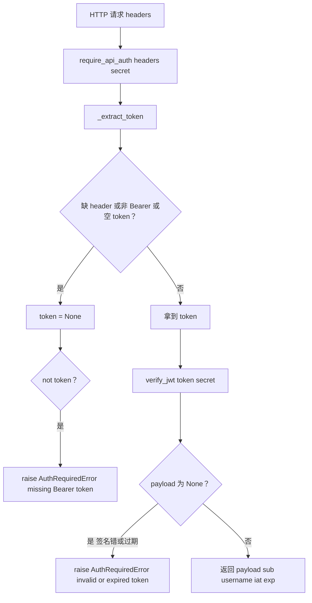

# authz/http_guard.py — http_guard.py

> **文件路径**: `backend/packages/harness/agentflow/authz/http_guard.py`
> **目录位置**: authz → http_guard.py
> **职责**: 鉴权守卫：从请求头解析 Bearer JWT，无效即抛 401 语义异常（M6）

## 📑 目录

- [📋 结构图](#📋-结构图)
- [📤 关键导出](#📤-关键导出)
- [💡 设计思想](#💡-设计思想)
- [🎯 实用场景](#🎯-实用场景)
- [📊 顺序执行链流程图](#📊-顺序执行链流程图)
- [🧩 代码解析（成块对照 http_guard.py）](#🧩-代码解析成块对照-http_guardpy)
- [❓ Q&A / 知识点](#❓-qa--知识点)
- [⚠️ 风险点](#⚠️-风险点)

## 📋 结构图

```text
┌──────────────────────────────────────────────────────────────┐
│ require_api_auth(headers, secret) → payload dict            │
│   │                                                         │
│   ├─ _extract_token(headers): Authorization: Bearer <t>     │
│   │     缺 header / 非 Bearer / 空 token → None            │
│   ├─ verify_jwt(token, secret): 签名 + 过期校验             │
│   │     （来自 agentflow.webui.auth，HS256 + exp 自动校验）  │
│   └─ 任一失败 → raise AuthRequiredError（401 语义）         │
│      成功 → 返回 payload（sub/username/iat/exp）            │
│                                                             │
│ resolve_auth_from_headers(headers, secret) → payload|None  │
│   同上但不抛错（可选身份场景）                               │
└──────────────────────────────────────────────────────────────┘
```

## 📤 关键导出

**异常**

- `AuthRequiredError`（`Exception` 子类，401 语义载体）

**函数**

- `require_api_auth(headers, secret)`：守卫入口——无有效 JWT 抛 `AuthRequiredError`，否则返回 payload
- `resolve_auth_from_headers(headers, secret)`：只解析不抛错——有效 JWT 返回 payload，否则 `None`

**内部私有**

- `_extract_token(headers)`：从 headers 取 Bearer token

## 💡 设计思想

1. **守卫是纯函数，不绑 HTTP 框架**：FastAPI / Starlette 皆可适配，CLI 环境可测
   （验收点：无 token 拒 / 带 token 过）。
2. **AuthRequiredError 表达 401 语义**：纯函数层只负责"判定 + 抛出"，
   调用方（HTTP 层）捕获后自己决定返回什么形状的 401 JSON。
3. **只认 Bearer scheme**：`Authorization: Bearer <token>` 是业界标准，
   其他 scheme（Basic 等）一律拒绝——最小攻击面。

## 🎯 实用场景

1. **HTTP API 前置守卫**：webui/API 路由进业务前调 `require_api_auth(headers, secret)`，
   拿到 payload 里的 `sub`/`username` 作为当前身份。
2. **可选身份场景**：公开接口但登录了就带身份——用 `resolve_auth_from_headers`，
   不抛错，`None` 即匿名。
3. **测试断言**：单测直接传 dict headers 调函数，断言"无 token 抛 AuthRequiredError /
   有效 token 返回 payload"，不起真实 HTTP server。

## 📊 顺序执行链流程图

**调用方**：`require_api_auth` ← webui/API 路由层；
`verify_jwt` ← `agentflow/webui/auth.py`（本文件 import）。

```text
HTTP 请求进来（headers dict）
│
▼
require_api_auth(headers, secret)
  token = _extract_token(headers)
    ├─ headers 空?                        → None
    ├─ 取 authorization（大小写两种 key）
    ├─ split(None, 1) 后 parts 长度≠2?     → None
    ├─ parts[0].lower() != "bearer"?      → None
    └─ token strip 后空?                  → None
  │
  ├─ not token?
  │    → raise AuthRequiredError("...missing Bearer token")   ← 401
  ▼
  payload = verify_jwt(token, secret)   ← webui/auth.py：HS256 签名 + exp 自动校验
  ├─ payload is None?（签名错/过期/格式错）
  │    → raise AuthRequiredError("...invalid or expired token") ← 401
  ▼
  return payload（sub/username/iat/exp）→ 业务层用身份
```

**Mermaid 版（GitHub / 飞书渲染）**：



## 🧩 代码解析（成块对照 http_guard.py）

> 读法：每块先贴**完整代码**，再看块下方的整块解析。代码与文件一致。

### 块 1：imports + `AuthRequiredError` + `_extract_token`

```python
from __future__ import annotations

from typing import Any

from agentflow.webui.auth import verify_jwt


class AuthRequiredError(Exception):
    """鉴权失败（对应 HTTP 401）。message 是给用户的拒绝说明。"""


def _extract_token(headers: dict[str, str] | None) -> str | None:
    """从 headers 里取 Bearer token；缺/非 Bearer/空 → None。"""
    if not headers:
        return None
    auth = headers.get("authorization") or headers.get("Authorization") or ""
    parts = str(auth).split(None, 1)
    if len(parts) != 2 or parts[0].lower() != "bearer":
        return None
    token = parts[1].strip()
    return token if token else None
```

**结构简析**：`AuthRequiredError` 是裸 `Exception` 子类，只带 message（401 语义载体）。
`_extract_token` 是纯解析——headers 空直接 None；同时认 `authorization` / `Authorization`
两种 key；`split(None, 1)` 按空白切两段；第一段小写必须是 `bearer`；第二段 strip 后空再归 None。

**`AuthRequiredError` 参数逐条解释**：构造只接 `message: str`（父类 `Exception` 标准用法），
无额外字段——message 即给用户的拒绝说明。

**`_extract_token()` 参数逐条解释**：

| 参数 | 类型 | 默认值 | 含义 |
|---|---|---|---|
| `headers` | `dict[str, str] \| None` | 必填（可传 None） | 请求头 dict；None / 空 → None；依次取 `authorization`、`Authorization` 两个 key；`split(None,1)` 后必须两段且 scheme 小写为 `bearer`，否则 None |

**落库要点**：`split(None, 1)` 是按任意空白切且只切一刀——容忍 `Bearer` 后多个空格；
`parts[0].lower() != "bearer"` 大小写不敏感认 scheme。任何一步不满足都返回 None（不抛错），
由上层决定是抛 401 还是当匿名。

### 块 2：`resolve_auth_from_headers` + `require_api_auth` —— 两种守卫入口

```python
def resolve_auth_from_headers(
    headers: dict[str, str] | None, secret: str
) -> dict[str, Any] | None:
    """从 headers 解析身份（不抛错）：有效 JWT → payload；否则 None。"""
    token = _extract_token(headers)
    if not token:
        return None
    return verify_jwt(token, secret)


def require_api_auth(headers: dict[str, str] | None, secret: str) -> dict[str, Any]:
    """鉴权守卫：无有效 JWT 抛 AuthRequiredError；否则返回 payload。

    入参:
        headers: 请求头（key 大小写不敏感取 authorization）
        secret:  JWT 签名密钥

    返回:
        payload dict（sub/username/iat/exp）

    异常:
        AuthRequiredError: 无 token / 非 Bearer / 签名无效 / 过期
    """
    token = _extract_token(headers)
    if not token:
        raise AuthRequiredError("Authentication required: missing Bearer token")
    payload = verify_jwt(token, secret)
    if payload is None:
        raise AuthRequiredError("Authentication required: invalid or expired token")
    return payload
```

**结构简析**：两个入口共用 `_extract_token` + `verify_jwt`，差别只在**失败时的行为**——
`resolve_auth_from_headers` 失败返回 `None`（可选身份），`require_api_auth` 失败抛
`AuthRequiredError`（强制鉴权）。`verify_jwt` 本身不抛错（来自 webui/auth.py，任何 JWT
异常都归 None），所以这里要判 `payload is None` 再抛。

**`resolve_auth_from_headers()` 参数逐条解释**：

| 参数 | 类型 | 默认值 | 含义 |
|---|---|---|---|
| `headers` | `dict[str, str] \| None` | 必填（可传 None） | 请求头；传给 `_extract_token` |
| `secret` | `str` | 必填 | JWT 签名密钥；传给 `verify_jwt` 做 HS256 校验 |

**`require_api_auth()` 参数逐条解释**：

| 参数 | 类型 | 默认值 | 含义 |
|---|---|---|---|
| `headers` | `dict[str, str] \| None` | 必填（可传 None） | 请求头；缺/非 Bearer → 抛 `AuthRequiredError("...missing Bearer token")` |
| `secret` | `str` | 必填 | JWT 签名密钥；`verify_jwt` 返回 None（签名错/过期）→ 抛 `AuthRequiredError("...invalid or expired token")` |

**落库要点**：成功返回的 payload 是 `verify_jwt` 解出的 dict，含 `sub`/`username`/`iat`/`exp`
（签发端 `generate_jwt` 写入）。两个分支的异常 message 不同——前端可据此区分"没带 token"
和"token 坏了/过期"。

## ❓ Q&A / 知识点

### 1. AuthRequiredError 为什么是 401 语义？它自己不返回 HTTP 响应吗？

**一句话**：本模块是**纯函数守卫**，不绑 HTTP 框架——它只负责"判定 + 抛异常"，
真正的 401 JSON 响应由上层 HTTP 框架（FastAPI/Starlette）捕获 `AuthRequiredError` 后构造。

源码类 docstring："鉴权失败（对应 HTTP 401）。message 是给用户的拒绝说明。"
两个 raise 点的 message 分别是：
- 无 token：`"Authentication required: missing Bearer token"`
- token 坏/过期：`"Authentication required: invalid or expired token"`

这样设计的好处：守卫逻辑可在 CLI/单测里直接调（不起 server），HTTP 形状留给框架层。

### 2. JWT 的 HS256 签名和 exp 过期校验在哪里做？本文件为什么看不到？

**一句话**：本文件只 import 了 `verify_jwt`，真正的 HS256 校验和 exp 自动过期判定
在 `agentflow/webui/auth.py` 里（PyJWT 的 `jwt.decode` 自动完成）。

依据 `webui/auth.py` 源码：
- `_JWT_ALGORITHM = "HS256"`，`verify_jwt` 调 `jwt.decode(token, secret, algorithms=["HS256"])`；
- exp 过期**不需要手写判断**——PyJWT 解码时发现 `exp` 已过会抛异常，被 `except Exception`
  兜住返回 `None`；
- 本文件 `require_api_auth` 判 `payload is None` 再抛 401。

所以"签名无效 / 过期 / 格式错"在本模块看来都是同一种结果：`verify_jwt` 返回 None。

### 3. PBKDF2 密码哈希和本守卫是什么关系？

**一句话**：没关系——PBKDF2 是**登录时校验密码**用的（`webui/auth.py.hash_password` /
`verify_password`），本守卫只校验**登录后拿到的 JWT**，不碰密码哈希。

`webui/auth.py` 里密码哈希自含格式是 `pbkdf2$sha256$100000$<salt_hex>$<hash_hex>`
（算法/迭代数/salt 随哈希串一起存）。完整链路：
1. 登录：`verify_password(明文, 存储哈希)` → 过了就 `generate_jwt(...)` 发 token；
2. 之后每次请求：本文件 `require_api_auth` 只验 JWT 签名 + exp，不再碰密码。

### 4. 这个文件里有 WebuiAuthGuard 白名单吗？

**一句话**：**没有**——M6 的 `http_guard.py` 只有 `AuthRequiredError` /
`_extract_token` / `resolve_auth_from_headers` / `require_api_auth` 四个符号，
没有任何白名单类或路径放行逻辑。

以源码为准：本文件 88 行全文如上，不存在 `WebuiAuthGuard` 类。白名单（哪些路径免登录）
属于 HTTP 路由层的装配职责——路由层自己决定"哪些路由包 require_api_auth、哪些不包"，
守卫本身不认识路径。组织级可见性守卫（require_*_visible）是 M7 才做的能力，M6 已裁剪掉。

### 5. resolve_auth_from_headers 和 require_api_auth 怎么选？

**一句话**：强制登录的接口用 `require_api_auth`（没 token 直接 401）；
"登录了就带身份、没登录当匿名"的接口用 `resolve_auth_from_headers`（返回 None 即匿名）。

| 场景 | 函数 | 无 token 时 |
|---|---|---|
| 私有 API / 写操作 | `require_api_auth` | 抛 AuthRequiredError → 401 |
| 公开页但登录态个性化 | `resolve_auth_from_headers` | 返回 None，业务按匿名处理 |

## ⚠️ 风险点

1. **JWT 密钥管理**：`secret` 由调用方传入——密钥泄漏 = 任何人可伪造 token；
   勿硬编码、勿进日志，轮换密钥会让所有已发 token 立即失效。
2. **只认 Bearer**：Basic / ApiKey 等 scheme 一律当 None 拒绝，别指望它兼容别的鉴权方式。
3. **verify_jwt 不抛错**：所有 JWT 失败（过期/伪造/格式错）都归 None，本模块不区分原因——
   排障时只能看到"invalid or expired token"，细分要去 webui/auth.py 加日志。
4. **无白名单**：本文件不做路径放行，白名单在路由装配层；别在这里找 `WebuiAuthGuard`。
5. **headers key 大小写**：只认 `authorization` 和 `Authorization` 两个拼写，
   全小写/全大写其它变体取不到（多数 HTTP 框架会归一，自造 dict 时注意）。

---
_2026-10-05 M6 新增：目录 + 结构图 + 流程图 + 成块代码解析（参数逐条表）+ Q&A。_
