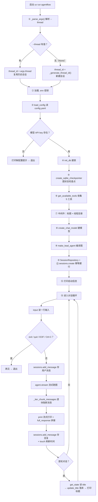
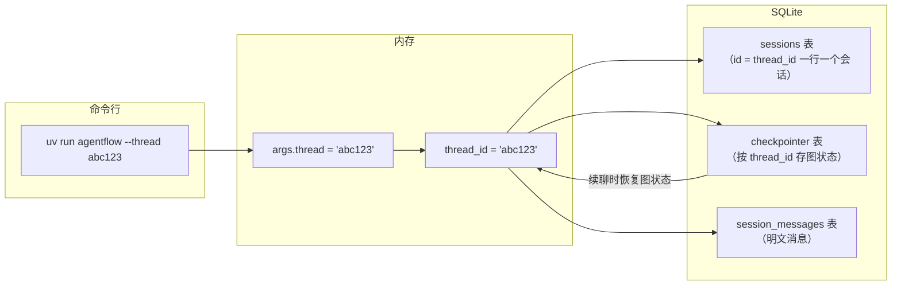

# cli/main.py — main.py

> **文件路径**: `backend/packages/harness/agentflow/cli/main.py`
> **目录位置**: cli → main.py
> **职责**: 终端对话 CLI

## 📑 目录

- [📋 结构图](#📋-结构图)
- [📤 关键导出](#📤-关键导出)
- [💡 设计思想](#💡-设计思想)
- [🎯 实用场景](#🎯-实用场景)
- [📊 流程图](#📊-流程图)
  - [1. main() 主流程（启动 → 装配 → 对话循环）](#1-main-主流程启动--装配--对话循环)
  - [2. 持久化数据流（thread_id 是钥匙）](#2-持久化数据流thread_id-是钥匙)
- [🧩 代码解析（成块对照 main.py）](#🧩-代码解析成块对照-mainpy)
  - [块 1：_parse_args() —— 命令行参数入口](#块-1_parse_args--命令行参数入口)
  - [块 2：_generate_thread_id() —— 新会话 ID](#块-2_generate_thread_id--新会话-id)
  - [块 3：_iter_chunk_messages() —— 从流式块里捞新消息](#块-3_iter_chunk_messages--从流式块里捞新消息)
  - [块 4：main() 装配段（①-⑫）](#块-4main-装配段-①-⑫)
  - [块 5：main() 对话循环（⑬）](#块-5main-对话循环-⑬)
- [📖 知识点](#📖-知识点)
  - [1. argparse —— 命令行参数解析](#1-argparse--命令行参数解析)
  - [2. stream() 流式 vs invoke() 一次性](#2-stream-流式-vs-invoke-一次性)
  - [3. checkpointer —— LangGraph 的"记忆体"](#3-checkpointer--langgraph-的记忆体)
  - [4. 中间件 —— 横向能力](#4-中间件--横向能力)
  - [5. 双份数据 —— 为什么存两遍](#5-双份数据--为什么存两遍)
  - [6. 异常处理设计](#6-异常处理设计)
- [❓ Q&A](#❓-qa)
- [⚠️ 风险点](#⚠️-风险点)

## 📋 结构图

```text
┌──────────────────────────────────────────────────────────────┐
│ main()  [uv run agentflow]                                   │
│   ├─ 解析 --thread <id> 参数                                 │
│   ├─ load_dotenv()          ← 读项目根 .env（密钥）          │
│   ├─ load_config()          ← 读 config.yaml → AppConfig    │
│   ├─ init_db(db_path)       ← 建表（sessions 等）            │
│   ├─ create_sqlite_checkpointer(db_path) ← 图状态检查点      │
│   ├─ get_available_tools()  ← 工具目录（M2，5 个）            │
│   ├─ 中间件 2 个            ← 标题/线程目录（M2）            │
│   ├─ create_chat_model(cfg) ← 模型工厂 → ChatOpenAI          │
│   ├─ make_lead_agent(...)   ← 构建主 Agent（带持久化）       │
│   ├─ SessionRepository(conn) ← 会话记录 repo                 │
│   └─ 对话循环:                                               │
│        你 > 输入 → agent.stream({messages}, thread_id)       │
│              → 逐块打印回复 → 存消息记录 → 首轮标题落库       │
│              → 循环直到 exit                                 │
└──────────────────────────────────────────────────────────────┘
```

## 📤 关键导出

**函数**

- `main()`

## 💡 设计思想

1. 入口层只做装配（配置/模型/检查点/repo/工具/中间件），业务在 agents/。
2. 启动信息显示模型/工具/会话/数据：调试 P-014/015/016 全靠它
   （限流/流式问题第一时间看到是哪个模型/供应商）。
3. 对话循环容错：模型调用失败给友好提示不崩（P-015 限流实测）。
4. 从任何目录启动都能找到配置（Path(__file__) 定位，P-014）。

## 🎯 实用场景

1. 终端对话入口：uv run agentflow
2. 完整装配演示：config→db→checkpointer→tools→middlewares→model→agent→循环
3. 流式输出：langgraph stream 逐块打印（P-016 嵌套结构兼容）
4. 自动标题落库：首轮后 get_state 读 title → sessions.update_title
5. 启动信息：模型/工具/会话/数据一目了然（用户明确要求）
6. 调试与演示：无 Web UI 前的最快验证路径

## 📊 流程图

### 1. main() 主流程（启动 → 装配 → 对话循环）

**ASCII 版（VSCode / 任何编辑器直接可见）**：

```text
uv run agentflow（request）
│
▼
_parse_args()                 ← 解析 --thread → args.thread
│
├──────────────┬──────────────┐
▼              ▼              │
--thread 有值   --thread 无    │
│              │              │
▼              ▼              │
thread_id =    thread_id =    │
args.thread    _generate_     │
（复用会话）    thread_id()    │
│              （新会话）      │
└──────────────┴──────────────┘
│
▼
load_dotenv()                 ← 加载项目根 .env（密钥）
│
▼
load_config()                 ← config.yaml → AppConfig
│
├──────────────┬──────────────┐
▼              ▼              │
无 API key     有 API key     │
│              │              │
▼              ▼              │
打印缺配置提示  init_db()      │
→ 退出         （建表）        │
│              │              │
└──────────────┴──────────────┘
│
▼
create_sqlite_checkpointer()  ← 图状态检查点（LangGraph 记忆体）
│
▼
get_available_tools()         ← 收集 5 个内置工具（M2）
│
▼
[TitleMiddleware,             ← 中间件：自动标题 + 线程数据目录
 ThreadDataMiddleware]
│
▼
create_chat_model()           ← 模型工厂 → ChatOpenAI
│
▼
make_lead_agent()             ← 编译图（模型 ↔ 工具循环）
│
▼
SessionRepository(conn)       ← 会话业务记录（明文消息）
│
▼
sessions.create(thread_id)    ← 幂等建会话行（INSERT OR IGNORE）
│
▼
打印启动信息                  ← 模型/工具/会话/数据，调试用
│
▼
对话循环（见下方展开）
```

**对话循环展开**（顺序执行链）：

```text
对话循环（一次运行 = 一个会话）
│
▼
input("你 > ").strip()        ← 读输入；exit/quit/EOF/Ctrl-C → 再见退出
│
▼
sessions.add_message(         ← ① 先存用户消息
    thread_id, "user", ...)
│
▼
agent.stream(config=          ← ② 流式跑图（模型↔工具循环，逐块产出）
    {"thread_id": thread_id})
│
▼
_iter_chunk_messages(chunk)   ← ③ 逐块取新消息（兼容嵌套结构）
│
▼
print(text, end="",           ← 打字机效果；full_response 同步拼接
      flush=True)
│
▼
sessions.add_message(         ← ④ 存回复 + touch 刷新会话时间
    thread_id, "assistant", ...)
│
▼
[首轮] get_state()            ← ⑤ 读 title → update_title 落库
→ update_title(thread_id,     （只做一次）
    title)
│
▼
（回到 input，继续循环）
```

**Mermaid 版（GitHub / 飞书渲染；VSCode 需装插件）**：



> VSCode 预览 Mermaid 需装插件（如 Markdown Preview Mermaid Support）；GitHub / 飞书直接渲染。

### 2. 持久化数据流（thread_id 是钥匙）

**ASCII 版（顺序执行链）**：

```text
uv run agentflow --thread abc123（request）
│
▼
args.thread = "abc123"        ← ① _parse_args 从命令行解析
│
▼
thread_id = "abc123"          ← ② main 确定 thread_id（有传复用、没传新建）
│
├──────────────┬──────────────┐
▼              ▼              │
sessions       checkpointer   │
（id=thread_id （按 thread_id  │
 一行一个会话）  存图状态）      │
│              │              │
▼              ▼              │
session_messages              │
（明文消息）                   │
│              │              │
└──────────────┴──────────────┘
│
▼
续聊：--thread 同一 ID       ← checkpointer 恢复图状态 → 上轮记忆还在
```

**Mermaid 版**：



## 🧩 代码解析（成块对照 main.py）

> 读法：每块先贴**完整代码**，再看块下方的整块解析。代码与文件一致，仅省略部分长注释。

### 块 1：`_parse_args()` —— 命令行参数入口

```python
def _parse_args() -> argparse.Namespace:
    """命令行参数: --thread 复用会话（验证持久化的入口）。"""
    p = argparse.ArgumentParser(description="AgentFlow 终端对话")
    p.add_argument(
        "--thread",
        default=None,  # 缺省 = 新会话（自动生成 thread_id）
        help="复用指定会话 ID（thread_id），继续上次对话",
    )
    return p.parse_args()
```

**整块解析**：这是一个标准的 argparse 三步走——`ArgumentParser` 建解析器（description 进 `--help` 帮助信息）→ `add_argument` 注册参数（`default=None` = 不传时 `args.thread` 是 None，作为"新会话"信号）→ `parse_args()` 读 `sys.argv` 返回 Namespace。**不需要代码传参**，值来自终端：

- `uv run agentflow --thread abc123` → `args.thread == "abc123"`（续用历史会话）
- `uv run agentflow` → `args.thread is None`（新会话）

### 块 2：`_generate_thread_id()` —— 新会话 ID

```python
def _generate_thread_id() -> str:
    """新会话 ID：os.urandom(8) 生成 8 个随机字节 → 32 位十六进制字符串。

    纯随机、无需查重（8 字节随机冲突概率可忽略），不暴露创建时间。
    """
    return os.urandom(8).hex()
```

**整块解析**：一行搞定——`os.urandom(8)` 生成密码学安全的 8 个随机字节，`.hex()` 转 32 位十六进制字符串（如 `13d77ca317ba86cf`）。纯随机、无需查重（8 字节冲突概率可忽略），**不暴露创建时间**。

### 块 3：`_iter_chunk_messages()` —— 从流式块里捞新消息

```python
def _iter_chunk_messages(chunk: dict) -> list:
    """从 langgraph stream chunk 里取新增消息（递归）——把每一小块 chunk 里的新消息捞出来。

    langgraph 1.0.x create_agent 的 stream 输出是**节点嵌套结构**：
        {'model': {'messages': [AIMessage(...)]}}
    而不是顶层 {'messages': [...]}（CLI 曾直接取顶层导致空打印，见 P-016）。
    递归兼容两种形态，取到第一个 messages 列表即返回。
    """
    top = chunk.get("messages")
    if top:
        return top
    for v in chunk.values():
        if isinstance(v, dict):
            found = _iter_chunk_messages(v)
            if found:
                return found
    return []
```

**整块解析**：LangGraph `stream()` 吐出的 chunk 有两种形态，这函数递归兼容两种：

| 形态 | 例子 | 命中路径 |
|---|---|---|
| 顶层直接有 | `{'messages': [AIMessage(...)]}` | `chunk.get("messages")` 一步命中 |
| 嵌套在节点里 | `{'model': {'messages': [...]}}` | 顶层 get 到 None → for 递归进 model |

逻辑三步：① `chunk.get("messages")` 安全取值（键不存在返回 None，不报错），`if top:` 非空才返回；② 顶层没有 → 遍历子值，`isinstance(v, dict)` 只递归字典；③ 内层找到非空列表立即返回（短路），全都没有 → `return []`。P-016 就是当初直接取顶层导致空打印修的。

### 块 4：`main()` 装配段（①-⑫）

```python
def main() -> None:
    """CLI 入口：装配所有组件，进入对话循环。"""
    args = _parse_args()                            # ① 解析命令行：--thread 复用会话

    project_root = Path(__file__).resolve().parents[5]
    load_dotenv(project_root / ".env")              # ② 加载密钥（不进代码/yaml）

    cfg = load_config(str(project_root / "config.yaml"))   # ③ 读配置
    if cfg.models is None or not cfg.models.chat.api_key:
        print("缺少模型配置：请检查 config.yaml 的 models 段，并在 .env 填写 API key")
        return                                      # 缺 key 直接退出，不空跑

    db_path = default_db_path()
    conn = init_db(db_path)                         # ④ 建表 + 连接

    checkpointer = create_sqlite_checkpointer(db_path)     # ⑤ 图状态检查点（记忆体）

    tools = get_available_tools()                   # ⑥ 收集 5 个内置工具（M2）

    middlewares = [TitleMiddleware(), ThreadDataMiddleware()]  # ⑦ 中间件（M2）

    model = create_chat_model(cfg.models.chat)      # ⑧ 模型工厂 → ChatOpenAI
    agent = make_lead_agent(                        # ⑨ 编译图（模型↔工具循环）
        model=model, checkpointer=checkpointer,
        tools=tools, middlewares=middlewares,
    )

    sessions = SessionRepository(conn)              # ⑩ 会话业务记录 repo

    thread_id = args.thread or _generate_thread_id()  # ⑪ 有传复用、没传新建
    sessions.create(thread_id)                      #    幂等建会话行

    reuse = "续用历史会话" if args.thread else "新会话"
    print(
        f"模型: {cfg.models.chat.model}（provider={cfg.models.chat.provider} @ {cfg.models.chat.base_url}）"
    )
    print(f"工具: {len(tools)} 个（{', '.join(t.name for t in tools)}）")
    print(f"会话: {thread_id}（{reuse}；--thread {thread_id} 可继续此会话）")
    print(f"数据: {db_path}")                       # ⑫ 启动信息（调试 P-014/015/016）
    print("输入 exit 退出\n")
```

**整块解析**：装配段只有一件事——**把零件造齐、接好，不干业务**。读法按"数据依赖"走：
①-③ 先有命令行参数、密钥、配置 → ④⑤ 建库和检查点（持久化底座）→ ⑥⑦ 工具和中间件（Agent 的"手"和横切能力）→ ⑧⑨ 模型和 Agent（核心组装）→ ⑩⑪ 会话 repo 和 thread_id（业务记录 + 持久化钥匙）→ ⑫ 打印启动信息（让控制台一眼看清用的什么，限流/流式问题第一时间定位到供应商）。

两个细节：`parents[5]` 向上 5 级定位项目根，从任何目录启动都找得到 config.yaml（P-014）；`sessions.create` 用 `INSERT OR IGNORE`，重复建同 ID 会话不会覆盖旧数据（幂等）。

### 块 5：`main()` 对话循环（⑬，main 内部片段）

```python
    first_turn = True                               # 首轮标记（标题只做一次）
    while True:
        try:
            user_input = input("你 > ").strip()     # 读一行输入，去首尾空白
        except (EOFError, KeyboardInterrupt):       # Ctrl-D / Ctrl-C：正常退出
            print("\n再见")
            break
        if not user_input:                          # 空输入 → 继续等
            continue
        if user_input.lower() in ("exit", "quit"):  # 退出词（大小写不敏感）
            print("再见")
            break

        sessions.add_message(thread_id, "user", user_input)   # ① 先存用户消息

        print("Agent > ", end="", flush=True)       # ② 打印前缀，立即显示
        full_response = ""
        try:
            for chunk in agent.stream(              # ③ 流式跑图（逐块产出）
                {"messages": [{"role": "user", "content": user_input}]},
                config={"configurable": {"thread_id": thread_id}},  # 持久化维度
            ):
                for msg in _iter_chunk_messages(chunk):   # 挖出新消息
                    text = getattr(msg, "content", "")
                    if text and isinstance(msg.content, str):
                        print(text, end="", flush=True)   # 不换行 → 打字机效果
                        full_response += text             # 同时拼完整回复
        except Exception as exc:                    # 模型异常容错（P-015）
            print(f"\n[模型调用失败] {type(exc).__name__}: {str(exc)[:200]}")
            full_response = f"(调用失败: {str(exc)[:120]})"
        print()                                     # 换行收尾

        sessions.add_message(thread_id, "assistant", full_response)  # ④ 存回复
        sessions.touch(thread_id)                   #    刷新 updated_at

        if first_turn:                              # ⑤ 首轮自动标题（只一次）
            first_turn = False
            try:
                st = agent.get_state({"configurable": {"thread_id": thread_id}})
                title = (st.values or {}).get("title") if st else None
                if title:
                    sessions.update_title(thread_id, title)
                    print(f"\n[标题] {title}")
            except Exception:                       # 标题失败不影响对话
                pass
```

**整块解析**：一次运行 = 一个会话，循环处理直到退出。每轮五步：

| 步 | 干什么 | 关键点 |
|---|---|---|
| ① 存用户消息 | `add_message(thread_id, "user", ...)` | 先存后跑：退出也能查到历史 |
| ②-③ 流式跑图 | `agent.stream(config={"thread_id": ...})` | 逐块取消息打印，`flush=True` 立即显示 |
| ④ 存回复 | `add_message` + `touch` | 明文记录 + 更新会话时间 |
| ⑤ 首轮标题 | `get_state` 读 `title` → 落库 | `first_turn` 保证只生成一次 |

两个设计点：`except Exception` 故意捕获所有模型异常（限流/欠费/网络抖动不崩 CLI，实测智谱 code 1305）；`agent.get_state` 按 thread_id 读图状态，取 TitleMiddleware 写入的 `title`——标题失败静默吞掉，不影响对话。

## 📖 知识点

### 1. argparse —— 命令行参数解析

| 概念 | 说明 |
|---|---|
| `sys.argv` | Python 启动时自动填充的列表：`["agentflow", "--thread", "abc123"]`（第 0 个是程序名） |
| Namespace | `parse_args()` 的返回值，一个"属性袋子"：`args.thread` 就是取值 |
| 去 `--` 规则 | `--thread` → 属性名 `thread`；`--model` → `model` |
| `default=None` | 用户没传时的值；`None` 在这里专门表示"要新建会话" |
| 为什么不用手动解析 | argparse 自动处理 `--help`、缺省值、类型转换，避免手写字符串切片 |

### 2. `stream()` 流式 vs `invoke()` 一次性

| 方式 | 行为 | 用户感受 |
|---|---|---|
| `agent.invoke(...)` | 等图全部跑完，一次返回完整结果 | 长时间无输出，像卡死 |
| `agent.stream(...)` | 图每走一步就 yield 一块输出 | 逐字"打字"出来，可中断 |

`main.py` 用 stream：`for chunk in agent.stream(...)` 循环里每个 chunk 是一个节点输出，`_iter_chunk_messages` 挖出新消息，`print(..., end="", flush=True)` 不换行立即打印。

### 3. checkpointer —— LangGraph 的"记忆体"

**图状态（graph state）是什么**：图运行时的「对话笔记本」——`messages` 对话历史、`title` 标题、工具结果等中间变量，全装在里面。默认只在内存：进程一退就丢。

**checkpointer 干了什么**（一个比喻）：

- 图状态 = 对话笔记本（草稿，攥在手里）
- checkpointer = 存档员：图每走一步，把笔记本快照交给它
- SQLite = 存档抽屉，按 `thread_id` 分档
- `thread_id` = 抽屉钥匙：同一把钥匙再开 → 快照读回塞进图 → **上轮对话记忆还在**

对应 main.py 三步：

| main.py 步骤 | 干什么 |
|---|---|
| ⑤ `create_sqlite_checkpointer(db_path)` | 造「存档员」（指定数据库文件） |
| ⑨ `make_lead_agent(checkpointer=…)` | 把存档员挂到 Agent，图开始自动存档 |
| ⑬ `stream(config={"thread_id": …})` | 每次对话带钥匙，按会话存取状态 |

这就是 `--thread` 存在的根本原因：**没有 checkpointer，`--thread` 就是空钥匙**——恢复了状态，续聊才有意义。

### 4. 中间件 —— 横向能力

- `AgentMiddleware` 是挂在 Agent 生命周期上的钩子（before_model / after_model 等）
- 不改变主图逻辑，只横切加能力：
  - `TitleMiddleware`：首条用户消息后，调模型生成 ≤12 字标题，写进图状态 `title`
  - `ThreadDataMiddleware`：before_agent 建 `data/threads/{thread_id}/user-data/` 目录
- 设计收益：主循环保持干净，新增能力 = 新增一个中间件（原版有 70+ 个）

**中间件钩子执行顺序**（一轮 Agent 调用）：

```text
request（用户消息进入 Agent）
│
▼
before_agent            ← 正序执行所有 before_agent
│
▼
before_model            ← 正序执行所有 before_model
│
├──────────────┬───────────────┐
▼              ▼               │
wrap_tool_call  wrap_model_call │
│              │               │
tools           model           │
│              │               │
└──────────────┴───────────────┘
│
▼
after_model             ← 逆序执行所有 after_model
│
▼
after_agent             ← 逆序执行所有 after_agent
│
▼
result
```

对照 main.py：`ThreadDataMiddleware` 在 `before_agent` 阶段建目录；`TitleMiddleware` 在 `before_model` 阶段（首轮）生成标题写进状态。

### 5. 双份数据 —— 为什么存两遍

| 数据 | 谁存 | 用途 |
|---|---|---|
| 图状态（二进制） | checkpointer | 恢复对话：续聊时把记忆原样还原 |
| 明文消息（文本） | SessionRepository | 展示：会话列表、消息历史查询 |

两者通过 thread_id 关联，各管各的（M7 Web UI 的会话列表靠明文，对话恢复靠图状态）。

### 6. 异常处理设计

| 异常 | 处理 | 原因 |
|---|---|---|
| `EOFError` / `KeyboardInterrupt` | 打印"再见"退出 | Ctrl-D / Ctrl-C 是正常退出路径，不是崩溃 |
| 模型调用任意异常 | 打印 `[模型调用失败]` + 错误摘要，本轮回复记为"调用失败" | 限流/欠费/网络抖动不该把 CLI 搞崩（P-015） |
| 标题生成异常 | 静默吞掉 | 标题是锦上添花，失败不影响对话 |

## ❓ Q&A

**Q: 为什么启动信息要显示模型？**

A: P-014/015/016 调试全靠它——限流/流式问题第一时间看到是哪个模型/供应商

**Q: --thread 怎么用？**

A: 启动时打印的会话 ID 加 --thread 可继续上次对话（持久化验证入口）

**Q: 图状态是什么？**

A: 图运行时的「对话笔记本」：messages 历史、title、工具结果等中间变量，默认只在内存（进程一退就丢）。checkpointer 把它按 thread_id 快照进 SQLite；同一 thread_id 再跑，快照读回 → 上轮记忆恢复。比喻：笔记本（图状态）→ 存档员（checkpointer）→ 抽屉（SQLite），thread_id 是钥匙。

**Q: argparse 是什么？（_parse_args 逐行解释）**

A: **argparse**：Python 标准库的命令行参数解析器。程序启动时命令行参数存在 `sys.argv`（如 `["agentflow", "--thread", "abc"]`），argparse 负责把字符串按规则解析成结构化对象，代码里直接 `args.thread` 取值，不用手写字符串处理。

```python
p = argparse.ArgumentParser(description="AgentFlow 终端对话")
p.add_argument("--thread", default=None, help="复用指定会话 ID（thread_id），继续上次对话")
args = p.parse_args()
```

| 代码 | 作用 |
| --- | --- |
| `ArgumentParser(...)` | 创建解析器；description 显示在 `uv run agentflow --help` 帮助信息里 |
| `add_argument("--thread", ...)` | 注册参数。用法 `--thread abc123`；参数名去 `--` 后 = 属性名 `thread` |
| `default=None` | 不传 `--thread` 时的默认值。None = 新会话 |
| `help="..."` | `--help` 时展示的说明文字 |
| `parse_args()` | 读 `sys.argv` 按规则解析，返回 Namespace：`args.thread` 即传值 |

取值效果：

- `uv run agentflow --thread 4af0deb8` → `args.thread == "4af0deb8"`（续用历史会话）
- `uv run agentflow`（不传）→ `args.thread is None`（新会话）

**为什么设计 --thread（设计意图）**：

- 它是"验证持久化"的测试入口：同一 thread_id 再跑一次，langgraph checkpointer 从 SQLite 恢复图状态（上轮对话记忆还在），SessionRepository 恢复消息记录
- 没有 Web UI 时，--thread 就是最快验证"数据落库 + 会话恢复"的路径

**调用链**：`main()` 里 `args = _parse_args()` → `thread_id = args.thread or _generate_thread_id()`（有则复用、无则新建）→ 启动信息打印"续用历史会话 / 新会话"。

## ⚠️ 风险点

1. Path(__file__).parents[5] 定位项目根，改目录层级会失效
2. _iter_chunk_messages 兼容嵌套/顶层两种 chunk 形态，勿简化
3. 首轮标题逻辑依赖 TitleMiddleware 写 state["title"]，两者需同步

---
_自动生成于 doc-code 规范落地（2026-09-28）。2026-09-29 更新：目录、顺序执行链流程图、成块代码解析、知识点；源码注释修正（_generate_thread_id 实现为 os.urandom 纯随机，编号理顺为 ①-⑬）。同日二更：块 3 docstring 与源码对齐；知识点 3 补「图状态」通俗解释 + 比喻 + main.py 三步对照；Q&A 新增「图状态是什么」。_
