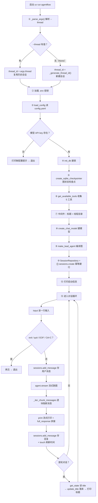
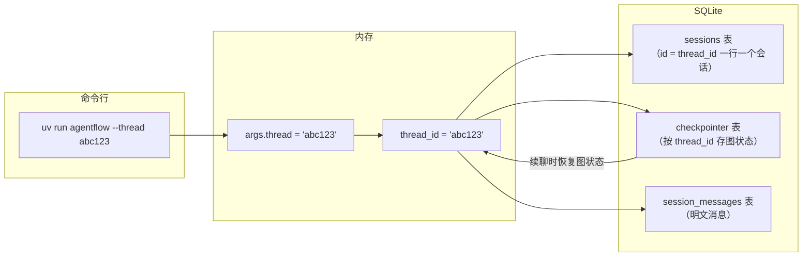

# cli/main.py — main.py（总览）

> **功能拆分的子文档**（按功能单独讲解）：
> - [assembly.md](assembly.md) —— main() 装配段详解（①-⑫ + M4 + M5 装配）
> - [automation.md](automation.md) —— automation 子命令族（list/create/pause/resume/delete）
> - [goal.md](goal.md) —— 长任务入口（断点恢复 + --goal）
> - [repl.md](repl.md) —— 对话循环（⑬ + 定时队列 drain）


## 📑 目录

- [📋 结构图](#📋-结构图)
- [📤 关键导出](#📤-关键导出)
- [💡 设计思想](#💡-设计思想)
- [🎯 实用场景](#🎯-实用场景)
- [📊 流程图](#📊-流程图)
  - [1. main() 主流程（启动 → 装配 → 对话循环）](#1-main-主流程启动--装配--对话循环)
  - [2. 持久化数据流（thread_id 是钥匙）](#2-持久化数据流thread_id-是钥匙)
- [🧩 代码解析（成块对照 main.py）](#🧩-代码解析成块对照-mainpy)
  - [块 1：_parse_args() —— 命令行参数入口](#块-1_parse_args--命令行参数入口)
  - [块 2：_generate_thread_id() —— 新会话 ID](#块-2_generate_thread_id--新会话-id)
  - [块 3：_iter_chunk_messages() —— 从流式块里捞新消息](#块-3_iter_chunk_messages--从流式块里捞新消息)
  - [块 6-M5·①：M5 导入 + GoalEngine 双路径导入](#块-6-m5①m5-导入--goalengine-双路径导入)
- [📖 知识点](#📖-知识点)
  - [1. argparse —— 命令行参数解析](#1-argparse--命令行参数解析)
  - [2. stream() 流式 vs invoke() 一次性](#2-stream-流式-vs-invoke-一次性)
  - [3. checkpointer —— LangGraph 的"记忆体"](#3-checkpointer--langgraph-的记忆体)
  - [4. 中间件 —— 横向能力](#4-中间件--横向能力)
  - [5. 双份数据 —— 为什么存两遍](#5-双份数据--为什么存两遍)
  - [6. 异常处理设计](#6-异常处理设计)
- [❓ Q&A](#❓-qa)
- [⚠️ 风险点](#⚠️-风险点)

## 📋 结构图

```text
┌──────────────────────────────────────────────────────────────┐
│ main()  [uv run agentflow]                                   │
│   ├─ 解析 --thread <id> 参数                                 │
│   ├─ load_dotenv()          ← 读项目根 .env（密钥）          │
│   ├─ load_config()          ← 读 config.yaml → AppConfig    │
│   ├─ init_db(db_path)       ← 建表（sessions 等）            │
│   ├─ create_sqlite_checkpointer(db_path) ← 图状态检查点      │
│   ├─ get_available_tools()  ← 工具目录（M2，5 个）            │
│   ├─ 中间件 2 个            ← 标题/线程目录（M2）            │
│   ├─ create_chat_model(cfg) ← 模型工厂 → ChatOpenAI          │
│   ├─ make_lead_agent(...)   ← 构建主 Agent（带持久化）       │
│   ├─ SessionRepository(conn) ← 会话记录 repo                 │
│   └─ 对话循环:                                               │
│        你 > 输入 → agent.stream({messages}, thread_id)       │
│              → 逐块打印回复 → 存消息记录 → 首轮标题落库       │
│              → 循环直到 exit                                 │
└──────────────────────────────────────────────────────────────┘
```

**M4 追加（装配段新增沙箱/审计/派发，启动信息新增 3 行）**：

```text
│   ├─ set_sandbox_provider(LocalSandboxProvider(项目/.sandbox)) ← M4
│   ├─ SandboxAuditRepository(db_path) → 注入 terminal/file 工具 ← M4
│   ├─ configure_dispatch_service(tools, model)  ← 派发服务注入   │
│   └─ 启动信息新增：沙箱: … / 子代理: …（并行 ≤3）/ 审计: N 条   │
```

**M5 追加（automation 子命令 / --goal 长任务 / 定时线程 / REPL drain 装配框）**：

```text
│   ├─ _parse_args：新增 --goal + automation 子命令族(list/create/pause/resume/delete)
│   ├─ if command=="automation" → _handle_automation_command → 打印即退出（不进 REPL）
│   ├─ GoalEngine 双路径导入（agents/goal | 顶层 goal，try/except 兼容落点）
│   ├─ GoalRepository / AutomationRepository(db_path) + queue.Queue()
│   ├─ AutomationScheduler(auto_repo, q, interval=60).start() ← daemon tick 线程
│   ├─ engine = GoalEngine(agent, model, goal_repo)
│   ├─ [--thread 恢复] get_active_by_thread → engine.resume(thread_id)
│   ├─ [--goal 入口]   engine.start(thread_id, args.goal)（先跑长任务再进 REPL）
│   ├─ 启动信息新增：定时: N 条 active（tick 60s）
│   └─ REPL 每轮 input 前 drain q：命中即在主线程 agent.invoke 跑定时任务
```

## 📤 关键导出

**函数**

- `main()`

## 💡 设计思想

1. 入口层只做装配（配置/模型/检查点/repo/工具/中间件），业务在 agents/。
2. 启动信息显示模型/工具/会话/数据：调试 P-014/015/016 全靠它
   （限流/流式问题第一时间看到是哪个模型/供应商）。
3. 对话循环容错：模型调用失败给友好提示不崩（P-015 限流实测）。
4. 从任何目录启动都能找到配置（Path(__file__) 定位，P-014）。

## 🎯 实用场景

1. 终端对话入口：uv run agentflow
2. 完整装配演示：config→db→checkpointer→tools→middlewares→model→agent→循环
3. 流式输出：langgraph stream 逐块打印（P-016 嵌套结构兼容）
4. 自动标题落库：首轮后 get_state 读 title → sessions.update_title
5. 启动信息：模型/工具/会话/数据一目了然（用户明确要求）
6. 调试与演示：无 Web UI 前的最快验证路径

## 📊 流程图

### 1. main() 主流程（启动 → 装配 → 对话循环）

**ASCII 版（VSCode / 任何编辑器直接可见）**：

```text
uv run agentflow（request）
│
▼
_parse_args()                 ← 解析 --thread → args.thread
│
├──────────────┬──────────────┐
▼              ▼              │
--thread 有值   --thread 无    │
│              │              │
▼              ▼              │
thread_id =    thread_id =    │
args.thread    _generate_     │
（复用会话）    thread_id()    │
│              （新会话）      │
└──────────────┴──────────────┘
│
▼
load_dotenv()                 ← 加载项目根 .env（密钥）
│
▼
load_config()                 ← config.yaml → AppConfig
│
├──────────────┬──────────────┐
▼              ▼              │
无 API key     有 API key     │
│              │              │
▼              ▼              │
打印缺配置提示  init_db()      │
→ 退出         （建表）        │
│              │              │
└──────────────┴──────────────┘
│
▼
create_sqlite_checkpointer()  ← 图状态检查点（LangGraph 记忆体）
│
▼
get_available_tools()         ← 收集 5 个内置工具（M2）
│
▼
[TitleMiddleware,             ← 中间件：自动标题 + 线程数据目录
 ThreadDataMiddleware]
│
▼
create_chat_model()           ← 模型工厂 → ChatOpenAI
│
▼
make_lead_agent()             ← 编译图（模型 ↔ 工具循环）
│
▼
SessionRepository(conn)       ← 会话业务记录（明文消息）
│
▼
sessions.create(thread_id)    ← 幂等建会话行（INSERT OR IGNORE）
│
▼
打印启动信息                  ← 模型/工具/会话/数据，调试用
│
▼
对话循环（见下方展开）
```

**对话循环展开**（顺序执行链）：

```text
对话循环（一次运行 = 一个会话）
│
▼
input("你 > ").strip()        ← 读输入；exit/quit/EOF/Ctrl-C → 再见退出
│
▼
sessions.add_message(         ← ① 先存用户消息
    thread_id, "user", ...)
│
▼
agent.stream(config=          ← ② 流式跑图（模型↔工具循环，逐块产出）
    {"thread_id": thread_id})
│
▼
_iter_chunk_messages(chunk)   ← ③ 逐块取新消息（兼容嵌套结构）
│
▼
print(text, end="",           ← 打字机效果；full_response 同步拼接
      flush=True)
│
▼
sessions.add_message(         ← ④ 存回复 + touch 刷新会话时间
    thread_id, "assistant", ...)
│
▼
[首轮] get_state()            ← ⑤ 读 title → update_title 落库
→ update_title(thread_id,     （只做一次）
    title)
│
▼
（回到 input，继续循环）
```

**Mermaid 版（GitHub / 飞书渲染；VSCode 需装插件）**：



> VSCode 预览 Mermaid 需装插件（如 Markdown Preview Mermaid Support）；GitHub / 飞书直接渲染。

**M4 追加：装配链在「收集工具」与「中间件」之间插入沙箱/审计/派发三步**

```text
get_available_tools() → 9 个工具（M4）
│
▼
set_sandbox_provider(LocalSandboxProvider(project_root/.sandbox))
│                                        ← 子代理/终端操作落在项目 .sandbox 内
▼
SandboxAuditRepository(db_path)
├─ configure_terminal_audit(repo)         ← terminal_run 写审计
└─ configure_file_audit(repo)             ← read_file/write_file 写审计
│
▼
create_chat_model() → model
│
▼
configure_dispatch_service(tools, model)  ← dispatch_subagents 用的工具集+父模型
│
▼
（继续 ⑦ 中间件 … ⑨ make_lead_agent）

启动信息新增三行（M4）：
  沙箱: LocalSandboxProvider（…/.sandbox）
  子代理: bash, general-purpose（并行 ≤3）
  审计: N 条
```

**M5 追加：启动早期多一条 automation 分支；装配末尾多定时/长任务装配；REPL 每轮 input 前多一段 drain**

```text
_parse_args() → args
│
├─ args.command == "automation" ?
│     ├─ 是 → _handle_automation_command(args)        ← M5：轻量装配
│     │        init_db + AutomationRepository（不建模型/agent/checkpointer）
│     │        list / create / pause / resume / delete → 打印 → return（不进 REPL）
│     └─ 否 → 继续主装配（load_config → db → … ⑨ make_lead_agent）
│
▼（主装配走到 sessions.create(thread_id) 之后）
GoalRepository / AutomationRepository（db_path 模式，线程本地连接）
q = queue.Queue()
scheduler = AutomationScheduler(auto_repo, q, interval=60)
scheduler.start()                       ← M5：daemon tick 线程，只扫库 + 入队 q，不碰模型
engine = GoalEngine(agent, model, goal_repo)
│
▼
启动信息新增一行：定时: N 条 active（tick 60s）
│
├─ get_active_by_thread(thread_id) 有未完成长任务？
│     └─ 是 → print [恢复] 第 x/max 步 → engine.resume(thread_id)（断点续跑）
├─ args.goal 有值？
│     └─ 是 → engine.start(thread_id, args.goal)（计划→逐步→汇总，完成后进 REPL）
│
▼
进入 REPL 对话循环（⑬），每轮 input 之前：
while (task_id, prompt) = q.get_nowait() 命中?
     ├─ 命中 → run_id=start_run → agent.invoke(HumanMessage(prompt),
     │         thread_id=auto-{task_id}) → finish_run(success/failed)
     │         → touch_last_run → 打印结果（主线程同步跑）
     └─ 未命中(queue.Empty) → break → 回到 input("你 > ")
```

### 2. 持久化数据流（thread_id 是钥匙）

**ASCII 版（顺序执行链）**：

```text
uv run agentflow --thread abc123（request）
│
▼
args.thread = "abc123"        ← ① _parse_args 从命令行解析
│
▼
thread_id = "abc123"          ← ② main 确定 thread_id（有传复用、没传新建）
│
├──────────────┬──────────────┐
▼              ▼              │
sessions       checkpointer   │
（id=thread_id （按 thread_id  │
 一行一个会话）  存图状态）      │
│              │              │
▼              ▼              │
session_messages              │
（明文消息）                   │
│              │              │
└──────────────┴──────────────┘
│
▼
续聊：--thread 同一 ID       ← checkpointer 恢复图状态 → 上轮记忆还在
```

**Mermaid 版**：



## 🧩 代码解析（成块对照 main.py）

> 读法：每块先贴**完整代码**，再看块下方的整块解析。代码与文件一致，仅省略部分长注释。
## 🧩 代码解析（成块对照 main.py）

### 块 1：`_parse_args()` —— 命令行参数入口

```python
def _parse_args() -> argparse.Namespace:
    """命令行参数: --thread 复用会话；M5 加 --goal 长任务入口 + automation 子命令族。"""
    p = argparse.ArgumentParser(description="AgentFlow 终端对话")
    p.add_argument(
        "--thread",
        default=None,  # 缺省 = 新会话（自动生成 thread_id）
        help="复用指定会话 ID（thread_id），继续上次对话",
    )
    p.add_argument(
        "--goal",
        default=None,  # 缺省 = 普通 REPL
        help="启动后先以长任务模式跑 GoalEngine（计划→逐步→汇总），完成后再进 REPL",
    )

    # M5：automation 定时任务子命令族（无子命令 = 进 REPL 默认行为）
    sub = p.add_subparsers(dest="command")
    pa = sub.add_parser("automation", help="定时任务管理（list/create/pause/resume/delete）")
    auto = pa.add_subparsers(dest="auto_action")

    auto.add_parser("list", help="列出全部定时任务")

    pc = auto.add_parser("create", help="创建定时任务")
    pc.add_argument("--name", default="", help="任务名（展示用）")
    pc.add_argument("--prompt", required=True, help="到点投递的提示词")
    pc.add_argument("--cron", default=None, help='标准 5 字段 cron，如 "*/1 * * * *"')
    pc.add_argument(
        "--schedule",
        default=None,
        help='自然语言调度，如 "每天9点"（与 --cron 二选一，经 normalize 归一）',
    )
    pc.add_argument("--once", action="store_true", help="一次性任务（配 --at）")
    pc.add_argument("--at", default=None, help='once 型目标时间 ISO，如 "2026-10-03T09:00:00"')

    pp = auto.add_parser("pause", help="暂停任务")
    pp.add_argument("auto_id", help="任务 task_id")
    pr = auto.add_parser("resume", help="恢复任务")
    pr.add_argument("auto_id", help="任务 task_id")
    pd = auto.add_parser("delete", help="删除任务（runs 历史保留）")
    pd.add_argument("auto_id", help="任务 task_id")

    return p.parse_args()
```

**结构简析**：标准 argparse 三步走——`ArgumentParser(description=...)` 建解析器（description 进 `--help`）→ 顶层 `add_argument` 注册 `--thread`/`--goal` 两个开关 → `add_subparsers` 挂 `automation` 子命令族（list/create/pause/resume/delete）→ `parse_args()` 读 `sys.argv` 返回 Namespace。函数本身**无形参**，值全部来自终端命令行；`None` 是核心信号——`--thread`/`--goal` 缺省都用 `None`，分别表示"新会话"和"普通 REPL"。

**`_parse_args()` 注册的命令行参数逐条解释**：

| 参数 | 类型 | 默认值 | 含义 |
|---|---|---|---|
| `--thread` | `str` | `None` | 复用指定会话 ID（thread_id）。传入后 `main()` 用它做持久化钥匙：checkpointer 恢复图状态（上轮对话记忆）、SessionRepository 续聊；同时触发 `goal_repo.get_active_by_thread(thread_id)` 断点恢复未完成长任务 |
| `--goal` | `str` | `None` | 长任务入口。传入后先 `engine.start(thread_id, args.goal)` 跑完整 GoalEngine（计划→逐步→汇总），完成后再进 REPL；不传则直接进 REPL |
| `automation`（子命令） | subcommand | `None` | 进入 M5 定时任务管理分支。`main()` 检测 `args.command=="automation"` 后转 `_handle_automation_command`，**轻量装配**（只建 db + AutomationRepository，不建模型/agent/checkpointer），执行完即退出，不进 REPL |
| `automation list` | subcommand | — | 列出全部定时任务（`auto_action="list"`）；空表打印"（无定时任务）" |
| `automation create --name` | `str` | `""` | 任务展示名；tick 触发时打印 `⏰ 定时触发: {name}`，缺省回退 task_id |
| `automation create --prompt` | `str`（required） | 必填 | 到点投给 agent 的提示词；drain 时包成 `HumanMessage(prompt)` 投递 |
| `automation create --cron` | `str` | `None` | 标准 5 字段 cron，如 `*/1 * * * *`；与 `--schedule` 二选一 |
| `automation create --schedule` | `str` | `None` | 自然语言调度，如 `每天9点`；与 `--cron` 二选一，经 `normalize_schedule` 归一成 5 字段 cron |
| `automation create --once` | flag（`store_true`） | `False` | 置位后任务为一次性（`schedule_type="once"`），需配 `--at` |
| `automation create --at` | `str` | `None` | once 型目标触发时刻 ISO，如 `2026-10-03T09:00:00`；recurring 型传 None |
| `automation pause <auto_id>` | positional `str` | 必填 | 任务 task_id；`auto_repo.pause(tid)` 置 status=paused（tick 跳过） |
| `automation resume <auto_id>` | positional `str` | 必填 | 任务 task_id；`auto_repo.resume(tid)` 置 status=active（恢复触发） |
| `automation delete <auto_id>` | positional `str` | 必填 | 任务 task_id；`auto_repo.delete(tid)` 删任务行（automation_runs 历史保留） |

**落库要点/补充**：`dest="command"`/`dest="auto_action"` 两个子解析器目标属性名固定——`main()` 用 `getattr(args, "command", None)=="automation"` 分流，`_handle_automation_command` 用 `getattr(args, "auto_action", None)` 分发；无子命令时两者均为 None，落到"进 REPL"默认路径。命令行取值示例：`uv run agentflow --thread abc123` → `args.thread=="abc123"`（续用历史会话）；`uv run agentflow` → `args.thread is None`（新会话）。

### 块 2：`_generate_thread_id()` —— 新会话 ID

```python
def _generate_thread_id() -> str:
    """新会话 ID：os.urandom(8) 生成 8 个随机字节 → 32 位十六进制字符串。

    纯随机、无需查重（8 字节随机冲突概率可忽略），不暴露创建时间。
    """
    return os.urandom(8).hex()
```

**结构简析**：无参工具函数，一行实现——`os.urandom(8)` 取 8 个密码学安全随机字节，`.hex()` 编码成 32 位十六进制字符串（如 `13d77ca317ba86cf`），作为新会话的 thread_id。

**落库要点/补充**：纯随机、无需查重（8 字节随机冲突概率可忽略）；**不暴露创建时间**（区别于 UUID v1/时间戳 ID）。返回值被 `main()` 用作 `thread_id = args.thread or _generate_thread_id()` 的"无 --thread 时"分支，随后 `sessions.create(thread_id)` 幂等建行 + checkpointer 以此为钥匙。

### 块 3：`_iter_chunk_messages()` —— 从流式块里捞新消息

```python
def _iter_chunk_messages(chunk: dict) -> list:
    """从 langgraph stream chunk 里取新增消息（递归）——把每一小块 chunk 里的新消息捞出来。

    langgraph 1.0.x create_agent 的 stream 输出是**节点嵌套结构**：
        {'model': {'messages': [AIMessage(...)]}}
    而不是顶层 {'messages': [...]}（CLI 曾直接取顶层导致空打印，见 P-016）。
    递归兼容两种形态，取到第一个 messages 列表即返回。
    """
    top = chunk.get("messages")
    if top:
        return top
    for v in chunk.values():
        if isinstance(v, dict):
            found = _iter_chunk_messages(v)
            if found:
                return found
    return []
```

**结构简析**：递归工具函数，从 LangGraph `agent.stream()` 吐出的 chunk 里捞出本块新增的消息列表。LangGraph 1.0.x `create_agent` 的 stream 输出是**节点嵌套结构** `{'model': {'messages': [AIMessage(...)]}}`，而不是顶层 `{'messages': [...]}`；函数先试顶层 `chunk.get("messages")`，命中即返回；未命中则遍历 `chunk.values()`、对 dict 类型递归下钻，取到第一个非空 messages 列表即短路返回；全没找到则 `return []`。

**`_iter_chunk_messages()` 参数逐条解释**：

| 参数 | 类型 | 默认值 | 含义 |
|---|---|---|---|
| `chunk` | `dict` | 必填 | `agent.stream()` 一次 yield 的节点输出字典。两种形态：①顶层直挂 `messages`（`{'messages': [AIMessage(...)]}`），一步命中；②嵌套在节点键下（`{'model': {'messages': [...]}}`），顶层 get 到 None → for 循环递归进 `model` 子字典再找。非 dict 的值（list/str 等）不递归 |

**落库要点/补充**：调用方在 `main()` 对话循环里 `for msg in _iter_chunk_messages(chunk)` 逐条取消息，只对 `isinstance(msg.content, str)` 的 assistant 文本做流式打印并拼进 `full_response`。P-016 就是当初直接取顶层 `chunk["messages"]` 导致空打印修的——**切勿简化成非递归版本**。

### 块 6-M5·①：M5 导入 + GoalEngine 双路径导入（main.py:113-125）

**① M5 导入 + GoalEngine 双路径导入（main.py:113-125）**：

```python
# M5 域：定时调度（手写 cron + daemon tick 线程）/ 定时任务持久化
from langchain_core.messages import HumanMessage

from agentflow.agents.checkpointer.provider import create_sqlite_checkpointer

# agents 域（主 Agent + 检查点）
from agentflow.agents.lead_agent.agent import make_lead_agent
from agentflow.agents.lead_agent.prompt import build_lead_agent_system_prompt

# 中间件（M2）：自动标题 + 线程数据目录
from agentflow.agents.middlewares.thread_data_middleware import ThreadDataMiddleware
from agentflow.agents.middlewares.title_middleware import TitleMiddleware

# 配置域
from agentflow.config.app_config import load_config
from agentflow.config.paths import default_db_path

# M3 域：记忆门面 / 知识库服务 / 技能加载 / 工具注入
from agentflow.knowledge.service import KnowledgeService
from agentflow.memory.facade import MemoryFacade

# 模型域（工厂）
from agentflow.models.factory import create_chat_model
from agentflow.persistence.automation_repositories import AutomationRepository

# 持久化域（建表 / 会话 repo）
from agentflow.persistence.bootstrap import init_db
from agentflow.persistence.goal_repositories import GoalRepository
from agentflow.persistence.knowledge_repositories import KnowledgeRepository
from agentflow.persistence.memory_repositories import MemoryRepository
from agentflow.persistence.sandbox_audit_repositories import SandboxAuditRepository
from agentflow.persistence.session_repositories import SessionRepository

# M4 域：沙箱（目录隔离）/ 子代理注册表 / 派发与审计注入
from agentflow.sandbox import (
    LocalSandboxProvider,
    get_sandbox_provider,
    set_sandbox_provider,
)
from agentflow.scheduler.cron import normalize_schedule
from agentflow.scheduler.loop import AutomationScheduler

# skills 加载 + knowledge 工具注入（M3）
from agentflow.skills.loader import build_skills_prompt
from agentflow.subagents import get_subagent_names
from agentflow.tools.builtins.dispatch_tool import configure_dispatch_service
from agentflow.tools.builtins.file_tools import (
    configure_sandbox_audit_repository as configure_file_audit,
)
from agentflow.tools.builtins.knowledge_tool import configure_knowledge_service
from agentflow.tools.builtins.terminal_tool import (
    configure_sandbox_audit_repository as configure_terminal_audit,
)

# 工具域（M2）：工具收集 + 结果存取
from agentflow.tools.tools import get_available_tools

# 核心域（并行 shard）：GoalEngine 落点可能在 agents/goal 或顶层 goal，两者兼容
try:  # pragma: no cover
    from agentflow.agents.goal.goal_loop import GoalEngine
except ImportError:  # pragma: no cover
    from agentflow.goal.goal_loop import GoalEngine
```


## 📖 知识点

## 📖 知识点

### 1. argparse —— 命令行参数解析

| 概念 | 说明 |
|---|---|
| `sys.argv` | Python 启动时自动填充的列表：`["agentflow", "--thread", "abc123"]`（第 0 个是程序名） |
| Namespace | `parse_args()` 的返回值，一个"属性袋子"：`args.thread` 就是取值 |
| 去 `--` 规则 | `--thread` → 属性名 `thread`；`--model` → `model` |
| `default=None` | 用户没传时的值；`None` 在这里专门表示"要新建会话" |
| 为什么不用手动解析 | argparse 自动处理 `--help`、缺省值、类型转换，避免手写字符串切片 |

### 2. `stream()` 流式 vs `invoke()` 一次性

| 方式 | 行为 | 用户感受 |
|---|---|---|
| `agent.invoke(...)` | 等图全部跑完，一次返回完整结果 | 长时间无输出，像卡死 |
| `agent.stream(...)` | 图每走一步就 yield 一块输出 | 逐字"打字"出来，可中断 |

`main.py` 用 stream：`for chunk in agent.stream(...)` 循环里每个 chunk 是一个节点输出，`_iter_chunk_messages` 挖出新消息，`print(..., end="", flush=True)` 不换行立即打印。

### 3. checkpointer —— LangGraph 的"记忆体"

**图状态（graph state）是什么**：图运行时的「对话笔记本」——`messages` 对话历史、`title` 标题、工具结果等中间变量，全装在里面。默认只在内存：进程一退就丢。

**checkpointer 干了什么**（一个比喻）：

- 图状态 = 对话笔记本（草稿，攥在手里）
- checkpointer = 存档员：图每走一步，把笔记本快照交给它
- SQLite = 存档抽屉，按 `thread_id` 分档
- `thread_id` = 抽屉钥匙：同一把钥匙再开 → 快照读回塞进图 → **上轮对话记忆还在**

对应 main.py 三步：

| main.py 步骤 | 干什么 |
|---|---|
| ⑤ `create_sqlite_checkpointer(db_path)` | 造「存档员」（指定数据库文件） |
| ⑨ `make_lead_agent(checkpointer=…)` | 把存档员挂到 Agent，图开始自动存档 |
| ⑬ `stream(config={"thread_id": …})` | 每次对话带钥匙，按会话存取状态 |

这就是 `--thread` 存在的根本原因：**没有 checkpointer，`--thread` 就是空钥匙**——恢复了状态，续聊才有意义。

### 4. 中间件 —— 横向能力

- `AgentMiddleware` 是挂在 Agent 生命周期上的钩子（before_model / after_model 等）
- 不改变主图逻辑，只横切加能力：
  - `TitleMiddleware`：首条用户消息后，调模型生成 ≤12 字标题，写进图状态 `title`
  - `ThreadDataMiddleware`：before_agent 建 `data/threads/{thread_id}/user-data/` 目录
- 设计收益：主循环保持干净，新增能力 = 新增一个中间件（原版有 70+ 个）

**中间件钩子执行顺序**（一轮 Agent 调用）：

```text
request（用户消息进入 Agent）
│
▼
before_agent            ← 正序执行所有 before_agent
│
▼
before_model            ← 正序执行所有 before_model
│
├──────────────┬───────────────┐
▼              ▼               │
wrap_tool_call  wrap_model_call │
│              │               │
tools           model           │
│              │               │
└──────────────┴───────────────┘
│
▼
after_model             ← 逆序执行所有 after_model
│
▼
after_agent             ← 逆序执行所有 after_agent
│
▼
result
```

对照 main.py：`ThreadDataMiddleware` 在 `before_agent` 阶段建目录；`TitleMiddleware` 在 `before_model` 阶段（首轮）生成标题写进状态。

### 5. 双份数据 —— 为什么存两遍

| 数据 | 谁存 | 用途 |
|---|---|---|
| 图状态（二进制） | checkpointer | 恢复对话：续聊时把记忆原样还原 |
| 明文消息（文本） | SessionRepository | 展示：会话列表、消息历史查询 |

两者通过 thread_id 关联，各管各的（M7 Web UI 的会话列表靠明文，对话恢复靠图状态）。

### 6. 异常处理设计

| 异常 | 处理 | 原因 |
|---|---|---|
| `EOFError` / `KeyboardInterrupt` | 打印"再见"退出 | Ctrl-D / Ctrl-C 是正常退出路径，不是崩溃 |
| 模型调用任意异常 | 打印 `[模型调用失败]` + 错误摘要，本轮回复记为"调用失败" | 限流/欠费/网络抖动不该把 CLI 搞崩（P-015） |
| 标题生成异常 | 静默吞掉 | 标题是锦上添花，失败不影响对话 |

## ❓ Q&A

**Q: 为什么启动信息要显示模型？**

A: P-014/015/016 调试全靠它——限流/流式问题第一时间看到是哪个模型/供应商

**Q: --thread 怎么用？**

A: 启动时打印的会话 ID 加 --thread 可继续上次对话（持久化验证入口）

**Q: 图状态是什么？**

A: 图运行时的「对话笔记本」：messages 历史、title、工具结果等中间变量，默认只在内存（进程一退就丢）。checkpointer 把它按 thread_id 快照进 SQLite；同一 thread_id 再跑，快照读回 → 上轮记忆恢复。比喻：笔记本（图状态）→ 存档员（checkpointer）→ 抽屉（SQLite），thread_id 是钥匙。

**Q: M3 记忆怎么跨会话记住？（与 checkpointer 的区别）**

A: 两套记忆各管各的——checkpointer 存**对话上下文**（同一 thread_id 才恢复）；M3 memories 表存**用户事实**（"用户叫小王"），**与 thread_id 无关**，新会话启动时 `memories.recall()` 召回并注入 system prompt，所以换会话也记得。沉淀在对话循环 `memories.remember(...)`（规则提取，只存 user 消息，疑问句过滤）。

**Q: argparse 是什么？（_parse_args 逐行解释）**

A: **argparse**：Python 标准库的命令行参数解析器。程序启动时命令行参数存在 `sys.argv`（如 `["agentflow", "--thread", "abc"]`），argparse 负责把字符串按规则解析成结构化对象，代码里直接 `args.thread` 取值，不用手写字符串处理。

```python
    p = argparse.ArgumentParser(description="AgentFlow 终端对话")
    p.add_argument(
        "--thread",
        default=None,  # 缺省 = 新会话（自动生成 thread_id）
        help="复用指定会话 ID（thread_id），继续上次对话",
    )
    p.add_argument(
        "--goal",
        default=None,  # 缺省 = 普通 REPL
        help="启动后先以长任务模式跑 GoalEngine（计划→逐步→汇总），完成后再进 REPL",
    )

    # M5：automation 定时任务子命令族（无子命令 = 进 REPL 默认行为）
    sub = p.add_subparsers(dest="command")
    pa = sub.add_parser("automation", help="定时任务管理（list/create/pause/resume/delete）")
    auto = pa.add_subparsers(dest="auto_action")

    auto.add_parser("list", help="列出全部定时任务")

    pc = auto.add_parser("create", help="创建定时任务")
    pc.add_argument("--name", default="", help="任务名（展示用）")
    pc.add_argument("--prompt", required=True, help="到点投递的提示词")
    pc.add_argument("--cron", default=None, help='标准 5 字段 cron，如 "*/1 * * * *"')
    pc.add_argument(
        "--schedule",
        default=None,
        help='自然语言调度，如 "每天9点"（与 --cron 二选一，经 normalize 归一）',
    )
    pc.add_argument("--once", action="store_true", help="一次性任务（配 --at）")
    pc.add_argument("--at", default=None, help='once 型目标时间 ISO，如 "2026-10-03T09:00:00"')

    pp = auto.add_parser("pause", help="暂停任务")
    pp.add_argument("auto_id", help="任务 task_id")
    pr = auto.add_parser("resume", help="恢复任务")
    pr.add_argument("auto_id", help="任务 task_id")
    pd = auto.add_parser("delete", help="删除任务（runs 历史保留）")
    pd.add_argument("auto_id", help="任务 task_id")

    return p.parse_args()
```

| 代码 | 作用 |
| --- | --- |
| `ArgumentParser(...)` | 创建解析器；description 显示在 `uv run agentflow --help` 帮助信息里 |
| `add_argument("--thread", ...)` | 注册参数。用法 `--thread abc123`；参数名去 `--` 后 = 属性名 `thread` |
| `default=None` | 不传 `--thread` 时的默认值。None = 新会话 |
| `help="..."` | `--help` 时展示的说明文字 |
| `parse_args()` | 读 `sys.argv` 按规则解析，返回 Namespace：`args.thread` 即传值 |

取值效果：

- `uv run agentflow --thread 4af0deb8` → `args.thread == "4af0deb8"`（续用历史会话）
- `uv run agentflow`（不传）→ `args.thread is None`（新会话）

**为什么设计 --thread（设计意图）**：

- 它是"验证持久化"的测试入口：同一 thread_id 再跑一次，langgraph checkpointer 从 SQLite 恢复图状态（上轮对话记忆还在），SessionRepository 恢复消息记录
- 没有 Web UI 时，--thread 就是最快验证"数据落库 + 会话恢复"的路径

**调用链**：`main()` 里 `args = _parse_args()` → `thread_id = args.thread or _generate_thread_id()`（有则复用、无则新建）→ 启动信息打印"续用历史会话 / 新会话"。

**Q: 定时任务为什么在主线程 drain 执行，而不是 tick 线程里直接跑？**

A: 因为这是**单线程 CLI**，模型/图/SQLite 连接都不是为并发设计的。`AutomationScheduler` 这个 daemon tick 线程**只做一件事**——每 60s 扫 automations 表、到点把 `(task_id, prompt)` 塞进 `queue.Queue()` 就返回，**绝不触碰 agent/模型**；真正跑模型的 `agent.invoke(...)` 被推迟到主线程，在每轮 `input("你 > ")` 之前 `q.get_nowait()` 抽出来同步执行。这样换线程跑模型不会撞 LangGraph 图状态锁 / SQLite 跨线程报错，代价是定时触发那一刻 REPL 会被阻塞到该次运行结束（R6 接受的取舍）。

**Q: --thread 怎么恢复一个跑了一半的长任务？**

A: 长任务的断点坐标存在 `goals` 表里（`current_step` / `completed_steps` / `plan_steps_json`）。启动时 `goal_repo.get_active_by_thread(thread_id)` 查该会话有没有状态在 `planning/planned/executing/paused` 的 goal；有就打印 `[恢复] 长任务继续：第 N/max 步` 并 `engine.resume(thread_id)`——已完成的步不重跑，从 `completed_steps+1` 继续。所以 `uv run agentflow --thread <之前那个会话id>` 就能把中断的长任务接上，无需 `--goal`。

## ⚠️ 风险点

## ⚠️ 风险点

1. Path(__file__).parents[5] 定位项目根，改目录层级会失效
2. _iter_chunk_messages 兼容嵌套/顶层两种 chunk 形态，勿简化
3. 首轮标题逻辑依赖 TitleMiddleware 写 state["title"]，两者需同步
4. M4 装配顺序敏感：必须先 `set_sandbox_provider` + 注入审计 repo，再 `configure_dispatch_service(tools, model)`；沙箱根固定为 `project_root / ".sandbox"`，改项目根定位会同时影响沙箱隔离边界
5. M5：automation 命中后在主线程 `agent.invoke` 跑模型，会阻塞 REPL 直到该次运行结束（R6 单线程 CLI，执行期间用户等待）——这是 M5 接受的取舍：scheduler daemon 线程绝不碰 agent/模型，换线程并发跑模型会撞 LangGraph 图状态锁与 SQLite 跨线程约束

---
_自动生成于 doc-code 规范落地（2026-09-28）。2026-09-29 更新：目录、顺序执行链流程图、成块代码解析、知识点；源码注释修正（_generate_thread_id 实现为 os.urandom 纯随机，编号理顺为 ①-⑬）。同日二更：块 3 docstring 与源码对齐；知识点 3 补「图状态」通俗解释 + 比喻 + main.py 三步对照；Q&A 新增「图状态是什么」。同日三更（M3）：块 4 装配段同步记忆/知识装配 + 系统提示注入；块 5 加 ①b 记忆沉淀；启动信息加记忆/知识条数；Q&A 新增「记忆怎么跨会话记住」；知识点 5 双份数据补充 memories 表（跨会话）。_
_2026-10-01 M4 补齐：目录 + 顺序执行链流程图 + 成块代码解析（+Q&A）。_
_2026-10-02 M5 补齐：目录 + 顺序执行链流程图 + 成块代码解析（+Q&A）。_
_2026-10-03 重构：代码解析段按「结构简析 + 参数逐条表格 + 落库要点」规范化（代码块零改动）。_