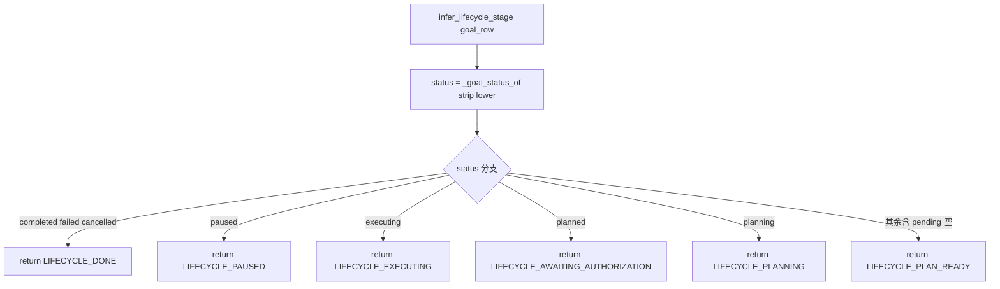

# collab/execution_lifecycle.py — execution_lifecycle.py

> **文件路径**: `backend/packages/harness/agentflow/collab/execution_lifecycle.py`
> **目录位置**: collab → execution_lifecycle.py
> **职责**: 执行生命周期 7 阶段常量 + 中文标签 + 裸文本"开始执行"意图识别（M5）

> **说明**：collab/ 包在 M5 **只有这一个业务文件**（对标 evoflow/collab/ 50+ 文件，supervisor/peer/org/App/推送/观测全砍，留 M7）。

## 📑 目录

- [📋 结构图](#📋-结构图)
- [📤 关键导出](#📤-关键导出)
- [💡 设计思想](#💡-设计思想)
- [🎯 实用场景](#🎯-实用场景)
- [📊 顺序执行链流程图](#📊-顺序执行链流程图)
- [🧩 代码解析（成块对照 execution_lifecycle.py）](#🧩-代码解析成块对照-execution_lifecyclepy)
- [❓ Q&A / 知识点](#❓-qa--知识点)
- [⚠️ 风险点](#⚠️-风险点)

## 📋 结构图

```text
┌──────────────────────────────────────────────────────────────┐
│ LIFECYCLE_* ×7 常量（稳定 key，供 UI/前端映射）               │
│   planning / plan_ready / awaiting_authorization /         │
│   authorized / executing / paused / done                     │
│                                                              │
│ lifecycle_label_zh(stage) → str                              │
│   阶段 key → 中文标签（未知阶段原样返回）                     │
│                                                              │
│ user_execution_start_intent(text) → bool                    │
│   裸文本集合子串匹配（去空格/小写，≤64 字符），M7 gate 用     │
│                                                              │
│ _goal_status_of(goal_row) → str  （内部：兼容 dict/对象/Row） │
│ infer_lifecycle_stage(goal_row) → stage                       │
│   goal_status → 生命周期阶段映射（终态统一 done）             │
└──────────────────────────────────────────────────────────────┘
```

## 📤 关键导出

**常量**

- `LIFECYCLE_PLANNING` / `LIFECYCLE_PLAN_READY` / `LIFECYCLE_AWAITING_AUTHORIZATION`
  / `LIFECYCLE_AUTHORIZED` / `LIFECYCLE_EXECUTING` / `LIFECYCLE_PAUSED` / `LIFECYCLE_DONE`

**函数**

- `lifecycle_label_zh(stage)`
- `user_execution_start_intent(text)`
- `infer_lifecycle_stage(goal_row)`

**内部私有**

- `_LIFECYCLE_LABELS_ZH` / `_START_INTENT_PHRASES` / `_TERMINAL` / `_goal_status_of`

## 💡 设计思想

1. **M5 自动穿过 awaiting_authorization**：流程自动授权，不等用户确认；
   `user_execution_start_intent` 函数体保留但**不接线**，给 M7"用户二次确认 gate"用。
2. **稳定 key 与展示分离**：7 个 `LIFECYCLE_*` 是稳定机器 key（UI/前端按它映射），
   中文标签走 `lifecycle_label_zh` 查表，不在常量里硬塞中文。
3. **裸文本意图刻意保守**：只收 ≤64 字符的短句、做短语子串匹配——
   长句一律 False，避免把"我不打算开始"误判成开始（M7 gate 误判代价高）。

## 🎯 实用场景

1. **M7 授权 gate**：用户说"开始/确认开始/go"才放行从 plan_ready 进入 executing；
   M5 此函数保留但不被调用。
2. **UI 状态展示**：`infer_lifecycle_stage(goal_row)` 由 goal 行状态推出阶段，
   再 `lifecycle_label_zh` 转中文给前端。
3. **断点恢复展示**：终态（completed/failed/cancelled）统一映射 done，
   前端不用关心具体是 failed 还是 cancelled。

## 📊 顺序执行链流程图

**调用方**：当前 **无生产调用方**——`infer_lifecycle_stage` / `user_execution_start_intent`
在 M5 未被任何模块 import（仅 `agents/goal/goal_state.py:62` 注释提及"终态映射 done"）。
以下是 `infer_lifecycle_stage(goal_row)` 自身的推断链：

```text
infer_lifecycle_stage(goal_row)
│
▼
status = _goal_status_of(goal_row).strip().lower()
│   （兼容 dict / 对象属性 / sqlite3.Row 三种 goal 行形态）
│
├─ status ∈ {completed, failed, cancelled}  → return LIFECYCLE_DONE
│
├─ status == "paused"                       → return LIFECYCLE_PAUSED
│
├─ status == "executing"                    → return LIFECYCLE_EXECUTING
│
├─ status == "planned"                      → return LIFECYCLE_AWAITING_AUTHORIZATION
│
├─ status == "planning"                     → return LIFECYCLE_PLANNING
│
└─ 其余（含 pending / 空）                   → return LIFECYCLE_PLAN_READY
```

**Mermaid 版（GitHub / 飞书渲染）**：



## 🧩 代码解析（成块对照 execution_lifecycle.py）

> 读法：每块先贴**完整代码**，再看块下方的整块解析。代码与文件一致。

### 块 1：7 阶段常量 + 中文标签表

```python
# ---------- 7 阶段生命周期常量（稳定 key，供 UI/前端映射） ----------
LIFECYCLE_PLANNING = "planning"
LIFECYCLE_PLAN_READY = "plan_ready"
LIFECYCLE_AWAITING_AUTHORIZATION = "awaiting_authorization"
LIFECYCLE_AUTHORIZED = "authorized"
LIFECYCLE_EXECUTING = "executing"
LIFECYCLE_PAUSED = "paused"
LIFECYCLE_DONE = "done"

_LIFECYCLE_LABELS_ZH: dict[str, str] = {
    LIFECYCLE_PLANNING: "规划中",
    LIFECYCLE_PLAN_READY: "计划已定稿",
    LIFECYCLE_AWAITING_AUTHORIZATION: "待授权开始执行",
    LIFECYCLE_AUTHORIZED: "已授权待启动",
    LIFECYCLE_EXECUTING: "执行中",
    LIFECYCLE_PAUSED: "已暂停",
    LIFECYCLE_DONE: "已结束",
}
```

**结构简析**：7 个 `LIFECYCLE_*` 是**稳定机器 key**（英文 snake_case），一旦发布不可改字符串值——UI/前端、日志、恢复逻辑都按它匹配。中文展示集中在 `_LIFECYCLE_LABELS_ZH` 查表，避免把中文写进常量导致改文案要动机器 key。7 阶段里 `authorized` 与 `awaiting_authorization` 是两个阶段。

**落库要点**：不碰 DB。M5 流程自动授权，所以实际运行时会"穿过" `awaiting_authorization`（goal 状态 planned → 映射到此阶段展示）直接进入 executing；勿把 planned 误改成直接映射 authorized。

### 块 2：开始意图短语集合 + 终态集合

```python
# "开始执行"裸文本意图集合（M5 冻结：子串匹配，≤64 字符）
_START_INTENT_PHRASES: frozenset[str] = frozenset(
    {
        "开始",
        "开始执行",
        "确认开始",
        "按计划开始执行",
        "开始吧",
        "执行",
        "start",
        "start execution",
        "go",
    }
)

# goal 终态
_TERMINAL = frozenset({"completed", "failed", "cancelled"})
```

**结构简析**：`_START_INTENT_PHRASES` 是 M7 gate 用的短语白名单，frozenset 冻结不可变，中英混收（中文 6 条：开始/开始执行/确认开始/按计划开始执行/开始吧/执行；英文 3 条：start/start execution/go）。`_TERMINAL` 与 `goal_state.TERMINAL_GOAL_STATUSES` 内容一致（completed/failed/cancelled），供 `infer_lifecycle_stage` 把所有终态统一映射 done。

**落库要点**：不碰 DB。M5 此集合保留但 `user_execution_start_intent` 不接线，给 M7"用户二次确认 gate"用——勿删。

### 块 3：`lifecycle_label_zh` + `user_execution_start_intent`

```python
def lifecycle_label_zh(stage: str) -> str:
    """生命周期阶段 → 中文标签（未知阶段返回原 key）。"""
    return _LIFECYCLE_LABELS_ZH.get(str(stage or ""), str(stage or ""))


def user_execution_start_intent(text: str) -> bool:
    """裸文本是否表达"开始执行"意图（≤64 字符，短语子串匹配）。

    M5 流程不 gate（自动授权）；此函数保留供 M7 用户二次确认。
    """
    raw = str(text or "").strip()
    if not raw or len(raw) > 64:
        return False
    compact = raw.replace(" ", "").replace("\u3000", "").lower()
    for phrase in _START_INTENT_PHRASES:
        if phrase.replace(" ", "") in compact:
            return True
    return False
```

**结构简析**：`lifecycle_label_zh` 双兜底查表，`user_execution_start_intent` 三道闸判裸文本"开始执行"意图（docstring 明确"M5 不 gate，保留供 M7"）。

**`lifecycle_label_zh()` 参数逐条解释**：

| 参数 | 类型 | 默认值 | 含义 |
|---|---|---|---|
| `stage` | `str` | 必填 | 阶段 key；`str(stage or "")` 把 None/空串安全转空串，查 `_LIFECYCLE_LABELS_ZH`，查不到就原样返回 key（不抛 KeyError） |

**`user_execution_start_intent()` 参数逐条解释**：

| 参数 | 类型 | 默认值 | 含义 |
|---|---|---|---|
| `text` | `str` | 必填 | 用户输入文本；strip 后空或 `len(raw) > 64` 直接 False（长句不判，防误命中）；去半角空格、去全角空格 `\u3000`、转小写得 compact，再对 `_START_INTENT_PHRASES` 各短语（也去空格）做子串包含，命中即 True |

**落库要点**：纯函数不碰 DB。≤64 字符闸是刻意保守——长句含"开始执行"子串（如"我不打算开始执行"）不判，走 NLU/对话理解。

### 块 4：`_goal_status_of` + `infer_lifecycle_stage`

```python
def _goal_status_of(goal_row) -> str:
    """从 goal 行（GoalRow / sqlite3.Row / dict）取 goal_status。"""
    if goal_row is None:
        return ""
    if isinstance(goal_row, dict):
        return str(goal_row.get("goal_status") or goal_row.get("status") or "")
    if hasattr(goal_row, "goal_status"):
        return str(goal_row.goal_status or "")
    try:
        return str(goal_row["goal_status"])
    except (KeyError, TypeError):  # dict 缺 key / 不可下标 → 视为无状态
        return ""


def infer_lifecycle_stage(goal_row) -> str:
    """由 goal 行状态推断生命周期阶段：
    终态→done；paused→paused；executing→executing；
    planned→awaiting_authorization；planning→planning；其余→plan_ready。
    """
    status = _goal_status_of(goal_row).strip().lower()
    if status in _TERMINAL:
        return LIFECYCLE_DONE
    if status == LIFECYCLE_PAUSED:
        return LIFECYCLE_PAUSED
    if status == LIFECYCLE_EXECUTING:
        return LIFECYCLE_EXECUTING
    if status == "planned":
        return LIFECYCLE_AWAITING_AUTHORIZATION
    if status == LIFECYCLE_PLANNING:
        return LIFECYCLE_PLANNING
    return LIFECYCLE_PLAN_READY
```

**结构简析**：`_goal_status_of` 兼容三种 goal 行形态；`infer_lifecycle_stage` 是 goal_status → 生命周期阶段的**单向映射**，终态统一收拢 done。

**`_goal_status_of()` 参数逐条解释**：

| 参数 | 类型 | 默认值 | 含义 |
|---|---|---|---|
| `goal_row` | GoalRow / sqlite3.Row / dict / `None` | 必填 | goal 行；None 返回空串；dict 先取 `goal_status` 再取 `status` 别名；有 `goal_status` 属性则取对象属性；`[]` 取值包 try/except `(KeyError, TypeError)` 兜底空串 |

**`infer_lifecycle_stage()` 参数逐条解释**：

| 参数 | 类型 | 默认值 | 含义 |
|---|---|---|---|
| `goal_row` | GoalRow / sqlite3.Row / dict | 必填 | goal 行；经 `_goal_status_of` 取 status 再 strip().lower()：终态（completed/failed/cancelled）→done、paused→paused、executing→executing、planned→awaiting_authorization、planning→planning、其余（含 pending/空）→plan_ready |

**落库要点**：planned 被刻意映射成 `awaiting_authorization`（M5 自动授权，此阶段会被流程穿过）；所有终态统一 done，前端不用区分 completed/failed/cancelled 细节（终态细节由 summary/outcome 承载）。

## ❓ Q&A / 知识点

### 1. 为什么 M5 保留 7 阶段，但流程会自动穿过 awaiting_authorization？

**一句话**：7 阶段是完整的 UI/前端契约（含"待授权"态），但 M5 产品形态是自动授权，
所以 `planned` 状态映射到 `awaiting_authorization` 仅作展示，流程不在这里停。

M7 才会接 `user_execution_start_intent` 做真正的 gate：用户说"开始"才把
`awaiting_authorization` 推到 `authorized` → `executing`。M5 为了演示流畅，
goal_loop 自动把 planned 迁到 executing，跳过人工确认环节——但 7 阶段 key 保留，
M7 接 gate 时不用改前端映射。

### 2. user_execution_start_intent 为什么要求 ≤64 字符才匹配？

**一句话**：刻意保守——长句几乎不可能是"确认开始"，子串匹配长句极易误命中
（如"我不打算开始执行这个计划"里含"开始执行"子串）。

代码里 `if not raw or len(raw) > 64: return False` 直接把长句挡在门外。
短确认语（"开始"/"确认开始"/"go"）都远短于 64 字符；长句走 NLU/对话理解，
不走这个裸文本闸。M7 gate 误判成"开始"会错误放行高风险操作，宁可不判。

### 3. infer_lifecycle_stage 为什么把终态统一映射成 done？

**一句话**：前端展示只关心"结束了没有"，不区分 completed/failed/cancelled 细节——
终态细节由 summary/outcome 字段承载，生命周期图上画一个 done 节点即可。

代码 `if status in _TERMINAL: return LIFECYCLE_DONE` 把三种终态收拢。
这也是为什么 goal_state.py 里 `TERMINAL_GOAL_STATUSES` 与本模块 `_TERMINAL`
内容一致——两者就是为"终态→done"这一步对齐的。

## ⚠️ 风险点

1. **当前无生产调用方**：本模块 4 个导出在 M5 未被任何模块 import（仅注释提及）；
   改动签名前要确认 M7 gate 计划，勿删 `user_execution_start_intent`。
2. **LIFECYCLE_* 字符串值是稳定契约**：UI/前端按 key 映射，勿改 "planning" 等字面量。
3. **planned → awaiting_authorization 是刻意映射**：M5 自动授权会穿过此阶段，
   勿误改成直接映射 authorized。
4. collab/ 包 M5 仅此一个文件，新增文件前先确认里程碑边界。

---
_2026-10-02 新建：M5 文档（目录 + 流程图 + 成块代码解析 + Q&A）。_

_2026-10-03 重构：代码解析段按「结构简析 + 参数逐条表格 + 落库要点」规范化（代码块零改动）。_
