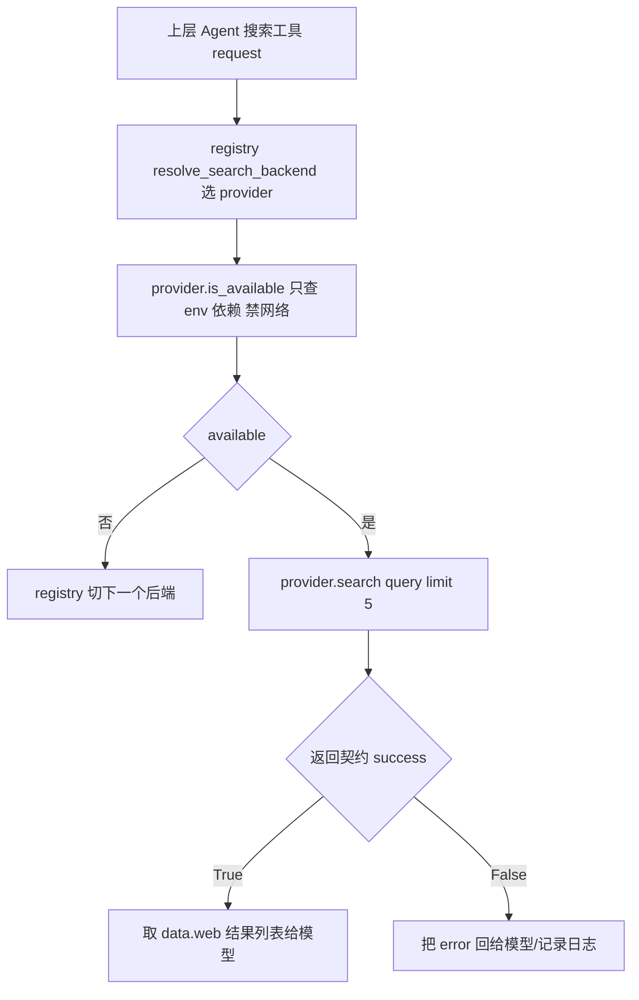

# community/web/provider.py — provider.py

> **文件路径**: `backend/packages/harness/agentflow/community/web/provider.py`
> **目录位置**: community/web → provider.py
> **职责**: 网页搜索 Provider 抽象基类 + 统一结果契约（M6）

## 📑 目录

- [📋 结构图](#📋-结构图)
- [📤 关键导出](#📤-关键导出)
- [💡 设计思想](#💡-设计思想)
- [🎯 实用场景](#🎯-实用场景)
- [📊 顺序执行链流程图](#📊-顺序执行链流程图)
- [🧩 代码解析（成块对照 provider.py）](#🧩-代码解析成块对照-providerpy)
- [❓ Q&A / 知识点](#❓-qa--知识点)
- [⚠️ 风险点](#⚠️-风险点)

## 📋 结构图

```text
┌──────────────────────────────────────────────────────────────┐
│ 模块级工具函数                                                │
│   _PLACEHOLDER_MARKERS = (your-, xxx, placeholder, example,   │
│                            changeme, todo, replace)           │
│   _looks_like_placeholder(value) -> bool   模板占位符判定      │
│   get_provider_env(name) -> str           env 直读+占位符过滤 │
│                                                              │
│ WebSearchProvider(abc.ABC)                                   │
│   ├─ name: str (abstract @property)   稳定注册 id（"ddgs"）  │
│   ├─ display_name: str                默认回退 = name         │
│   ├─ is_available() -> bool (abstract)  只查 env/依赖,禁网络 │
│   ├─ supports_search() -> bool          默认 True            │
│   └─ search(query, limit=5) -> dict      默认返回不支持契约   │
│        成功: {"success": True,  "data": {"web": [...]}}       │
│        失败: {"success": False, "error": str}                 │
└──────────────────────────────────────────────────────────────┘
```

## 📤 关键导出

**类**

- `WebSearchProvider`（抽象基类，子类必须实现 `name` / `is_available` / `search`）

**模块函数**

- `get_provider_env(name: str) -> str`（读环境变量，带占位符过滤）

**模块私有**

- `_looks_like_placeholder(value: str) -> bool`
- `_PLACEHOLDER_MARKERS`（占位符标记元组）

## 💡 设计思想

1. **统一结果契约**：不管背后是哪个搜索引擎，`search()` 都返回同形状
   `{"success": bool, "data"/"error"}`——上层（Agent 工具）只认契约不认引擎。
2. **`is_available` 不碰网络**：只查 env / 依赖是否就绪，供 registry 自动发现时廉价快速判断，
   不能在里面发真实 HTTP 请求（否则自动发现会慢且被反爬）。
3. **env 直读 + placeholder 过滤**：key 形如 `your-xxx` / `xxx` / `changeme` 视为未配置
   （防止用户留着模板占位符当真实 key 用），命中即返回空串。
4. **ABC 默认实现兜底**：`supports_search()` 默认 `True`、`search()` 默认返回"不支持"错误契约，
   子类按需覆盖——最小化子类必须实现的面（只强制 name/is_available/search）。

## 🎯 实用场景

1. **新增搜索后端**：写一个 `class MyProvider(WebSearchProvider)`，实现 `name`/`is_available`/
   `search`，在 `registry.register_provider(MyProvider())` 即可接入，上层工具零改动。
2. **判断 key 是否真配置**：`get_provider_env("TAVILY_API_KEY")` 直读 env，占位符自动变空串，
   供子类 `is_available()` 判断"有没有真 key"。
3. **上层工具统一消费**：Agent 的 web 搜索工具只调 `provider.search(query, limit)`，
   按 `success` 字段分流，不关心底层是 ddgs / searxng / tavily。

## 📊 顺序执行链流程图

**调用方**：`WebSearchProvider` 是抽象基类，实际由 `registry.resolve_search_backend()` 选中的子类
（如 `DDGSWebSearchProvider`）实例化后调用；`get_provider_env` 被子类 `is_available`/`search` 内部复用。

```text
上层 Agent 搜索工具（request 入口）
│
▼
registry.resolve_search_backend() 选出 provider 实例
│
▼
provider.is_available()          ← 只查 env/依赖，禁止网络 I/O
│      └─（子类内部可能调 get_provider_env("XXX_KEY")）
│             val = os.getenv(name).strip()
│             _looks_like_placeholder(val) ? → "" : val
│
▼（available 通过）
provider.search(query, limit=5) ← 子类覆盖，执行真实搜索
│
▼
统一契约 dict 返回
   成功: {"success": True,  "data": {"web": [ {title,url,description,position} ]}}
   失败: {"success": False, "error": "..."}
│
▼
上层按 success 分流：取 data.web 或把 error 回给模型
```

**Mermaid 版（GitHub / 飞书渲染）**：



## 🧩 代码解析（成块对照 provider.py）

> 读法：每块先贴**完整代码**，再看块下方的整块解析。代码与文件一致。

### 块 1：imports + 占位符判定 + `get_provider_env`

```python
from __future__ import annotations

import abc
import os
from typing import Any

_PLACEHOLDER_MARKERS = ("your-", "xxx", "placeholder", "example", "changeme", "todo", "replace")


def _looks_like_placeholder(value: str) -> bool:
    """判断字符串是否像模板占位符（未配置的真实 key）。"""
    v = (value or "").strip().lower()
    if not v:
        return True
    return any(m in v for m in _PLACEHOLDER_MARKERS)


def get_provider_env(name: str) -> str:
    """读环境变量；占位符/空值 → 返回 ""（视为未配置）。"""
    val = (os.getenv(name) or "").strip()
    return "" if _looks_like_placeholder(val) else val
```

**结构简析**：标准库导入（`abc`/`os`/`typing.Any`）。`_PLACEHOLDER_MARKERS` 是占位符标记元组；
`_looks_like_placeholder` 把值 strip+lower 后，空串或命中任一标记都判为占位符；
`get_provider_env` 在 `os.getenv` 之上包一层——读到的值只要像占位符就归一为 `""`（视为未配置）。

**`_looks_like_placeholder()` 参数逐条解释**：

| 参数 | 类型 | 默认值 | 含义 |
|---|---|---|---|
| `value` | `str` | 必填 | 待判定的环境变量原始值；先 `(value or "")` 防空，再 `.strip().lower()` 归一；空串直接 `True`（空=未配置）；否则 `any(m in v for m in _PLACEHOLDER_MARKERS)` 命中任一标记即 `True` |

**`get_provider_env()` 参数逐条解释**：

| 参数 | 类型 | 默认值 | 含义 |
|---|---|---|---|
| `name` | `str` | 必填 | 环境变量名（如 `"TAVILY_API_KEY"`）；`os.getenv(name) or ""` 取空安全，`.strip()` 去空白；经 `_looks_like_placeholder` 判定，占位符/空值返回 `""`，否则返回原始值 |

**落库要点**：这两个函数是"是否真配置"的统一闸门——子类 `is_available()` 里调
`get_provider_env(...)`，拿到非空才算有 key。`""` 与占位符被等价归一，避免模板残留 key 蒙混过关。

### 块 2：`WebSearchProvider` 抽象基类（name / display_name / is_available / supports_search / search）

```python
class WebSearchProvider(abc.ABC):
    """可插拔的网页搜索后端。

    子类必须实现:
        name: 稳定 id（registry 注册键）
        is_available: 廉价可用性检查（只查 env/依赖，禁止网络 I/O）
        search: 执行搜索，返回统一契约 dict
    """

    @property
    @abc.abstractmethod
    def name(self) -> str:
        """稳定 id，用于 registry 注册与 search_backend 配置。"""

    @property
    def display_name(self) -> str:
        return self.name

    @abc.abstractmethod
    def is_available(self) -> bool:
        """廉价检查（env/依赖是否存在）。禁止网络 I/O。"""

    def supports_search(self) -> bool:
        return True

    def search(self, query: str, limit: int = 5) -> dict[str, Any]:
        """执行搜索。默认实现返回不支持（子类覆盖）。"""
        return {"success": False, "error": f"{self.name} does not support search"}
```

**结构简析**：继承 `abc.ABC`。`name` 与 `is_available` 是 `@abstractmethod`（子类必须实现，
否则无法实例化）；`display_name` / `supports_search` / `search` 给默认实现，子类按需覆盖。
`search` 默认返回"不支持"错误契约而非 raise——保证即使子类忘了覆盖也走统一错误形状。

**`name`（abstract property）参数逐条解释**：无参数，子类用 `@property` 返回稳定 id 字符串
（如 `"ddgs"`），同时作 registry 注册键与 `search_backend` 配置值。

**`display_name()` 参数逐条解释**：无参数，默认 `return self.name`（展示名回退到稳定 id），
子类可覆盖为人类可读名（如 `"DuckDuckGo (ddgs)"`）。

**`is_available()` 参数逐条解释**：无参数，子类实现廉价检查（env/依赖是否存在）；
**禁止网络 I/O**——registry 自动发现时会对所有 provider 批量调用它，发真实请求会拖慢且被反爬。

**`supports_search()` 参数逐条解释**：无参数，默认 `return True`；为将来扩展（如仅聊天/仅抓取的
provider）留口子，搜索类 provider 一般不用动。

**`search()` 参数逐条解释**：

| 参数 | 类型 | 默认值 | 含义 |
|---|---|---|---|
| `query` | `str` | 必填 | 搜索关键词；子类拿去调底层引擎 |
| `limit` | `int` | `5` | 期望返回条数上限；子类通常再夹紧到合理区间（如 ddgs 夹到 1..20） |

**返回契约要点**：默认实现返回 `{"success": False, "error": f"{self.name} does not support search"}`；
子类覆盖后应返回同形状——成功 `{"success": True, "data": {"web": [...]}}`，失败 `{"success": False, "error": str}`。
上层只认 `success` 布尔分流，不认具体引擎。

## ❓ Q&A / 知识点

### 1. WebSearchProvider 的统一结果契约长什么样？

**一句话**：任何 provider 的 `search(query, limit=5)` 都返回同形状 dict——
成功 `{"success": True, "data": {"web": [...]}}`，失败 `{"success": False, "error": str}`，
上层只按 `success` 分流。

源码块 2 的 `search` 签名是 `search(self, query: str, limit: int = 5) -> dict[str, Any]`。
默认实现返回错误契约（`f"{self.name} does not support search"`）；子类（见 ddgs.py）成功时把结构化
结果列表塞进 `data.web`，每条是 `{title, url, description, position}`。这套契约让上层 Agent 搜索工具
不必关心底层是 ddgs / tavily / searxng——换引擎只换 provider 实例，工具代码零改动。

### 2. 为什么 is_available 禁止网络 I/O？

**一句话**：registry 自动发现时会对所有已注册 provider 批量调 `is_available()` 挑可用后端，
若每个都发真实 HTTP 请求，启动会被拖慢、还会被搜索引擎反爬封 IP——它只该做"本地廉价检查"
（env 有没有 key、依赖 import 不 import 得进来）。

源码 docstring 明确写"廉价检查（env/依赖是否存在）。禁止网络 I/O"。真实网络连通性留给 `search()`
调用时去暴露（失败走 error 契约）。

### 3. get_provider_env 的占位符过滤是干什么的？为什么要它？

**一句话**：用户常把模板配置里的 `your-api-key-here` / `xxx` / `changeme` 原样留在 env 里，
`get_provider_env` 把这种"看着像占位符"的值归一成空串，避免它被当成真实 key 拿去发请求。

`_looks_like_placeholder` 命中 `_PLACEHOLDER_MARKERS = ("your-","xxx","placeholder","example",
"changeme","todo","replace")` 任一标记即判占位符。这样子类 `is_available()` 用 `get_provider_env`
判断时，模板残留不会被误判为"已配置"——少一类"key 明明填了却一直 401"的排障坑。

### 4. display_name 和 name 有什么区别？

**一句话**：`name` 是稳定机器 id（注册键/配置值，如 `"ddgs"`），不可变；
`display_name` 是给人看的展示名（如 `"DuckDuckGo (ddgs)"`），默认回退到 `name`，子类可覆盖。

`name` 是 `@abstractmethod`（子类必须给一个稳定 id）；`display_name` 是普通 `@property`，
默认 `return self.name`。配置里写 `search_backend = "ddgs"` 用的是 `name`；列表/UI 里展示用
`display_name`。

## ⚠️ 风险点

1. **is_available 绝不能发网络请求**：自动发现会批量调它，发真实请求会慢且触发反爬。
2. **search 失败必须走 error 契约，不要 raise**：上层按 `success` 分流，抛异常会绕过统一兜底。
3. **占位符过滤是字符串包含判定**：`"xxx"` 是子串匹配，若真实 key 恰好含 `xxx` 会被误判为空——
   实际 API key 多为随机串，撞标记概率极低，但自定义标记时勿加过短子串。
4. **ABC 只强制 name/is_available/search**：`display_name`/`supports_search` 有默认实现，
   子类忘了覆盖 search 时会静默返回"does not support search"错误，而非报抽象方法未实现。

---
_2026-10-05 M6 新增：目录 + 结构图 + 流程图 + 成块代码解析（参数逐条表）+ Q&A。_
