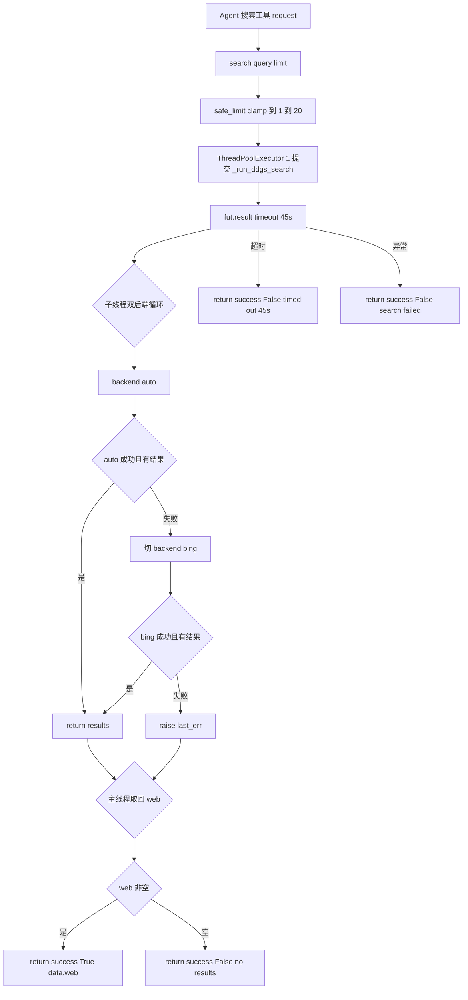

# community/web/providers/ddgs.py — ddgs.py

> **文件路径**: `backend/packages/harness/agentflow/community/web/providers/ddgs.py`
> **目录位置**: community/web/providers → ddgs.py
> **职责**: DuckDuckGo（ddgs 库）免费搜索后端，无 API key，双后端兜底 + 45s 硬超时（M6）

## 📑 目录

- [📋 结构图](#📋-结构图)
- [📤 关键导出](#📤-关键导出)
- [💡 设计思想](#💡-设计思想)
- [🎯 实用场景](#🎯-实用场景)
- [📊 顺序执行链流程图](#📊-顺序执行链流程图)
- [🧩 代码解析（成块对照 ddgs.py）](#🧩-代码解析成块对照-ddgspy)
- [❓ Q&A / 知识点](#❓-qa--知识点)
- [⚠️ 风险点](#⚠️-风险点)

## 📋 结构图

```text
┌──────────────────────────────────────────────────────────────┐
│ 模块级                                                       │
│   _SEARCH_TIMEOUT_SECS = 45           单次搜索硬超时         │
│   _run_ddgs_search(query, safe_limit) 子线程里真实搜         │
│        for backend in (auto, bing):   ← 双后端兜底           │
│          DDGS(timeout=15).text(query, max_results, backend)   │
│          → [{title,url,description,position}]                 │
│        auto 失败 → 切 bing；两个都失败 → raise last_err       │
│                                                              │
│ DDGSWebSearchProvider(WebSearchProvider)                     │
│   ├─ name="ddgs" / display_name="DuckDuckGo (ddgs)"          │
│   ├─ is_available(): import ddgs 成功即 True（无 key）      │
│   └─ search(query, limit=5):                                 │
│        safe_limit = clamp(limit, 1, 20)                      │
│        ThreadPoolExecutor(1) + fut.result(timeout=45)       │
│        空结果 → success False "no results"                   │
│        超时   → success False "timed out after 45s"          │
│        异常   → success False "search failed: ..."           │
│        成功   → {"success":True,"data":{"web":[...]}}        │
└──────────────────────────────────────────────────────────────┘
```

## 📤 关键导出

**类**

- `DDGSWebSearchProvider`（继承 `WebSearchProvider`，registry 内置自动注册）

**模块私有**

- `_run_ddgs_search(query, safe_limit)`（子线程真实搜索）
- `_SEARCH_TIMEOUT_SECS = 45`（硬超时常量）

## 💡 设计思想

1. **免费无 key**：ddgs 库直连 DuckDuckGo，不需要 API key——天然符合"测试不依赖真实 key"的纪律，
   也是 registry 自动发现序里排第一的保底后端。
2. **双后端兜底**：`for backend in ("auto", "bing")`——国内网络 DDG HTML（auto）常被墙/被拦，
   auto 失败就切 bing；两个都失败才把最后一个错误 raise 出去。
3. **45s 硬超时**：网络搜索最怕挂起——用 `ThreadPoolExecutor(max_workers=1)` 跑搜索，
   `fut.result(timeout=45)` 保证最坏 45 秒必须返回（超时转 error 契约，不无限等）。
4. **limit 夹紧 1..20**：`max(1, min(int(limit), 20))`——防上层传 9999 打爆上游。

## 🎯 实用场景

1. **默认搜索后端**：`resolve_search_backend()` 在无 key 环境下默认选中 ddgs（自动序第一）。
2. **国内网络兜底**：auto 被拦时自动切 bing，不用人工配置就能出结果。
3. **测试/离线环境**：无 API key 也能跑通搜索链路（只要能 import ddgs + 有网）。

## 📊 顺序执行链流程图

**调用方**：`DDGSWebSearchProvider` ← `registry.ensure_providers_loaded`（内置注册）；
`search` ← 上层 Agent 搜索工具经 `get_provider("ddgs").search(...)` 调用。

```text
上层 Agent 搜索工具 request
│
▼
provider.search(query, limit=5)        [DDGSWebSearchProvider.search]
│
├─ safe_limit = max(1, min(int(limit), 20))     ← 夹紧 1..20
│
├─ with ThreadPoolExecutor(max_workers=1) as pool:
│     fut = pool.submit(_run_ddgs_search, query, safe_limit)
│     web = fut.result(timeout=45)        ← 45s 硬超时闸门
│        │
│        ▼（子线程里）
│     _run_ddgs_search(query, safe_limit)
│        from ddgs import DDGS
│        for backend in ("auto", "bing"):   ← 双后端兜底
│          try:
│            with DDGS(timeout=15) as client:
│              client.text(query, max_results=safe_limit, backend=backend)
│            命中 results? → return results
│          except: last_err=e; logger.info; continue（切下一个 backend）
│        两个都失败 → raise last_err；都返回空 → return []
│
▼（主线程取回结果）
if not web:  return {"success":False, "error":"ddgs returned no results"}
return {"success":True, "data":{"web":web}}
│
├─ except TimeoutError → {"success":False,"error":"...timed out after 45s"}
└─ except Exception    → {"success":False,"error":"ddgs search failed: ..."}
```

**Mermaid 版（GitHub / 飞书渲染）**：



## 🧩 代码解析（成块对照 ddgs.py）

> 读法：每块先贴**完整代码**，再看块下方的整块解析。代码与文件一致。

### 块 1：imports + 45s 超时常量 + `_run_ddgs_search`（双后端兜底）

```python
from __future__ import annotations

import concurrent.futures
import logging
from typing import Any

from agentflow.community.web.provider import WebSearchProvider

logger = logging.getLogger(__name__)

_SEARCH_TIMEOUT_SECS = 45


def _run_ddgs_search(query: str, safe_limit: int) -> list[dict[str, Any]]:
    """实际执行 ddgs 搜索（在子线程跑，带 45s 超时）。

    双后端（auto → bing）循环重试：国内网络 DDG HTML 常被拦，bing 兜底。
    """
    from ddgs import DDGS

    last_err: Exception | None = None
    for backend in ("auto", "bing"):
        try:
            results: list[dict[str, Any]] = []
            with DDGS(timeout=15) as client:
                for i, hit in enumerate(
                    client.text(query, max_results=safe_limit, backend=backend)
                ):
                    if i >= safe_limit:
                        break
                    url = str(hit.get("href") or hit.get("url") or "")
                    results.append(
                        {
                            "title": str(hit.get("title", "")),
                            "url": url,
                            "description": str(hit.get("body", "")),
                            "position": i + 1,
                        }
                    )
            if results:
                return results
        except Exception as e:  # noqa: BLE001 —— ddgs 后端失败换下一个
            last_err = e
            logger.info("ddgs backend=%s failed: %s", backend, e)
            continue
    if last_err is not None:
        raise last_err
    return []
```

**结构简析**：`_SEARCH_TIMEOUT_SECS = 45` 是模块级硬超时常量。`_run_ddgs_search` 在子线程里真实跑——
函数内延迟 `from ddgs import DDGS`（避免 import 本模块即依赖 ddgs 包）；`for backend in ("auto","bing")`
双后端循环：每个后端 try 建 `DDGS(timeout=15)` 上下文调 `client.text(...)`，把命中逐条结构化成
`{title,url,description,position}`；某后端出结果就 return，失败记 `last_err` 切下一个；两个都抛错则
`raise last_err`，都返回空则 `return []`。

**`_run_ddgs_search()` 参数逐条解释**：

| 参数 | 类型 | 默认值 | 含义 |
|---|---|---|---|
| `query` | `str` | 必填 | 搜索关键词，透传给 `client.text(query, ...)` |
| `safe_limit` | `int` | 必填 | 已夹紧的条数上限（外层 `search` 夹到 1..20）；`client.text(max_results=safe_limit)` 且循环里 `if i >= safe_limit: break` 双保险 |

**返回/错误要点**：成功返回 `list[dict]`，每条含 `title`/`url`（优先 `href` 回退 `url`）/`description`
（取 `body`）/`position`（从 1 起）。单后端异常 `logger.info` 后 continue 切下一个 backend；
两个都失败 `raise last_err`（把最后一个原始异常抛给外层 search 转 error 契约）。

### 块 2：`DDGSWebSearchProvider`（name / display_name / is_available / search）

```python
class DDGSWebSearchProvider(WebSearchProvider):
    """DuckDuckGo（ddgs 库）免费搜索后端，无 API key。"""

    @property
    def name(self) -> str:
        return "ddgs"

    @property
    def display_name(self) -> str:
        return "DuckDuckGo (ddgs)"

    def is_available(self) -> bool:
        try:
            import ddgs  # noqa: F401

            return True
        except ImportError:
            return False

    def search(self, query: str, limit: int = 5) -> dict[str, Any]:
        """执行搜索。统一契约：成功 {"success","data":{"web":[...]}} / 失败 error。"""
        safe_limit = max(1, min(int(limit), 20))
        try:
            with concurrent.futures.ThreadPoolExecutor(max_workers=1) as pool:
                fut = pool.submit(_run_ddgs_search, query, safe_limit)
                web = fut.result(timeout=_SEARCH_TIMEOUT_SECS)
            if not web:
                return {"success": False, "error": "ddgs returned no results"}
            return {"success": True, "data": {"web": web}}
        except concurrent.futures.TimeoutError:
            return {"success": False, "error": f"ddgs search timed out after {_SEARCH_TIMEOUT_SECS}s"}
        except Exception as exc:  # noqa: BLE001 —— 网络异常统一转 error 契约
            logger.warning("ddgs search failed: %s", exc)
            return {"success": False, "error": f"ddgs search failed: {exc}"}
```

**结构简析**：实现基类三抽象面。`name` 固定 `"ddgs"`，`display_name` 给人类可读名。
`is_available` 只尝试 `import ddgs`——能 import 就算可用（无 key 依赖，不碰网络）。
`search` 是核心：先 `safe_limit` 夹紧到 1..20，再用单线程池跑 `_run_ddgs_search` 并 `fut.result(timeout=45)`
做硬超时；按"空结果 / 超时 / 异常 / 成功"四条分支返回统一契约。

**`name`（property）参数逐条解释**：无参数，固定返回 `"ddgs"`（registry 注册键 + 自动发现序第一项）。

**`display_name()` 参数逐条解释**：无参数，返回 `"DuckDuckGo (ddgs)"`（展示名）。

**`is_available()` 参数逐条解释**：无参数。`try: import ddgs; return True`，`except ImportError: return False`——
**只查依赖能否 import，不发网络请求**（符合基类"禁止网络 I/O"约束）。

**`search()` 参数逐条解释**：

| 参数 | 类型 | 默认值 | 含义 |
|---|---|---|---|
| `query` | `str` | 必填 | 搜索关键词，透传给 `_run_ddgs_search` |
| `limit` | `int` | `5` | 期望条数；`safe_limit = max(1, min(int(limit), 20))` 夹紧到 1..20（防上层传 9999 打爆上游） |

**返回契约要点**：

| 分支 | 触发条件 | 返回 |
|---|---|---|
| 成功 | `web` 非空 list | `{"success": True, "data": {"web": web}}` |
| 空结果 | `web` 为空 list | `{"success": False, "error": "ddgs returned no results"}` |
| 超时 | `fut.result(timeout=45)` 抛 `TimeoutError` | `{"success": False, "error": "ddgs search timed out after 45s"}` |
| 其它异常 | `_run_ddgs_search` 抛任意 Exception | `{"success": False, "error": "ddgs search failed: {exc}"}`（先 `logger.warning`） |

**落库要点**：`ThreadPoolExecutor(max_workers=1)` 用完即 `with` 关闭；超时只是 `fut.result` 抛错返回，
**子线程里的 ddgs 请求并不会真被 kill**（Python 线程无法强杀）——但主线程已 45s 返回，不阻塞上层。

## ❓ Q&A / 知识点

### 1. ddgs 的双后端兜底是怎么工作的？

**一句话**：`_run_ddgs_search` 里 `for backend in ("auto", "bing")` 顺序尝试——先用 auto（DDG HTML/官方），
失败就切 bing；auto 在国内网络常被墙/被拦，bing 作兜底，两个都失败才报错。

每个 backend 独立 try：建 `DDGS(timeout=15)` 上下文调 `client.text(query, max_results, backend=backend)`。
某 backend 成功且 `results` 非空就立刻 return；抛异常记 `last_err` + `logger.info` 后 continue 下一个。
两个都抛错则 `raise last_err`（最后一个原始异常）给外层 search 转 error 契约。注意"失败"包含
抛异常——若 auto 返回空 list 不抛错，代码 `if results: return results` 不命中，会继续走 bing。

### 2. 45s 硬超时是怎么实现的？为什么需要它？

**一句话**：`search` 把真正的 ddgs 调用丢进 `ThreadPoolExecutor(max_workers=1)`，主线程
`fut.result(timeout=_SEARCH_TIMEOUT_SECS=45)`——最多等 45 秒，超时就转成 error 契约返回，不让搜索无限挂起。

为什么需要：ddgs 是免费网页端爬取，网络不通或被反爬时底层请求可能长时间不返回。没有超时，
上层 Agent 的一次 web 搜索调用会卡住整个 REPL。`fut.result(timeout=45)` 抛 `concurrent.futures.TimeoutError`，
被 search 捕获后返回 `"ddgs search timed out after 45s"`。注意：这是主线程侧超时，子线程里的请求
仍在跑（Python 不能强杀线程），但线程池 `with` 退出时会随上下文关闭回收，主线程已解脱。

### 3. is_available 为什么只 import ddgs 而不发请求？

**一句话**：ddgs 是免费无 key 后端——"能不能用"只取决于 `ddgs` 包装没装（`import ddgs` 成功），
不取决于有没有 API key，也不该在自动发现时发真实搜索请求（否则慢且被反爬）。

源码 `try: import ddgs; return True except ImportError: return False`。符合基类
`WebSearchProvider.is_available` "廉价检查、禁止网络 I/O" 的约束。真正的网络连通性由 `search()`
调用时暴露（失败走 error 契约）。

### 4. limit 为什么要夹紧到 1..20？

**一句话**：`safe_limit = max(1, min(int(limit), 20))`——把上层传入的条数夹到 [1,20]，
防上层误传 0/负数/超大数（如 9999）打爆免费的 ddgs 上游。

两道保险：`client.text(max_results=safe_limit)` 告诉上游只要这么多，循环里 `if i >= safe_limit: break`
再截断一次。下限 `max(1, ...)` 防止 0 导致空查询，上限 `min(...,20)` 是免费引擎的合理负载上限。

## ⚠️ 风险点

1. **超时不杀子线程**：`fut.result(timeout=45)` 超时后主线程返回，但子线程里的 ddgs 请求仍在跑——
   Python 线程无法强杀，靠线程池上下文关闭回收；高频超时调用会堆积空闲线程。
2. **免费引擎反爬/限流**：ddgs 是网页端爬取，高频/密集查询会被 DuckDuckGo 或 bing 端限流封 IP，
   表现为 auto/bing 双双失败 → `"ddgs search failed"`。
3. **双后端都失败才报错**：auto 失败是 `logger.info`（正常降级），不要误当错误告警；
   只有两个 backend 都挂才 `raise last_err` → 外层 error 契约。
4. **结果字段依赖上游形状**：`url` 取 `href or url`、`description` 取 `body`——ddgs 库版本升级改字段名
   会静默拿到空串，需盯上游 schema。

---
_2026-10-05 M6 新增：目录 + 结构图 + 流程图 + 成块代码解析（参数逐条表）+ Q&A。_
