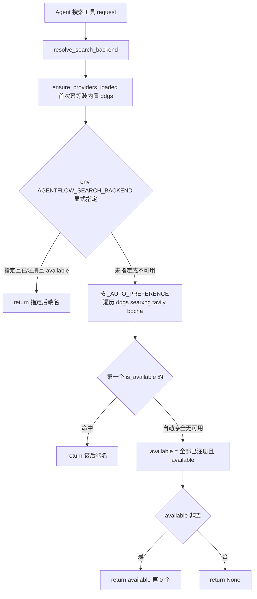

# community/web/registry.py — registry.py

> **文件路径**: `backend/packages/harness/agentflow/community/web/registry.py`
> **目录位置**: community/web → registry.py
> **职责**: 搜索 Provider 注册中心（懒加载 + 线程安全 + 后端自动解析，M6）

## 📑 目录

- [📋 结构图](#📋-结构图)
- [📤 关键导出](#📤-关键导出)
- [💡 设计思想](#💡-设计思想)
- [🎯 实用场景](#🎯-实用场景)
- [📊 顺序执行链流程图](#📊-顺序执行链流程图)
- [🧩 代码解析（成块对照 registry.py）](#🧩-代码解析成块对照-registrypy)
- [❓ Q&A / 知识点](#❓-qa--知识点)
- [⚠️ 风险点](#⚠️-风险点)

## 📋 结构图

```text
┌──────────────────────────────────────────────────────────────┐
│ 模块级状态（单例注册表，进程内一份）                          │
│   _providers: dict[name -> provider]   注册表字典            │
│   _lock   = threading.RLock()          读写可重入锁          │
│   _loaded = bool                       内置 provider 是否已装 │
│   _AUTO_PREFERENCE = [ddgs,searxng,tavily,bocha] 自动发现序  │
│                                                              │
│ register_provider(p)        类型/name 校验后写 _providers    │
│ ensure_providers_loaded()   首次幂等注册内置 ddgs provider   │
│ list_providers()            按 name 排序返回全部 provider    │
│ get_provider(name)          按名查单个，None 若不存在         │
│ resolve_search_backend()    选当前后端名（env 显式 > 自动序）│
└──────────────────────────────────────────────────────────────┘
```

## 📤 关键导出

**函数**

- `register_provider(provider: WebSearchProvider) -> None`
- `ensure_providers_loaded() -> None`
- `list_providers() -> list[WebSearchProvider]`
- `get_provider(name: str) -> WebSearchProvider | None`
- `resolve_search_backend() -> str | None`

**模块私有**

- `_providers` / `_lock` / `_loaded` / `_AUTO_PREFERENCE`

## 💡 设计思想

1. **懒加载注册**：import 本模块不触发副作用；第一次访问（list/get/resolve）时才
   `ensure_providers_loaded()` 注册内置 provider——测试可随时 `register_provider` 自定义 provider 覆盖。
2. **线程安全（RLock）**：所有对 `_providers` 的读写都包在 `threading.RLock()` 里；
   `ensure_providers_loaded` 用 double-check（先拿锁看 `_loaded`）——未来 scheduler/子代理并发取 provider 时不炸。
3. **后端解析 = env 显式优先，否则按内置优先级挑第一个可用**：
   `AGENTFLOW_SEARCH_BACKEND` 指定则用之；否则按 `_AUTO_PREFERENCE`（ddgs→searxng→tavily→bocha）
   挑第一个 `is_available()` 的。ddgs 免费无 key 永远是保底后端。
4. **字典注册表（非装饰器/非工厂）**：注册方式就是直接 `register_provider(instance)` 写进
   `_providers[name]`——重复 name 覆盖，类型与 name 非空在注册时校验。

## 🎯 实用场景

1. **选搜索后端**：Agent 工具启动时 `resolve_search_backend()` 拿到后端名，再 `get_provider(name)`
   取实例调 `search()`。
2. **测试注入 mock provider**：测试里 `register_provider(MockProvider())` 覆盖内置，
   不碰真实网络。
3. **加新内置 provider**：在 `ensure_providers_loaded` 的 try 里追加一行
   `register_provider(NewProvider())`，自动发现序 `_AUTO_PREFERENCE` 里加它的 name。

## 📊 顺序执行链流程图

**调用方**：`resolve_search_backend` / `get_provider` ← 上层 Agent 搜索工具；
`register_provider` ← `ensure_providers_loaded`（内置 ddgs）或测试/扩展代码。

```text
上层 Agent 搜索工具（request 入口）
│
▼
resolve_search_backend()
│
├─ ensure_providers_loaded()          ← 首次才真装内置 ddgs
│     with _lock: if _loaded: return; _loaded=True
│     import ddgs provider → register_provider(DDGSWebSearchProvider())
│
├─ explicit = os.getenv("AGENTFLOW_SEARCH_BACKEND")
│     explicit 非空？ → get_provider(explicit) + is_available() ? → return name
│
▼（env 未指定或指定不可用）
按 _AUTO_PREFERENCE = [ddgs, searxng, tavily, bocha] 顺序遍历
│
├─ for name in 序: p=_providers.get(name); p and p.is_available() ? → return name
│
▼（自动序里一个都不可用）
available = [name for name,p in _providers.items() if p.is_available()]
│
▼
return available[0] if available else None   ← 全无可用返回 None
```

**Mermaid 版（GitHub / 飞书渲染）**：



## 🧩 代码解析（成块对照 registry.py）

> 读法：每块先贴**完整代码**，再看块下方的整块解析。代码与文件一致。

### 块 1：imports + 模块级状态（单例注册表 + RLock + 自动发现序）

```python
from __future__ import annotations

import logging
import os
import threading

from agentflow.community.web.provider import WebSearchProvider

logger = logging.getLogger(__name__)

_providers: dict[str, WebSearchProvider] = {}
_lock = threading.RLock()
_loaded = False

# 自动发现顺序（env 未显式指定时按此挑第一个可用）
_AUTO_PREFERENCE: list[str] = ["ddgs", "searxng", "tavily", "bocha"]
```

**结构简析**：标准库导入（logging/os/threading）+ `WebSearchProvider` 基类。模块级三件套构成
单例注册表：`_providers`（name→实例字典）、`_lock`（RLock 可重入锁）、`_loaded`（内置是否已装标志）。
`_AUTO_PREFERENCE` 是自动发现优先级序——env 未指定时按它挑第一个可用。

**落库要点**：`_providers` 是进程内模块级字典（全进程一份，即"单例注册表"）；`RLock` 而非 `Lock`
是因为 `ensure_providers_loaded` 拿锁置标志后，注册失败路径里 `register_provider` 还会再次 `with _lock`，
可重入避免死锁。

### 块 2：`register_provider` + `ensure_providers_loaded`（注册 + 懒加载内置）

```python
def register_provider(provider: WebSearchProvider) -> None:
    """注册一个搜索 provider。name 非空且不重复（重复覆盖）。"""
    if not isinstance(provider, WebSearchProvider):
        raise TypeError(f"expected WebSearchProvider, got {type(provider).__name__}")
    name = provider.name
    if not isinstance(name, str) or not name.strip():
        raise ValueError("Web provider .name must be a non-empty string")
    with _lock:
        _providers[name.strip()] = provider
    logger.debug("Registered web provider '%s'", name)


def ensure_providers_loaded() -> None:
    """首次访问时注册内置 provider（幂等，线程安全）。"""
    global _loaded
    with _lock:
        if _loaded:
            return
        _loaded = True
    try:
        from agentflow.community.web.providers.ddgs import DDGSWebSearchProvider

        register_provider(DDGSWebSearchProvider())
    except Exception as exc:  # noqa: BLE001 —— 内置 provider 注册失败不影响 registry 空转
        logger.warning("Failed to register built-in providers: %s", exc)
```

**结构简析**：`register_provider` 做两道校验（类型必须是 `WebSearchProvider` 子类、`name` 非空字符串），
然后 `with _lock` 写进 `_providers[name.strip()]`——重复 name 直接覆盖。`ensure_providers_loaded` 是
懒加载闸门：拿锁 double-check `_loaded`，已装直接 return；否则先把 `_loaded=True` 置上（放锁外再 import，
避免持锁 import 慢/死锁），try 里 import 并注册内置 ddgs，失败只 warning 不炸。

**`register_provider()` 参数逐条解释**：

| 参数 | 类型 | 默认值 | 含义 |
|---|---|---|---|
| `provider` | `WebSearchProvider` | 必填 | 待注册的 provider 实例；非子类抛 `TypeError`；取 `provider.name` 作键，非字符串/空串抛 `ValueError`；`with _lock` 写 `_providers[name.strip()]`，同名覆盖 |

**`ensure_providers_loaded()` 参数逐条解释**：无参数。`global _loaded`；拿锁 double-check——
已加载直接 return，否则先置 `_loaded=True` 再放锁；随后 `from ...ddgs import DDGSWebSearchProvider`
延迟 import（避免 import 本模块即副作用），实例化并注册；任何异常 `logger.warning` 吞掉（内置注册失败
registry 仍可空转，等外部 `register_provider` 注入）。

**落库要点**：注册方式是**字典直接写入**（`_providers[name] = instance`），不是装饰器、不是工厂函数——
调用方自己 `new` 实例再 `register_provider`。`DDGSWebSearchProvider()` 在 ensure 里按需实例化
（懒加载，import 本模块时不实例化）。

### 块 3：`list_providers` + `get_provider` + `resolve_search_backend`（查询与后端解析）

```python
def list_providers() -> list[WebSearchProvider]:
    """全部已注册 provider（按 name 排序）。"""
    ensure_providers_loaded()
    with _lock:
        items = list(_providers.values())
    return sorted(items, key=lambda p: p.name)


def get_provider(name: str) -> WebSearchProvider | None:
    """按 name 查 provider；不存在返回 None。"""
    ensure_providers_loaded()
    if not isinstance(name, str):
        return None
    with _lock:
        return _providers.get(name.strip())


def resolve_search_backend() -> str | None:
    """解析当前搜索后端名。

    顺序:
        1. 环境变量 AGENTFLOW_SEARCH_BACKEND 显式指定（存在且已注册 → 用之）
        2. 否则按 _AUTO_PREFERENCE 挑第一个 is_available() 的

    返回:
        选中的后端名；一个都不可用 → None。
    """
    ensure_providers_loaded()
    explicit = (os.getenv("AGENTFLOW_SEARCH_BACKEND") or "").strip()
    if explicit:
        provider = get_provider(explicit)
        if provider is not None and provider.is_available():
            return provider.name
    with _lock:
        registered = list(_providers.items())
    for name in _AUTO_PREFERENCE:
        provider = _providers.get(name)
        if provider is not None and provider.is_available():
            return name
    available = [name for name, p in registered if p.is_available()]
    return available[0] if available else None
```

**结构简析**：三个查询函数开头都先 `ensure_providers_loaded()`（保证内置已装）。`list_providers`
拿锁快照 values 再锁外排序；`get_provider` 非字符串入参直接返回 None，拿锁按 `name.strip()` 取；
`resolve_search_backend` 是选后端核心——env 显式优先，否则按自动序挑第一个可用，最后兜底从
全量已注册里挑第一个可用。

**`list_providers()` 参数逐条解释**：无参数。先 `ensure_providers_loaded()`，`with _lock` 里
`list(_providers.values())` 快照（锁外排序不持锁），按 `p.name` 升序返回。

**`get_provider()` 参数逐条解释**：

| 参数 | 类型 | 默认值 | 含义 |
|---|---|---|---|
| `name` | `str` | 必填 | 要查的 provider 名；先 `ensure_providers_loaded()`；非 `str` 直接返回 None；`with _lock` 里 `_providers.get(name.strip())`，不存在返回 None |

**`resolve_search_backend()` 参数逐条解释**：无参数。解析顺序三步：

| 步骤 | 逻辑 | 返回 |
|---|---|---|
| ① env 显式 | `explicit = os.getenv("AGENTFLOW_SEARCH_BACKEND").strip()`；非空则 `get_provider(explicit)` 且 `is_available()` 通过 | 返回该 `provider.name` |
| ② 自动序 | 遍历 `_AUTO_PREFERENCE`（ddgs→searxng→tavily→bocha），第一个 `_providers.get(name)` 且 `is_available()` 的 | 返回该 `name` |
| ③ 兜底 | `with _lock` 快照 `registered`；`available = [n for n,p in registered if p.is_available()]` | `available[0]` 若非空，否则 `None` |

**落库要点**：`is_available()` 在锁外调用（它只查 env/依赖，不碰 `_providers`），避免持锁做外部判断；
`registered` 先拿锁快照成 list 再遍历，避免遍历中字典被别的线程改。

## ❓ Q&A / 知识点

### 1. registry 是怎么做到懒加载和线程安全的？

**一句话**：模块级 `_providers` 字典 + `threading.RLock` 全局一把锁 + `_loaded` 标志位——
import 本模块不注册任何 provider，第一次 list/get/resolve 时 `ensure_providers_loaded()` 才幂等装内置，
所有读写都在 `with _lock` 里，并发取 provider 不炸。

懒加载：`ensure_providers_loaded` 里 `if _loaded: return`，且内置 ddgs 是函数内 `from ...ddgs import`
延迟 import——import registry 本身零副作用。线程安全：`register_provider`/`list_providers`/
`get_provider`/resolve 的字典访问全在 `with _lock` 内；用 RLock 是因为 ensure 置完 `_loaded` 后
`register_provider` 还要再进一次 `with _lock`，可重入不死锁。

### 2. 提供商注册方式是装饰器、字典还是工厂？

**一句话**：是**字典直接注册**——调用方自己 `new` 一个 provider 实例，调 `register_provider(instance)`，
它内部按 `instance.name` 写进模块级 `_providers[name] = instance`。

既不是装饰器（没有 `@register` 语法糖），也不是工厂函数（registry 不负责 `new`，只收现成实例）。
唯一"工厂"色彩的地方是 `ensure_providers_loaded` 里 `register_provider(DDGSWebSearchProvider())`
——内置 provider 在这里按需实例化。重复 name 直接覆盖（注释写明"重复覆盖"），便于测试注入 mock。

### 3. resolve_search_backend 的选择优先级是什么？

**一句话**：env 显式指定 > 自动发现序第一个可用 > 全量已注册第一个可用 > None。

源码三步：① `AGENTFLOW_SEARCH_BACKEND` 非空且该 provider 已注册且 `is_available()` → 用它；
② 否则按 `_AUTO_PREFERENCE = ["ddgs","searxng","tavily","bocha"]` 挑第一个可用；
③ 自动序里一个都没注册/没可用，就从全部已注册 provider 里挑第一个 `is_available()` 的；
④ 全都不可用返回 `None`。ddgs 排自动序第一且免费无 key，天然是保底后端。

### 4. 为什么 ensure_providers_loaded 要先置 _loaded=True 再 import？

**一句话**：把 `_loaded=True` 放在锁内置顶、把 `import` 和 `register` 放锁外——既保证幂等
（第二个进来的线程看到 `_loaded` 直接 return），又避免持锁做慢 import 造成别的线程堵锁。

源码 `with _lock: if _loaded: return; _loaded = True` 出锁后才 `try: from ...ddgs import ...; register`。
若 import 抛异常，`_loaded` 已是 True，不会反复重试注册（只 warning 一次）；后续靠外部
`register_provider` 补。这是典型的"先占标志再干慢活"的懒加载 double-check 写法。

## ⚠️ 风险点

1. **is_available 在锁外调**：resolve 里对每个 provider 调 `is_available()` 不持锁——它只查 env/依赖，
   若子类实现违规发了网络请求，会在无锁状态下阻塞（且被反爬）。
2. **_loaded 置位后失败不重试**：内置 ddgs 注册失败只 warning 一次，`_loaded=True` 挡住后续重试——
   此时只能靠外部 `register_provider` 注入，否则 search 后端可能为 None。
3. **重复 name 静默覆盖**：`_providers[name.strip()] = provider` 同名直接盖，后注册的赢——
   测试注入 mock 能覆盖内置是特性，但生产环境误注册同名 provider 会无声替换。
4. **_AUTO_PREFERENCE 是硬编码序**：加新内置 provider 要同时改这个列表，否则它只在第③步兜底出现，
   优先级低于列表里的旧 provider。

---
_2026-10-05 M6 新增：目录 + 结构图 + 流程图 + 成块代码解析（参数逐条表）+ Q&A。_
