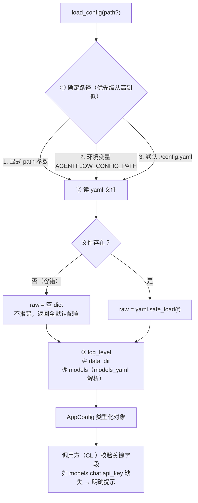

# config/app_config.py — app_config.py

> **文件路径**: `backend/packages/harness/agentflow/config/app_config.py`
> **目录位置**: config → app_config.py
> **职责**: 全局配置入口

## 📑 目录

- [📋 结构图 / 思维图](#📋-结构图--思维图)
- [📤 关键导出](#📤-关键导出)
- [💡 设计思想](#💡-设计思想)
- [🎯 实用场景](#🎯-实用场景)
- [🧩 代码解析（成块对照 app_config.py）](#🧩-代码解析成块对照-app_configpy)
- [❓ Q&A](#❓-qa)
- [⚠️ 风险点](#⚠️-风险点)

## 📋 结构图 / 思维图

**ASCII 版（VSCode / 任何编辑器直接可见）**：

```text
┌──────────────────────────────────────────────────────┐
│ load_config(path?) ──► AppConfig                      │
│   ① 定路径: 参数 > AGENTFLOW_CONFIG_PATH > config.yaml│
│   ② 读 yaml（缺文件则空 dict，不报错）                │
│   ③ log_level ← raw["log_level"]                     │
│   ④ data_dir  ← raw["paths"]["data_dir"]             │
│   ⑤ models    ← models_yaml.load_models_from_yaml()  │
└──────────────────────────────────────────────────────┘
```

**Mermaid 版（思维图，GitHub / 飞书渲染；VSCode 需装插件）**：



## 📤 关键导出

**类**

- `AppConfig`

**函数**

- `load_config()`

**常量**

- `DEFAULT_CONFIG_PATH`

## 💡 设计思想

1. 全局配置唯一入口：yaml → 类型化对象（AppConfig）。
2. 文件缺失返回默认不报错（容错设计），由调用方校验——
   CLI 检查 models/api_key，缺失给明确提示。
3. 路径支持参数/环境变量覆盖，M7 gateway 复用同一入口。

## 🎯 实用场景

1. 全局配置入口：CLI/未来 gateway 统一从 config.yaml 加载配置
2. 配置缺失检测：models 段未配/无 API key 时给出明确提示（CLI 启动检查）
3. 多环境切换：改 config.yaml 即可切模型/供应商/数据路径

## 🧩 代码解析（成块对照 app_config.py）

> 读法：每块先贴**完整代码**，再看块下方的整块解析。代码与文件一致，仅省略头部规范注释。

### 块 1：imports + 默认路径常量

```python
from __future__ import annotations  # 延迟求值注解：3.12 下允许"类内引用自身类型"

import os
from dataclasses import dataclass, field

import yaml

# 同域模块（相对导入：models 配置类型 / yaml 解析 / 路径）
from agentflow.config.model_config import ModelConfig
from agentflow.config.models_yaml import load_models_from_yaml
from agentflow.config.paths import default_data_dir

# 默认配置文件路径：项目根 config.yaml（仿原版支持环境变量覆盖路径的思路）
DEFAULT_CONFIG_PATH = "config.yaml"
```

**结构简析**：依赖分三层——标准库（`os` 读环境变量、`dataclass`/`field` 定义数据类）、第三方（`yaml` 解析配置文件）、同域模块（`ModelConfig` 类型、`load_models_from_yaml` 解析器、`default_data_dir` 目录定位）。

**补充**：`DEFAULT_CONFIG_PATH = "config.yaml"` 是**相对当前工作目录**的默认路径——这也是 P-014 的根源（从 backend 启动找不到根 config.yaml，所以 CLI 显式传绝对路径）。

### 块 2：`AppConfig` 数据类 —— 类型化配置的载体

```python
@dataclass
class AppConfig:
    """应用全局配置（M1 只有 3 个字段）。"""
    log_level: str = "info"
    models: ModelConfig | None = None
    data_dir: str = field(default_factory=default_data_dir)
```

**结构简析**：用 `@dataclass` 把配置变成**类型化对象**（而非散落的 dict）——字段有类型、有默认值，IDE 补全/类型检查都能用；所有字段都有默认值，缺文件时 `AppConfig()` 全默认也能建出来（容错设计）。

**`AppConfig` 字段逐条解释**：

| 参数 | 类型 | 默认值 | 含义 |
|---|---|---|---|
| `log_level` | `str` | `"info"` | 日志级别（debug/info/warning/error） |
| `models` | `ModelConfig \| None` | `None` | 模型配置；config.yaml 没有 models 段时为 None，由调用方（CLI）校验 api_key |
| `data_dir` | `str` | `field(default_factory=default_data_dir)` | 数据目录（SQLite 等落盘位置）；用 default_factory **惰性求值**，每次实例化才调用 `default_data_dir()`，避免默认参数在定义期固定求值 |

### 块 3：`load_config` ① ② —— 定路径 + 容错读 yaml

```python
def load_config(path: str | None = None) -> AppConfig:
    # ① 确定配置文件路径（优先级：参数 > 环境变量 > 默认）
    cfg_path = path or os.environ.get("AGENTFLOW_CONFIG_PATH") or DEFAULT_CONFIG_PATH

    # ② 读取 yaml（文件缺失时 raw 保持空 dict，不报错）
    raw: dict = {}
    if os.path.exists(cfg_path):
        with open(cfg_path, encoding="utf-8") as f:
            raw = yaml.safe_load(f) or {}
```

**结构简析**：本块是 `load_config` 的前两步——① 路径三级回退（`path or env or DEFAULT`，`or` 短路取第一个非空值）；② `if os.path.exists` 先查再读，文件不存在就跳过，`raw` 保持空 dict。

**`load_config()` 参数逐条解释**：

| 参数 | 类型 | 默认值 | 含义 |
|---|---|---|---|
| `path` | `str \| None` | `None` | 显式配置文件路径，优先级最高；为 None 时依次回退环境变量 `AGENTFLOW_CONFIG_PATH`、再回退 `DEFAULT_CONFIG_PATH`（`"config.yaml"`，相对 cwd） |

**落库要点/补充**：缺文件不报错是刻意设计（容错），坏配置的校验责任交给调用方（CLI 检查 models/api_key）；`yaml.safe_load(f) or {}` 兜底——yaml 空文件返回 None，`or {}` 保证 `raw` 是 dict。

### 块 4：`load_config` ③④⑤ —— 逐字段装配

```python
    # ③④⑤ 逐字段装配（缺省都走默认值，保证类型安全）
    cfg = AppConfig(log_level=str(raw.get("log_level", "info")))
    cfg.data_dir = str((raw.get("paths") or {}).get("data_dir") or default_data_dir())
    cfg.models = load_models_from_yaml(raw.get("models"))
    return cfg
```

**结构简析**：本块是 `load_config` 的后三步装配，每步都有缺省保护：① `log_level` 取 `raw["log_level"]`，缺省 `"info"`；② `data_dir` 双层 `or {}` 兜底（paths 段缺、data_dir 键缺都回退 `default_data_dir()`）；③ `models` 委托 `load_models_from_yaml(raw["models"])` 解析（models 段为 None 时返回 None）。

**补充**：「缺省都走默认值」是类型安全的保证——调用方拿到的永远是完整 `AppConfig`，不会因缺字段崩在装配处。本块无新增参数，沿用块 3 的 `path`。

## ❓ Q&A

**Q: 配置加载失败会怎样？**

A: CLI 提示"缺少模型配置"并退出，不会带着坏配置跑

## ⚠️ 风险点

1. 缺文件不报错是设计（容错），调用方必须自行校验关键字段
2. 默认路径是相对 cwd 的 config.yaml；CLI 已显式传项目根路径（P-014）

---
_自动生成于 doc-code 规范落地（2026-09-28）。来源：app_config.py 头部注释 + 顶层符号。_
_2026-09-30 追加：目录 + 思维图（Mermaid 版）+ 成块代码解析（4 块：imports/AppConfig 数据类/定路径容错读/逐字段装配）。_
_2026-10-03 重构：代码解析段按「结构简析 + 参数逐条表格 + 落库要点」规范化（代码块零改动）。_
