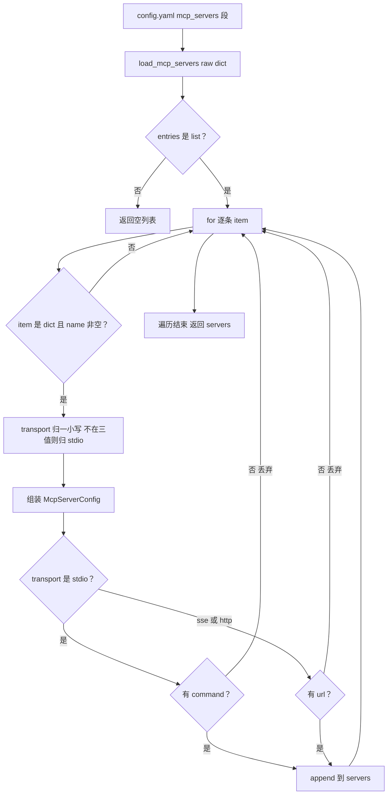

# config/mcp_config.py — mcp_config.py

> **文件路径**: `backend/packages/harness/agentflow/config/mcp_config.py`
> **目录位置**: config → mcp_config.py
> **职责**: MCP 外部服务器配置数据类 + 从 config.yaml 的 mcp_servers 段解析（M6）

## 📑 目录

- [📋 结构图](#📋-结构图)
- [📤 关键导出](#📤-关键导出)
- [💡 设计思想](#💡-设计思想)
- [🎯 实用场景](#🎯-实用场景)
- [📊 顺序执行链流程图](#📊-顺序执行链流程图)
- [🧩 代码解析（成块对照 mcp_config.py）](#🧩-代码解析成块对照-mcp_configpy)
- [❓ Q&A / 知识点](#❓-qa--知识点)
- [⚠️ 风险点](#⚠️-风险点)

## 📋 结构图

```text
┌──────────────────────────────────────────────────────────────┐
│ config.yaml 的 mcp_servers 段（list[dict]）                   │
│   - name: my-server                                          │
│     transport: stdio        # stdio | sse | http             │
│     command: npx            # stdio 必填                      │
│     args: ["-y", "@modelcontextprotocol/server-xxx"]         │
│     env: {...}              # 可选：子进程环境变量            │
│     url: ...                # sse/http 必填                   │
│     headers: {...}          # sse/http 可选                  │
│            ↓ load_mcp_servers(raw)                           │
│ McpServerConfig(name, transport, command, args, env,         │
│                 url, headers)                                 │
│   name: str（必填）                                          │
│   transport: str = "stdio"                                   │
│   command: str | None = None                                 │
│   args: list[str] = field(default_factory=list)              │
│   env: dict[str, str] = field(default_factory=dict)          │
│   url: str | None = None                                     │
│   headers: dict[str, str] = field(default_factory=dict)      │
└──────────────────────────────────────────────────────────────┘
```

## 📤 关键导出

**类**

- `McpServerConfig`（`@dataclass`，单个 MCP 服务器配置的数据类）

**函数**

- `load_mcp_servers(raw)`：从 yaml raw dict 解析出可用服务器列表（不可用条目静默丢弃）
- `_opt_str(value)`：内部工具，None/空串 → None

## 💡 设计思想

1. **配置哲学 = config.yaml 单一来源**：不学原版的 SQLite 配置表，M6 只学
   config.yaml 的 mcp_servers 段（D2 裁剪）。
2. **三传输覆盖**：stdio（本地子进程）/ sse / http（远程 URL）——
   字面量就这三种，未知 transport 归一为 stdio。
3. **缺省容错**：transport 缺省 stdio；缺 name、缺 command 的 stdio 条目、
   缺 url 的 sse/http 条目一律**静默丢弃不抛错**，与 M1 load_config
   「文件缺失不抛错」的容错哲学一致。

## 🎯 实用场景

1. **CLI 启动装配**：`mcp/tools.py.load_mcp_tools` 先调 `load_mcp_servers`
   把 config.yaml 段洗成 `list[McpServerConfig]`。
2. **远程/本地混合接入**：stdio 条目接本地 npx/uvx 子进程，sse/http 条目
   接远程 MCP 服务，统一由本数据类承载。
3. **配置体检**：写配置时不用读代码——`transport` 缺省 stdio，stdio 必带
   command，sse/http 必带 url，缺了就被丢弃且无报错。

## 📊 顺序执行链流程图

**调用方**：`load_mcp_servers` ← `mcp/tools.py.load_mcp_tools:67`；
`McpServerConfig` ← `mcp/client.py.build_server_params`。

```text
config.yaml mcp_servers 段（list[dict]）
│
▼
load_mcp_servers(raw)
  entries = (raw or {}).get("mcp_servers") or []      ← None/缺段 → []
  if not isinstance(entries, list): return []          ← 不是 list → 空
  │
  for item in entries:                                 ← 逐条过
    ├─ item 不是 dict?            → continue（丢弃）
    ├─ name 空?                   → continue（丢弃）
    ├─ transport 归一小写;不在三值内 → 归 "stdio"
    ├─ 组装 McpServerConfig(...)
    ├─ stdio 且无 command?        → continue（丢弃）← 无法起子进程
    └─ sse/http 且无 url?         → continue（丢弃）
  │
  ▼
servers: list[McpServerConfig]  → 交给 build_servers_config
```

**Mermaid 版（GitHub / 飞书渲染）**：



## 🧩 代码解析（成块对照 mcp_config.py）

> 读法：每块先贴**完整代码**，再看块下方的整块解析。代码与文件一致。

### 块 1：imports + `McpServerConfig` 数据类

```python
from __future__ import annotations

from dataclasses import dataclass, field
from typing import Any


@dataclass
class McpServerConfig:
    """单个 MCP 外部服务器配置（对应 config.yaml mcp_servers 段的一个条目）。

    字段:
        name (str):         服务器名（工具名前缀，如 mcp_my_server_xxx）
        transport (str):    传输类型 stdio/sse/http，缺省 stdio
        command (str|None): stdio 传输必填：启动子进程的命令（如 npx / uvx）
        args (list[str]):   stdio 传输：命令参数，缺省 []
        env (dict):         stdio 传输：传给子进程的额外环境变量，缺省 {}
        url (str|None):     sse/http 传输必填：服务器 URL
        headers (dict):     sse/http 传输：请求头，缺省 {}
    """

    name: str
    transport: str = "stdio"
    command: str | None = None
    args: list[str] = field(default_factory=list)
    env: dict[str, str] = field(default_factory=dict)
    url: str | None = None
    headers: dict[str, str] = field(default_factory=dict)
```

**结构简析**：标准库 `dataclass` 数据类——`name` 必填无默认，其余字段全有默认；
可变集合（args/env/headers）用 `field(default_factory=list|dict)`，避免 dataclass
可变默认值共享陷阱。docstring 明确 `name` 同时是**工具名前缀**（如 `mcp_my_server_xxx`）。

**`McpServerConfig` 字段逐条解释**：

| 字段 | 类型 | 默认值 | 含义 |
|---|---|---|---|
| `name` | `str` | 必填 | 服务器名；同时是工具名前缀（adapter 会把它拼进工具名，如 `mcp_my_server_xxx`） |
| `transport` | `str` | `"stdio"` | 传输类型三选：`stdio`（本地子进程）/ `sse` / `http`（远程 URL）；显式给非法值会被 `load_mcp_servers` 归一回 `stdio` |
| `command` | `str \| None` | `None` | 仅 stdio 用：启动子进程的命令（如 `npx` / `uvx`）；stdio 缺它整条配置被丢弃 |
| `args` | `list[str]` | `field(default_factory=list)` | 仅 stdio 用：命令参数列表（如 `["-y", "@modelcontextprotocol/server-filesystem"]`） |
| `env` | `dict[str, str]` | `field(default_factory=dict)` | 仅 stdio 用：额外传给子进程的环境变量；空 dict 默认 |
| `url` | `str \| None` | `None` | 仅 sse/http 用：服务器 URL；sse/http 缺它整条配置被丢弃 |
| `headers` | `dict[str, str]` | `field(default_factory=dict)` | 仅 sse/http 用：请求头（如鉴权头）；空 dict 默认 |

**落库要点**：本类不落 SQLite，只是内存数据类；最终随 `build_servers_config`
转成 langchain-mcp-adapters 的参数字典喂给 `MultiServerMCPClient`。

### 块 2：`load_mcp_servers` —— 从 yaml raw dict 解析

```python
def load_mcp_servers(raw: dict | None) -> list[McpServerConfig]:
    """从 yaml 的 mcp_servers 段解析出启用服务器列表。

    入参:
        raw: config.yaml 整体 dict（或其 mcp_servers 段）。None/缺段 → 空列表。

    规则:
        - 每个条目必须有非空 name；缺 name 的条目丢弃。
        - transport 缺省 stdio；显式 sse/http 时必须带 url，否则丢弃。
        - stdio 时必须带 command，否则丢弃（缺 command 的 stdio 无法启动子进程）。
        - env/headers/args 缺省为空，保留原样传给 langchain-mcp-adapters。

    返回:
        list[McpServerConfig]：可用服务器列表（可能为空）。
    """
    servers: list[McpServerConfig] = []
    entries = (raw or {}).get("mcp_servers") or []
    if not isinstance(entries, list):
        return servers
    for item in entries:
        if not isinstance(item, dict):
            continue
        name = str(item.get("name") or "").strip()
        if not name:
            continue
        transport = str(item.get("transport") or "stdio").strip().lower()
        if transport not in ("stdio", "sse", "http"):
            transport = "stdio"
        cfg = McpServerConfig(
            name=name,
            transport=transport,
            command=_opt_str(item.get("command")),
            args=[str(a) for a in (item.get("args") or [])],
            env=dict(item.get("env") or {}),
            url=_opt_str(item.get("url")),
            headers=dict(item.get("headers") or {}),
        )
        if transport == "stdio":
            if not cfg.command:
                continue  # stdio 缺 command → 不可用，丢弃
        else:
            if not cfg.url:
                continue  # sse/http 缺 url → 不可用，丢弃
        servers.append(cfg)
    return servers
```

**结构简析**：纯函数容错解析——`raw` 为 None、缺 `mcp_servers` 键、或它不是 list，
统统返回空列表；逐条校验 name/transport/必填字段，不合格 `continue` 丢弃。
全程不抛配置异常（M6 容错哲学）。

**`load_mcp_servers()` 参数逐条解释**：

| 参数 | 类型 | 默认值 | 含义 |
|---|---|---|---|
| `raw` | `dict \| None` | 必填（可传 None） | config.yaml 整体 dict 或其 `mcp_servers` 段；None/缺段/非 list → 返回 `[]` |

**落库要点**：transport 先 `strip().lower()` 归一，不在 `("stdio","sse","http")` 内强制归
`stdio`；`command`/`url` 走 `_opt_str`（空串→None）；`args` 逐元素 `str(a)`，
`env`/`headers` 浅拷贝成新 dict。最后按 transport 分支校验必填：stdio 无 command、
sse/http 无 url 都 `continue` 丢弃。

### 块 3：`_opt_str` —— 内部空值归一

```python
def _opt_str(value: Any) -> str | None:
    """None/空 → None；否则 strip 后的字符串。"""
    if value is None:
        return None
    s = str(value).strip()
    return s if s else None
```

**结构简析**：小工具——把 `None`、空串、纯空白串统一归一成 `None`，
避免配置里写 `command: ""` 被当成"有 command"。

**`_opt_str()` 参数逐条解释**：

| 参数 | 类型 | 默认值 | 含义 |
|---|---|---|---|
| `value` | `Any` | 必填 | 原始值；None 直接返回 None；否则 `str(value).strip()`，空串再归 None |

**落库要点**：仅被 `load_mcp_servers` 用于 `command`/`url` 两个可选字符串字段。

## ❓ Q&A / 知识点

### 1. McpServerConfig 三传输各自需要哪些字段？默认值是什么？

**一句话**：stdio 走 `command`+`args`+`env`，sse/http 走 `url`+`headers`；
`transport` 缺省 `"stdio"`，`args`/`env`/`headers` 缺省为空集合，`command`/`url` 缺省 `None`。

源码字段表（见块 1）：

| transport | 必填字段 | 可选字段 | 缺省行为 |
|---|---|---|---|
| `stdio`（缺省） | `command` | `args=[]`、`env={}` | 缺 command → `load_mcp_servers` 整条丢弃 |
| `sse` | `url` | `headers={}` | 缺 url → 整条丢弃 |
| `http` | `url` | `headers={}` | 缺 url → 整条丢弃 |

注意：源码里第三传输字面量就是 `http`（`if transport not in ("stdio","sse","http")`），
不是别的名字；给了非法 transport 会被归一回 `stdio`。

### 2. 配置写错了（缺 command / 缺 url）会报错吗？

**一句话**：不会——`load_mcp_servers` 静默丢弃该条目，继续处理下一条，
函数照常返回可用列表（可能少一条）。

这是刻意的容错哲学（与 M1 `load_config` 一致）：配置里某台 MCP 服务器写错，
不应该让整个 CLI 启动失败。代价是**排障时静默**——你以为配了 3 台，实际只加载 2 台，
不打日志。要确认加载结果，看 `mcp/tools.py` 里 `logger.info("Loaded %d MCP tool(s) ...")`。

### 3. name 字段除了显示，还有什么用？

**一句话**：`name` 同时是**工具名前缀**——docstring 原文
「服务器名（工具名前缀，如 mcp_my_server_xxx）」。

langchain-mcp-adapters 在把 MCP 工具转成 BaseTool 时，会按服务器名给工具名加命名空间
（避免两台服务器都有同名 `search` 工具时冲突）。本模块不自己拼前缀，只是把 `name`
原样传下去（`build_servers_config` 的 key 就是 `server_config.name`），命名空间由 adapter 完成。

### 4. 为什么 args/env/headers 要用 field(default_factory=...)？

**一句话**：dataclass 的可变默认值（`[]`/`{}`）会被所有实例共享——
用 `default_factory=list/dict` 保证每个 `McpServerConfig` 拿到独立空集合。

这是 dataclass 的硬规则：直接写 `args: list[str] = []` 会在类定义期报 ValueError，
且语义上所有实例共享同一个 list 会串数据。源码三行 `field(default_factory=...)` 正是避这个坑。

## ⚠️ 风险点

1. **配置错误静默丢弃**：缺 name / 缺 command(stdio) / 缺 url(sse|http) 都 `continue`，
   不抛错不打日志——配了不生效时先查这里。
2. **transport 归一**：拼写错（如 `STDIO`、`stdioo`）会被 `lower()`+白名单归成 `stdio`，
   远程服务器配错 transport 会被悄悄当成本地 stdio 处理。
3. **name 即工具命名空间**：两台服务器起同名 name，后者会在
   `build_servers_config` 的 dict 里覆盖前者。
4. **env 只传额外变量**：源码 `params["env"] = dict(config.env)` 是子进程环境**叠加**，
   不继承语义以 adapter 实现为准，别在这里塞 PATH 期望覆盖。

---
_2026-10-05 M6 新增：目录 + 结构图 + 流程图 + 成块代码解析（参数逐条表）+ Q&A。_
