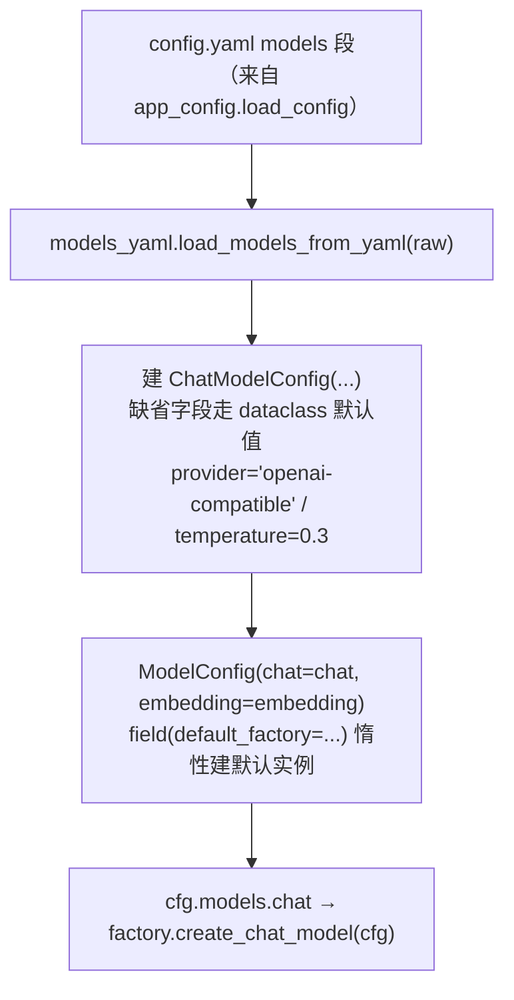

# config/model_config.py — model_config.py

> **文件路径**: `backend/packages/harness/agentflow/config/model_config.py`
> **目录位置**: config → model_config.py
> **职责**: 模型配置类型

## 📑 目录

- [📋 结构图](#📋-结构图)
- [📤 关键导出](#📤-关键导出)
- [💡 设计思想](#💡-设计思想)
- [🎯 实用场景](#🎯-实用场景)
- [📊 顺序执行链流程图](#📊-顺序执行链流程图)
- [🧩 代码解析（成块对照 model_config.py）](#🧩-代码解析成块对照-model_configpy)
- [❓ Q&A / 知识点](#❓-qa--知识点)
- [⚠️ 风险点](#⚠️-风险点)

## 📋 结构图

```text
┌──────────────────────────────────────────────┐
│ ModelConfig                                  │
│   └── chat: ChatModelConfig                  │
│         provider  : 供应商类型（分发依据）     │
│         base_url  : API 地址                  │
│         model     : 模型名                    │
│         api_key   : 密钥（支持 ${ENV}）       │
│         temperature: 采样温度                 │
└──────────────────────────────────────────────┘
```

## 📤 关键导出

**类**

- `ChatModelConfig`
- `ModelConfig`

## 💡 设计思想

1. 配置先类型化再使用：防止散落 dict 魔法键（字段对齐原版）。
2. dataclass 足够（无需 pydantic 校验，M1 保持最简）。

## 🎯 实用场景

1. 模型配置数据结构：chat 模型/provider/base_url/api_key 的字段定义
2. 环境变量展开：api_key 支持 ${ENV} 从 .env 读取，密钥不落 yaml

## 📊 顺序执行链流程图

本文件是纯类型定义（数据类），本身没有可执行逻辑；它的"执行链"发生在**被装配**时——由 models_yaml 逐字段实例化，再往下游工厂传：

```text
config.yaml 的 models 段被解析（request，来自 app_config.load_config）
│
▼
models_yaml.load_models_from_yaml(raw)   ← 唯一调用方
│
▼
建 ChatModelConfig(...)                   ← 缺省字段走 dataclass 默认值
│                                         （provider="openai-compatible" / temperature=0.3）
▼
ModelConfig(chat=chat, embedding=embedding) ← field(default_factory=...) 惰性建默认实例
│
▼
cfg.models.chat 传给 factory.create_chat_model(cfg) ← 类型化对象往下游流
```

**Mermaid 版（GitHub / 飞书渲染；VSCode 需装插件）**：



## 🧩 代码解析（成块对照 model_config.py）

> 读法：每块先贴**完整代码**，再看块下方的整块解析。代码与文件一致，仅省略头部规范注释。

### 块 1：imports —— 只依赖 dataclass

```python
from __future__ import annotations

from dataclasses import dataclass, field
```

**结构简析**：零第三方依赖——`from __future__ import annotations` 延迟注解求值（3.12 下允许类内引用自身类型）；`dataclass` 装饰器把普通类变成带 `__init__`/`__repr__` 的数据类；`field` 用于声明「惰性默认值」。

**补充**：本模块刻意不引 pydantic——M1 只要类型化容器，不要运行时校验。

### 块 2：`ChatModelConfig` —— 所有供应商共用一套字段

```python
@dataclass
class ChatModelConfig:
    """对话模型配置。

    设计说明: 所有供应商（DeepSeek / 智谱 GLM / Ollama / LM Studio）
    都走 OpenAI 兼容协议，因此同一套字段即可覆盖全部——
    factory.py 只按 provider 分发，代码不用为每家供应商单独写配置类。
    """

    provider: str = "openai-compatible"  # 供应商类型；factory 按它分发
    base_url: str = ""                   # API 地址，如 https://api.deepseek.com/v1
    model: str = ""                      # 模型名，如 deepseek-chat / glm-4.7-flash
    api_key: str = ""                    # 密钥；支持 ${ENV} 占位（models_yaml 展开）
    temperature: float = 0.3             # 采样温度：越低越确定，越高越发散
```

**结构简析**：5 个字段全部有默认值，核心设计是**一套字段覆盖全部供应商**——因为 DeepSeek/GLM/Ollama/LM Studio 都讲 OpenAI 兼容协议，区别只在 `base_url`/`model`/`api_key`，不需要每家写一个配置类。

**`ChatModelConfig` 字段逐条解释**：

| 参数 | 类型 | 默认值 | 含义 |
|---|---|---|---|
| `provider` | `str` | `"openai-compatible"` | 供应商类型；**factory 据此分发分支**（不是真去连 OpenAI） |
| `base_url` | `str` | `""` | API 地址，如 `https://api.deepseek.com/v1` |
| `model` | `str` | `""` | 模型名，如 `deepseek-chat` / `glm-4.7-flash` |
| `api_key` | `str` | `""` | 密钥；支持 `${ENV}` 占位（展开发生在上层 models_yaml，本类不感知环境变量） |
| `temperature` | `float` | `0.3` | 采样温度：越低越确定，越高越发散 |

### 块 3：`ModelConfig` —— chat / embedding 两个模型槽位

```python
@dataclass
class ModelConfig:
    """模型配置集合（M1 只有对话模型；M3 加 embedding）。"""

    chat: ChatModelConfig = field(default_factory=ChatModelConfig)
    embedding: ChatModelConfig = field(default_factory=ChatModelConfig)
```

**结构简析**：容器类只挂两个 `ChatModelConfig`——`chat`（对话模型）与 `embedding`（M3 知识库向量化模型）；embedding 复用同一个类，是因为向量化服务同样走 OpenAI 兼容协议。

**`ModelConfig` 字段逐条解释**：

| 参数 | 类型 | 默认值 | 含义 |
|---|---|---|---|
| `chat` | `ChatModelConfig` | `field(default_factory=ChatModelConfig)` | 对话模型配置；用 default_factory **惰性求值**（每次实例化才 new 一个），避免所有 ModelConfig 共享同一实例的 dataclass 经典坑 |
| `embedding` | `ChatModelConfig` | `field(default_factory=ChatModelConfig)` | embedding 向量化模型配置；装配时由 models_yaml 显式传 `temperature=0.0`（chat 默认 0.3），配置类本身不区分二者 |

## ❓ Q&A / 知识点

### 1. 为什么用 dataclass 而不是 pydantic？

**一句话**：M1 只需要"类型化的配置袋子"，不需要运行时校验——dataclass 零依赖、最轻。

| 对比 | dataclass | pydantic |
|---|---|---|
| 校验 | 无（字段是什么就是什么） | 自动类型/取值校验 |
| 依赖 | 标准库 | 第三方重依赖 |
| M1 定位 | 配置读取后由调用方（CLI）校验 api_key | 过度设计 |

校验责任被有意上移到调用方：app_config 装配后，CLI 检查 `cfg.models.chat.api_key` 是否为空，缺了就明确提示退出（见 cli/main.py）。

### 2. 为什么 embedding 也用 ChatModelConfig？

**一句话**：embedding 服务同样走 OpenAI 兼容协议，字段（base_url/model/api_key）和对话模型完全同构，没必要另建一个 EmbeddingConfig 类。区别只在默认采样温度——chat 默认 0.3，embedding 默认 0.0（在 models_yaml 装配时显式传入），配置类本身不区分二者。

## ⚠️ 风险点

1. api_key 走 ${ENV} 展开（models_yaml 处理），勿在 yaml 明文写密钥
2. 新增字段需同步 models_yaml.py 解析与 config.yaml 示例

---
_自动生成于 doc-code 规范落地（2026-09-28）。来源：model_config.py 头部注释 + 顶层符号。_
_2026-09-30 补齐：目录 + 顺序执行链流程图 + 成块代码解析（+Q&A）。_
_2026-10-03 重构：代码解析段按「结构简析 + 参数逐条表格 + 落库要点」规范化（代码块零改动）。_
