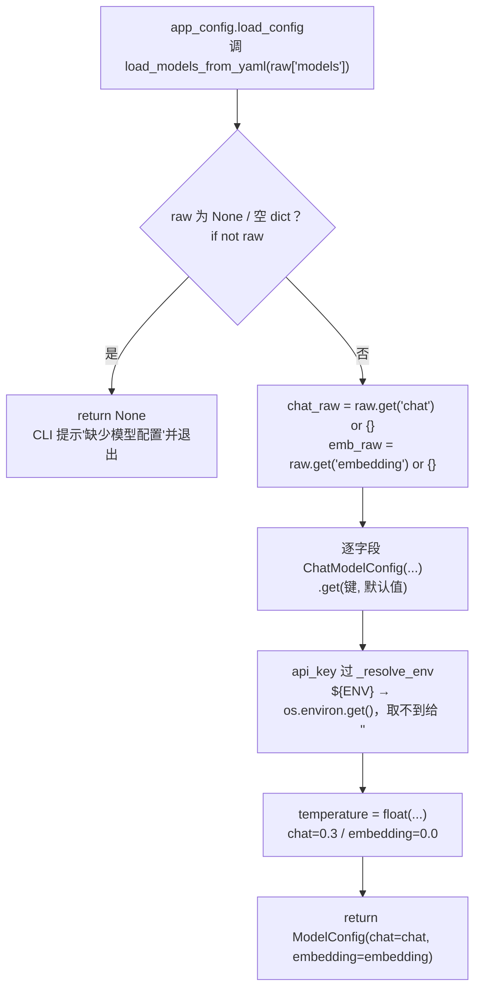

# config/models_yaml.py — models_yaml.py

> **文件路径**: `backend/packages/harness/agentflow/config/models_yaml.py`
> **目录位置**: config → models_yaml.py
> **职责**: yaml models 段解析

## 📑 目录

- [📋 结构图](#📋-结构图)
- [📤 关键导出](#📤-关键导出)
- [💡 设计思想](#💡-设计思想)
- [🎯 实用场景](#🎯-实用场景)
- [📊 顺序执行链流程图](#📊-顺序执行链流程图)
- [🧩 代码解析（成块对照 models_yaml.py）](#🧩-代码解析成块对照-models_yamlpy)
- [❓ Q&A / 知识点](#❓-qa--知识点)
- [⚠️ 风险点](#⚠️-风险点)

## 📋 结构图

```text
┌──────────────────────────────────────────────────┐
│ load_models_from_yaml(raw dict)                  │
│   raw = { "chat": { provider/base_url/model/...}}│
│   ① 无 raw → 返回 None                          │
│   ② chat 段字段逐项读取（缺省走默认）            │
│   ③ api_key 经 _resolve_env 展开 ${ENV}          │
│   ④ 返回 ModelConfig(chat=...)                  │
└──────────────────────────────────────────────────┘
```

## 📤 关键导出

**函数**

- `load_models_from_yaml()`

## 💡 设计思想

1. 密钥不落 yaml（安全）：${ENV} 由本层统一展开，读取 .env。
2. 提供"获取 config 数据"的对外方法：app_config 只调这一个函数，
   其他模块不直接碰 yaml 细节。

## 🎯 实用场景

1. YAML 加载与校验：config.yaml → 结构化配置（models 段）
2. 多 provider 支持：zhipu/deepseek/openai 兼容 OpenAI 协议

## 📊 顺序执行链流程图

```text
app_config.load_config 调 load_models_from_yaml(raw["models"])（request）
│
▼
raw 为 None / 空 dict？          ← if not raw
├─ 是 → return None             ← CLI 据此提示"缺少模型配置"并退出
└─ 否 ↓
▼
chat_raw = raw.get("chat") or {}   ← chat 段缺省兜底空 dict
emb_raw  = raw.get("embedding") or {}  ← M3 embedding 段同理
│
▼
逐字段 ChatModelConfig(...)        ← 每字段 .get(键, 默认值)
api_key 过 _resolve_env            ← ${ENV} → os.environ.get()，取不到给 ""
temperature = float(...)           ← 强制转 float（chat=0.3 / embedding=0.0）
│
▼
return ModelConfig(chat=chat, embedding=embedding)
```

**Mermaid 版（GitHub / 飞书渲染；VSCode 需装插件）**：



## 🧩 代码解析（成块对照 models_yaml.py）

> 读法：每块先贴**完整代码**，再看块下方的整块解析。代码与文件一致，仅省略头部规范注释。

### 块 1：imports —— os + 两个配置类

```python
from __future__ import annotations

import os

from agentflow.config.model_config import ChatModelConfig, ModelConfig
```

**结构简析**：只引三样——`os`（读环境变量，给 `${ENV}` 展开用）、`ChatModelConfig`/`ModelConfig`（本模块产出的类型，从 model_config 引入）。

**补充**：本模块是「yaml → 类型化对象」的翻译层，不碰文件 IO（文件读取在 app_config）、不碰校验（在 CLI）。

### 块 2：`_resolve_env` —— `${ENV}` 占位展开

```python
def _resolve_env(value: str) -> str:
    """展开 ${ENV_VAR} 占位符为环境变量值。

    设计动机: 密钥（api_key）不应明文写入 config.yaml（会进 git 泄露），
    所以配置里写 ${ZHIPU_API_KEY} 这类占位，运行时从环境/.env 取。
    非占位格式（普通字符串）原样返回。
    """
    if value.startswith("${") and value.endswith("}"):
        return os.environ.get(value[2:-1], "")
    return value
```

**结构简析**：三行核心逻辑——① 判形：`startswith("${") and endswith("}")` 才认定是占位符；② 切片 `value[2:-1]` 去掉 `${` 和 `}` 拿到变量名；③ `os.environ.get(变量名, "")` 取值，取不到给空串而不抛异常；非占位字符串原样返回。

**`_resolve_env()` 参数逐条解释**：

| 参数 | 类型 | 默认值 | 含义 |
|---|---|---|---|
| `value` | `str` | 必填 | 配置字符串；形如 `${ZHIPU_API_KEY}` 则取环境变量值，普通字符串原样返回 |

**落库要点/补充**：环境变量没配时 `os.environ.get(..., "")` 让 api_key 变成空串，把「缺 key」的暴露时机交给下游（CLI 构造 ChatOpenAI 时才抛 Missing credentials）——配置解析阶段永远不炸。

### 块 3：`load_models_from_yaml` —— 装配入口

```python
def load_models_from_yaml(raw: dict | None) -> ModelConfig | None:
    """从 config.yaml 的 models 段构建 ModelConfig。

    参数:
        raw: yaml 里的 models 段（dict），如 {"chat": {...}}；缺省传 None

    返回:
        ModelConfig | None —— 没有 models 段时返回 None（调用方需判空）
    """
    # ① 没有 models 段 → 返回 None（cli 据此提示"缺少模型配置"）
    if not raw:
        return None

    # ② 读取 chat 段（缺省给空 dict，字段再逐个兜底默认值）
    chat_raw = raw.get("chat") or {}
    # M3：embedding 段（知识库向量化；缺省空 dict 走默认值）
    emb_raw = raw.get("embedding") or {}

    # ③ 逐字段装配，api_key 走环境变量展开
    chat = ChatModelConfig(
        provider=chat_raw.get("provider", "openai-compatible"),
        base_url=chat_raw.get("base_url", ""),
        model=chat_raw.get("model", ""),
        api_key=_resolve_env(chat_raw.get("api_key", "")),
        temperature=float(chat_raw.get("temperature", 0.3)),
    )
    embedding = ChatModelConfig(
        provider=emb_raw.get("provider", "openai-compatible"),
        base_url=emb_raw.get("base_url", ""),
        model=emb_raw.get("model", ""),
        api_key=_resolve_env(emb_raw.get("api_key", "")),
        temperature=float(emb_raw.get("temperature", 0.0)),
    )
    return ModelConfig(chat=chat, embedding=embedding)
```

**结构简析**：四步——① `if not raw` 把「没配 models 段」显式转成 `None`，让 CLI 有明确提示点；② `raw.get(...) or {}` 双层兜底（段缺失/值为 None 都给空 dict）；③ chat 与 embedding 两段**同构装配**，唯一差别是 temperature 默认值（对话 0.3、embedding 0.0）；④ api_key 是唯一过 `_resolve_env` 的字段。

**`load_models_from_yaml()` 参数逐条解释**：

| 参数 | 类型 | 默认值 | 含义 |
|---|---|---|---|
| `raw` | `dict \| None` | 必填 | yaml 里的 models 段（dict），如 `{"chat": {...}}`；为 None/空 dict 时直接返回 None（调用方需判空） |

**落库要点/补充**：所有 `.get(键, 默认值)` 的默认值必须与 model_config.py 的 dataclass 默认值一致（provider=`"openai-compatible"`、base_url/model/api_key=`""`）；temperature 强制 `float(...)` 转换，chat 缺省 0.3、embedding 缺省 0.0。

## ❓ Q&A / 知识点

### 1. 为什么 `${ENV}` 展开失败不报错？

**一句话**：`os.environ.get(name, "")` 取不到环境变量时静默给空串，把"缺 key"留到构造模型时再暴露——这样解析配置阶段永远不炸。

- yaml 写 `${ZHIPU_API_KEY}` 但 `.env` 没配 → `api_key=""`
- 本函数照常返回 ModelConfig，不抛异常
- 下游 `ChatOpenAI(api_key="")` 构造时才抛 Missing credentials，由 CLI 容错打印

设计取舍：配置解析层只负责"翻译"，"密钥是否真的可用"是运行期问题。

### 2. chat 和 embedding 的 temperature 默认值为什么不一样？

**一句话**：对话需要创造性（0.3），向量化需要确定性（0.0）。

| 槽位 | 默认 temperature | 原因 |
|---|---|---|
| chat | 0.3 | 对话要一点发散，回答不死板 |
| embedding | 0.0 | 向量表征必须确定，同一句子每次向量化结果要一致 |

注意这个差异**不在 model_config.py**（那里两个槽位都用 dataclass 默认 0.3），而是在本装配层显式传 `embedding temperature=0.0` 覆盖。

## ⚠️ 风险点

1. ${ENV} 展开失败时返回原样字符串（调用方兜底，勿抛异常）
2. 字段缺省默认值与 model_config.py 的 dataclass 默认值需保持一致

---
_自动生成于 doc-code 规范落地（2026-09-28）。来源：models_yaml.py 头部注释 + 顶层符号。_
_2026-09-30 补齐：目录 + 顺序执行链流程图 + 成块代码解析（+Q&A）。_
_2026-10-03 重构：代码解析段按「结构简析 + 参数逐条表格 + 落库要点」规范化（代码块零改动）。_
