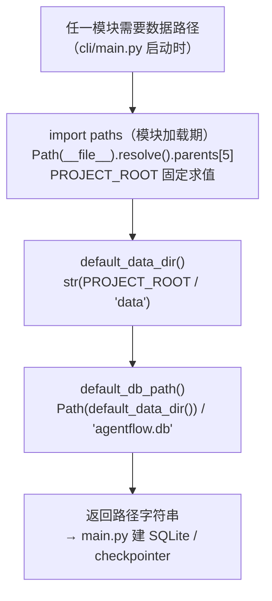

# config/paths.py — paths.py

> **文件路径**: `backend/packages/harness/agentflow/config/paths.py`
> **目录位置**: config → paths.py
> **职责**: 数据路径定位

## 📑 目录

- [📋 结构图](#📋-结构图)
- [📤 关键导出](#📤-关键导出)
- [💡 设计思想](#💡-设计思想)
- [🎯 实用场景](#🎯-实用场景)
- [📊 顺序执行链流程图](#📊-顺序执行链流程图)
- [🧩 代码解析（成块对照 paths.py）](#🧩-代码解析成块对照-pathspy)
- [❓ Q&A / 知识点](#❓-qa--知识点)
- [⚠️ 风险点](#⚠️-风险点)

## 📋 结构图

```text
┌────────────────────────────────────────────────────────┐
│ 目录层级（从本文件向上数）:                             │
│   parents[0] agentflow/config                          │
│   parents[1] agentflow                                 │
│   parents[2] harness                                   │
│   parents[3] packages                                  │
│   parents[4] backend                                   │
│   parents[5] AgentFlow  ← 项目根 (PROJECT_ROOT)         │
│                                                        │
│  default_data_dir() → 项目根/data                      │
│  default_db_path()  → 项目根/data/agentflow.db         │
└────────────────────────────────────────────────────────┘
```

## 📤 关键导出

**函数**

- `default_data_dir()`
- `default_db_path()`

**常量**

- `PROJECT_ROOT`
- `BACKEND_ROOT`

## 💡 设计思想

1. 用 __file__ 定位（而非 os.getcwd()）：保证从任何目录启动
   都能找到 data/ 与数据库，不依赖"先 cd 到项目根"（P-014 教训）。
2. 路径计算集中一处，各模块不各自拼路径。

## 🎯 实用场景

1. 路径解析唯一入口：项目根/data 目录/默认 DB 路径集中管理
2. 消除 cwd 依赖：不依赖"从哪个目录启动"（P-014 教训）

## 📊 顺序执行链流程图

```text
任一模块需要数据目录 / 数据库路径（request，如 cli/main.py 启动时）
│
▼
import paths（模块加载期）        ← Path(__file__).resolve().parents[5]
│                                  PROJECT_ROOT / BACKEND_ROOT 在此刻固定求值
▼
default_data_dir()               ← str(PROJECT_ROOT / "data")
│
▼
default_db_path()                ← Path(default_data_dir()) / "agentflow.db"
│                                  （复用上面的 data 目录，不重复拼）
▼
返回路径字符串 → main.py 建 SQLite / checkpointer
```

**Mermaid 版（GitHub / 飞书渲染；VSCode 需装插件）**：



## 🧩 代码解析（成块对照 paths.py）

> 读法：每块先贴**完整代码**，再看块下方的整块解析。代码与文件一致，仅省略头部规范注释。

### 块 1：imports + 两个根路径常量

```python
from __future__ import annotations

from pathlib import Path

# 项目根：AgentFlow/（从本文件所在位置向上 5 级）
PROJECT_ROOT = Path(__file__).resolve().parents[5]
# 后端根：backend/
BACKEND_ROOT = Path(__file__).resolve().parents[4]
```

**结构简析**：`Path(__file__).resolve()` 先把本文件自身路径转成绝对路径，再用 `.parents[N]` 向上回溯——`parents[5]` = AgentFlow 项目根（`PROJECT_ROOT`），`parents[4]` = backend/（`BACKEND_ROOT`）。

**补充**：两个常量在**模块被 import 的那一刻就固定求值**（Python 模块级代码只跑一次），之后任何调用拿到的都是同一个绝对路径，与「当前工作目录」无关——这就是 P-014 教训的解法（不从 cwd 找路径）。

### 块 2：`default_data_dir` —— 数据目录

```python
def default_data_dir() -> str:
    """数据目录：项目根/data（SQLite、日志等落盘位置）。"""
    return str(PROJECT_ROOT / "data")
```

**结构简析**：一行函数——`PROJECT_ROOT / "data"` 用 pathlib 的 `/` 运算符拼路径（自动处理斜杠），再 `str()` 转字符串返回。SQLite、日志等所有落盘物都落这个目录。

**`default_data_dir()` 参数逐条解释**：无参数，直接返回 `str(PROJECT_ROOT / "data")`。

**补充**：函数化而非常量是刻意的——保持「数据目录」概念集中在此处，未来要加环境变量覆盖只需改这里。

### 块 3：`default_db_path` —— SQLite 文件路径

```python
def default_db_path() -> str:
    """SQLite 文件路径：项目根/data/agentflow.db。"""
    return str(Path(default_data_dir()) / "agentflow.db")
```

**结构简析**：**复用** `default_data_dir()` 而不是再拼一遍 `PROJECT_ROOT / "data" / "agentflow.db"`——保证数据库永远落在数据目录里，两处定义不会漂移（改数据目录只需改块 2 一处）。pathlib 先 `Path(default_data_dir())` 把字符串转回 Path 再 `/ "agentflow.db"`，最后 str 返回。

**`default_db_path()` 参数逐条解释**：无参数，直接返回 `str(Path(default_data_dir()) / "agentflow.db")`。

## ❓ Q&A / 知识点

### 1. 为什么用 `__file__` 而不是 `os.getcwd()`？

**一句话**：`os.getcwd()` 跟着"你从哪个目录敲命令"走，`__file__` 跟着"代码文件在哪"走——后者固定。

| 做法 | 从项目根启动 | 从别的目录 `uv run` |
|---|---|---|
| `os.getcwd()/data` | 正确 | 错——拼到错误目录（P-014） |
| `Path(__file__)` 回溯 | 正确 | 仍正确——代码位置不变 |

教训：用户可能在任意目录启动 CLI，路径定位必须锚定代码文件本身。

### 2. `parents[5]` 的层级怎么数？

**一句话**：从本文件 `config/paths.py` 所在目录开始，向上 0 级起数：

- `parents[0]` = `agentflow/config`
- `parents[1]` = `agentflow`
- `parents[2]` = `harness`
- `parents[3]` = `packages`
- `parents[4]` = `backend`
- `parents[5]` = `AgentFlow`（项目根）

所以 `BACKEND_ROOT = parents[4]`、`PROJECT_ROOT = parents[5]`。整体移动 backend/ 目录层级后这个数字必须重算（风险点 1）。

## ⚠️ 风险点

1. parents[5] 依赖目录层级；整体移动 backend/ 时需重算
2. 支持环境变量覆盖（AGENTFLOW_CONFIG_PATH 等），勿删

---
_自动生成于 doc-code 规范落地（2026-09-28）。来源：paths.py 头部注释 + 顶层符号。_
_2026-09-30 补齐：目录 + 顺序执行链流程图 + 成块代码解析（+Q&A）。_
_2026-10-03 重构：代码解析段按「结构简析 + 参数逐条表格 + 落库要点」规范化（代码块零改动）。_
