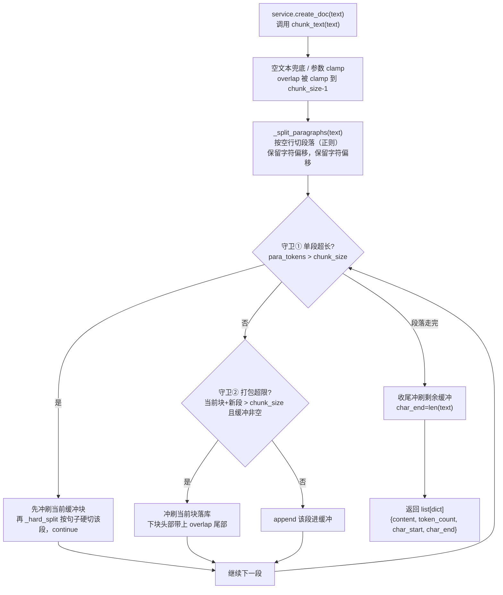

# knowledge/chunker.py — chunker.py

> **文件路径**: `backend/packages/harness/agentflow/knowledge/chunker.py`
> **目录位置**: knowledge → chunker.py
> **职责**: 文本分块（按段落切分 + 贪心打包 + 超长硬切 + overlap 上下文衔接）

## 📑 目录

- [📋 结构图](#📋-结构图)
- [📤 关键导出](#📤-关键导出)
- [💡 设计思想](#💡-设计思想)
- [🎯 实用场景](#🎯-实用场景)
- [📊 顺序执行链流程图](#📊-顺序执行链流程图)
- [🧩 代码解析（成块对照 chunker.py）](#🧩-代码解析成块对照-chunkerpy)
- [❓ Q&A / 知识点](#❓-qa--知识点)
- [⚠️ 风险点](#⚠️-风险点)

## 📋 结构图

```text
┌──────────────────────────────────────────────────────────┐
│ _count_tokens(text) → int                                 │
│   tiktoken 有则精确计数；否则 len//4 启发式              │
│                                                          │
│ chunk_text(text, chunk_size=512, overlap=50) → list[dict]│
│   ① _split_paragraphs: 按 \n\n 切段落（保留字符偏移）    │
│   ② 贪心打包段落直到 chunk_size                          │
│   ③ 单段超长 → _hard_split 按句子硬切                    │
│   ④ 新块开头带上前块 overlap 尾部（上下文衔接）          │
│   返回: {content, token_count, char_start, char_end}      │
└──────────────────────────────────────────────────────────┘
```

## 📤 关键导出

**函数**

- `chunk_text(text, chunk_size=512, overlap=50)` → `list[dict]`

**内部私有函数**

- `_count_tokens(text)`：token 计数（tiktoken 优先，len//4 兜底）
- `_split_paragraphs(text)`：按空行切段落，保留 start/end 偏移
- `_hard_split(text, chunk_size, overlap)`：单段超长按句子硬切

## 💡 设计思想

1. 分块质量决定检索质量：按段落切（语义完整）而非按字数硬切——段落是语义边界，跨段落硬切会把一句话腰斩，向量就失真。
2. overlap 保留上下文：相邻块共享前块尾部约 overlap 个字符，避免"问题横跨切缝"时漏召回。
3. token 计数启发式（len//4）避免硬依赖 tiktoken：M3 最小化依赖，没装 tiktoken 也能跑（计数仅用于切块，不影响正确性）。

## 🎯 实用场景

1. 建库第一步：任何文档导入都先过 `chunk_text` 切成可向量化的小文本单元。
2. 默认参数对齐 FastGPT text2Chunks：`chunk_size=512 token / overlap=50`，开箱即用无需调参。
3. 带字符偏移返回（char_start/char_end）：未来可回链原文位置做"引用高亮"。

## 📊 顺序执行链流程图（chunk_text 被调用时）

```text
service.create_doc(text) 调用 chunk_text(text)（request，来自 knowledge/service.py）
│
▼
空文本兜底 / 参数 clamp        ← not text.strip() → 返回 []；
│                                overlap = max(0, min(overlap, chunk_size-1))
▼
_split_paragraphs(text)        ← 按空行切段落（正则）<br/>保留字符偏移，保留每段 start/end 字符偏移
│
▼
逐段循环 · 守卫① 单段超长？（para_tokens > chunk_size）
│                              ← 命中：先冲刷当前缓冲块，再 _hard_split 该段按句子硬切，continue
▼
守卫② 打包超限？（当前块+新段 > chunk_size 且缓冲非空）
│                              ← 命中：冲刷当前块落库，下块头部带上 overlap 尾部
│                              ← 未命中：append 该段进缓冲，继续下一段
▼
收尾冲刷剩余缓冲                ← current_parts 非空 → 追加最后一块（char_end=len(text)）
│
▼
返回 list[dict]                ← 每项 {content, token_count, char_start, char_end}
```

**Mermaid 版（GitHub / 飞书渲染；VSCode 需装插件）**：



## 🧩 代码解析（成块对照 chunker.py）

> 读法：每块先贴**完整代码**，再看块下方的整块解析。代码与文件一致，仅省略头部规范注释。

### 块 1：imports + tiktoken 惰性加载 —— 可选依赖降级

```python
from __future__ import annotations

import re

# 尝试用 tiktoken 精确计数；没有则退回 len//4 启发式（M3 不硬依赖）
_tiktoken_enc = None
try:
    import tiktoken

    _tiktoken_enc = tiktoken.get_encoding("cl100k_base")
except Exception:  # noqa: BLE001, S110 —— tiktoken 未安装时降级启发式，不报错
    pass
```

**整块解析**：模块级就决定"要不要精确数 token"。`try/except` 包住 `import tiktoken` 并预取 `cl100k_base` 编码（OpenAI 的主流 BPE），成功则 `_tiktoken_enc` 非 None；失败（未安装）整个 except 吞掉，`_tiktoken_enc` 保持 None。这是典型的**可选依赖降级**：装了 tiktoken 精确切，没装也不炸（退回启发式）。`re` 用于段落与句子切分，是本模块唯一硬依赖。

### 块 2：`_count_tokens` —— 精确/估算双路

```python
def _count_tokens(text: str) -> int:
    """token 计数：tiktoken 有则精确，否则 len//4 估算（照原版）。"""
    if _tiktoken_enc is not None:
        return len(_tiktoken_enc.encode(text))
    return max(1, len(text) // 4)
```

**整块解析**：计数只有两个出口——有 encoder 就 `encode` 后取长度（精确）；否则 `len(text)//4`（粗略按 4 字符 ≈ 1 token 的英文经验）。`max(1, ...)` 兜底空串不返回 0。这个数字**只用于切块决策**，不写入向量、不影响检索正确性，所以估算误差可接受。

### 块 3：`_split_paragraphs` —— 按空行切段落并保留偏移

```python
def _split_paragraphs(text: str) -> list[dict]:
    """按空行切段落，保留每个段落的起始/结束字符偏移。"""
    paras: list[dict] = []
    start = 0
    for m in re.finditer(r"\n\s*\n", text):
        end = m.start()
        seg = text[start:end].strip()
        if seg:
            paras.append({"text": seg, "start": start, "end": end})
        start = m.end()
    tail = text[start:].strip()
    if tail:
        paras.append({"text": tail, "start": start, "end": len(text)})
    return paras
```

**整块解析**：正则 `\n\s*\n` 匹配"空行"（允许空行里有空白字符）。`finditer` 逐次给出匹配位置，循环里把 `[start:end]` 截出来 strip 后非空才收，记录原始字符偏移 `start/end`；最后一段用 `text[start:]` 收尾。**偏移保留是关键**——后续打包块时 `char_start/char_end` 能回链原文位置。

### 块 4：`_hard_split` —— 单段超长按句子硬切

```python
def _hard_split(text: str, chunk_size: int, overlap: int) -> list[dict]:
    """单段超 chunk_size 时按句子硬切（照原版思想）。"""
    sentences = re.split(r"(?<=[。！？.!?])\s*", text)
    chunks: list[dict] = []
    buf = ""
    start = 0
    for s in sentences:
        if not s:
            continue
        if _count_tokens(buf + s) > chunk_size and buf:
            chunks.append({"content": buf, "token_count": _count_tokens(buf), "char_start": start, "char_end": start + len(buf)})
            start += max(0, len(buf) - overlap * 4)
            buf = text[start : start + len(s)]
            continue
        buf += s
    if buf:
        chunks.append({"content": buf, "token_count": _count_tokens(buf), "char_start": start, "char_end": start + len(buf)})
    return chunks
```

**整块解析**：一个段落本身就超 chunk_size 时，不能整段塞进一块，于是退一步按**句子**切（正则 `(?<=[。！？.!?])` 向后断言保留中英文句末标点）。缓冲 `buf` 逐句累加，一旦 `buf+s` 超限就把 buf 落成一块；下一块起点用 `start += max(0, len(buf) - overlap*4)` 回退约 overlap 字符做衔接。`overlap*4` 是把 overlap（按 token 计）粗略换算回字符（1 token ≈ 4 字符）。

### 块 5：`chunk_text` 主函数 —— 贪心打包 + overlap 衔接

```python
def chunk_text(
    text: str,
    chunk_size: int = 512,
    overlap: int = 50,
) -> list[dict]:
    """把文本切成带重叠的分块（照原版：尊重段落边界）。

    返回每个分块含: content / token_count / char_start / char_end。
    """
    if not text or not text.strip():
        return []
    chunk_size = max(1, chunk_size)
    overlap = max(0, min(overlap, chunk_size - 1))

    paragraphs = _split_paragraphs(text)
    if not paragraphs:
        return []

    chunks: list[dict] = []
    current_parts: list[str] = []
    current_tokens = 0
    current_start = paragraphs[0]["start"]
    overlap_text = ""

    for para in paragraphs:
        para_text = para["text"]
        para_tokens = _count_tokens(para_text)

        # 单段超长：先冲刷当前缓冲，再硬切该段
        if para_tokens > chunk_size:
            if current_parts:
                chunks.append(
                    {"content": "\n".join(current_parts), "token_count": current_tokens,
                     "char_start": current_start, "char_end": para["start"]}
                )
                current_parts = []
                current_tokens = 0
                overlap_text = chunks[-1]["content"][-(overlap * 4):] if overlap > 0 else ""
            sub = _hard_split(para_text, chunk_size, overlap)
            chunks.extend(sub)  # 合并硬切出的分块（性能：一次性 extend）
            if chunks and overlap > 0:
                overlap_text = chunks[-1]["content"][-(overlap * 4):]
            continue

        # 加这段会超 chunk_size → 冲刷当前块，下一块带上 overlap
        if current_tokens + para_tokens > chunk_size and current_parts:
            chunks.append(
                {"content": "\n".join(current_parts), "token_count": current_tokens,
                 "char_start": current_start, "char_end": para["start"]}
            )
            current_parts = []
            current_tokens = 0
            if overlap > 0 and overlap_text:
                current_parts.append(overlap_text)
                current_tokens = _count_tokens(overlap_text)
            current_start = para["start"]

        current_parts.append(para_text)
        current_tokens += para_tokens

    # 收尾：冲刷剩余缓冲
    if current_parts:
        chunks.append(
            {"content": "\n".join(current_parts), "token_count": current_tokens,
             "char_start": current_start, "char_end": len(text)}
        )
    return chunks
```

**整块解析**：对外唯一入口。核心是一个"段落缓冲 + 两个冲刷分支"的状态机：

| 分支 | 触发条件 | 动作 |
|---|---|---|
| 单段超长 | `para_tokens > chunk_size` | 先冲刷当前缓冲，再 `_hard_split` 该段，extend 进结果 |
| 打包超限 | `current_tokens + para_tokens > chunk_size` 且缓冲非空 | 冲刷当前块；下一块头部预挂 `overlap_text`（前块尾部约 overlap×4 字符） |
| 正常累加 | 否则 | 段落 append 进 `current_parts` |

overlap 的实现是"显式把前块尾部文本塞进下块开头"（`current_parts.append(overlap_text)`），而不是切完再去重——简单直接，代价是相邻块内容有少量重复。参数 clamp 保证 `overlap < chunk_size`。

## ❓ Q&A / 知识点

### 为什么按段落切，而不是按固定字数硬切？

**一句话**：段落是语义边界，按段落切能保住一句话/一个论点的完整性；按字数硬切会把句子腰斩，向量表达就残缺。

向量检索的质量取决于"每块是不是一个语义自洽的单元"。`_split_paragraphs` 用空行 `\n\s*\n` 切，天然尊重作者的段落结构；只有当**单个段落本身**超长时，才退一步按句子（`。！？.!?`）硬切。这是"先语义、后兜底"的两级降级。

### overlap 是怎么实现的？为什么是 `overlap * 4`？

**一句话**：overlap 不是切完后去重，而是**冲刷一块后，显式把前块尾部约 `overlap*4` 个字符塞进下块开头**；`*4` 是"1 token ≈ 4 字符"的粗略换算（与 `_count_tokens` 的 len//4 启发式同源）。

因为 overlap 参数按 token 计（默认 50），而缓冲里存的是字符串，所以要用 `overlap * 4` 估出对应的字符数取尾部。注意：这只是启发式换算，没装 tiktoken 时切块粒度本身就是估算的，overlap 同样是估算量级。

## ⚠️ 风险点

1. chunk_size/overlap 调参直接影响检索召回粒度，勿随意改（512/50 对齐 FastGPT）。
2. overlap 不能 ≥ chunk_size（实现里已 clamp 到 `chunk_size-1`）。
3. tiktoken 未装时 token 数是估算值（仅用于切块，不影响正确性）。
4. 当前唯一调用方是 `knowledge/service.py` 的 `create_doc`；建库脚本未接线前，本模块只在内部被触发。

---
_2026-09-30 新建：M3 文档（目录 + 流程图 + 成块代码解析 + Q&A）。_
