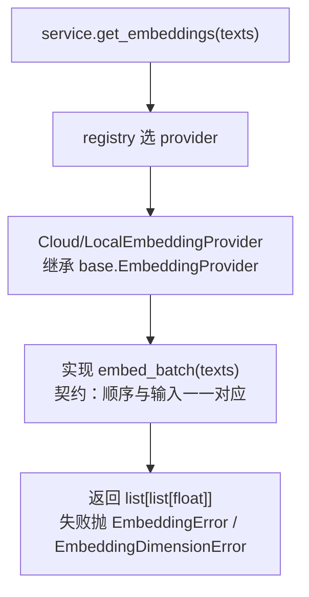

# knowledge/embedding/base.py — base.py

> **文件路径**: `backend/packages/harness/agentflow/knowledge/embedding/base.py`
> **目录位置**: knowledge → embedding → base.py
> **职责**: embedding 抽象基类 + 常量 + 异常类型（接口定义层）

## 📑 目录

- [📋 结构图](#📋-结构图)
- [📤 关键导出](#📤-关键导出)
- [💡 设计思想](#💡-设计思想)
- [🎯 实用场景](#🎯-实用场景)
- [📊 顺序执行链流程图](#📊-顺序执行链流程图)
- [🧩 代码解析（成块对照 base.py）](#🧩-代码解析成块对照-basepy)
- [❓ Q&A / 知识点](#❓-qa--知识点)
- [⚠️ 风险点](#⚠️-风险点)

## 📋 结构图

```text
┌──────────────────────────────────────────────────────┐
│ 常量:                                                │
│   DEFAULT_EMBEDDING_MODEL = "text-embedding-3-small" │
│   DEFAULT_EMBEDDING_DIM = 1536                       │
│   MAX_BATCH_SIZE = 100                               │
│                                                      │
│ 异常:                                                │
│   EmbeddingError(Exception)                          │
│   EmbeddingDimensionError(EmbeddingError)             │
│                                                      │
│ 抽象基类:                                            │
│   EmbeddingProvider                                   │
│     model_name: str = DEFAULT_EMBEDDING_MODEL        │
│     embed_batch(texts) -> list[list[float]]  ← 抽象   │
└──────────────────────────────────────────────────────┘
        ▲
        │ 被 knowledge/embedding/registry.py 继承/引用
        │   CloudEmbeddingProvider(EmbeddingProvider)
        │   LocalEmbeddingProvider(EmbeddingProvider)
```

## 📤 关键导出

**类（抽象/异常）**

- `EmbeddingProvider`：向量模型抽象基类
- `EmbeddingError`：向量化后端错误基异常
- `EmbeddingDimensionError`：维度不匹配异常（继承 `EmbeddingError`）

**常量**

- `DEFAULT_EMBEDDING_MODEL = "text-embedding-3-small"`
- `DEFAULT_EMBEDDING_DIM = 1536`
- `MAX_BATCH_SIZE = 100`

## 💡 设计思想

1. 抽象接口先行：云端/本地 provider 只实现 `embed_batch`，上层（registry/service）不感知供应商差异——这是"面向接口编程"，换供应商不改上层。
2. 异常类型先行：维度不匹配、网络/鉴权失败各有专属异常，便于调用方（service/CLI）区分处理与友好提示。
3. 常量集中兜底：默认模型名/维度/批大小定义在基类模块，registry 与 service 共享同一组默认值，避免散落魔法字符串。

## 🎯 实用场景

1. 定义"向量后端长什么样"：任何新供应商（本地模型/云 API）只要继承 `EmbeddingProvider` 实现 `embed_batch` 即可接入。
2. 异常分类捕获：service 层 `search` 用 `except Exception` 兜检索失败，registry 层把网络/鉴权错误统一包成 `EmbeddingError`。
3. 默认维度兜底：`detect_embedding_dim` 探不到维度时回退 `DEFAULT_EMBEDDING_DIM`。

## 📊 顺序执行链流程图

本文件是纯接口/常量定义，**本身没有可执行逻辑**；它的"执行链"发生在被实现与被调用时：

```text
registry.py 需要一个向量后端（request，来自 knowledge/service.py 的 get_embeddings）
│
▼
registry 定义 Cloud/LocalEmbeddingProvider(EmbeddingProvider)  ← 继承本文件基类
│
▼
子类实现 embed_batch(texts)        ← 契约：输入顺序与输出一一对应
│
▼
调用方拿到 list[list[float]]      ← 失败时抛 EmbeddingError / EmbeddingDimensionError
```

**Mermaid 版（GitHub / 飞书渲染；VSCode 需装插件）**：



## 🧩 代码解析（成块对照 base.py）

> 读法：每块先贴**完整代码**，再看块下方的整块解析。代码与文件一致，仅省略头部规范注释。

### 块 1：常量 —— 默认模型/维度/批大小

```python
from __future__ import annotations

# 默认向量模型（OpenAI 兼容命名；M3 未配置时的兜底）
DEFAULT_EMBEDDING_MODEL = "text-embedding-3-small"
DEFAULT_EMBEDDING_DIM = 1536

# 单次批量向量化最大条数（照原版）
MAX_BATCH_SIZE = 100
```

**整块解析**：三个常量是"未配置时的兜底基准"。`DEFAULT_EMBEDDING_MODEL` 是 OpenAI 兼容命名，`DEFAULT_EMBEDDING_DIM=1536` 正是该模型的输出维度（二者配套）；`MAX_BATCH_SIZE=100` 标注单次批量上限。它们集中定义在这里，registry 的 `_resolve_provider`/`detect_embedding_dim` 在 cfg 为空时都回退到这组值。

### 块 2：异常类型 —— 两级错误体系

```python
class EmbeddingError(Exception):
    """向量化后端错误（网络/鉴权/本地加载失败）。"""


class EmbeddingDimensionError(EmbeddingError):
    """向量维度与预期不符。"""
```

**整块解析**：两级异常树——`EmbeddingError` 是所有向量化错误的根（网络/鉴权/本地加载失败），`EmbeddingDimensionError` 继承它专管"维度不符"。调用方可以 `except EmbeddingError` 一把兜住全部向量化故障，也可以单独 catch 维度错误做更精细处理。注意 registry 里目前并未真正 raise `EmbeddingDimensionError`，但异常类型已预留。

### 块 3：`EmbeddingProvider` 抽象基类 —— 唯一接口 `embed_batch`

```python
class EmbeddingProvider:
    """向量模型抽象基类（云端/本地各自实现 embed_batch）。"""

    model_name: str = DEFAULT_EMBEDDING_MODEL

    def embed_batch(self, texts: list[str]) -> list[list[float]]:
        """批量向量化（顺序与输入一致）。

        返回: texts 等长的向量列表。
        """
        raise NotImplementedError
```

**整块解析**：基类不做抽象基类装饰器（没有 ABCMeta/abstractmethod），而是用"默认 `raise NotImplementedError`"的轻量做法约束子类。它只暴露一件事：`embed_batch(texts) -> list[list[float]]`，契约有二——① 返回长度与输入等长；② **第 i 个输出对应第 i 个输入**（下游按 index 对齐）。`model_name` 是类属性默认值，子类 `__init__` 里会用 cfg.model 覆盖。registry 里的 Cloud/Local 两个 provider 就是这个接口的两个具体实现。

## ❓ Q&A / 知识点

### 为什么基类不用 ABCMeta / abstractmethod？

**一句话**：M3 保持最轻量——用普通基类 + `raise NotImplementedError` 达到同样的"必须覆写"约束，零额外开销。

子类不实现 `embed_batch` 时，一旦调用就抛 `NotImplementedError`，效果等价于抽象方法；区别只是编译期不强制（实例化不报错，调用才报错）。对 M3 这种只有两个已知子类、且都在同仓库实现的场景，够用。

### base.py 与 registry.py 是什么关系？

**一句话**：base.py **定义接口**（`EmbeddingProvider` 长什么样、有哪些异常、默认常量），registry.py **实现并选择**这个接口（`Cloud/LocalEmbeddingProvider` 继承基类，`_resolve_provider` 按配置挑一个）。base 不知道 registry 的存在；registry import base。

## ⚠️ 风险点

1. `embed_batch` 必须保持输入顺序与输出一一对应（下游按 index 对齐，registry 里靠按 `index` 排序兜底）。
2. 维度校验统一抛 `EmbeddingDimensionError`，勿静默截断或补零。
3. 本文件只定义接口，真正的 HTTP 调用在 registry.py；改接口会同时影响两个 provider。

---
_2026-09-30 新建：M3 文档（目录 + 流程图 + 成块代码解析 + Q&A）。_
