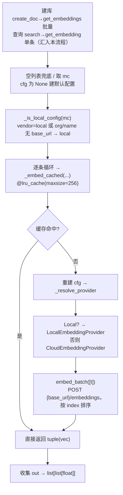

# knowledge/embedding/registry.py — registry.py

> **文件路径**: `backend/packages/harness/agentflow/knowledge/embedding/registry.py`
> **目录位置**: knowledge → embedding → registry.py
> **职责**: 向量模型注册与公共 API（云端/本地 provider 选择 + LRU 缓存 + 维度探测）

## 📑 目录

- [📋 结构图](#📋-结构图)
- [📤 关键导出](#📤-关键导出)
- [💡 设计思想](#💡-设计思想)
- [🎯 实用场景](#🎯-实用场景)
- [📊 顺序执行链流程图](#📊-顺序执行链流程图)
- [🧩 代码解析（成块对照 registry.py）](#🧩-代码解析成块对照-registrypy)
- [❓ Q&A / 知识点](#❓-qa--知识点)
- [⚠️ 风险点](#⚠️-风险点)

## 📋 结构图

```text
┌──────────────────────────────────────────────────────────┐
│ _KNOWN_DIMS: dict[str,int]   已知模型→维度表             │
│   known_embedding_dim(model_id) → int|None  查表         │
│                                                          │
│ _is_local_config(cfg) → bool                             │
│   vendor=="local" 或 模型id含"/"且无 base_url → 本地      │
│                                                          │
│ CloudEmbeddingProvider(EmbeddingProvider)                │
│   embed_batch → POST {base_url}/embeddings               │
│ LocalEmbeddingProvider(EmbeddingProvider)               │
│   委托 CloudEmbeddingProvider（同协议，只换 base_url）   │
│                                                          │
│ _resolve_provider(cfg) → EmbeddingProvider  按配置选实现 │
│                                                          │
│ _embed_cached(...)  @lru_cache(maxsize=256)  单条缓存    │
│ get_embeddings(texts, cfg) → list[list[float]]  公共API  │
│ get_embedding(text, cfg) → list[float]        单条入口   │
│ detect_embedding_dim(cfg, fallback) → int   已知表→探针→兜底│
└──────────────────────────────────────────────────────────┘
```

## 📤 关键导出

**函数（公共 API）**

- `get_embedding(text, cfg=None)` → `list[float]`
- `get_embeddings(texts, cfg=None)` → `list[list[float]]`
- `known_embedding_dim(model_id)` → `int | None`
- `detect_embedding_dim(cfg=None, *, fallback=DEFAULT_EMBEDDING_DIM)` → `int`

**类（两个后端 provider）**

- `CloudEmbeddingProvider`
- `LocalEmbeddingProvider`

**内部私有函数**

- `_is_local_config(cfg)`：判断是否走本地
- `_resolve_provider(cfg)`：按配置选 provider
- `_embed_cached(...)`：`@lru_cache` 单条向量化缓存

## 💡 设计思想

1. 配置驱动切换：云端/本地只改 config.yaml 的 embedding 段，代码零改动。判定规则照原版——`vendor=="local"` 或模型 id 是 `org/name` 形态且无 base_url 即本地。
2. 全走 OpenAI 兼容协议：云端和本地（LM Studio/Ollama）都是 `POST {base_url}/embeddings`，所以 `LocalEmbeddingProvider` 直接委托 `CloudEmbeddingProvider`，一个实现通吃。
3. LRU 缓存：`_embed_cached` 用 `@lru_cache(maxsize=256)`，同文本同模型不重复调后端（省 token/时间）；缓存 key 含模型名，换模型自动失效。

## 🎯 实用场景

1. 知识库建库与检索的向量化：service.py 导入文档批量向量化（`get_embeddings`）、查询时单条向量化（`get_embedding`）。
2. 维度探测：建库前 `detect_embedding_dim` 确定向量维度（已知表命中则免探针调用）。
3. 本地调试：把 embedding 段 provider 设 `local` 或模型填 `bge-m3`，base_url 指向 LM Studio，即切本地向量化。

## 📊 顺序执行链流程图（get_embeddings 被调用时）

```text
建库 service.create_doc 调 get_embeddings(texts, cfg) 批量；查询 service.search 调 get_embedding(query, cfg) 单条（request，来自 knowledge/service.py；二者最终都汇入下面的 get_embeddings 流程）
│
▼
空列表兜底 / 取 mc            ← cfg 为 None 时建默认 ChatModelConfig
│
▼
_is_local_config(mc) 判定     ← vendor=="local" 或 模型含"/"且无 base_url → kind="local"
│
▼
逐条 t 循环 → _embed_cached(t, model, base_url, api_key, kind)
│                            ← @lru_cache(maxsize=256)：命中缓存直接返回 tuple(vec)
▼
缓存未命中 → 重建 ChatModelConfig → _resolve_provider(cfg)
│                            ← _is_local_config 为真 → Local，否则 Cloud
▼
provider.embed_batch([t])    ← Cloud: POST {base_url}/embeddings
│                            {"model":..., "input":[t]}；按 index 排序对齐
▼
返回 tuple(vec) → list(cached) 收集成 out
│
▼
返回 list[list[float]]       ← 交给 service 落库 / 算余弦
```

**Mermaid 版（GitHub / 飞书渲染；VSCode 需装插件）**：



## 🧩 代码解析（成块对照 registry.py）

> 读法：每块先贴**完整代码**，再看块下方的整块解析。代码与文件一致，仅省略头部规范注释。

### 块 1：imports + `_KNOWN_DIMS` 维度表 —— 免探针的已知表

```python
from __future__ import annotations

from functools import lru_cache

from agentflow.config.model_config import ChatModelConfig
from agentflow.knowledge.embedding.base import (
    DEFAULT_EMBEDDING_DIM,
    DEFAULT_EMBEDDING_MODEL,
    EmbeddingError,
    EmbeddingProvider,
)

# 已知模型 → 维度表（照原版；新模型在此追加，避免探针调用）
_KNOWN_DIMS: dict[str, int] = {
    # 云端（OpenAI 兼容）
    "text-embedding-3-small": 1536,
    "text-embedding-3-large": 3072,
    "text-embedding-ada-002": 1536,
    # 智谱
    "embedding-3": 2048,
    "embedding-2": 1024,
    # 本地（BGE 系列）
    "baai/bge-small-zh-v1.5": 512,
    "baai/bge-base-zh-v1.5": 768,
    "baai/bge-large-zh-v1.5": 1024,
    "baai/bge-m3": 1024,
    "bge-small-zh-v1.5": 512,
    "bge-base-zh-v1.5": 768,
    "bge-large-zh-v1.5": 1024,
    "bge-m3": 1024,
}
```

**整块解析**：从 base.py 只拿四个符号（两个默认常量、异常、基类）。`_KNOWN_DIMS` 是手工维护的"模型名 → 维度"查表，覆盖云端 OpenAI 系、智谱、本地 BGE 系列（带/不带 `baai/` 前缀两形态都列了）。它的价值是**避免探针调用**：已知模型直接查表拿维度，不用真发一次请求去量向量长度。

### 块 2：`known_embedding_dim` + `_is_local_config` —— 查表与本地判定

```python
def known_embedding_dim(model_id: str) -> int | None:
    """查已知维度表（大小写不敏感）；未知返回 None。"""
    if not model_id:
        return None
    return _KNOWN_DIMS.get(model_id.strip().lower())


def _is_local_config(cfg: ChatModelConfig) -> bool:
    """判断该配置是否走本地 provider（照原版规则）。"""
    vendor = (cfg.provider or "").strip().lower()
    if vendor == "local":
        return True
    model_id = (cfg.model or "").strip()
    base_url = (cfg.base_url or "").strip()
    # HF repo 形态（org/name 且无 base_url）→ 本地
    return "/" in model_id and not base_url and not model_id.startswith(("http://", "https://"))
```

**整块解析**：两个纯判定函数。`known_embedding_dim` 做 strip+lower 后查表，未知返回 None（让上层走探针）。`_is_local_config` 是"云端/本地"分流的核心规则：① provider 字面等于 `local` → 本地；② 否则看模型 id 形态——含 `/`（如 `baai/bge-m3`）、且没配 base_url、且不是 http(s) 开头，就当作 HF repo 形态走本地。三条同时成立才算本地。

### 块 3：`CloudEmbeddingProvider` —— OpenAI 兼容 /embeddings 实现

```python
class CloudEmbeddingProvider(EmbeddingProvider):
    """云端向量化（OpenAI 兼容 /embeddings 协议）。"""

    def __init__(self, cfg: ChatModelConfig) -> None:
        self.cfg = cfg
        self.model_name = (cfg.model or DEFAULT_EMBEDDING_MODEL).strip() or DEFAULT_EMBEDDING_MODEL

    def embed_batch(self, texts: list[str]) -> list[list[float]]:
        if not texts:
            return []
        try:
            import requests
        except ImportError as exc:
            raise EmbeddingError("requests 未安装，无法向量化") from exc

        url = f"{self.cfg.base_url.rstrip('/')}/embeddings"
        headers = {"Authorization": f"Bearer {self.cfg.api_key}"}
        try:
            resp = requests.post(
                url, headers=headers, json={"model": self.model_name, "input": texts}, timeout=60
            )
            resp.raise_for_status()
            data = resp.json().get("data") or []
            # 按 index 排序，保证与输入顺序一致
            ordered = sorted(data, key=lambda d: int(d.get("index", 0)))
            vecs = [d["embedding"] for d in ordered]
            if len(vecs) != len(texts):
                raise EmbeddingError(f"向量化返回 {len(vecs)} 条，期望 {len(texts)} 条")
            return vecs
        except EmbeddingError:
            raise
        except Exception as exc:  # 网络/鉴权/格式错误统一包装为 EmbeddingError
            raise EmbeddingError(f"云端向量化失败: {type(exc).__name__}: {str(exc)[:200]}") from exc
```

**整块解析**：这是 `EmbeddingProvider` 接口的云端实现。要点：① `requests` 在函数内延迟 import，没装就抛 `EmbeddingError`；② 请求体是标准 OpenAI 兼容 `{"model":..., "input": texts}`，URL 拼 `{base_url}/embeddings`；③ **按 `index` 字段排序**保证输出与输入顺序对齐（base.py 接口契约）；④ 返回条数与输入不符即抛错；⑤ 网络/鉴权/格式异常统一包装成 `EmbeddingError`（`except EmbeddingError: raise` 先放行已包装的，避免二次包装）。

### 块 4：`LocalEmbeddingProvider` + `_resolve_provider` —— 本地实现与选择器

```python
class LocalEmbeddingProvider(EmbeddingProvider):
    """本地向量化（LM Studio / Ollama，同一 OpenAI 兼容协议）。"""

    def __init__(self, cfg: ChatModelConfig) -> None:
        self.cfg = cfg
        self.model_name = (cfg.model or DEFAULT_EMBEDDING_MODEL).strip() or DEFAULT_EMBEDDING_MODEL

    def embed_batch(self, texts: list[str]) -> list[list[float]]:
        # 协议与云端完全一致，只换 base_url/api_key（api_key 本地通常随意填）
        return CloudEmbeddingProvider(self.cfg).embed_batch(texts)


def _resolve_provider(cfg: ChatModelConfig | None) -> EmbeddingProvider:
    """按配置选 provider（云端/本地）。"""
    mc = cfg or ChatModelConfig(
        provider="openai", model=DEFAULT_EMBEDDING_MODEL, base_url="", api_key=""
    )
    if _is_local_config(mc):
        return LocalEmbeddingProvider(mc)
    return CloudEmbeddingProvider(mc)
```

**整块解析**：`LocalEmbeddingProvider` 几乎是空壳——因为 LM Studio/Ollama 也讲 OpenAI 兼容协议，`embed_batch` 直接委托 `CloudEmbeddingProvider(self.cfg).embed_batch(texts)`，只靠 cfg 里的 base_url/api_key 区分本地远端。`_resolve_provider` 是工厂：cfg 为空时建一个默认 openai 配置，再用 `_is_local_config` 决定返回 Local 还是 Cloud。这就是"注册表/选择器"角色——上层只拿 `EmbeddingProvider`，不关心背后是云是本地。

### 块 5：`_embed_cached` —— LRU 缓存的单条向量化

```python
@lru_cache(maxsize=256)
def _embed_cached(text: str, model_name: str, base_url: str, api_key: str, provider_kind: str) -> tuple[float, ...]:
    """单条文本向量化（LRU 缓存：同文本同模型不重复调后端）。"""
    cfg = ChatModelConfig(
        provider="local" if provider_kind == "local" else "openai",
        base_url=base_url, model=model_name, api_key=api_key,
    )
    vec = _resolve_provider(cfg).embed_batch([text])[0]
    return tuple(vec)
```

**整块解析**：`@lru_cache(maxsize=256)` 把缓存 key 显式做成 5 个标量参数（text/model/base_url/api_key/provider_kind）——**不能直接用 cfg 对象做 key**（不可哈希/不稳定），所以拆成标量。返回 `tuple[float,...]` 也是为了可哈希。缓存命中时完全不发 HTTP。注意 key 含 model_name/base_url，换模型或换端点后缓存自然失效（key 变了）。

### 块 6：`get_embeddings` / `get_embedding` —— 公共入口

```python
def get_embeddings(texts: list[str], cfg: ChatModelConfig | None = None) -> list[list[float]]:
    """批量向量化（缓存感知：已缓存的文本不重复调用）。"""
    if not texts:
        return []
    mc = cfg or ChatModelConfig(
        provider="openai", model=DEFAULT_EMBEDDING_MODEL, base_url="", api_key=""
    )
    kind = "local" if _is_local_config(mc) else "cloud"
    out: list[list[float]] = []
    for t in texts:
        cached = _embed_cached(t, mc.model, mc.base_url, mc.api_key, kind)
        out.append(list(cached))
    return out


def get_embedding(text: str, cfg: ChatModelConfig | None = None) -> list[float]:
    """单条向量化（公共入口）。"""
    return get_embeddings([text], cfg)[0]
```

**整块解析**：对外两个入口。`get_embeddings` 先判空、再算一次 `kind`（local/cloud），然后**逐条**走 `_embed_cached`（批量里每条单独缓存，命中即省一次请求）。`get_embedding` 是单条便捷包装——复用 `get_embeddings([text])[0]`。service.py 建库用 `get_embeddings`，查询用 `get_embedding`。

### 块 7：`detect_embedding_dim` —— 已知表 → 探针 → 兜底

```python
def detect_embedding_dim(
    cfg: ChatModelConfig | None = None,
    *,
    fallback: int = DEFAULT_EMBEDDING_DIM,
) -> int:
    """探测向量维度：已知表 → 探针调用 → 兜底（照原版）。"""
    mc = cfg or ChatModelConfig(
        provider="openai", model=DEFAULT_EMBEDDING_MODEL, base_url="", api_key=""
    )
    known = known_embedding_dim(mc.model)
    if known is not None:
        return known
    try:
        vec = get_embedding("dimension probe", mc)
        if vec:
            return len(vec)
    except EmbeddingError:
        pass
    return fallback
```

**整块解析**：维度探测三级降级——① `known_embedding_dim` 查表命中直接返回（零请求）；② 没命中就发一次探针请求 `"dimension probe"`，量 `len(vec)`；③ 探针也失败（EmbeddingError）就回退 `fallback`（默认 1536）。`*, fallback=` 关键字-only 参数强制调用方显式传兜底值。当前 service.py 未直接调用本函数，但它是建库前确定维度的标准入口。

## ❓ Q&A / 知识点

### LocalEmbeddingProvider 为什么不自己发请求？

**一句话**：LM Studio / Ollama 都讲 OpenAI 兼容协议，`/embeddings` 请求格式与云端完全一致，所以本地实现直接委托 `CloudEmbeddingProvider`，只靠 cfg 的 base_url/api_key 指向本地端口——一个 HTTP 实现通吃云与本地。

这也是"全走 OpenAI 兼容协议"设计思想的直接结果：如果本地后端协议不同，Local 就必须重写 `embed_batch`；现在省了一份代码。

### 为什么 `_embed_cached` 要拆成 5 个标量参数，而不是直接传 cfg？

**一句话**：`functools.lru_cache` 要求所有参数**可哈希**；`ChatModelConfig` 是 dataclass 实例，且为了缓存 key 稳定，作者显式拆成 text/model/base_url/api_key/provider_kind 五个标量，返回值也转成 `tuple`（list 不可哈希）。

副作用：缓存 key 绑定 (文本, 模型, 端点, 供应商类型)——同文本换模型/换端点是不同 key，缓存自动隔离，不会串维度。

## ⚠️ 风险点

1. 维度一致性是检索正确性前提：建库与查询必须同一模型同一维度。
2. 缓存 key = (文本, 模型名, base_url, api_key, provider_kind)；换模型后缓存自然失效，但 maxsize=256 有上限，冷启动会重复请求。
3. 后端失败统一抛 `EmbeddingError`；调用方（service/CLI）负责友好提示（service.search 已 try 兜成提示文本）。
4. `requests` 是函数内延迟 import，未安装时才报错——部署环境需确保 requests 可用。

---
_2026-09-30 新建：M3 文档（目录 + 流程图 + 成块代码解析 + Q&A）。_
