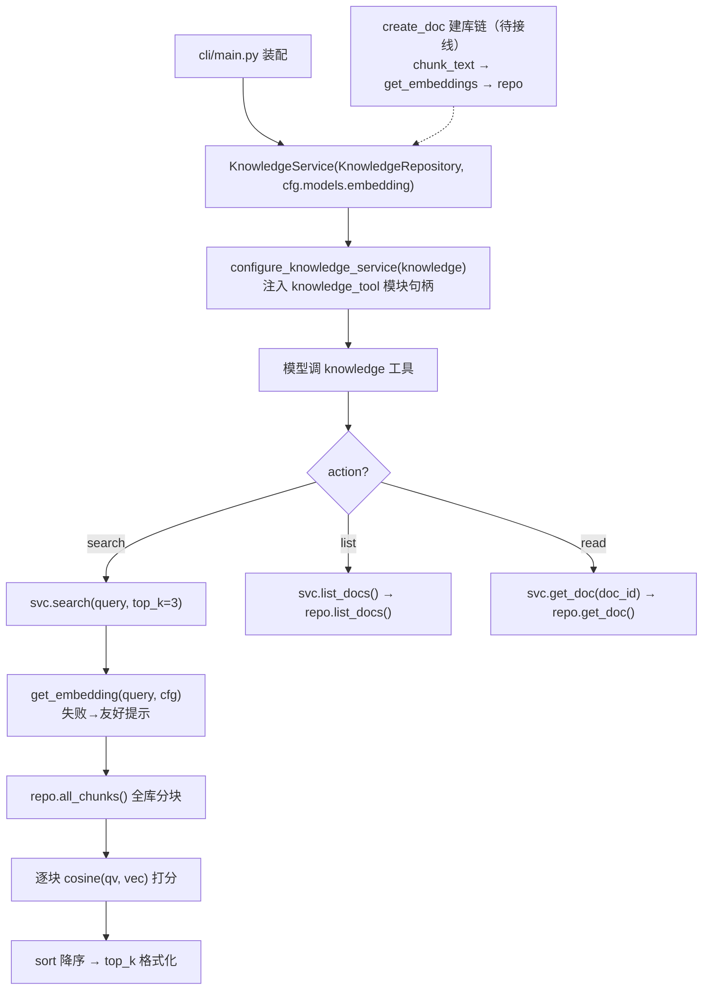

# knowledge/service.py — service.py

> **文件路径**: `backend/packages/harness/agentflow/knowledge/service.py`
> **目录位置**: knowledge → service.py
> **职责**: 知识库总入口（建库：导入→分块→向量化→落库；检索：query→向量→余弦→top_k）

## 📑 目录

- [📋 结构图](#📋-结构图)
- [📤 关键导出](#📤-关键导出)
- [💡 设计思想](#💡-设计思想)
- [🎯 实用场景](#🎯-实用场景)
- [📊 顺序执行链流程图](#📊-顺序执行链流程图)
- [🧩 代码解析（成块对照 service.py）](#🧩-代码解析成块对照-servicepy)
- [❓ Q&A / 知识点](#❓-qa--知识点)
- [⚠️ 风险点](#⚠️-风险点)

## 📋 结构图

```text
┌──────────────────────────────────────────────────────────┐
│ cosine(a, b) → float        余弦相似度（检索打分函数）    │
│                                                          │
│ KnowledgeService                                          │
│   __init__(repo, embedding_cfg)                          │
│   create_doc(title, text, source="") → doc_id            │
│     text → chunk_text() → get_embeddings()               │
│     → repo.create_doc + repo.add_chunk                   │
│   search(query, top_k=3) → list[dict]                     │
│     query → get_embedding() → 余弦全库 → top_k            │
│   list_docs() → 文档列表（工具 list 用）                  │
│   get_doc(doc_id) → 单文档（工具 read 用）                │
└──────────────────────────────────────────────────────────┘
   ▲ 被 cli/main.py 装配 → configure_knowledge_service 注入
   │ 到 tools/builtins/knowledge_tool.py 的模块级句柄
   └─ 内部委托: chunker.chunk_text / embedding.registry / KnowledgeRepository
```

## 📤 关键导出

**类**

- `KnowledgeService`：知识库总入口（建库/检索/列表/读文档）

**内部私有函数**

- `cosine(a, b)`：余弦相似度（维度不一致返回 0.0）

## 💡 设计思想

1. 知识库 = 分块 → 向量 → 相似度检索，三步闭环（M3 验收点 2/3）。本文件把三个环节串成一个服务：分块交给 chunker，向量化交给 embedding registry，落库交给 repo。
2. 维度一致性：建库与检索用**同一个** `embedding_cfg`，否则向量空间不同，余弦相似度无意义。
3. 检索失败友好兜底：`search` 内部 try 住向量化异常，返回"检索失败"提示而非把异常抛崩模型循环。

## 🎯 实用场景

1. CLI 装配知识库：`cli/main.py` 用 `KnowledgeRepository(db_path)` + `cfg.models.embedding` 实例化本服务，再 `configure_knowledge_service(knowledge)` 挂给 knowledge 工具。
2. 模型检索：knowledge 工具 `action=search` → `svc.search(query, top_k=3)` 拿命中回填模型（标准 RAG）。
3. 文档管理：`list_docs` / `get_doc` 支撑工具的 list/read 动作。

## 📊 顺序执行链流程图

```text
cli/main.py 装配（request）
│
▼
KnowledgeService(KnowledgeRepository(db_path), cfg.models.embedding)
│                                        ← 持有 repo 与 embedding_cfg
▼
configure_knowledge_service(knowledge)   ← 注入 knowledge_tool 模块级 _knowledge_service
│
▼
运行期模型调 knowledge 工具
│
├─ action=search → svc.search(query, top_k=3)
│     │
│     ▼
│   get_embedding(query, cfg)            ← 查询向量化（失败→友好提示）
│     │
│     ▼
│   repo.all_chunks() 取全库分块
│     │
│     ▼
│   逐块 json.loads(embedding) → cosine(qv, vec) 打分
│     │
│     ▼
│   sort 降序 → 取 top_k → 格式化 list[dict]
│
├─ action=list   → svc.list_docs()  → repo.list_docs()
└─ action=read   → svc.get_doc(doc_id) → repo.get_doc(doc_id)

建库链（create_doc，当前无 in-repo 调用方，待建库脚本接线）:
  text → chunk_text(text) → get_embeddings(texts, cfg)
       → repo.create_doc(title, source) → repo.add_chunk(...) 逐块
```

**Mermaid 版（GitHub / 飞书渲染；VSCode 需装插件）**：



## 🧩 代码解析（成块对照 service.py）

> 读法：每块先贴**完整代码**，再看块下方的整块解析。代码与文件一致，仅省略头部规范注释。

### 块 1：imports —— 串起 chunker / embedding registry / repo

```python
from __future__ import annotations

import json
import math

from agentflow.config.model_config import ChatModelConfig
from agentflow.knowledge.chunker import chunk_text
from agentflow.knowledge.embedding.registry import (
    get_embedding,
    get_embeddings,
)
from agentflow.persistence.knowledge_repositories import KnowledgeRepository
```

**结构简析**：本文件是"编排者"，import 即它的协作关系图——`chunker.chunk_text`（分块）、`embedding.registry.get_embedding/get_embeddings`（向量化）、`persistence.KnowledgeRepository`（落库）。`json` 用于把向量序列化成字符串存库/反序列化打分，`math` 用于余弦开方。service 自己不实现分块或 HTTP，只负责把它们按正确顺序串起来。

**补充**：`ChatModelConfig` 仅作 `embedding_cfg` 的类型标注；建库与检索共用同一 `embedding_cfg` 来源（`cli/main.py` 装配的 `cfg.models.embedding`），从入口上锁定"同一模型同一维度"。

### 块 2：`cosine` —— 余弦相似度打分

```python
def cosine(a: list[float], b: list[float]) -> float:
    """余弦相似度（向量检索打分；维度不一致返回 0）。"""
    if not a or not b or len(a) != len(b):
        return 0.0
    dot = sum(x * y for x, y in zip(a, b))
    na = math.sqrt(sum(x * x for x in a))
    nb = math.sqrt(sum(y * y for y in b))
    if na == 0 or nb == 0:
        return 0.0
    return dot / (na * nb)
```

**结构简析**：纯函数打分。两个防御点——① 任一向量为空或**长度不等**直接返回 `0.0`（绝不抛异常，脏数据块不影响整体检索）；② 任一向量范数为 0（零向量）也返回 `0.0`，避免除零。结果范围 `[-1, 1]`，文本向量通常为正。这是 M3 的"检索引擎"：全库线性扫，对每块算一次余弦。

**`cosine()` 参数逐条解释**：

| 参数 | 类型 | 默认值 | 含义 |
|---|---|---|---|
| `a` | `list[float]` | 必填 | 查询向量，`search` 中即 `qv = get_embedding(query, cfg)`；与 `b` 必须同维度，为空直接返回 `0.0` |
| `b` | `list[float]` | 必填 | 库中分块向量，`json.loads(r["embedding"])` 反序列化所得；与 `a` 长度不等返回 `0.0`，范数为 0 返回 `0.0` |

**落库要点**：返回值作 `scored` 元组首元素 `(cosine(qv, vec), r)`，随后 `scored.sort(reverse=True)` 降序、`[:top_k]` 截取命中。

### 块 3：`KnowledgeService.__init__` —— 持有 repo 与 embedding_cfg

```python
class KnowledgeService:
    """知识库总入口：建库 + 检索（M3 最小闭环）。"""

    def __init__(self, repo: KnowledgeRepository, embedding_cfg: ChatModelConfig) -> None:
        self.repo = repo
        self.embedding_cfg = embedding_cfg
```

**结构简析**：构造只接两个依赖——`repo`（持久化）与 `embedding_cfg`（向量化配置），各自原样存为实例属性，不做加工。embedding_cfg 被**固定持有**，建库和检索都用它。

**`KnowledgeService.__init__()` 参数逐条解释**：

| 参数 | 类型 | 默认值 | 含义 |
|---|---|---|---|
| `repo` | `KnowledgeRepository` | 必填 | 持久化仓库实例，封装 `create_doc`/`add_chunk`/`all_chunks`/`list_docs`/`get_doc` 等 SQL；`KnowledgeRepository(db_path)` 只是仓库对象，连接在首次执行 SQL 时惰性建立 |
| `embedding_cfg` | `ChatModelConfig` | 必填 | 向量化配置，建库（`create_doc`）与检索（`search`）都传它给 `get_embeddings/get_embedding`，从结构上保证"同一模型同一维度"（设计思想 2） |

**补充**：本类不是 LangChain 工具，而是普通服务对象，由 CLI 实例化后经 `configure_knowledge_service` 注入 `knowledge_tool` 的模块级句柄。

### 块 4：`create_doc` —— 建库链（分块→向量化→落库）

```python
    def create_doc(self, title: str, text: str, source: str = "") -> int:
        """导入文档：分块 → 向量化 → 落库，返回 doc_id。

        异常: 向量化失败抛 EmbeddingError（由调用方友好提示）。
        """
        chunks = chunk_text(text)
        if not chunks:
            raise ValueError("文档内容为空，无法建库")
        doc_id = self.repo.create_doc(title, source)
        texts = [c["content"] for c in chunks]
        vecs = get_embeddings(texts, self.embedding_cfg)
        for c, v in zip(chunks, vecs):
            self.repo.add_chunk(doc_id, c["content"], json.dumps(v))
        return doc_id
```

**结构简析**：建库四步——① `chunk_text(text)` 切块，切不出块直接 `ValueError`；② 先 `repo.create_doc(title, source)` 拿 `doc_id`（外键，必须先有文档才能加块）；③ `get_embeddings` 批量向量化全部块文本；④ 逐块 `repo.add_chunk(doc_id, content, json.dumps(v))` 落库。

**`create_doc()` 参数逐条解释**：

| 参数 | 类型 | 默认值 | 含义 |
|---|---|---|---|
| `title` | `str` | 必填 | 文档标题，透传 `repo.create_doc(title, source)` 作为文档记录主字段 |
| `text` | `str` | 必填 | 原始文档全文，先过 `chunk_text(text)` 切块；若 `chunks` 为空则 `raise ValueError("文档内容为空，无法建库")` |
| `source` | `str` | `""` | 文档来源（路径/URL 等），透传 `repo.create_doc`；缺省为空串 |

**落库要点**：向量以 `json.dumps(v)` 序列化成 JSON 字符串存 `chunks.embedding`（repo 层不感知向量结构）；向量化失败抛 `EmbeddingError`，由调用方（未来的建库入口）友好提示；**当前仓库内无任何脚本/命令调用 `create_doc`**——导入建库入口待接线。返回 `doc_id`（int）。

### 块 5：`search` —— 检索链（查询向量→余弦全库→top_k）

```python
    def search(self, query: str, top_k: int = 3) -> list[dict]:
        """检索：query → 向量 → 余弦相似度 → top_k 命中（格式化）。"""
        try:
            qv = get_embedding(query, self.embedding_cfg)
        except Exception as exc:  # noqa: BLE001 —— 向量化失败返回友好提示
            return [{"title": "（检索失败）", "score": 0.0, "content": f"向量化失败: {type(exc).__name__}: {str(exc)[:120]}"}]

        rows = self.repo.all_chunks()
        scored = []
        for r in rows:
            try:
                vec = json.loads(r["embedding"] or "[]")
            except ValueError:
                continue
            scored.append((cosine(qv, vec), r))
        scored.sort(key=lambda t: t[0], reverse=True)
        hits = []
        for score, r in scored[:top_k]:
            hits.append(
                {
                    "title": r["doc_title"] or f"文档{r['doc_id']}",
                    "score": score,
                    "content": (r["content"] or "")[:400],
                    "doc_id": r["doc_id"],
                }
            )
        return hits
```

**结构简析**：检索五步。① 查询向量化，**失败不抛崩**——包成一条 `（检索失败）` 提示 dict 返回（保护模型循环）；② `repo.all_chunks()` 拉全库分块（M3 线性扫描，无向量索引）；③ 逐块 `json.loads` 反序列化向量，坏数据（`ValueError`）`continue` 跳过；④ `cosine` 打分后降序排序；⑤ 取 `top_k` 格式化成命中 dict。

**`search()` 参数逐条解释**：

| 参数 | 类型 | 默认值 | 含义 |
|---|---|---|---|
| `query` | `str` | 必填 | 用户/模型查询文本；先 `get_embedding(query, self.embedding_cfg)` 向量化，**失败时不抛异常**，返回单条 `[{"title":"（检索失败）","score":0.0,"content":"向量化失败: ..."}]`（异常类型名 + 消息截 120 字） |
| `top_k` | `int` | `3` | 返回命中条数；对打分降序后的 `scored` 列表做 `[:top_k]` 截取 |

**落库要点**：命中 dict 形如 `{title, score, content, doc_id}`——`title` 缺省回退 `f"文档{r['doc_id']}"`，`content` 取 `(r["content"] or "")[:400]`（截 400 字符给工具层展示）；坏向量行（`json.loads` 抛 `ValueError`）跳过不参与打分。

### 块 6：`list_docs` / `get_doc` —— 透传 repo

```python
    def list_docs(self) -> list:
        """文档列表（knowledge 工具 list 动作用）。"""
        return self.repo.list_docs()

    def get_doc(self, doc_id: int):
        """单文档（knowledge 工具 read 动作用）。"""
        return self.repo.get_doc(doc_id)
```

**结构简析**：两个薄透传方法——工具的 list/read 动作不需要 service 做加工，直接把 repo 结果返回。

**`list_docs()` / `get_doc()` 参数逐条解释**：

- `list_docs()` 无参数：直接 `return self.repo.list_docs()`，供 knowledge 工具 `action=list` 调用。

| 参数 | 类型 | 默认值 | 含义 |
|---|---|---|---|
| `doc_id` | `int` | 必填 | 目标文档 ID，透传 `self.repo.get_doc(doc_id)`，供 knowledge 工具 `action=read` 调用 |

**补充**：docstring 明确标注每个方法服务于 knowledge 工具的哪个动作，是 service 与工具层之间的契约说明。

## ❓ Q&A / 知识点

### 1. 为什么检索失败要包成 dict 返回，而不是抛异常？

**一句话**：search 跑在 LangGraph 工具循环里——向量化服务（尤其本地/云端 API）可能不可用，一旦抛异常会打断整个模型循环；包成一条 `（检索失败）` 提示让工具能正常返回、模型能据此告诉用户"检索暂时不可用"，链路不崩。

对比 `create_doc`：建库是一次性的、由人主动触发，失败抛 `EmbeddingError` 让上层（CLI）明确报错即可；而 search 是模型每次问答都可能调的热路径，必须容错。

### 2. M3 的检索为什么是"全库线性扫描"？以后怎么升级？

**一句话**：M3 用 `repo.all_chunks()` 拉全部分块、内存里逐块算余弦，数据量小（本地个人知识库）完全够用；M5 接向量库（faiss）时，只需把"全库线性打分"换成"向量库 ANN 查询"，`search` 的输入输出契约（query → top_k dict 列表）不变。

这也是 repo 注释里写的"M5 换向量库时 `all_chunks` 改为向量库检索，接口签名保持"的含义。

### 3. `KnowledgeRepository(db_path)` 获取到的是数据库对象吗？（2026-09-30 用户提问）

**答案：不是数据库对象，是"仓库对象"（Repository）——数据访问层的实例。这一步根本没有打开数据库。**

`KnowledgeService(KnowledgeRepository(db_path), cfg.models.embedding)` 中，`KnowledgeRepository(db_path)` 调用的是 `BaseRepository.__init__`（persistence/repositories.py:58）：

```python
def __init__(self, conn=None, db_path=None):
    self._conn = None           # 没传连接
    self._db_path = db_path     # 只存了路径字符串
    self._local = threading.local()  # 线程本地存储
```

**真正的 SQLite 连接是"惰性建立"的**——第一次执行 SQL 时才连库：

```text
KnowledgeRepository(db_path)      → 仓库对象（知道库路径 + SQL 方法），未连库
        │ 第一次执行 SQL（_execute / _fetch_*）时
        ▼
conn property（repositories.py:64）→ 从线程本地取连接
        │ 没有？
        ▼
connect(db_path)（db.connect）    → 真正的 SQLite 连接对象（WAL/外键/Row 配置）
```

| 对象 | 是什么 | 角色 |
|---|---|---|
| `KnowledgeRepository(db_path)` | 仓库对象 | 知道去哪连库、封装 SQL 方法（create_doc/add_chunk/…） |
| `conn` property | 惰性取连接 | 第一次执行 SQL 时 `connect(db_path)` 建好，线程本地缓存 |
| `sqlite3.Connection` | 数据库句柄 | 真正执行 INSERT/SELECT 的底层对象 |

**为什么传 db_path 而不是连接**：SQLite 连接不能跨线程共用——LangGraph 工具在后台线程跑 SQL，所以每线程各建/复用连接（`self._local`），这是 `conn` property 的线程安全设计（P-018 修复）。

**一句话**：`KnowledgeRepository(db_path)` = "会连库的 SQL 执行器"，不是库本身。连库发生在第一次调用 `repo.create_doc(...)` 之类方法的那一刻。

## ⚠️ 风险点

1. 建库/查询必须同一 embedding 模型同一维度（验收排查表第一项）；换模型需重建库。
2. 全库线性扫描 M3 够用；文档量上去后延迟线性增长，M5 才接 faiss。
3. `create_doc` 目前无 in-repo 调用方——建库/导入脚本尚未接线，知识库初始为空时 search/list 返回空提示属正常。
4. embedding 失败时 `search` 已兜底，但 `create_doc` 会抛 EmbeddingError，由未来的建库入口负责提示。

---
_2026-09-30 新建：M3 文档（目录 + 流程图 + 成块代码解析 + Q&A）。_
_2026-09-30 追加：Q&A 归档区（KnowledgeRepository(db_path) 是仓库对象非数据库对象，惰性连接详解，用户提问自动归纳）。_
_2026-10-03 重构：代码解析段按「结构简析 + 参数逐条表格 + 落库要点」规范化（代码块零改动）。_
