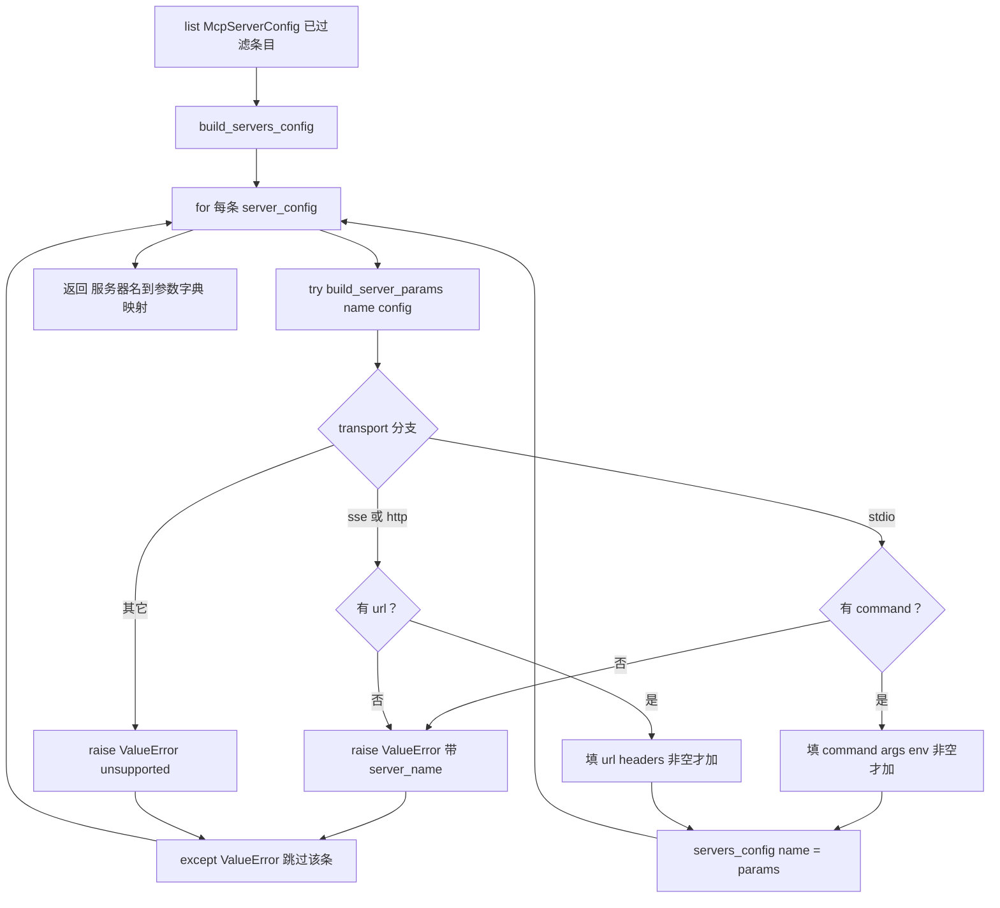

# mcp/client.py — client.py

> **文件路径**: `backend/packages/harness/agentflow/mcp/client.py`
> **目录位置**: mcp → client.py
> **职责**: 把 McpServerConfig 转成 langchain-mcp-adapters 的服务器参数字典（M6）

## 📑 目录

- [📋 结构图](#📋-结构图)
- [📤 关键导出](#📤-关键导出)
- [💡 设计思想](#💡-设计思想)
- [🎯 实用场景](#🎯-实用场景)
- [📊 顺序执行链流程图](#📊-顺序执行链流程图)
- [🧩 代码解析（成块对照 client.py）](#🧩-代码解析成块对照-clientpy)
- [❓ Q&A / 知识点](#❓-qa--知识点)
- [⚠️ 风险点](#⚠️-风险点)

## 📋 结构图

```text
┌──────────────────────────────────────────────────────────────┐
│ McpServerConfig                                             │
│   (name/transport/command/args/env/url/headers)             │
│            ↓ build_server_params(server_name, config)         │
│ langchain-mcp-adapters 参数字典:                              │
│   stdio: {"transport":"stdio","command":...,"args":...,     │
│           "env":{...}（env 非空才加）}                       │
│   sse/http: {"transport":"sse|http","url":...,              │
│              "headers":{...}（headers 非空才加）}            │
│            ↓ build_servers_config(configs)                  │
│ {"my-server": {参数字典}, ...}  → MultiServerMCPClient       │
└──────────────────────────────────────────────────────────────┘
```

## 📤 关键导出

**函数**

- `build_server_params(server_name, config)`：单个 McpServerConfig → adapter 参数字典
- `build_servers_config(configs)`：配置列表 → `{服务器名: 参数字典}`，喂 `MultiServerMCPClient`

## 💡 设计思想

1. **本文件只做"配置 → 参数字典"**：真正连接服务器、把 MCP 工具转成 `BaseTool`
   是 langchain-mcp-adapters 的事；本模块不 import adapter，保持纯数据转换、可单测。
2. **三传输参数差异显式化**：stdio 走 `command/args/env`，sse/http 走 `url/headers`，
   分支写死，不碰未知 kwargs。
3. **stdio 不转发 timeout/cwd**：部分 adapter 版本对未知 kwargs 报错（原版注释经验），
   所以这里只传白名单内的键。

## 🎯 实用场景

1. **装配 MultiServerMCPClient**：`mcp/tools.py.load_mcp_tools` 先
   `build_servers_config(servers)` 拿到 `{name: params}`，再原样传给客户端构造。
2. **单测配置正确性**：不连真实 MCP 服务器，直接断言 `build_server_params`
   产出的字典键集符合预期（stdio 有 command、sse 有 url）。
3. **错误定位**：`server_name` 贯穿 ValueError 消息，哪台服务器配置非法一眼可见。

## 📊 顺序执行链流程图

**调用方**：`build_servers_config` ← `mcp/tools.py.load_mcp_tools:70`；
`build_server_params` 由 `build_servers_config` 内部逐条调用。

```text
list[McpServerConfig]（来自 load_mcp_servers，已滤掉缺字段条目）
│
▼
build_servers_config(configs)
  servers_config = {}
  │
  for sc in configs:
    ├─ try:
    │    params = build_server_params(sc.name, sc)
    │    servers_config[sc.name] = params
    └─ except ValueError:
         continue   ← 单条非法不阻断整体
  │
  ▼
build_server_params(server_name, config)（逐条）
  params = {"transport": config.transport or "stdio"}
  ├─ transport == "stdio":
  │    无 command → raise ValueError(带 server_name)
  │    params["command"] / ["args"] / (env 非空才 ["env"])
  ├─ transport in ("sse","http"):
  │    无 url → raise ValueError(带 server_name)
  │    params["url"] / (headers 非空才 ["headers"])
  └─ 其它 transport → raise ValueError(unsupported)
  │
  ▼
{"my-server": {...}} → MultiServerMCPClient
```

**Mermaid 版（GitHub / 飞书渲染）**：



## 🧩 代码解析（成块对照 client.py）

> 读法：每块先贴**完整代码**，再看块下方的整块解析。代码与文件一致。

### 块 1：imports + `build_server_params` —— 单配置 → adapter 参数字典

```python
from __future__ import annotations

from typing import Any

from agentflow.config.mcp_config import McpServerConfig


def build_server_params(server_name: str, config: McpServerConfig) -> dict[str, Any]:
    """把单个 McpServerConfig 转成 langchain-mcp-adapters 的服务器参数字典。

    入参:
        server_name: 服务器名（仅用于报错信息定位）。
        config: McpServerConfig（transport/command/args/env/url/headers）。

    返回:
        dict：langchain-mcp-adapters 认可的参数字典，按传输类型不同键集。

    异常:
        ValueError: stdio 缺 command，或 sse/http 缺 url（配置非法时显式报错）。
    """
    transport_type = config.transport or "stdio"
    params: dict[str, Any] = {"transport": transport_type}

    if transport_type == "stdio":
        if not config.command:
            raise ValueError(
                f"MCP server '{server_name}' with stdio transport requires 'command' field"
            )
        params["command"] = config.command
        params["args"] = list(config.args)
        if config.env:
            params["env"] = dict(config.env)
    elif transport_type in ("sse", "http"):
        if not config.url:
            raise ValueError(
                f"MCP server '{server_name}' with {transport_type} transport requires 'url' field"
            )
        params["url"] = config.url
        if config.headers:
            params["headers"] = dict(config.headers)
    else:
        raise ValueError(
            f"MCP server '{server_name}' has unsupported transport type: {transport_type}"
        )
    return params
```

**结构简析**：按 transport 三分支构造 adapter 参数字典。公共键 `transport` 先放；
stdio 分支补 `command`/`args`，env 非空才加 `env`；sse/http 分支补 `url`，headers
非空才加 `headers`；落到 else（理论上 `load_mcp_servers` 已归一，这里是双保险）抛
unsupported。三个 ValueError 都带 `server_name`，便于定位是哪台服务器。

**`build_server_params()` 参数逐条解释**：

| 参数 | 类型 | 默认值 | 含义 |
|---|---|---|---|
| `server_name` | `str` | 必填 | 服务器名；**不进参数字典**，仅拼进 ValueError 消息做错误定位 |
| `config` | `McpServerConfig` | 必填 | 单个服务器配置；按其 `transport` 分支取 `command/args/env`（stdio）或 `url/headers`（sse/http） |

**落库要点**：`args` 用 `list(config.args)`、`env`/`headers` 用 `dict(...)` 做浅拷贝，
避免外部持有引用被后续修改污染；`env`/`headers` 仅在**非空**时才写进 dict——
空集合不加键，保持参数字典最小（部分 adapter 对空键敏感）。

### 块 2：`build_servers_config` —— 配置列表 → 名字映射

```python
def build_servers_config(configs: list[McpServerConfig]) -> dict[str, dict[str, Any]]:
    """把配置列表转成"服务器名 → 参数字典"映射（喂 MultiServerMCPClient）。

    入参:
        configs: McpServerConfig 列表（来自 load_mcp_servers，已过滤不可用条目）。

    返回:
        dict：服务器名 → 参数字典；配置非法条目跳过并记录（单条失败不影响整体）。
    """
    servers_config: dict[str, dict[str, Any]] = {}
    for server_config in configs:
        try:
            servers_config[server_config.name] = build_server_params(
                server_config.name, server_config
            )
        except ValueError:
            # 单条配置非法（缺 command/url）不阻断整体——M6 容错哲学
            continue
    return servers_config
```

**结构简析**：遍历配置列表，逐条调 `build_server_params`，以 `server_config.name` 为 key
塞进 dict；单条 `ValueError` 被 try 吞掉 `continue`——**单台服务器配置非法不拖垮整体**。

**`build_servers_config()` 参数逐条解释**：

| 参数 | 类型 | 默认值 | 含义 |
|---|---|---|---|
| `configs` | `list[McpServerConfig]` | 必填 | 来自 `load_mcp_servers` 的已过滤列表；逐条转参数字典，按 name 聚合成 dict |

**落库要点**：返回的 dict 直接就是 `MultiServerMCPClient(servers_config)` 的入参形状——
key 是服务器名，value 是参数字典。同名 name 后者覆盖前者（dict 赋值语义）。

## ❓ Q&A / 知识点

### 1. 为什么 build_server_params 在这层又校验一次 command/url（load_mcp_servers 不是滤过了吗）？

**一句话**：双保险——`load_mcp_servers` 滤的是「yaml 段里的坏条目」，
但 `build_server_params` 是公开导出函数，可能被别处直接构造 `McpServerConfig` 调进来，
缺字段就该当场 `raise ValueError` 而不是把坏字典喂给 adapter 后才崩。

两层防御：
- `load_mcp_servers`：yaml 容错哲学——坏条目**静默丢弃**，不抛错；
- `build_server_params`：纯函数契约——入参非法就**显式抛 ValueError**，消息带 `server_name`。

### 2. env / headers 为什么"非空才加进字典"？空 dict 传进去有什么问题？

**一句话**：保持参数字典最小化——部分 langchain-mcp-adapters 版本对传入空 `env={}` /
空 `headers={}` 会走额外分支或告警（原版注释经验），非空才加键最稳妥。

源码 `if config.env: params["env"] = dict(config.env)`——空 dict 是 falsy，
就不写这个键。同理 `if config.headers:`。

### 3. server_name 参数为什么不写进参数字典，只用于报错？

**一句话**：因为 adapter 已经按 dict 的 **key** 识别服务器了——
`build_servers_config` 里 `servers_config[server_config.name] = params`，
`params` 本身不需要再带一份 name（会重复）。

`server_name` 只在 `raise ValueError(f"MCP server '{server_name}' ...")` 里出现，
纯粹是错误信息的定位锚点。这也是为什么 `build_server_params` 要把 name 和 config 分开传——
config.name 也能拿到，但显式传参让函数签名自文档化。

### 4. build_servers_config 吞掉 ValueError 后，调用方怎么知道哪台被跳过了？

**一句话**：当前实现只 `continue`，**不打日志**——这是 M6 容错哲学的代价。

`load_mcp_tools` 层只会在最后打 `Loaded %d MCP tool(s) from %d server(s)` 的汇总日志。
如果某条配置在 `load_mcp_servers` 阶段已被滤（缺 command/url），到不了这里；
真到这层还抛 ValueError 的场景很少（比如绕过 load_mcp_servers 直接造 config）。
排障时按 `server_name` 关键字搜 ValueError 原文即可。

## ⚠️ 风险点

1. **同名覆盖**：两台服务器 `name` 相同，`build_servers_config` 的 dict 后者覆盖前者。
2. **吞错无日志**：`except ValueError: continue` 不打日志，静默跳过——MCP 工具数量对不上时回头查这里。
3. **勿加未知 kwargs**：注释明确 stdio 不转发 timeout/cwd，部分 adapter 版本对未知键报错。
4. **不 import adapter**：本模块保持纯数据转换；升级 langchain-mcp-adapters 后键集变了，
   这里要同步改（键集与 adapter 版本强耦合）。

---
_2026-10-05 M6 新增：目录 + 结构图 + 流程图 + 成块代码解析（参数逐条表）+ Q&A。_
