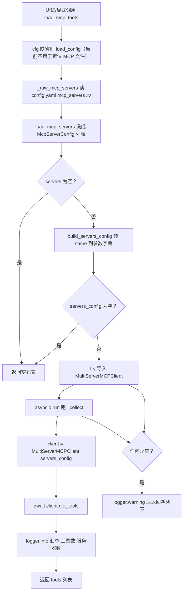

# mcp/tools.py — tools.py

> **文件路径**: `backend/packages/harness/agentflow/mcp/tools.py`
> **目录位置**: mcp → tools.py
> **职责**: 从 config.yaml 加载 MCP 外部服务器并返回 BaseTool 列表（M6）

## 📑 目录

- [📋 结构图](#📋-结构图)
- [📤 关键导出](#📤-关键导出)
- [💡 设计思想](#💡-设计思想)
- [🎯 实用场景](#🎯-实用场景)
- [📊 顺序执行链流程图](#📊-顺序执行链流程图)
- [🧩 代码解析（成块对照 tools.py）](#🧩-代码解析成块对照-toolspy)
- [❓ Q&A / 知识点](#❓-qa--知识点)
- [⚠️ 风险点](#⚠️-风险点)

## 📋 结构图

```text
┌──────────────────────────────────────────────────────────────┐
│ load_mcp_tools(cfg)                                          │
│   │                                                         │
│   ├─ cfg = cfg or load_config()                             │
│   ├─ load_mcp_servers({"mcp_servers": _raw_mcp_servers(cfg)})│
│   │     空列表 → return []（无 MCP 配置就不折腾）             │
│   ├─ build_servers_config → {name: params}                  │
│   │     空 → return []                                       │
│   ├─ MultiServerMCPClient(servers)  ← langchain-mcp-adapters │
│   ├─ async def _collect(): client = MultiServerMCPClient(..) │
│   │                        return await client.get_tools()   │
│   └─ asyncio.run(_collect()) 同步桥接 → list[BaseTool]       │
│                                                             │
│   任何异常 → logger.warning + return []（可选项降级）         │
└──────────────────────────────────────────────────────────────┘
```

## 📤 关键导出

**函数**

- `load_mcp_tools(cfg=None)`：加载全部启用 MCP 服务器的工具，合并成 `list[BaseTool]`；
  配置为空 / 连接失败一律返回 `[]`（可选项语义，不抛错）

**内部私有**

- `_raw_mcp_servers(cfg)`：从 config.yaml 读 `mcp_servers` 原始 list

## 💡 设计思想

1. **MCP 工具是可选组件**：显式调用时，连接失败 / 配置为空返回 `[]`；当前 CLI/主 Agent 没有调用本函数。
2. **asyncio.run 同步桥接**：适用于没有运行中事件循环的同步调用方；若从 async 服务调用，会因已有事件循环而失败。
3. **懒加载**：只有调 `load_mcp_tools` 时才建客户端（不常驻连接）。

## 🎯 实用场景

1. **显式加载**：调用 `load_mcp_tools()` 可单独发现工具；要让 Agent 使用，还需调用方把返回值并入 `make_lead_agent(..., tools=...)`。当前主流程尚未这样做。
2. **无 MCP 环境开发**：config.yaml 不配 mcp_servers，函数直接 `return []`，
   本地开发零依赖。
3. **MCP 服务器挂了**：子进程起不来 / 远程 URL 不通，函数记录 warning 并返回 `[]`；若未来接入主流程，调用方可以选择降级继续启动。

## 📊 顺序执行链流程图

**调用方**：目前由测试直接调用；M6 当前没有生产代码调用方。后续接入时由 agent 装配处调用；
内部依赖 `load_mcp_servers` ← `config/mcp_config.py`、`build_servers_config` ← `mcp/client.py`、
`MultiServerMCPClient` ← `langchain_mcp_adapters.client`。

```text
agent 装配（同步链）
│
▼
load_mcp_tools(cfg=None)
  cfg = cfg or load_config()                 （目前仅保留接口形状）
  servers = load_mcp_servers({"mcp_servers": _raw_mcp_servers(cfg)})
  │
  ├─ not servers?        → return []   ← 无配置直接空
  ▼
  servers_config = build_servers_config(servers)
  ├─ not servers_config? → return []   ← 全被滤掉
  ▼
  try:
    from langchain_mcp_adapters.client import MultiServerMCPClient
    async def _collect():
        client = MultiServerMCPClient(servers_config)   ← 0.1.0 不作 context manager
        return await client.get_tools()
    tools = asyncio.run(_collect())
    logger.info("Loaded %d MCP tool(s) from %d server(s)", ...)
    return tools
  except Exception as exc:
    logger.warning("MCP tools load failed (skipped): %s", exc)
    return []
```

**Mermaid 版（GitHub / 飞书渲染）**：



## 🧩 代码解析（成块对照 tools.py）

> 读法：每块先贴**完整代码**，再看块下方的整块解析。代码与文件一致。

### 块 1：imports + `load_mcp_tools` —— 主入口（含 async 桥接）

```python
from __future__ import annotations

import asyncio
import logging
from typing import Any

from agentflow.config.app_config import AppConfig
from agentflow.config.mcp_config import load_mcp_servers
from agentflow.mcp.client import build_servers_config

logger = logging.getLogger(__name__)


def load_mcp_tools(cfg: AppConfig | None = None) -> list[Any]:
    """从配置加载 MCP 外部服务器，返回它们的工具列表（BaseTool）。

    入参:
        cfg: AppConfig（从 .models 之外读取 mcp_servers 段）。None 时尝试加载默认配置。

    返回:
        list[BaseTool]：所有启用 MCP 服务器的工具合并列表。
        配置为空 / 连接失败 → []（可选项语义，不抛错）。

    流程:
        1. load_mcp_servers → 可用服务器列表（空则 return []）
        2. build_servers_config → 服务器名→参数字典
        3. MultiServerMCPClient 连接 + get_tools()（async，asyncio.run 桥接）
    """
    from agentflow.config.app_config import load_config

    cfg = cfg or load_config()
    servers = load_mcp_servers({"mcp_servers": _raw_mcp_servers(cfg)})
    if not servers:
        return []
    servers_config = build_servers_config(servers)
    if not servers_config:
        return []
    try:
        from langchain_mcp_adapters.client import MultiServerMCPClient

        async def _collect() -> list[Any]:
            # langchain-mcp-adapters 0.1.0：MultiServerMCPClient 不可作 context manager，
            # 正确用法 = 直接 get_tools()（0.1.0 起不支持 async with / __aexit__）
            client = MultiServerMCPClient(servers_config)
            return await client.get_tools()

        tools = asyncio.run(_collect())
        logger.info("Loaded %d MCP tool(s) from %d server(s)", len(tools), len(servers_config))
        return tools
    except Exception as exc:  # noqa: BLE001 —— MCP 连接失败可选项降级，不阻断主流程
        logger.warning("MCP tools load failed (skipped): %s", exc)
        return []
```

**结构简析**：同步函数包一层 async——先洗配置（两道空判提前 return），再在 try 里
延迟 import adapter、定义内部 async `_collect`、用 `asyncio.run` 跑。关键注释点明
**0.1.0 的 MultiServerMCPClient 不可作 context manager**，所以是 `client = ...; await client.get_tools()`，
不是 `async with`。最外层 `except Exception` 兜底降级。

**`load_mcp_tools()` 参数逐条解释**：

| 参数 | 类型 | 默认值 | 含义 |
|---|---|---|---|
| `cfg` | `AppConfig \| None` | `None` | 已加载的 AppConfig；None 时函数内 `load_config()` 取默认配置（实际 mcp_servers 段由 `_raw_mcp_servers` 直接读 yaml，不依赖 cfg 字段） |

**落库要点**：两道早退——`not servers`（yaml 段空/全被滤）和 `not servers_config`
（build 阶段全失败）都直接 `return []`，不碰 adapter。`asyncio.run(_collect())` 是同步桥接点；
成功打 info 汇总日志，失败打 warning 后返回 `[]`。

### 块 2：`_raw_mcp_servers` —— 直接读 config.yaml 的 mcp_servers 段

```python
def _raw_mcp_servers(cfg: AppConfig) -> list[dict[str, Any]]:
    """从 AppConfig 里取 mcp_servers 原始列表。

    说明: AppConfig 目前无 mcp_servers 字段（M6 暂不侵入主配置），
    这里读取 config.yaml 的 mcp_servers 段作为数据源；
    若未来 AppConfig 增加该字段，直接替换实现即可。
    """
    import os

    import yaml

    path = os.environ.get("AGENTFLOW_CONFIG_PATH") or "config.yaml"
    if not os.path.exists(path):
        return []
    with open(path, encoding="utf-8") as f:
        raw = yaml.safe_load(f) or {}
    entries = raw.get("mcp_servers") or []
    return entries if isinstance(entries, list) else []
```

**结构简析**：M6 暂不把 mcp_servers 塞进 AppConfig 数据类，而是**直接再读一遍 yaml 文件**
取 `mcp_servers` 段。路径走环境变量 `AGENTFLOW_CONFIG_PATH`，缺省 `config.yaml`；
文件不存在 / 段不是 list 都返回 `[]`。

**`_raw_mcp_servers()` 参数逐条解释**：

| 参数 | 类型 | 默认值 | 含义 |
|---|---|---|---|
| `cfg` | `AppConfig` | 必填 | 当前实现里**未使用**（docstring 说明：AppConfig 暂无 mcp_servers 字段，留参为将来替换实现） |

**落库要点**：`os.environ.get("AGENTFLOW_CONFIG_PATH") or "config.yaml"` 定位文件；
`yaml.safe_load` 后取 `mcp_servers`，非 list 归 `[]`。这是 M6 的过渡实现——
docstring 明确"未来 AppConfig 加字段后直接替换"。

## ❓ Q&A / 知识点

### 1. langchain-mcp-adapters 0.1.0 为什么不能用 async with？源码怎么规避？

**一句话**：0.1.0 的 `MultiServerMCPClient` 没实现 `__aenter__/__aexit__`，
写 `async with MultiServerMCPClient(...)` 会直接报"不是异步上下文管理器"——
源码规避方式是**直接构造 + 直接 await get_tools()**，不走 context manager。

源码块 1 注释原文：
> langchain-mcp-adapters 0.1.0：MultiServerMCPClient 不可作 context manager，
> 正确用法 = 直接 get_tools()（0.1.0 起不支持 async with / __aexit__）

对应代码（源码块 1 原文）：`client = MultiServerMCPClient(servers_config)` 紧接 `return await client.get_tools()`，
**不是** `async with MultiServerMCPClient(servers_config) as client:`（0.1.0 会炸）。
升级 adapter 版本后若支持了 context manager，这里可以改回 `async with` 做资源清理。

### 2. MCP 工具名前缀和冲突是怎么处理的？

**一句话**：本仓库**不自己拼前缀**——`load_mcp_tools` 原样返回 `await client.get_tools()` 的结果，
命名空间由 langchain-mcp-adapters 的 `MultiServerMCPClient` 按服务器名处理。

依据：
- `config/mcp_config.py` docstring 写明 `name` 是"工具名前缀，如 `mcp_my_server_xxx`"；
- `build_servers_config` 以 `server_config.name` 为 dict key 传给客户端；
- 本文件拿到 tools 后**不改名、不去重**，直接合并返回。

两台服务器都有名为 `search` 的工具时，冲突规避靠 adapter 侧的命名空间（按服务器名前缀），
不在本模块。工具最终挂载到 agent 的工具注册表，发生在 agent 装配处（调用 `load_mcp_tools` 的地方），
本文件只负责"产出工具列表"。

### 3. 为什么用 asyncio.run 桥接？会不会和已有事件循环冲突？

**一句话**：agentflow 的装配链是同步的，而 adapter 是 async API——`asyncio.run`
在同步函数里开一个临时事件循环跑完 `_collect` 就关，CLI 单线程场景下没有别的循环在跑，不冲突。

`asyncio.run` 的语义：创建新事件循环 → 跑协程 → 关闭循环。只要调用时**当前线程没有正在运行的
事件循环**就安全。CLI 装配阶段是同步主线程、没起 loop，所以 OK。如果将来在已运行 loop 的
环境（如 web 服务）里调这个函数，`asyncio.run` 会报错——那时要改成 `asyncio.ensure_future`
或把 `load_mcp_tools` 本身 async 化。

### 4. MCP 连接失败为什么返回 [] 而不是抛错？

**一句话**：MCP 是**可选项**——用户没配 / 配错 / 远程服务器挂了，都不该让主 agent 起不来。

源码最外层 `except Exception as exc: logger.warning(...); return []`。设计意图（模块注释）：
"MCP 工具是可选项：连接失败/配置为空一律返回 []，绝不阻断主 Agent 装配（CLI 无 MCP 服务器时照常对话）"。
代价是**静默降级**——服务器挂了你只会在 warning 日志里看到一条，agent 照常跑只是少了几个工具。

## ⚠️ 风险点

1. **0.1.0 不支持 async with**：升级 langchain-mcp-adapters 后别随手改回 `async with`，
   先确认目标版本支持 `__aexit__`，否则连接不清理。
2. **asyncio.run 约束**：只能在无运行中事件循环的同步上下文调；将来搬进 web/async 服务会炸。
3. **静默降级**：`except Exception` 吞所有异常返回 `[]`，MCP 工具没加载时只看 warning 日志。
4. **`cfg` 参数未生效**：`_raw_mcp_servers(cfg)` 当前不读取 `cfg` 内容；MCP 列表从 `AGENTFLOW_CONFIG_PATH` 或 cwd 下的 `config.yaml` 获取。
5. **_raw_mcp_servers 重复读 yaml**：M6 过渡实现直接再读一遍 config.yaml，与 AppConfig 可能不同步；
   将来 AppConfig 加 mcp_servers 字段后记得替换实现。

---
_2026-10-05 M6 新增：目录 + 结构图 + 流程图 + 成块代码解析（参数逐条表）+ Q&A。_
