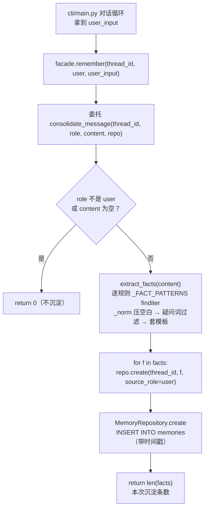

# memory/consolidate.py — consolidate.py

> **文件路径**: `backend/packages/harness/agentflow/memory/consolidate.py`
> **目录位置**: memory → consolidate.py
> **职责**: 记忆沉淀（规则事实提取）

## 📑 目录

- [📋 结构图](#📋-结构图)
- [📤 关键导出](#📤-关键导出)
- [💡 设计思想](#💡-设计思想)
- [🎯 实用场景](#🎯-实用场景)
- [📊 顺序执行链流程图](#📊-顺序执行链流程图)
- [🧩 代码解析（成块对照 consolidate.py）](#🧩-代码解析成块对照-consolidatepy)
- [❓ Q&A / 知识点](#❓-qa--知识点)
- [⚠️ 风险点](#⚠️-风险点)

## 📋 结构图

```text
┌────────────────────────────────────────────────┐
│ extract_facts(text) → list[str]                 │
│   规则匹配（中文优先）:                          │
│     我叫/我是/我喜欢/我爱/我住在/我来自/         │
│     我在/我会/我擅长/我是做…的/…               │
│   命中 → 整理成"用户X"标准句（去重）             │
│                                                 │
│ consolidate_message(thread_id, role, content,   │
│                     repo) → int                 │
│   只处理 user 消息 → extract_facts → 落库        │
│   返回本次沉淀条数（CLI 可显示"已记住"）         │
└────────────────────────────────────────────────┘
```

调用关系（真实源码）：
- **被谁调用**：`memory/facade.py`（`MemoryFacade.remember` → `consolidate_message`；`MemoryFacade.extract_facts` 静态方法 → `extract_facts`）；另有 `tests/test_memory_consolidate.py` 直接单测。
- **它调用谁**：`repo.create(thread_id, content, source_role="user")`（由 `MemoryRepoLike` Protocol 约定，真实实现是 `persistence/memory_repositories.py` 的 `MemoryRepository.create` → INSERT INTO memories）。

## 📤 关键导出

**函数**

- `extract_facts(text: str) -> list[str]`
- `consolidate_message(thread_id, role, content, repo) -> int`

**类型 / 常量**

- `MemoryRepoLike`（Protocol：只约束 repo 有 `create` 方法）
- `_FACT_PATTERNS`（事实提取规则表）
- `_QUESTION_WORDS`（疑问词过滤表）
- `_norm(fact)`（内部私有：事实标准化）

## 💡 设计思想

1. 记忆 ≠ 对话全文：只沉淀"可复用的事实"（跨会话才有意义）。
2. 规则提取 100% 稳定（不调模型）：M3 验收不依赖模型/限流；
   后续想换 LLM 抽取只需替换 `extract_facts` 内部实现。
3. 中文优先：用户是中文对话，规则按中文句式写（原版是英文 token）。
4. 只依赖 `MemoryRepoLike` Protocol（结构类型）：consolidate 不绑死具体 repo，
   测试可直接注入 mock（`repo.create`），便于单测。

## 🎯 实用场景

1. 用户随口自报家门："我叫小王，喜欢爬虫" → 沉淀成 `用户叫小王` / `用户喜欢爬虫`，新会话启动时召回注入系统提示词。
2. 静默沉淀：对话循环里每条 user 消息过一遍 `consolidate_message`，提取不到就返回 0，不打扰用户。
3. 可替换抽取层：未来想上 LLM 事实抽取，只改 `extract_facts` 内部，`consolidate_message` 与落库链路不动。

## 📊 顺序执行链流程图

沉淀链路由 `facade.remember` 触发，最终走到本文件：

```text
cli/main.py 对话循环：用户回车拿到 user_input（request）
│
▼
memories.remember(thread_id, "user", user_input)   ← facade 门面入口
│
▼
facade 委托 consolidate_message(thread_id, role, content, self.repo)
│
▼
role != "user" 或 content 为空？        ← 非 user 消息（assistant 话术）直接 return 0
│  是 → return 0（不沉淀）
│  否 ↓
▼
extract_facts(content)                   ← 逐规则 _FACT_PATTERNS finditer
│                                        命中 → _norm 压空白 → 疑问词过滤 → 模板套"用户X"
▼
for f in facts: repo.create(thread_id, f, source_role="user")
│                                        ← MemoryRepository.create：INSERT INTO memories（带时间戳）
▼
return len(facts)                        ← 本次沉淀条数（0 = 没提取到事实）
```

**Mermaid 版（GitHub / 飞书渲染；VSCode 需装插件）**：



## 🧩 代码解析（成块对照 consolidate.py）

> 读法：每块先贴**完整代码**，再看块下方的整块解析。代码与文件一致，仅省略头部规范注释。

### 块 1：imports —— 只依赖标准库

```python
from __future__ import annotations

import re
from typing import Protocol
```

**整块解析**：零第三方依赖。`re` 是规则提取的核心（预编译正则）；`typing.Protocol` 用于定义 `MemoryRepoLike` 结构类型（本文件不 import 具体的 `MemoryRepository`，只约束"有 `create` 方法"，从而把落库实现与提取逻辑解耦）。`from __future__ import annotations` 让注解延迟求值，便于在类/函数签名里前向引用。

### 块 2：`_FACT_PATTERNS` —— 规则表（正则 → 标准句模板）

```python
# 事实提取规则：pattern → 标准化模板（{} 内是捕获的用户信息）
_FACT_PATTERNS: list[tuple[re.Pattern[str], str]] = [
    (re.compile(r"我叫([\u4e00-\u9fff\w·]{1,20})"), "用户叫{0}"),
    (re.compile(r"我是([\u4e00-\u9fff\w·]{1,20})"), "用户是{0}"),
    # 主语"我"可省略（"喜欢爬虫"与"我喜欢爬虫"都是事实）
    (re.compile(r"(?:我喜欢|喜欢)([^，。！？\n]{1,30})"), "用户喜欢{0}"),
    (re.compile(r"(?:我爱|爱)([^，。！？\n]{1,30})"), "用户爱{0}"),
    (re.compile(r"(?:我住在|住在)([^，。！？\n]{1,30})"), "用户住在{0}"),
    (re.compile(r"(?:我来自|来自)([^，。！？\n]{1,30})"), "用户来自{0}"),
    (re.compile(r"我在([^，。！？\n]{1,30})"), "用户在{0}"),
    (re.compile(r"(?:我擅长|擅长)([^，。！？\n]{1,30})"), "用户擅长{0}"),
    (re.compile(r"我会([^，。！？\n]{1,30})"), "用户会{0}"),
    (re.compile(r"我是做([^，。！？\n]{1,30})"), "用户是做{0}"),
]
```

**整块解析**：这是模块的"灵魂表"——每一项是 `(已编译正则, 模板)`：正则捕获用户信息片段，`{0}` 处套成"用户X"标准句。几个真实细节：① 前两条 `我叫/我是` 捕获长度 1~20 字符（姓名/身份短），后几条捕获到句末标点为止（1~30 字符，描述性内容长）；② `(?:我喜欢|喜欢)` 用非捕获组，主语"我"可省略（注释明说"喜欢爬虫"也算事实）；③ 全表预编译（`re.compile`），`extract_facts` 直接复用，不重复编译。捕获字符集 `[\u4e00-\u9fff\w·]` 即"中文汉字 + 单词字符 + 间隔号"（`\u4e00`~`\u9fff` 是中文 Unicode 区间）。

### 块 3：`MemoryRepoLike` Protocol + `_QUESTION_WORDS` —— 落库契约与疑问词过滤

```python
class MemoryRepoLike(Protocol):
    """consolidate 只依赖 repo 的 create（便于测试注入 mock）。"""

    def create(self, thread_id: str, content: str, source_role: str = "user") -> None: ...


# 疑问词：捕获到这些词说明是提问而非陈述事实（如"我叫什么"），跳过
_QUESTION_WORDS = ("什么", "怎么", "哪", "为什么", "吗", "呢", "如何")
```

**整块解析**：两个"防错"设计。① `MemoryRepoLike` 是结构化 Protocol——只要求实现 `create(thread_id, content, source_role="user") -> None`，真实的 `MemoryRepository` 自然满足（鸭子类型），测试时塞个 mock 对象即可，consolidate 完全不碰 SQL。② `_QUESTION_WORDS` 是疑问词元组：用户说"我叫什么"时其实是在提问，不是在报事实，后续 `extract_facts` 会用它把这类误命中过滤掉。

### 块 4：`_norm` + `extract_facts` —— 规则提取主逻辑

```python
def _norm(fact: str) -> str:
    """标准化事实：压空白 + 去首尾空格。"""
    return re.sub(r"\s+", " ", fact).strip()


def extract_facts(text: str) -> list[str]:
    """从一句话里提取用户事实（规则匹配，中文句式优先）。

    例: "我叫小王，喜欢爬虫" → ["用户叫小王", "用户喜欢爬虫"]
    疑问句（"我叫什么"）会被过滤——那不是事实。
    """
    if not text:
        return []
    facts: list[str] = []
    seen: set[str] = set()
    for pat, template in _FACT_PATTERNS:
        for m in pat.finditer(text):
            val = _norm(m.group(1))
            if not val:
                continue
            if any(w in val for w in _QUESTION_WORDS):
                continue  # 提问而非陈述，跳过
            fact = template.format(val)
            if fact not in seen:
                seen.add(fact)
                facts.append(fact)
    return facts
```

**整块解析**：提取主循环——空串直接返回 `[]`；遍历 `_FACT_PATTERNS`，每条正则 `finditer` 扫全文。每个命中先 `_norm` 压多余空白、再做两道闸：空值跳过、命中疑问词跳过（"我叫什么"被这里滤掉）。通过后套模板生成标准句，并用 `seen` 集合在**本次提取内去重**（同一句重复命中只留一条）。docstring 给的样例 `"我叫小王，喜欢爬虫" → ["用户叫小王", "用户喜欢爬虫"]` 正是 `我叫` + `喜欢` 两条规则各命中一次。

### 块 5：`consolidate_message` —— 单条消息沉淀入口

```python
def consolidate_message(thread_id: str, role: str, content: str, repo: MemoryRepoLike) -> int:
    """把一条消息里的用户事实沉淀入库（只处理 user 消息）。

    返回: 本次沉淀的条数（0 = 没提取到事实）。
    """
    if role != "user" or not content:
        return 0
    facts = extract_facts(content)
    for f in facts:
        repo.create(thread_id, f, source_role="user")
    return len(facts)
```

**整块解析**：沉淀的对外入口（被 `facade.remember` 调用）。第一道闸 `role != "user" or not content`：assistant 回复是模型话术、不是用户事实，直接返回 0；空内容也不处理。过闸后调 `extract_facts` 提事实，逐条 `repo.create(thread_id, f, source_role="user")` 落库，最后返回 `len(facts)`——返回值就是 CLI/门面可展示的"本次记住了几条"。注意去重只在单次 `extract_facts` 内做，跨会话全库去重不在本层（源码注释归到 M5）。

## ❓ Q&A / 知识点

### 为什么只沉淀 user 消息，不沉淀 assistant 回复？

**一句话**：记忆存的是"用户的事实"，assistant 说的话是模型话术、不是用户自我描述，沉淀进去会污染"关于用户的事实"。

`consolidate_message` 第一行 `if role != "user" or not content: return 0` 直接把非 user 消息挡在外面。这也是 `repo.create(..., source_role="user")` 恒为 user 的原因——落库时事实已经确定来自用户消息。

### 为什么用规则正则而不是调 LLM 抽事实？

**一句话**：M3 要"100% 稳定、不依赖模型/限流"的最小闭环，规则提取可复现、零成本；LLM 抽取作为后续替换，只需改 `extract_facts` 内部。

| 方案 | 稳定性 | 依赖 | M3 定位 |
|---|---|---|---|
| 规则正则（当前） | 命中即固定，不随机 | 无 | 验收不卡模型/限流 |
| LLM 抽取 | 每次结果可能不同 | 需调模型、有延迟/限流 | 后续替换 `extract_facts` 内部 |

替换边界清晰：`consolidate_message` 只认 `extract_facts -> list[str]` 这个契约，内部换成模型抽取也不动落库链路。

### `MemoryRepoLike` Protocol 解决了什么？

**一句话**：让 consolidate 只依赖"有 `create` 方法"这一结构契约，不 import 具体 `MemoryRepository`，测试可注入 mock、落库实现可替换。

真实的 `persistence/memory_repositories.py::MemoryRepository` 实现了 `create/recall/count`，天然满足该 Protocol；单测里直接构造一个带 `create` 的假 repo 即可，无需起 SQLite。

### `repo: MemoryRepoLike` 怎么读？（Protocol 结构化类型详解，2026-09-30 用户提问）

**一句话**：`MemoryRepoLike` 是 typing.Protocol 定义的结构化类型——"只要长得像 MemoryRepository（有 `create` 方法），就能传进来"，不要求是它的实例或子类。

```python
# 真实的 MemoryRepository（persistence/memory_repositories.py）
class MemoryRepository:
    def create(self, thread_id, content, source_role="user"): ...  # ✓ consolidate 只认这个
    def recall(self, thread_id=None, limit=10): ...                 # 用不到
    def count(self): ...                                            # 用不到

# 测试用的假 repo（只有 create，没有 recall/count）
class FakeRepo:
    def create(self, thread_id, content, source_role="user"): ...   # ✓ 也满足

# 两个都能传进 consolidate_message(repo=...) —— 都"满足 MemoryRepoLike"
```

| 写法 | 依赖 | 测试 | 换实现 |
|---|---|---|---|
| `repo: MemoryRepository` | import 具体类，绑死 SQLite | 必须起真库 | 换库要改 consolidate |
| `repo: MemoryRepoLike`（Protocol） | 只认"有 create 的结构" | 塞假对象即可 | create 在就不动 consolidate |

**判定规则**：类型检查器（mypy/pyright）按**结构兼容**检查——对象有没有 `create` 方法、签名是否匹配，不看类继承关系（鸭子类型）。consolidate 只依赖 Protocol 声明的 `create` 一个方法，`recall/count` 它不关心。

**命名惯例**：`MemoryRepoLike` / `XxxProtocol` / `SupportsXxx` 都是"行为契约类型"的常见命名——看到 `Like` 就想到"长得像、行为符合即可"。

### extract_facts（事实抽取）是什么？通用概念 vs 本项目实现（2026-09-30 用户提问）

**通用概念（你贴的笔记，LLM 版）**：把一段杂乱长文本（合同/聊天记录/业务文档）自动抓出**原子化、独立、可核验**的一条条客观事实，输出结构化数据（JSON）。

```text
原文：客户 A 在 2026-09-30 下单，采购 20 台设备，交付期 10 月 20 日。
输出：{客户名称: A, 下单日期: 2026-09-30, 采购数量: 20 台, 交付截止: 2026-10-20}
```

用途：提炼事实入库、区分客观事实 vs 主观看法、减少幻觉（只提取原文存在内容）、常配 RAG（文档片段 → extract facts → 存向量/事实库）。

**⚠️ 本项目 M3 的 `extract_facts` 不是 LLM 版，是规则正则版**（见代码解析块 2/4）：

| 维度 | 通用 LLM 版（你贴的） | AgentFlow M3 规则版 |
|---|---|---|
| 抽取引擎 | 大模型（每轮花钱/限流/结果随机） | 预编译正则 `_FACT_PATTERNS`（免费/稳定/可复现） |
| 输出 | JSON 结构化字段 | `list[str]` 标准句（如 `"用户叫小王"`） |
| 适用文本 | 任意业务文档（合同/采购单…） | 只处理**用户自我描述**（我叫/我喜欢/我住在…中文句式） |
| 输入门槛 | `role != "user"` 不拦 | `consolidate_message` 第一道闸只收 user 消息 |
| 幻觉风险 | 模型可能编造 | 正则只命中原文，天然零编造 |
| 与 RAG 关系 | 常配套（抽完存向量库） | M3 独立，知识库走 knowledge 包（chunker+embedding），与记忆互不干扰 |

**一句话总结（本项目版）**：`extract_facts` = 从**用户的一句话**里，用规则正则扒出"用户X"标准句（我叫/我喜欢/我住在…），存进 memories 表供新会话召回——不是通用文档事实抽取，是"用户画像事实沉淀"。

> 若未来想上 LLM 抽取，替换边界已在代码解析块 5 说明：只改 `extract_facts` 内部实现，签名 `text -> list[str]` 不变，`consolidate_message` 与落库链路不动。

## ⚠️ 风险点

1. 规则命中不了的事实（自由表述）M3 不沉淀——可接受（最小闭环）
2. 同内容重复落库由 `_dedup`（会话内去重）缓解；跨会话全库去重 M5 再学
3. 只沉淀 user 消息：assistant 回复是模型话术，不是用户事实

---
_2026-09-30 新建：M3 文档（目录 + 流程图 + 成块代码解析 + Q&A）。_
_2026-09-30 追加：Q&A 归档区（extract_facts 通用概念 vs 本项目规则版对照、MemoryRepoLike Protocol 详解，用户提问自动归纳）；同日 mermaid 块修复。_
