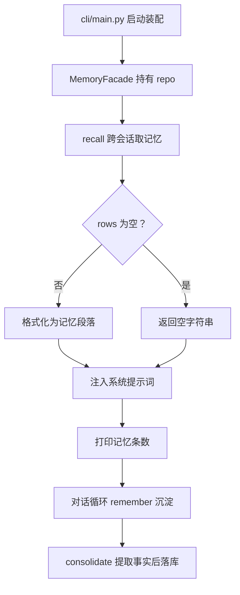

# memory/facade.py — facade.py

> **文件路径**: `backend/packages/harness/agentflow/memory/facade.py`
> **目录位置**: memory → facade.py
> **职责**: 记忆总入口（门面）

## 📑 目录

- [📋 结构图](#📋-结构图)
- [📤 关键导出](#📤-关键导出)
- [💡 设计思想](#💡-设计思想)
- [🎯 实用场景](#🎯-实用场景)
- [📊 顺序执行链流程图](#📊-顺序执行链流程图)
- [🧩 代码解析（成块对照 facade.py）](#🧩-代码解析成块对照-facadepy)
- [❓ Q&A / 知识点](#❓-qa--知识点)
- [⚠️ 风险点](#⚠️-风险点)

## 📋 结构图

```text
┌────────────────────────────────────────────────┐
│ MemoryFacade                                   │
│   __init__(repo: MemoryRepository)             │
│   remember(thread_id, role, content) → int     │
│     委托 consolidate_message + 落库             │
│   recall(thread_id=None, limit=10) → str        │
│     取记忆 → 格式化段落（供注入系统提示词）     │
│   count() → int（CLI 启动信息）                │
│   extract_facts(text) → list[str]（静态透传）   │
└────────────────────────────────────────────────┘
```

调用关系（真实源码）：
- **被谁调用**：`cli/main.py`——L77 `from agentflow.memory.facade import MemoryFacade`；L170 `memories = MemoryFacade(MemoryRepository(db_path=db_path))`；L176 `memories.recall(limit=10)`；L202 `memories.count()`；L225 `memories.remember(thread_id, "user", user_input)`。另有 `tests/test_memory_consolidate.py` 单测。
- **它调用谁**：`memory/consolidate.py` 的 `consolidate_message`（remember 委托）与 `extract_facts`（静态方法透传）；`persistence/memory_repositories.py` 的 `MemoryRepository`（`recall`/`count`，以及 remember 链路里的 `create`）。

## 📤 关键导出

**类**

- `MemoryFacade`（方法：`remember` / `recall` / `count` / 静态 `extract_facts`）

## 💡 设计思想

1. 门面模式：业务方（CLI/中间件）只认识 `MemoryFacade`，
   不直接碰 consolidate 细节或 repo SQL。
2. recall 跨会话（`thread_id=None` 取全部）：这是"新会话记得旧事实"
   的入口（M3 验收点 1）。
3. 注入格式固定：CLI 把 `recall()` 结果拼进系统提示词即可。

## 🎯 实用场景

1. 启动注入：CLI 装配后 `recall(limit=10)` 拿记忆快照，拼进 `build_lead_agent_system_prompt(memory_ctx, skills_ctx)`。
2. 对话沉淀：每轮用户消息后 `remember(thread_id, "user", user_input)` 静默落库。
3. 启动信息：`count()` 打印"记忆: N 条"，控制台一眼看清数据规模。

## 📊 顺序执行链流程图

以 CLI 一次会话里的记忆生命周期为例（request 来自 cli/main.py 装配与对话循环）：

```text
cli/main.py 启动装配（request）
│
▼
memories = MemoryFacade(MemoryRepository(db_path=db_path))   ← 门面持有 repo
│
▼
memory_ctx = memories.recall(limit=10)        ← recall(thread_id=None 跨会话)
│                                            self.repo.recall(None, limit=10) 取 rows
▼
rows 为空？ → 是 → 返回 ""（提示词无记忆段）
│  否 ↓
▼
lines = [f"- {r['content']}" ...]            ← 格式化成"已知关于用户的事实:\n- ..."
│
▼
system_prompt = build_lead_agent_system_prompt(memory_ctx, skills_ctx)  ← 注入
│
▼
启动信息 print(f"记忆: {memories.count()} 条")  ← count() → self.repo.count()
│
▼
对话循环：用户回车 → memories.remember(thread_id, "user", user_input)
│                                            remember 委托 consolidate_message
▼
consolidate_message 提取事实 → repo.create 落库 → return 沉淀条数
```

**Mermaid 版（GitHub / 飞书渲染；VSCode 需装插件）**：



## 🧩 代码解析（成块对照 facade.py）

> 读法：每块先贴**完整代码**，再看块下方的整块解析。代码与文件一致，仅省略头部规范注释。

### 块 1：imports —— 门面的两条依赖边

```python
from __future__ import annotations

from agentflow.memory.consolidate import consolidate_message, extract_facts
from agentflow.persistence.memory_repositories import MemoryRepository
```

**整块解析**：门面恰好连两条边——① `consolidate_message, extract_facts`（记忆"怎么提取/沉淀"的业务逻辑）；② `MemoryRepository`（记忆"存哪"的数据访问）。门面自己不写提取规则、也不写 SQL，只把这两者编排到一起。这正是门面模式：对外暴露统一接口，对内委托给 consolidate 与 repo。

### 块 2：`MemoryFacade.__init__` + `remember` —— 沉淀委托

```python
class MemoryFacade:
    """记忆总入口：沉淀 + 召回（M3 最小闭环）。"""

    def __init__(self, repo: MemoryRepository) -> None:
        self.repo = repo

    def remember(self, thread_id: str, role: str, content: str) -> int:
        """沉淀一条消息里的用户事实，返回沉淀条数。"""
        return consolidate_message(thread_id, role, content, self.repo)
```

**整块解析**：`__init__` 只做一件事——把 repo 存到 `self.repo`（依赖注入，方便换 repo / 测试）。`remember` 是纯委托：签名收 `thread_id/role/content`，转头就调 `consolidate_message(thread_id, role, content, self.repo)`，把提取+落库的活儿全交出去，返回值（本次沉淀条数）原样透传。门面不在这里写任何规则——规则在 consolidate。

### 块 3：`recall` —— 召回并格式化成提示词段落

```python
    def recall(self, thread_id: str | None = None, limit: int = 10) -> str:
        """取记忆并格式化成提示词段落（跨会话，按时间倒序）。

        返回: 记忆段落；无记忆时返回空串。
        """
        rows = self.repo.recall(thread_id, limit=limit)
        if not rows:
            return ""
        lines = [f"- {r['content']}" for r in rows]
        return "已知关于用户的事实:\n" + "\n".join(lines)
```

**整块解析**：召回链路——`self.repo.recall(thread_id, limit=limit)` 取行（`thread_id=None` 即跨会话取全部最新 `limit` 条，按时间倒序）。两道处理：① 空结果直接返回 `""`（提示词里就没有记忆段，模型不困惑）；② 非空则每行渲染成 `- {content}`，拼成固定头 `已知关于用户的事实:` 的段落。返回字符串可被 CLI 直接拼进系统提示词——格式固定是这个门面的承诺。

### 块 4：`count` + 静态 `extract_facts` —— 条数与测试透传

```python
    def count(self) -> int:
        """记忆总条数（CLI 启动信息）。"""
        return self.repo.count()

    # 供测试/工具用：直接暴露规则提取
    @staticmethod
    def extract_facts(text: str) -> list[str]:
        """规则提取用户事实（透传给 consolidate）。"""
        return extract_facts(text)
```

**整块解析**：`count()` 也是薄委托——`self.repo.count()`，专供 CLI 启动信息打印。`@staticmethod extract_facts` 注释明说"供测试/工具用"：它不访问 `self`，只是把 consolidate 的 `extract_facts` 再暴露一层，让测试/工具方从门面这一个入口就能拿到规则提取能力，不必再单独 import consolidate。

## ❓ Q&A / 知识点

### 门面（Facade）在这里到底简化了什么？

**一句话**：业务方（CLI）只跟 `MemoryFacade` 一个对象打交道，不用分别 import consolidate 和 MemoryRepository、也不用知道"沉淀要先提取再落库"这条链路。

| 业务方要做的事 | 没有门面时 | 有门面后 |
|---|---|---|
| 沉淀一条用户事实 | 自己调 `extract_facts` 再循环 `repo.create` | `memories.remember(thread_id, "user", text)` 一行 |
| 召回注入提示词 | 自己 `repo.recall` 再手拼字符串 | `memories.recall(limit=10)` 直接拿到段落 |
| 启动展示条数 | 自己 `repo.count()` | `memories.count()` |

门面把"提取（consolidate）+ 落库/查询（repo）"的协作封装成 remember/recall/count 三个动作。

### recall 为什么默认跨会话（thread_id=None）？

**一句话**：M3 验收点是"新会话也能记得旧事实"——`thread_id` 只是来源标签、不是隔离键，`recall(thread_id=None)` 才会把全库最新事实取出来注入。

CLI 启动时正是用 `memories.recall(limit=10)`（不传 thread_id）拿快照，这样换了新 thread 也能召回历史沉淀的事实。若传了具体 `thread_id`，repo 层会按该会话过滤。

## ⚠️ 风险点

1. recall 返回字符串直接拼提示词；条数多时注意 token 长度
2. 记忆为空时返回空串（提示词里就没有记忆段，模型不困惑）

---
_2026-09-30 新建：M3 文档（目录 + 流程图 + 成块代码解析 + Q&A）。_
_2026-09-30 修复：Mermaid 块改为无 <br/> 精简版（规避 splitLineToFitWidth 换行报错）。_
