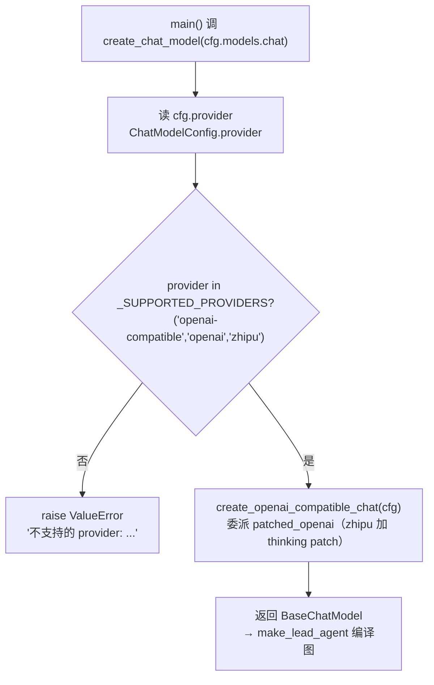

# models/factory.py — factory.py

> **文件路径**: `backend/packages/harness/agentflow/models/factory.py`
> **目录位置**: models → factory.py
> **职责**: 模型工厂

## 📑 目录

- [📋 结构图](#📋-结构图)
- [📤 关键导出](#📤-关键导出)
- [💡 设计思想](#💡-设计思想)
- [🎯 实用场景](#🎯-实用场景)
- [📊 顺序执行链流程图](#📊-顺序执行链流程图)
- [🧩 代码解析（成块对照 factory.py）](#🧩-代码解析成块对照-factorypy)
- [❓ Q&A](#❓-qa)
- [⚠️ 风险点](#⚠️-风险点)

## 📋 结构图

```text
┌──────────────────────────────────────────────┐
│ create_chat_model(ChatModelConfig)           │
│   │                                         │
│   ├─ provider = openai-compatible → ChatOpenAI│
│   ├─ provider = openai           → ChatOpenAI│
│   ├─ provider = zhipu           → ChatOpenAI│
│   └─ 其他 → raise ValueError                 │
└──────────────────────────────────────────────┘
```

## 📤 关键导出

**函数**

- `create_chat_model()`

**常量**

- `_SUPPORTED_PROVIDERS`

## 💡 设计思想

1. 工厂模式：配置 → 模型实例，调用方不关心具体供应商。
2. 全走 OpenAI 兼容协议（zhipu/deepseek/openai 都是），
   ChatOpenAI 换 base_url + api_key 即可（Q: 为什么都走 OpenAI 兼容）。
3. 测试注入点：测试可传 mock 模型，不真调 API。

## 🎯 实用场景

1. 模型工厂：按配置创建 ChatOpenAI（zhipu/deepseek 都是 OpenAI 兼容协议）
2. 切模型只需改配置：4.5↔4.7↔DeepSeek 不用改代码（config.yaml 注释里有备选）
3. 测试注入点：测试可传 mock 模型，不真调 API

## 📊 顺序执行链流程图

```text
main() 调 create_chat_model(cfg.models.chat)（request）
│
▼
读 cfg.provider               ← ChatModelConfig.provider
│
▼
provider in _SUPPORTED_PROVIDERS?   ← ("openai-compatible", "openai", "zhipu")
├─ 否 → raise ValueError("不支持的 provider: ...")  ← 白名单外宁可报错
└─ 是 ↓
▼
create_openai_compatible_chat(cfg)   ← 委派 patched_openai（zhipu 加 thinking patch）
│
▼
返回 BaseChatModel → make_lead_agent 编译图
```

**Mermaid 版（GitHub / 飞书渲染；VSCode 需装插件）**：



## 🧩 代码解析（成块对照 factory.py）

> 读法：每块先贴**完整代码**，再看块下方的整块解析。代码与文件一致，仅省略头部规范注释。

### 块 1：imports —— 模型统一接口 + 两个同域模块

```python
from __future__ import annotations

# BaseChatModel: LangChain 模型统一接口（所有模型类的抽象基类）
from langchain_core.language_models import BaseChatModel

from agentflow.config.model_config import ChatModelConfig
from agentflow.models.patched_openai import create_openai_compatible_chat
```

**结构简析**：四个 import 分两类——`langchain_core.BaseChatModel` 是 LangChain 所有聊天模型的抽象基类（工厂返回类型签名用它，调用方只认这个接口，不关心具体是 ChatOpenAI 还是 mock）；同域两个是数据来源（`ChatModelConfig`）和适配出口（`create_openai_compatible_chat`）。

**补充**：工厂本身**不直接 new 模型**，而是委派给 patched_openai。

### 块 2：`_SUPPORTED_PROVIDERS` —— provider 白名单

```python
# provider 白名单：当前支持的供应商类型（都走 OpenAI 兼容协议）
_SUPPORTED_PROVIDERS = ("openai-compatible", "openai", "zhipu")
```

**结构简析**：元组常量写死当前支持的三种 provider（`"openai-compatible"`、`"openai"`、`"zhipu"`）。

**补充**：三者都走同一个适配函数 `create_openai_compatible_chat`——区别只在 base_url/api_key（和 zhipu 在 patch 层加的 extra_body），所以白名单再长也只是「放行」，不是「分发到不同构造函数」。

### 块 3：`create_chat_model` —— 工厂入口

```python
def create_chat_model(cfg: ChatModelConfig) -> BaseChatModel:
    """按配置创建对话模型（工厂入口）。

    参数:
        cfg: ChatModelConfig（provider/base_url/model/api_key/temperature）

    返回:
        BaseChatModel: 可直接被 create_agent 使用的模型实例

    扩展点（M6）: 增加供应商只需:
        1. patched_xxx.py 加适配函数
        2. 本函数加一个 provider 分支
    配置驱动，Agent 层代码不动。
    """
    if cfg.provider in _SUPPORTED_PROVIDERS:
        return create_openai_compatible_chat(cfg)
    raise ValueError(f"不支持的 provider: {cfg.provider}")
```

**结构简析**：函数体就两行——① `if cfg.provider in _SUPPORTED_PROVIDERS` 命中白名单就委派 `create_openai_compatible_chat(cfg)`；② 否则 `raise ValueError`。

**`create_chat_model()` 参数逐条解释**：

| 参数 | 类型 | 默认值 | 含义 |
|---|---|---|---|
| `cfg` | `ChatModelConfig` | 必填 | 对话模型配置（含 provider/base_url/model/api_key/temperature）；函数只读 `cfg.provider` 做白名单判断，其余字段透传给适配函数 |

**落库要点/补充**：**白名单外直接报错而非静默降级**——配错 provider 时第一时间炸出来，比偷偷换个供应商跑歪结果好得多。docstring 的「扩展点（M6）」：未来加供应商 = 新 patched_xxx + 加分支，Agent 层（make_lead_agent 调用处）零改动——这就是工厂模式的收益。

## ❓ Q&A

**Q: zhipu/deepseek 为什么都能用？**

A: 都是 OpenAI 兼容协议，ChatOpenAI 换 base_url+api_key 即可

**Q: 怎么切回 DeepSeek？**

A: config.yaml models 段 provider 改 deepseek，.env 配 DEEPSEEK_API_KEY

## ⚠️ 风险点

1. provider 白名单外直接 raise ValueError（宁可失败不静默换供应商）
2. 新增供应商 = 加一个分支 + config.yaml 注释说明，勿破坏现有分支

---
_自动生成于 doc-code 规范落地（2026-09-28）。来源：factory.py 头部注释 + 顶层符号。_
_2026-09-30 补齐：目录 + 顺序执行链流程图 + 成块代码解析（+Q&A）。_
_2026-10-03 重构：代码解析段按「结构简析 + 参数逐条表格 + 落库要点」规范化（代码块零改动）。_
