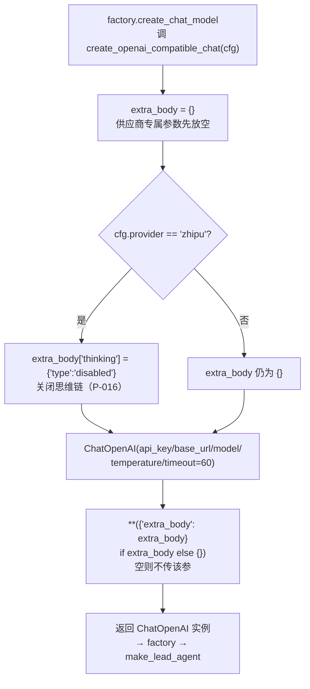

# models/patched_openai.py — patched_openai.py

> **文件路径**: `backend/packages/harness/agentflow/models/patched_openai.py`
> **目录位置**: models → patched_openai.py
> **职责**: OpenAI 兼容供应商适配

## 📑 目录

- [📋 结构图](#📋-结构图)
- [📤 关键导出](#📤-关键导出)
- [💡 设计思想](#💡-设计思想)
- [🎯 实用场景](#🎯-实用场景)
- [📊 顺序执行链流程图](#📊-顺序执行链流程图)
- [🧩 代码解析（成块对照 patched_openai.py）](#🧩-代码解析成块对照-patched_openaipy)
- [❓ Q&A / 知识点](#❓-qa--知识点)
- [⚠️ 风险点](#⚠️-风险点)

## 📋 结构图

```text
┌──────────────────────────────────────────────┐
│ create_openai_compatible_chat(ChatModelConfig)│
│   → ChatOpenAI(                              │
│       api_key=cfg.api_key,                   │
│       base_url=cfg.base_url,                 │
│       model=cfg.model,                       │
│       temperature=cfg.temperature,           │
│     )                                        │
└──────────────────────────────────────────────┘
```

## 📤 关键导出

**函数**

- `create_openai_compatible_chat()`

## 💡 设计思想

1. ChatOpenAI 向 base_url 发 /chat/completions 请求——
   DeepSeek/GLM/Ollama/LM Studio 都兼容此协议。
2. 独立文件 = 收敛层占位：供应商差异（如智谱 thinking extra_body,
   P-016）以后都收在这里，不污染 factory。

## 🎯 实用场景

1. 智谱流式修复：extra_body thinking disabled，让流式走 content 而非 reasoning_content（P-016）

## 📊 顺序执行链流程图

```text
factory.create_chat_model 调 create_openai_compatible_chat(cfg)（request）
│
▼
extra_body = {}                ← 供应商专属参数先放空
│
▼
cfg.provider == "zhipu"?       ← 分支判断
├─ 是 → extra_body["thinking"] = {"type": "disabled"}  关闭思维链（P-016）
└─ 否 → extra_body 仍为 {}
│
▼
ChatOpenAI(api_key/base_url/model/temperature/timeout=60)
│  **({"extra_body": extra_body} if extra_body else {})  ← 空则不传 extra_body 参数
▼
返回 ChatOpenAI 实例 → factory → make_lead_agent
```

**Mermaid 版（GitHub / 飞书渲染；VSCode 需装插件）**：



## 🧩 代码解析（成块对照 patched_openai.py）

> 读法：每块先贴**完整代码**，再看块下方的整块解析。代码与文件一致，仅省略头部规范注释。

### 块 1：imports —— ChatOpenAI + 配置类型

```python
from __future__ import annotations

# ChatOpenAI: LangChain 对 OpenAI 协议的封装
# 它向 base_url 发 /chat/completions 请求——DeepSeek/GLM/Ollama/LM Studio 都兼容
from langchain_openai import ChatOpenAI

from agentflow.config.model_config import ChatModelConfig
```

**结构简析**：两个 import——`ChatOpenAI` 是 LangChain 对 OpenAI 协议的封装（向 `base_url` 发 `/chat/completions`，DeepSeek/GLM/Ollama/LM Studio 都兼容这个协议）；`ChatModelConfig` 是入参类型。

**补充**：这个文件就是「构造 ChatOpenAI 实例」的收敛层。

### 块 2：`extra_body` 装配 —— zhipu 思维链开关

```python
    # 供应商专属请求参数（patch 层职责：不同供应商在 extra body 上有细微差异）
    extra_body: dict = {}
    if cfg.provider == "zhipu":
        # 智谱 thinking 模型默认开启思维链 → 流式时内容在 delta.reasoning_content，
        # langchain-openai 只解析 delta.content → 全空（CLI 打字不出内容，见 P-016）。
        # 关闭思考模式：内容走标准 content 字段（对话场景不需要思维链）。
        extra_body["thinking"] = {"type": "disabled"}
```

**结构简析**：本块是 `create_openai_compatible_chat(cfg)` 的函数体前半——`extra_body` 初始化为空 dict，仅当 `cfg.provider == "zhipu"` 时写入 `thinking={"type":"disabled"}`。

**`create_openai_compatible_chat()` 参数逐条解释**：

| 参数 | 类型 | 默认值 | 含义 |
|---|---|---|---|
| `cfg` | `ChatModelConfig` | 必填 | 对话模型配置；`base_url` 指向对应供应商的 OpenAI 兼容端点；本块只读 `cfg.provider` 决定是否加 zhipu 补丁 |

**落库要点/补充**：根因是 P-016——智谱 thinking 模型默认开思维链，流式时正文在 `delta.reasoning_content`，而 langchain-openai 只解析 `delta.content`，结果 CLI 打出来全是空；关掉思考模式后内容走标准 `content` 字段，流式才正常（对话场景不需要思维链，所以直接关）。

### 块 3：实例化 `ChatOpenAI` —— 收敛层出口

```python
    return ChatOpenAI(
        api_key=cfg.api_key,        # 密钥（构造时就校验，为空会抛 Missing credentials）
        base_url=cfg.base_url,      # API 地址（如 https://api.deepseek.com/v1）
        model=cfg.model,            # 模型名（如 deepseek-chat）
        temperature=cfg.temperature,  # 采样温度
        timeout=60,                 # 请求超时兜底（秒）：免费模型高峰可能"挂起"不返回
        #   —— 60s 无响应抛 APITimeoutError，由 CLI 容错打印友好提示，不会无限等
        #   —— 实测：智谱 GLM-4.7-Flash 高峰 code 1305 限流（见问题日志 P-015）
        **({"extra_body": extra_body} if extra_body else {}),
    )
```

**结构简析**：把 `ChatModelConfig` 的字段一一映射给 `ChatOpenAI` 构造器（api_key/base_url/model/temperature 透传 + 硬编码 `timeout=60`），最后用三元组展开条件传 `extra_body`。

**落库要点/补充**：① `timeout=60` 是兜底——免费模型高峰可能挂起不返回，60 秒抛 APITimeoutError，由 CLI 容错打印，不会无限等（P-015 实测智谱 GLM-4.7-Flash 高峰 code 1305 限流）；② `**({"extra_body": extra_body} if extra_body else {})` 是条件传参——extra_body 为空（非 zhipu）时就不传这个 kwarg，避免给 ChatOpenAI 塞个空 dict；③ api_key 为空会在构造时抛 Missing credentials，这是「缺 key」的真正暴露点。本块无新增参数，沿用块 2 的 `cfg`。

## ❓ Q&A / 知识点

### 1. 为什么智谱必须关掉 thinking？（P-016 根因）

**一句话**：不关的话，流式正文被塞进 `delta.reasoning_content`，而 langchain-openai 只读 `delta.content`，CLI 一个字都打不出来。

| 状态 | 流式 chunk 里正文在哪 | langchain-openai 读哪 | 结果 |
|---|---|---|---|
| thinking 开（默认） | `delta.reasoning_content` | `delta.content` | content 空 → CLI 打不出字 |
| thinking disabled | `delta.content`（标准字段） | `delta.content` | 正常流式输出 |

`extra_body["thinking"] = {"type": "disabled"}` 就是在请求体里告诉智谱"对话场景不要思维链"。

### 2. extra_body 为空时为什么用三元组展开？

**一句话**：`**({"extra_body": extra_body} if extra_body else {})`——有 patch 才传参，没 patch 就不传，保持 ChatOpenAI 构造签名干净。

- zhipu → extra_body 非空 → 展开成 `extra_body={"thinking":...}`
- 其他 provider → extra_body 是 `{}` → `else {}` 展开为空 → 不传该 kwarg

比"永远传 extra_body={}"更干净，也避免未来误判。

## ⚠️ 风险点

1. 智谱流式需 extra_body thinking disabled（P-016），M6 在此补 patch
2. 当前直接返回标准 ChatOpenAI，无副作用

---
_自动生成于 doc-code 规范落地（2026-09-28）。来源：patched_openai.py 头部注释 + 顶层符号。_
_2026-09-30 补齐：目录 + 顺序执行链流程图 + 成块代码解析（+Q&A）。_
_2026-10-03 重构：代码解析段按「结构简析 + 参数逐条表格 + 落库要点」规范化（代码块零改动）。_
