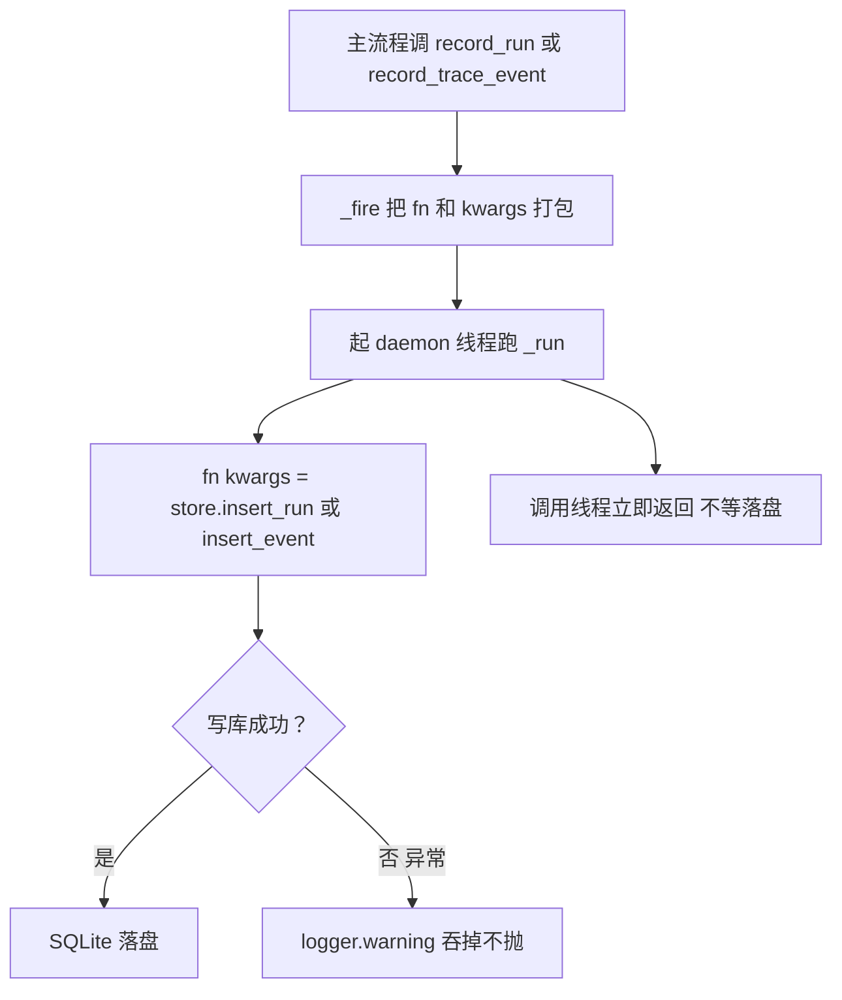

# observability/recorder.py — recorder.py

> **文件路径**: `backend/packages/harness/agentflow/observability/recorder.py`
> **目录位置**: observability → recorder.py
> **职责**: 可观测记录器——run 根记录 + span 事件，fire-and-forget 异步写库（M6）

## 📑 目录

- [📋 结构图](#-结构图)
- [📤 关键导出](#-关键导出)
- [💡 设计思想](#-设计思想)
- [🎯 实用场景](#-实用场景)
- [📊 顺序执行链流程图](#-顺序执行链流程图)
- [🧩 代码解析（成块对照 recorder.py）](#-代码解析成块对照-recorderpy)
- [❓ Q&A / 知识点](#-qa--知识点)
- [⚠️ 风险点](#-风险点)

## 📋 结构图

```text
┌──────────────────────────────────────────────────────────────┐
│ new_run_id() → "r_" + os.urandom(6).hex()  短随机 run_id     │
│                                                              │
│ ObservabilityRecorder(store: ObsTraceStore)                  │
│   __init__ → store.create_tables()（幂等建表）                │
│   record_run(run_id, thread_id, started_at, ...)             │
│     → _fire(store.insert_run, ...)   ← fire-and-forget       │
│   record_trace_event(run_id, kind, span_name, ...)           │
│     → _fire(store.insert_event, ...) ← fire-and-forget       │
│   _fire(fn, **kwargs):                                       │
│     daemon 线程跑 fn(**kwargs)，异常 logger.warning 吞掉       │
└──────────────────────────────────────────────────────────────┘
```

## 📤 关键导出

**类**

- `ObservabilityRecorder`（记录器：record_run / record_trace_event）

**函数**

- `new_run_id`（生成 run 级唯一 ID）

## 💡 设计思想

1. **fire-and-forget**：观测写入绝不阻塞主流程——模型 invoke 的时延不该等 SQLite 落盘；
   每次写起一个 daemon 线程跑，失败只打日志不抛给调用方。
2. **调用方零侵入**：`record_*` 只收标量关键字参数，调用方不用 import store/sqlite。
3. **可测试**：注入内存 store（`sqlite_path=":memory:"`）即可断言链路完整。
4. **与 store 分工**：recorder 管"何时记/异步发"，store 管"怎么落 SQLite"。

## 🎯 实用场景

1. **对话开始**：一次请求入口调 `record_run(new_run_id(), thread_id, started_at)`。
2. **各 span 点**：模型调用/工具调用/中间件埋点调 `record_trace_event(...)`。
3. **装配**：`__init__(store)` 时 `create_tables()` 幂等建表。
4. **排障**：失败被吞成 warning，查日志 `observability write failed:` 关键词。

## 📊 顺序执行链流程图

**调用方**：`ObservabilityRecorder` ← agent/webui 埋点；`store` ← `observability/store.py`。

```text
主流程（调用线程，不阻塞）
│
├─ run_id = new_run_id()           "r_" + 6字节随机hex
├─ recorder.record_run(run_id, ...)
│     └─ _fire(store.insert_run, ...)
└─ recorder.record_trace_event(run_id, kind, ...)
      └─ _fire(store.insert_event, ...)
            │
            ▼（每写一次新起一个 daemon 线程）
        _run():
          try: fn(**kwargs)        → store.insert_* → SQLite 落盘
          except: logger.warning("observability write failed: %s")
            │
            ▼（异常被吞，主流程无感知）
        调用线程立即返回（不等落盘）
```

**Mermaid 版（GitHub / 飞书渲染）**：



## 🧩 代码解析（成块对照 recorder.py）

> 读法：每块先贴**完整代码**，再看块下方的整块解析。代码与文件一致。

### 块 1：imports + `new_run_id`

```python
from __future__ import annotations

import logging
import os
import threading
from typing import Any

from agentflow.observability.store import ObsTraceStore

logger = logging.getLogger(__name__)


def new_run_id() -> str:
    """生成 run_id：r_ + 6 字节随机 hex（与 thread_id/task_id 同款风格）。"""
    return "r_" + os.urandom(6).hex()
```

**结构简析**：标准库（logging/os/threading/Any）+ 依赖 `ObsTraceStore`。`new_run_id()` 是模块级函数，
生成 run 级唯一 ID——`"r_" + os.urandom(6).hex()`（12 字符随机 hex）。

**`new_run_id()` 参数逐条解释**：无参数。返回 `"r_" + 6 字节密码学随机字节的 hex`——
与 thread_id/task_id 同款 `"r_"` 前缀风格，多线程/多进程下无需协调自增。

**落库要点**：run_id 是 `agentflow_obs_runs` 主键；随机 hex 不暴露请求总量，冲突概率可忽略。

### 块 2：`ObservabilityRecorder.__init__` + `record_run` + `record_trace_event`

```python
class ObservabilityRecorder:
    """可观测记录器：run 根记录 + span 事件，异步写库（fire-and-forget）。"""

    def __init__(self, store: ObsTraceStore) -> None:
        self._store = store
        self._store.create_tables()

    def record_run(
        self,
        *,
        run_id: str,
        thread_id: str,
        started_at: str,
        duration_ms: float = 0.0,
        status: str = "ok",
    ) -> None:
        """记录一次对话/一次请求（根）。异步落库，失败仅告警。"""
        self._fire(self._store.insert_run, run_id=run_id, thread_id=thread_id,
                  started_at=started_at, duration_ms=duration_ms, status=status)

    def record_trace_event(
        self,
        *,
        run_id: str,
        kind: str,
        span_name: str,
        started_at: str,
        duration_ms: float = 0.0,
        meta: dict[str, Any] | None = None,
        status: str = "ok",
    ) -> None:
        """记录一个 span（模型调用/工具调用/中间件）。异步落库。"""
        self._fire(
            self._store.insert_event,
            run_id=run_id,
            kind=kind,
            span_name=span_name,
            started_at=started_at,
            duration_ms=duration_ms,
            meta=meta,
            status=status,
        )
```

**结构简析**：`__init__` 注入 store 并 `create_tables()`（幂等建表）。两个 record 方法签名与
store 的 `insert_run`/`insert_event` **逐参数对齐**（全关键字），内部只是把调用转发给 `_fire`
异步执行——自身不写库、不阻塞。

**`__init__()` 参数逐条解释**：

| 参数 | 类型 | 默认值 | 含义 |
|---|---|---|---|
| `store` | `ObsTraceStore` | 必填 | 可观测存储；构造时立即 `store.create_tables()` 幂等建两表 |

**`record_run()` 参数逐条解释**：

| 参数 | 类型 | 默认值 | 含义 |
|---|---|---|---|
| `run_id` | `str` | 必填（关键字） | run 主键（一般由 `new_run_id()` 生成） |
| `thread_id` | `str` | 必填（关键字） | 归属会话线程 id |
| `started_at` | `str` | 必填（关键字） | 开始时刻（ISO 串，调用方传入） |
| `duration_ms` | `float` | `0.0` | 根记录总耗时（毫秒） |
| `status` | `str` | `"ok"` | 终态 |

**`record_trace_event()` 参数逐条解释**：

| 参数 | 类型 | 默认值 | 含义 |
|---|---|---|---|
| `run_id` | `str` | 必填（关键字） | 归属 run（挂到对应 run 的链路下） |
| `kind` | `str` | 必填（关键字） | span 类型：`model_call` / `tool_call` / `middleware` |
| `span_name` | `str` | 必填（关键字） | span 名（模型名/工具名等） |
| `started_at` | `str` | 必填（关键字） | span 开始时刻（ISO 串） |
| `duration_ms` | `float` | `0.0` | span 耗时（毫秒） |
| `meta` | `dict[str, Any] \| None` | `None` | span 细节 dict，store 侧序列化进 `meta_json` |
| `status` | `str` | `"ok"` | span 终态 |

**落库要点**：两方法都立即 `self._fire(...)` 返回——主流程不等落盘；真正的 INSERT/COMMIT 在 `_fire` 的后台线程里。

### 块 3：`_fire` —— fire-and-forget 异步写库

```python
    def _fire(self, fn, **kwargs: Any) -> None:
        """fire-and-forget：后台线程执行写库，异常只打日志。"""
        def _run() -> None:
            try:
                fn(**kwargs)
            except Exception as exc:  # noqa: BLE001 —— 观测失败不干扰主流程
                logger.warning("observability write failed: %s", exc)

        threading.Thread(target=_run, daemon=True).start()
```

**结构简析**：`_fire` 是异步核心——把"写库函数 + 它的 kwargs"包进 `_run`，起一个
`daemon=True` 线程跑；`_run` 内 try 包住，任何异常只 `logger.warning`，**绝不向上抛**。

**`_fire()` 参数逐条解释**：

| 参数 | 类型 | 默认值 | 含义 |
|---|---|---|---|
| `fn` | callable | 必填 | 要异步执行的写库函数（如 `store.insert_run` / `store.insert_event`） |
| `**kwargs` | `Any` | `{}` | 透传给 `fn` 的关键字参数（run_id/kind/...） |

**落库要点**：daemon 线程随主进程退出即结束，不 join、不等结果；观测写失败被降级为一条 warning，
主流程（模型 invoke）零感知——代价是极端情况下**观测事件会丢**。

## ❓ Q&A / 知识点

### 1. fire-and-forget 为什么"失败只打日志不抛"？

**一句话**：可观测是旁路能力——它挂了不该拖垮主流程（模型调用不能因为 SQLite 写失败就报错）。

`_run` 里 `except Exception: logger.warning(...)` 把所有写库异常降级成一条 warning。
这是刻意的容错设计：观测数据允许丢，业务结果不能受影响。代价就是排障时可能看到链路缺 span。

### 2. new_run_id 的 run_id 是怎么生成的？为什么用随机 hex？

**一句话**：`"r_" + os.urandom(6).hex()`——6 字节密码学随机数（12 字符 hex），
与 thread_id/task_id 同款风格，多线程下无需协调自增、也不暴露请求总量。

用随机而非自增整数：自增会泄漏"系统处理了多少请求"，且需要跨线程锁；随机 hex 冲突概率可忽略，
`r_` 前缀让人一眼识别这是 observability run。

### 3. recorder 和 store 怎么分工？为什么不直接让调用方调 store？

**一句话**：recorder 管"何时记 + 异步发 + 容错吞错"，store 管"怎么落 SQLite"——
调用方只面向 recorder 的标量接口，不用 import sqlite/JSON，零侵入。

若让调用方直接 `store.insert_run`，就失去了 fire-and-forget 异步性和失败降级——
模型调用会同步等落盘，观测写失败还会冒泡炸主流程。recorder 这层就是为了把这两件事收口。

### 4. 每次写都新起一个线程，会不会有问题？

**一句话**：M6 接受这个简单实现——每次 record_* 起一个短生命周期 daemon 线程，
避免了建队列/worker 的复杂度；代价是高频 span 下线程数短时膨胀。

没有队列背压：若 obs.db 锁竞争激烈（`timeout=10` 等锁），后台线程会在那等，
异常被吞。M6 数据量小可接受；要扩到高频链路需改单写线程 + 队列模型。

## ⚠️ 风险点

1. **异步记录会丢事件**：daemon 线程随主进程退出即被杀——进程在落盘前退出，未落库的 span 直接丢；
   写库异常也被吞成 warning。排障时链路不完整属预期，查 `observability write failed:` 日志。
2. **无线程池/队列**：每次写新起一个 daemon 线程，高频埋点下线程短时膨胀，且无背压。
3. **started_at 由调用方传入**：recorder 不打自己的时间戳，主流程若时钟错乱会影响链路时序。
4. **daemon 线程不 join**：主进程退出时后台写线程可能还没落盘——不要指望"进程退出前 flush 观测"。

---
_2026-10-05 M6 新增：目录 + 结构图 + 流程图 + 成块代码解析（参数逐条表）+ Q&A。_
