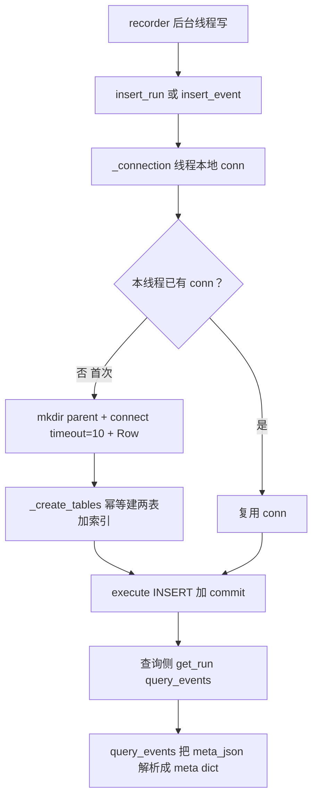

# observability/store.py — store.py

> **文件路径**: `backend/packages/harness/agentflow/observability/store.py`
> **目录位置**: observability → store.py
> **职责**: 可观测链路 SQLite 存储（runs 根表 + trace_events span 表，db_path 线程本地连接，M6）

## 📑 目录

- [📋 结构图](#-结构图)
- [📤 关键导出](#-关键导出)
- [💡 设计思想](#-设计思想)
- [🎯 实用场景](#-实用场景)
- [📊 顺序执行链流程图](#-顺序执行链流程图)
- [🧩 代码解析（成块对照 store.py）](#-代码解析成块对照-storepy)
- [❓ Q&A / 知识点](#-qa--知识点)
- [⚠️ 风险点](#-风险点)

## 📋 结构图

```text
┌──────────────────────────────────────────────────────────────┐
│ ObsTraceStore(sqlite_path)                                   │
│   _local = threading.local()   ← P-018 线程本地连接          │
│   _connection() → 线程首连时 mkdir + connect + row_factory    │
│                   + 自动 _create_tables（幂等）              │
│   _create_tables(conn): runs + trace_events + idx 索引       │
│   create_tables():     公开建表入口（幂等）                   │
│   insert_run(...):     INSERT OR REPLACE runs（根记录）      │
│   insert_event(...):   INSERT trace_events（span 明细）      │
│   get_run(run_id):     → run dict | None                     │
│   query_events(run_id):→ [span dict]（按 started_at 升序）    │
│   close():             关当前线程连接（幂等）                 │
└──────────────────────────────────────────────────────────────┘
```

## 📤 关键导出

**类**

- `ObsTraceStore`（可观测存储：建表 / 写入 / 查询）

## 💡 设计思想

1. **独立数据库（默认 `data/obs.db`）**：可观测数据与业务库分离——业务库坏了不影响观测，
   观测库膨胀可整体删（M6 不做归档）。
2. **run 是根、event 是 span**：一次对话 = 1 run + N events（模型调用/工具调用/中间件），
   按 run_id 一查即得完整链路。
3. **线程本地连接（P-018）**：`threading.local()` 每线程一 conn——recorder 的
   fire-and-forget 在后台线程写库，共享主线程 conn 会撞 SQLite `check_same_thread`。
4. **meta_json 存 JSON 文本**：span 细节序列化进单列，查询层再 `json.loads`——列模型最小化。
5. **row_factory=Row**：查询返回 dict 形状，上层不用记列序。

## 🎯 实用场景

1. **recorder 装配**：`recorder.py:__init__` 收到 store 后调 `create_tables()` 建表。
2. **写链路**：对话开始 `insert_run`，各 span 点 `insert_event`（由 recorder fire-and-forget 触发）。
3. **查链路**：`get_run(run_id)` 取根记录 + `query_events(run_id)` 取全部 span，按 started_at 升序拼成完整时序。
4. **测试注入**：可单独测试 store 时传 `sqlite_path=":memory:"`；但 recorder 会在新线程写入，
   而线程本地连接会为该线程创建另一份内存库。跨线程 recorder 测试应使用临时磁盘文件。

## 📊 顺序执行链流程图

**调用方**：`ObsTraceStore` ← `observability/recorder.py`（写）；
查询侧 `get_run`/`query_events` ← webui/排障读链路口。

```text
recorder（fire-and-forget 后台线程）
│
├─ store.insert_run(run_id, ...)
└─ store.insert_event(run_id, kind, ...)
        │
        ▼
    conn = self._connection()
        线程首次？→ mkdir parent + sqlite3.connect(timeout=10)
                  + row_factory=Row + _create_tables(conn)（幂等）
        │
        ▼
    conn.execute(f"INSERT ... {ObservabilityTable.RUNS/TRACE_EVENTS} ...")
    conn.commit()
        │
        ▼
查询侧（webui / 排障）
    get_run(run_id) → SELECT * FROM runs WHERE run_id=? → dict|None
    query_events(run_id) → SELECT * FROM events WHERE run_id=?
                           ORDER BY started_at ASC → meta_json 解析成 meta
```

**Mermaid 版（GitHub / 飞书渲染）**：



## 🧩 代码解析（成块对照 store.py）

> 读法：每块先贴**完整代码**，再看块下方的整块解析。代码与文件一致。

### 块 1：imports + `ObsTraceStore.__init__` + `_connection`

```python
from __future__ import annotations

import json
import sqlite3
import threading
from pathlib import Path
from typing import Any

from agentflow.observability.tables import ObservabilityTable


class ObsTraceStore:
    """可观测链路存储（SQLite）。

    runs: 一次对话/一次请求的根记录（run_id/thread_id/started_at/duration_ms/status）
    trace_events: 该 run 下的 span 明细（kind/span_name/started_at/duration_ms/meta/status）
    """

    def __init__(self, sqlite_path: str | Path) -> None:
        self._path = Path(sqlite_path)
        # P-018 教训：线程本地连接，绝不跨线程共享 conn
        # （recorder 的 fire-and-forget 在后台线程写库，共享主线程 conn 会撞
        #   SQLite check_same_thread 限制）
        self._local = threading.local()

    def _connection(self) -> sqlite3.Connection:
        conn = getattr(self._local, "conn", None)
        if conn is None:
            self._path.parent.mkdir(parents=True, exist_ok=True)
            conn = sqlite3.connect(str(self._path), timeout=10)
            conn.row_factory = sqlite3.Row
            self._local.conn = conn
            self._create_tables(conn)  # 每个线程首次连接自动建表（幂等）
        return conn
```

**结构简析**：标准库导入（json/sqlite3/threading/Path/Any）+ 表名常量 `ObservabilityTable`。
`__init__` 只存 `sqlite_path` 包成 `Path`，并建 `threading.local()` 线程本地槽——**不在这里建连**。
`_connection()` 是懒建连：每线程第一次访问时才 `connect`，并顺手 `mkdir -p`、设 `row_factory=Row`、
自动 `_create_tables`（幂等）。

**`__init__()` 参数逐条解释**：

| 参数 | 类型 | 默认值 | 含义 |
|---|---|---|---|
| `sqlite_path` | `str \| Path` | 必填 | obs.db 路径（包成 `Path` 存 `self._path`）；测试可传 `:memory:`；父目录在首连时 `mkdir(parents=True, exist_ok=True)` 自动建 |

**`_connection()` 参数逐条解释**：无参数。按线程本地槽取 conn，没有才建——
与 persistence BaseRepository 的 db_path 线程本地连接模式（P-018）一致。

**落库要点**：`sqlite3.connect(..., timeout=10)` 给 10 秒锁等待；`row_factory=sqlite3.Row` 让
`dict(row)` 直接转 dict；每个线程首连都跑一次 `_create_tables`（`IF NOT EXISTS` 幂等，重复跑无害）。

### 块 2：`_create_tables` + `create_tables` —— 两表一索引

```python
    def _create_tables(self, conn: sqlite3.Connection) -> None:
        """建表 SQL（对给定连接执行）。幂等。"""
        conn.executescript(
            f"""
            CREATE TABLE IF NOT EXISTS {ObservabilityTable.RUNS} (
                run_id TEXT PRIMARY KEY,
                thread_id TEXT NOT NULL,
                started_at TEXT NOT NULL,
                duration_ms REAL NOT NULL DEFAULT 0,
                status TEXT NOT NULL DEFAULT 'ok'
            );
            CREATE TABLE IF NOT EXISTS {ObservabilityTable.TRACE_EVENTS} (
                id INTEGER PRIMARY KEY AUTOINCREMENT,
                run_id TEXT NOT NULL,
                kind TEXT NOT NULL,
                span_name TEXT NOT NULL,
                started_at TEXT NOT NULL,
                duration_ms REAL NOT NULL DEFAULT 0,
                meta_json TEXT NOT NULL DEFAULT '{{}}',
                status TEXT NOT NULL DEFAULT 'ok'
            );
            CREATE INDEX IF NOT EXISTS idx_obs_events_run
                ON {ObservabilityTable.TRACE_EVENTS}(run_id, started_at);
            """
        )
        conn.commit()

    def create_tables(self) -> None:
        """公开建表入口（幂等）。内部各方法首次访问连接时也会自动建表。"""
        self._create_tables(self._connection())
```

**结构简析**：`_create_tables` 用 `executescript` 一把建两表一索引，全 `IF NOT EXISTS` 幂等。
`runs` 以 `run_id` 为主键；`trace_events` 自增 `id` 为主键、`run_id` 挂归属，
并在 `(run_id, started_at)` 建复合索引（按 run 查链路 + 按时间排序的热路径）。
`create_tables()` 是公开入口，内部方法首连时其实也会自动建。

**`_create_tables()` 参数逐条解释**：

| 参数 | 类型 | 默认值 | 含义 |
|---|---|---|---|
| `conn` | `sqlite3.Connection` | 必填 | 目标连接；建表 SQL 对它执行（表名走 `ObservabilityTable.RUNS/TRACE_EVENTS` f-string 插值） |

**`create_tables()` 参数逐条解释**：无参数，调 `_create_tables(self._connection())`——
公开幂等建表入口（recorder `__init__` 显式调一次）。

**落库要点**：`meta_json` 默认值 `'{{}}'`——因为整段 SQL 在 f-string 里，
双花括号 `{{}}` 转义后落库就是字面 `{}`；`duration_ms` 默认 `0`、`status` 默认 `'ok'`。

### 块 3：`insert_run` + `insert_event` —— 写根记录与 span

```python
    def insert_run(
        self,
        *,
        run_id: str,
        thread_id: str,
        started_at: str,
        duration_ms: float = 0.0,
        status: str = "ok",
    ) -> None:
        """写一条 run（根记录）。"""
        conn = self._connection()
        conn.execute(
            f"INSERT OR REPLACE INTO {ObservabilityTable.RUNS}"
            "(run_id, thread_id, started_at, duration_ms, status) VALUES (?,?,?,?,?)",
            (run_id, thread_id, started_at, duration_ms, status),
        )
        conn.commit()

    def insert_event(
        self,
        *,
        run_id: str,
        kind: str,
        span_name: str,
        started_at: str,
        duration_ms: float = 0.0,
        meta: dict[str, Any] | None = None,
        status: str = "ok",
    ) -> None:
        """写一条 span（run 下的事件）。kind 如 model_call / tool_call / middleware。"""
        conn = self._connection()
        conn.execute(
            f"INSERT INTO {ObservabilityTable.TRACE_EVENTS}"
            "(run_id, kind, span_name, started_at, duration_ms, meta_json, status)"
            " VALUES (?,?,?,?,?,?,?)",
            (
                run_id,
                kind,
                span_name,
                started_at,
                duration_ms,
                json.dumps(meta or {}, ensure_ascii=False),
                status,
            ),
        )
        conn.commit()
```

**结构简析**：两个写方法都用 `*` 强制关键字传参。`insert_run` 写根记录，用
`INSERT OR REPLACE`（同 run_id 重写可覆盖，幂等）；`insert_event` 写 span，普通 `INSERT`
（每次调用追加一行，自增 id）。`meta` dict 经 `json.dumps(meta or {}, ensure_ascii=False)`
序列化成 `meta_json` 文本。

**`insert_run()` 参数逐条解释**：

| 参数 | 类型 | 默认值 | 含义 |
|---|---|---|---|
| `run_id` | `str` | 必填（关键字） | run 主键；`INSERT OR REPLACE` 同值覆盖 |
| `thread_id` | `str` | 必填（关键字） | 归属会话线程 id |
| `started_at` | `str` | 必填（关键字） | 开始时刻（ISO 串，由调用方传入） |
| `duration_ms` | `float` | `0.0` | 根记录总耗时（毫秒） |
| `status` | `str` | `"ok"` | 终态（`ok` / 其他失败态） |

**`insert_event()` 参数逐条解释**：

| 参数 | 类型 | 默认值 | 含义 |
|---|---|---|---|
| `run_id` | `str` | 必填（关键字） | 归属 run；挂到 `agentflow_obs_runs.run_id`（无外键级联） |
| `kind` | `str` | 必填（关键字） | span 类型，如 `model_call` / `tool_call` / `middleware` |
| `span_name` | `str` | 必填（关键字） | span 名（如模型名/工具名） |
| `started_at` | `str` | 必填（关键字） | span 开始时刻（ISO 串） |
| `duration_ms` | `float` | `0.0` | span 耗时（毫秒） |
| `meta` | `dict[str, Any] \| None` | `None` | span 细节；`None` 落 `{}`；`json.dumps(..., ensure_ascii=False)` 保留中文 |
| `status` | `str` | `"ok"` | span 终态 |

**落库要点**：两方法各一次 `commit()`；`insert_event` 的 `meta` 在写入侧序列化、
`query_events` 在读取侧反序列化——列模型只存文本。

### 块 4：`get_run` + `query_events` + `close`

```python
    def get_run(self, run_id: str) -> dict[str, Any] | None:
        """按 run_id 查根记录；不存在 → None。"""
        conn = self._connection()
        row = conn.execute(
            f"SELECT * FROM {ObservabilityTable.RUNS} WHERE run_id = ?", (run_id,)
        ).fetchone()
        return dict(row) if row is not None else None

    def query_events(self, run_id: str) -> list[dict[str, Any]]:
        """按 run_id 查全部 span（按 started_at 升序）——完整链路。"""
        conn = self._connection()
        rows = conn.execute(
            f"SELECT * FROM {ObservabilityTable.TRACE_EVENTS}"
            " WHERE run_id = ? ORDER BY started_at ASC",
            (run_id,),
        ).fetchall()
        events = []
        for row in rows:
            d = dict(row)
            try:
                d["meta"] = json.loads(d.pop("meta_json") or "{}")
            except json.JSONDecodeError:
                d["meta"] = {}
            events.append(d)
        return events

    def close(self) -> None:
        """关闭当前线程的连接（幂等）。其他线程连接随线程消亡由 GC 回收。"""
        conn = getattr(self._local, "conn", None)
        if conn is not None:
            conn.close()
            self._local.conn = None
```

**结构简析**：`get_run` 取根记录单行（None 安全）；`query_events` 取某 run 全部 span，
按 `started_at ASC` 升序——这就是"完整链路"的时序视图，并在读取侧把 `meta_json` 解析成 `meta` dict
（解码失败兜底 `{}`）。`close()` 只关**当前线程**的连接（幂等），其他线程的 conn 随线程消亡 GC。

**`get_run()` 参数逐条解释**：

| 参数 | 类型 | 默认值 | 含义 |
|---|---|---|---|
| `run_id` | `str` | 必填 | `WHERE run_id = ?` 取单行；命中返回 `dict`，未命中返回 `None` |

**`query_events()` 参数逐条解释**：

| 参数 | 类型 | 默认值 | 含义 |
|---|---|---|---|
| `run_id` | `str` | 必填 | `WHERE run_id = ? ORDER BY started_at ASC` 取该 run 全部 span；每行 `meta_json` 解析进 `meta` 字段（`meta_json` 被 pop 掉） |

**`close()` 参数逐条解释**：无参数，关当前线程 conn 并置 `self._local.conn = None`（幂等）。

**落库要点**：`query_events` 用 `d.pop("meta_json")` 把原始文本列移出、换成解析后的 `meta`——
上层拿到的 dict 里直接是结构化 meta，不用再记 `meta_json` 这一列。

## ❓ Q&A / 知识点

### 1. store 为什么用 threading.local 线程本地连接（P-018）？

**一句话**：recorder 的 fire-and-forget 是在**后台线程**里写库，若共享主线程那条 conn，
会直接撞 SQLite 的 `check_same_thread`（默认只允许建连线程用它）。

`self._local = threading.local()` 让每个线程**各建各的 conn**：主线程查询一条、recorder 后台写线程
另一条，互不共享、互不踩线程限制。这与 persistence BaseRepository 的 db_path 线程本地连接模式
（P-018）完全一致。代价是每个线程首连都会 `_create_tables`（幂等，无害）。

### 2. runs 用 INSERT OR REPLACE、events 用普通 INSERT，区别在哪？

**一句话**：run_id 是 `runs` 主键——同一 run 重写（如结束时补 duration/status）要覆盖，所以
`INSERT OR REPLACE`；events 是追加型 span，每次调用都是新一行（自增 id），普通 `INSERT` 即可。

语义上 run 是"一条根记录可更新终态"，event 是"append-only 的 span 流水"。

### 3. meta_json 为什么写入时 json.dumps、读取时 json.loads，而不是列存？

**一句话**：span 的细节结构随 kind 变化（model_call 有 token 数、tool_call 有入参），
列模型最小化——全塞进一个 JSON 文本列，查询层再解析，不用为每种 kind 加列。

`json.dumps(meta or {}, ensure_ascii=False)` 保留中文；`query_events` 里解码失败兜底 `{}`，
坏 JSON 不会炸掉整条链路查询。

### 4. close() 为什么只关当前线程的连接？

**一句话**：conn 存在 `threading.local()` 槽里，每个线程的 `self._local.conn` 是各自的——
`getattr(self._local, "conn", None)` 拿到的天然就是**本线程**那条，拿不到别的线程的。

其他线程（如 recorder 写线程）的 conn 随线程结束由 GC 回收，无需也无法在这里代关。

## ⚠️ 风险点

1. **后台写线程无队列背压**：每次写都新起一个 daemon 线程（由 recorder._fire），高频 span 下
   线程数会短时膨胀；观测写失败只打日志、**事件会丢**（不影响主流程，但排障时链路可能缺 span）。
2. **JWT/密钥不属本模块**：本模块只管 obs.db；obs.db 里无敏感凭证，但 meta 里可能落 prompt 片段，
   整库删/外传前注意隐私。
3. **独立库不做 WAL/归档**：M6 默认 `data/obs.db`，多写线程并发靠 `timeout=10` 等锁，
   高并发下可能 `database is locked`（被 recorder 吞成 warning）。
4. **表名只认 ObservabilityTable 常量**：SQL 里出现裸表名字符串即漂移，改前缀要同步重建库。

---
_2026-10-05 M6 新增：目录 + 结构图 + 流程图 + 成块代码解析（参数逐条表）+ Q&A。_
