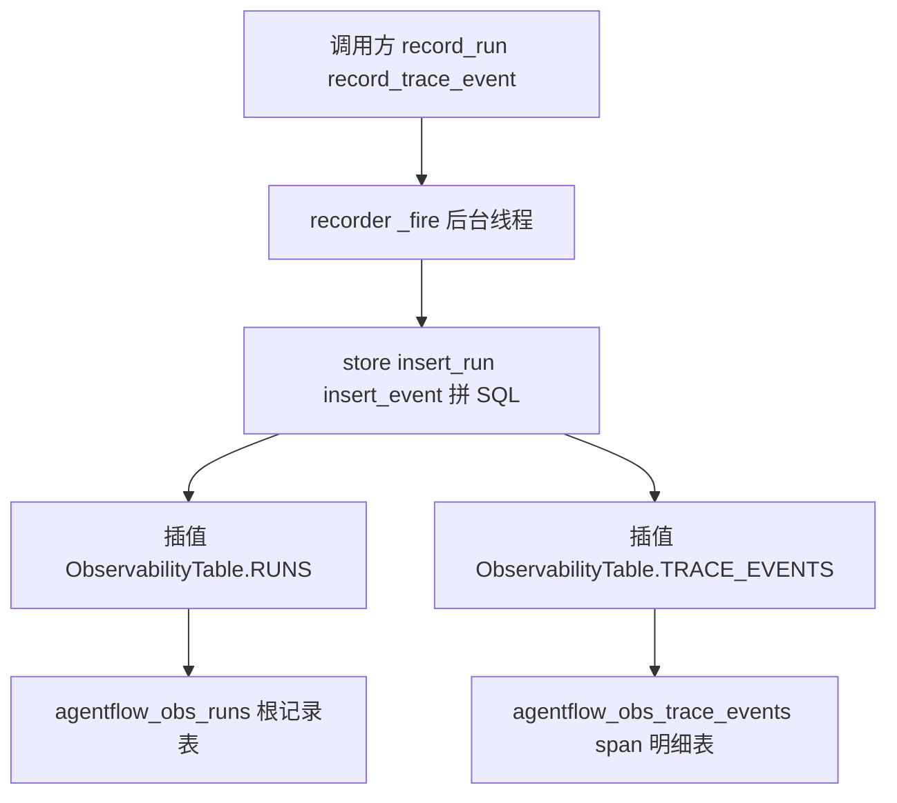

# observability/tables.py — tables.py

> **文件路径**: `backend/packages/harness/agentflow/observability/tables.py`
> **目录位置**: observability → tables.py
> **职责**: 可观测表名常量（统一前缀 `agentflow_obs_`，M6 最小 2 表）

## 📑 目录

- [📋 结构图](#-结构图)
- [📤 关键导出](#-关键导出)
- [💡 设计思想](#-设计思想)
- [🎯 实用场景](#-实用场景)
- [📊 顺序执行链流程图](#-顺序执行链流程图)
- [🧩 代码解析（成块对照 tables.py）](#-代码解析成块对照-tablespy)
- [❓ Q&A / 知识点](#-qa--知识点)
- [⚠️ 风险点](#-风险点)

## 📋 结构图

```text
┌──────────────────────────────────────────────────────────────┐
│ ObservabilityTable（纯常量类，无方法）                        │
│   RUNS        = "agentflow_obs_runs"          （一次对话根记录）│
│   TRACE_EVENTS= "agentflow_obs_trace_events"  （run 下 span 明细）│
│                                                              │
│ 被引用方:                                                    │
│   store.py   → _create_tables / insert_run / insert_event    │
│                 get_run / query_events 全部 SQL f-string 插值  │
└──────────────────────────────────────────────────────────────┘
```

## 📤 关键导出

**类**

- `ObservabilityTable`（表名常量容器，无方法、无实例字段）

## 💡 设计思想

1. **表名集中成常量**：改表名只动这一处，散落各处的 SQL（store.py 全部
   INSERT/SELECT/CREATE）不漂移、不拼错字符串。
2. **统一前缀 `agentflow_obs_`**：与业务表（sessions/goals/automations 等）清晰隔离，
   在同一个 obs.db 里一眼可识别哪些是可观测表。
3. **M6 最小 2 表（D6 裁剪）**：原版对标 8 张表，M6 只留 runs（一次对话/一次请求的根）
   + trace_events（span 明细）——"按 run 查完整链路"的最小数据模型。

## 🎯 实用场景

1. **store 建表**：`store.py:_create_tables` 用 `{ObservabilityTable.RUNS}` /
   `{ObservabilityTable.TRACE_EVENTS}` 做 f-string 表名插值。
2. **写入/查询**：`insert_run` / `insert_event` / `get_run` / `query_events` 的 SQL
   全部引用这两个常量，不出现裸字符串表名。
3. **改名零成本**：将来要把表改名或换前缀，只改本文件两行常量。

## 📊 顺序执行链流程图

**调用方**：`ObservabilityTable` ← `observability/store.py`（建表 + 读写 SQL）；
`store.py` ← `observability/recorder.py`（fire-and-forget 写库）。本图画
**recorder → store → tables 表名引用**关系。

```text
调用方（一次对话开始 / 各 span 点）
│
├─ recorder.record_run(...)
└─ recorder.record_trace_event(...)
        │
        ▼（fire-and-forget 后台线程）
    recorder._fire → store.insert_run / store.insert_event
        │
        ▼（store 拼 SQL 时插值表名）
    f"INSERT INTO {ObservabilityTable.RUNS}"          → "agentflow_obs_runs"
    f"INSERT INTO {ObservabilityTable.TRACE_EVENTS}"  → "agentflow_obs_trace_events"
        │
        ▼
    SQLite（data/obs.db）真正落表
```

**Mermaid 版（GitHub / 飞书渲染）**：



## 🧩 代码解析（成块对照 tables.py）

> 读法：先贴**完整代码**，再看下方整块解析。本文件仅 26 行，正文就一个常量类。

### 块 1：`ObservabilityTable` —— 两张表名常量

```python
class ObservabilityTable:
    """可观测 SQLite 表名常量（统一前缀 agentflow_obs_）。"""

    RUNS = "agentflow_obs_runs"
    TRACE_EVENTS = "agentflow_obs_trace_events"
```

**结构简析**：纯常量类（无 `__init__`、无方法），两个类属性即两张表名。
`RUNS` 是一次对话/请求的根记录表，`TRACE_EVENTS` 是该 run 下的 span 明细表。

**`ObservabilityTable` 常量逐条解释**：

| 常量 | 值 | 含义 |
|---|---|---|
| `RUNS` | `"agentflow_obs_runs"` | 根记录表表名：一行 = 一次对话/一次请求（run_id/thread_id/started_at/duration_ms/status） |
| `TRACE_EVENTS` | `"agentflow_obs_trace_events"` | span 明细表表名：一行 = 一个 span（模型调用/工具调用/中间件），靠 run_id 挂到 run 下 |

**落库要点**：store.py 的 SQL 用 f-string `{ObservabilityTable.RUNS}` 插值表名——
常量值以 `agentflow_obs_` 开头，与业务表前缀隔离；建表是 `CREATE TABLE IF NOT EXISTS`（幂等）。

## ❓ Q&A / 知识点

### 1. 为什么表名要集中成常量，而不是 SQL 里直接写字符串？

**一句话**：表名是会变的"魔法字符串"，散落 N 处的 SQL 里写死 `agentflow_obs_runs`，
将来改一次名就要全局搜替换，漏一处就运行时报 no-such-table。

集中到 `ObservabilityTable` 后，store.py 全部 `f"... {ObservabilityTable.RUNS} ..."` 插值——
改表名只动本文件两行。这也是对标 EvoFlow 的同款做法（原版 8 张表也这么管）。

### 2. 统一前缀 agentflow_obs_ 解决什么问题？

**一句话**：可观测数据与业务数据虽然 M6 放在独立 obs.db，但前缀让人一眼区分
"这张表是观测用的"，且防止与业务表（sessions/goals/automations）命名撞车。

前缀即命名空间：`agentflow_obs_runs` vs 业务可能出现的 `runs`——不会混。

### 3. 为什么 M6 只留 runs + trace_events 两张表（D6 裁剪）？

**一句话**：验收点是"按 run 查完整链路"，最小模型 = 1 个根（run）+ N 个 span（events）；
原版 8 张表里 schema 升级、thinking 索引、复杂查询都属于 M7+ 治理能力，M6 不需要。

一次对话 = 1 run（根）+ N events（span 明细），按 run_id 一查即得完整链路——
两张表足够表达这个关系，多了反而增加维护成本。

## ⚠️ 风险点

1. **表前缀冲突**：勿在业务库或其他模块再用 `agentflow_obs_` 前缀命名表；
   改前缀需同步评估 obs.db 已有数据（旧表名不会自动迁移）。
2. **常量只此一处**：任何 SQL 里出现裸 `"agentflow_obs_..."` 字符串都算漂移，
   应改成引用 `ObservabilityTable.*`。
3. **改表名不自动迁移**：常量改名后旧 obs.db 里的老表不会被 rename，
   已有观测历史会读不出来（M6 不做归档/迁移，观测库可整体删重建）。

---
_2026-10-05 M6 新增：目录 + 结构图 + 流程图 + 成块代码解析（参数逐条表）+ Q&A。_
