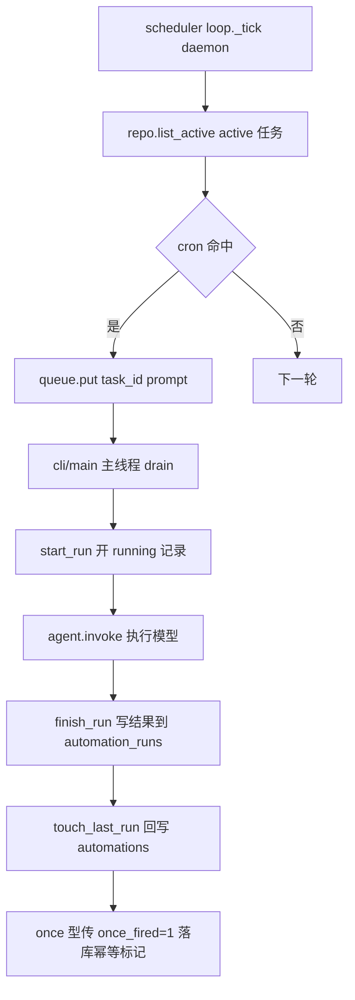

# persistence/automation_repositories.py — automation_repositories.py

> **文件路径**: `backend/packages/harness/agentflow/persistence/automation_repositories.py`
> **目录位置**: persistence → automation_repositories.py
> **职责**: 定时任务（automations）+ 执行历史（automation_runs）两表数据访问（M5）

## 📑 目录

- [📋 结构图](#📋-结构图)
- [📤 关键导出](#📤-关键导出)
- [💡 设计思想](#💡-设计思想)
- [🎯 实用场景](#🎯-实用场景)
- [📊 顺序执行链流程图](#📊-顺序执行链流程图)
- [🧩 代码解析（成块对照 automation_repositories.py）](#🧩-代码解析成块对照-automation_repositoriespy)
- [❓ Q&A / 知识点](#❓-qa--知识点)
- [⚠️ 风险点](#⚠️-风险点)

## 📋 结构图

```text
┌──────────────────────────────────────────────────────────────┐
│ AutomationRepository(BaseRepository)                          │
│   automations 表（任务定义）:                                 │
│     create / get / list_active / list / pause / resume /     │
│     delete / touch_last_run(last_status, run_count_inc,      │
│                              once_fired)                     │
│   automation_runs 表（执行历史）:                            │
│     start_run(task_id) → run_id                              │
│     finish_run(run_id, status, output, error, duration)       │
└──────────────────────────────────────────────────────────────┘
```

## 📤 关键导出

**类**

- `AutomationRepository`（继承 `BaseRepository`，走 db_path 线程本地连接模式 P-018）

## 💡 设计思想

1. **走 BaseRepository db_path 模式（P-018）**：scheduler daemon 线程与主线程
   各持线程本地连接，不共享 conn；WAL 下读写不互斥。
2. **任务定义与执行历史分两表**：automations 是任务（一条 = 一个定时配置），
   automation_runs 是每次执行历史（一条 = 一次触发）。
3. **delete 只删任务行，runs 历史保留（不级联）**：审计/排障需要历史。
4. **once_fired 仅显式传参才更新**：recurring 任务回写时不动该列。

## 🎯 实用场景

1. **tick 扫任务**：`scheduler/loop.py._tick` 每轮 `list_active()` 取 active 任务。
2. **执行落历史**：`cli/main.py` drain 队列时 `start_run` 开记录 → `agent.invoke` →
   `finish_run` 写结果 → `touch_last_run` 回写任务行。
3. **任务管理**：`cli/main.py` 子命令 `pause`/`resume`/`list` 操作 automations 表。

## 📊 顺序执行链流程图

**调用方**：
- `AutomationRepository.list_active` ← `scheduler/loop.py:103`（tick 每轮）
- `start_run` / `finish_run` / `touch_last_run` / `get` ← `cli/main.py` drain 循环（395/396/410/419/422）
- `pause` / `resume` ← `cli/main.py` 任务管理子命令（243/245）

```text
scheduler/loop._tick（daemon 线程）
│
└─ repo.list_active() → SELECT * WHERE status='active'
       │
       ▼（命中 cron 后 queue.put）
cli/main REPL 主线程 drain
│
├─ run_id = repo.start_run(task_id)   → INSERT automation_runs status='running'
├─ task_row = repo.get(task_id)       → 取任务名/类型
├─ agent.invoke(prompt)               → 真正执行模型（R4：只在主线程）
├─ repo.finish_run(run_id, status, output/error, duration)
└─ repo.touch_last_run(task_id, last_status, run_count_inc=1,
                       once_fired=1 if once else None)
        → UPDATE automations last_run/last_status/run_count/(once_fired)
```

**Mermaid 版（GitHub / 飞书渲染）**：



## 🧩 代码解析（成块对照 automation_repositories.py）

> 读法：每块先贴**完整代码**，再看块下方的整块解析。代码与文件一致。

### 块 1：imports + 类声明 + table_name + `create`

```python
from __future__ import annotations

import os

from agentflow.persistence.repositories import BaseRepository
from agentflow.persistence.timestamps import now_utc_iso


class AutomationRepository(BaseRepository):
    """automations（任务定义）+ automation_runs（执行历史）两表数据访问。"""

    @property
    def table_name(self) -> str:
        return "automations"

    # ---------- 任务定义 CRUD ----------
    def create(
        self,
        task_id: str,
        name: str,
        prompt: str,
        schedule: str,
        schedule_type: str = "recurring",
        scheduled_at: str | None = None,
        status: str = "active",
    ) -> None:
        """创建一条定时任务（schedule 应为 normalize_schedule 归一后的 5 字段 cron）。"""
        now = now_utc_iso()
        self._execute(
            "INSERT INTO automations "
            "(task_id, name, prompt, schedule, schedule_type, scheduled_at, "
            " status, once_fired, last_run, last_status, run_count, created_at, updated_at) "
            "VALUES (?, ?, ?, ?, ?, ?, ?, 0, NULL, '', 0, ?, ?)",
            (task_id, name, prompt, schedule, schedule_type, scheduled_at, status, now, now),
        )
```

**结构简析**：继承 `BaseRepository`，`table_name` 返回 `"automations"`。`create` 落一条任务——
注意 INSERT 列里 `once_fired` 硬编码 `0`、`last_run` 硬编码 `NULL`、`last_status` 硬编码 `''`、
`run_count` 硬编码 `0`（新任务未跑过）。

**`create()` 参数逐条解释**：

| 参数 | 类型 | 默认值 | 含义 |
|---|---|---|---|
| `task_id` | `str` | 必填 | 任务唯一 ID（调用方生成，如 `"a_" + os.urandom(...).hex()`） |
| `name` | `str` | 必填 | 任务显示名；tick 触发时打印 `⏰ 定时触发: {name}`（缺省回退 task_id） |
| `prompt` | `str` | 必填 | 触发时投给 agent 的提示词（`HumanMessage(prompt)`，同一 thread 执行） |
| `schedule` | `str` | 必填 | cron 5 字段表达式；应为 `normalize_schedule` 归一后的格式（`*/5 * * * *` / `@daily`→`0 9 * * *`） |
| `schedule_type` | `str` | `"recurring"` | `recurring`=周期型（按 cron 反复触发）；`once`=一次性（需带 `scheduled_at`） |
| `scheduled_at` | `str \| None` | `None` | 仅 once 型：目标触发时刻（ISO 串，如 `2026-10-05T09:00:00`）；tick 扫描时若当前时间与它相差 >120 秒则放弃这次触发 |
| `status` | `str` | `"active"` | `active`=启用（scheduler tick 每轮扫描）；`paused`=停用（不触发） |

**落库要点**：INSERT 同时写 `created_at`/`updated_at`（均为 `now_utc_iso()`）；四个运行字段
（`once_fired`/`last_run`/`last_status`/`run_count`）初始化占位，由 `start_run`/`finish_run` 后续更新。

### 块 2：`get` + `list_active` + `list` + `pause` + `resume` + `delete`

```python
    def get(self, task_id: str) -> dict | None:
        """按 task_id 取任务行（dict）。"""
        row = self._fetch_one(
            "SELECT * FROM automations WHERE task_id = ?", (task_id,)
        )
        return dict(row) if row else None

    def list_active(self) -> list[dict]:
        """全部 active 任务（scheduler tick 每轮调用）。"""
        rows = self._fetch_all(
            "SELECT * FROM automations WHERE status = 'active'"
        )
        return [dict(r) for r in rows]

    def list(self) -> list[dict]:
        """全部任务（list 子命令用，按创建时间倒序）。"""
        rows = self._fetch_all(
            "SELECT * FROM automations ORDER BY created_at DESC"
        )
        return [dict(r) for r in rows]

    def pause(self, task_id: str) -> None:
        """暂停任务（active → paused）。"""
        self._execute(
            "UPDATE automations SET status = 'paused', updated_at = ? WHERE task_id = ?",
            (now_utc_iso(), task_id),
        )

    def resume(self, task_id: str) -> None:
        """恢复任务（paused → active）。"""
        self._execute(
            "UPDATE automations SET status = 'active', updated_at = ? WHERE task_id = ?",
            (now_utc_iso(), task_id),
        )

    def delete(self, task_id: str) -> None:
        """删除任务定义（automation_runs 历史保留，不级联删）。"""
        self._execute("DELETE FROM automations WHERE task_id = ?", (task_id,))
```

**结构简析**：这 6 个方法都是 `automations` 任务定义表的读 / 切状态 / 删除操作，全部走基类
`_fetch_one` / `_fetch_all` / `_execute` 封装；读方法统一把 `sqlite3.Row` 转成 `dict`（None 安全）。

**`get()` 参数逐条解释**：

| 参数 | 类型 | 默认值 | 含义 |
|---|---|---|---|
| `task_id` | `str` | 必填 | 任务唯一 ID；按 `WHERE task_id = ?` 取单行，命中返回 `dict`，未命中返回 `None` |

**`list_active()` 参数逐条解释**：无参数，直接执行 `SELECT * FROM automations WHERE status = 'active'`——
scheduler tick 每轮调的热查询，只取启用中的任务。

**`list()` 参数逐条解释**：无参数，直接执行 `SELECT * FROM automations ORDER BY created_at DESC`——
list 子命令用，全量任务按创建时间倒序。

**`pause()` 参数逐条解释**：

| 参数 | 类型 | 默认值 | 含义 |
|---|---|---|---|
| `task_id` | `str` | 必填 | 目标任务 ID；UPDATE `status='paused'`，同步刷 `updated_at`（active → paused，tick 不再触发） |

**`resume()` 参数逐条解释**：

| 参数 | 类型 | 默认值 | 含义 |
|---|---|---|---|
| `task_id` | `str` | 必填 | 目标任务 ID；UPDATE `status='active'`，同步刷 `updated_at`（paused → active，恢复触发） |

**`delete()` 参数逐条解释**：

| 参数 | 类型 | 默认值 | 含义 |
|---|---|---|---|
| `task_id` | `str` | 必填 | 目标任务 ID；`DELETE FROM automations WHERE task_id = ?`——只删任务定义行 |

**落库要点**：`pause`/`resume` 都同步刷 `updated_at = now_utc_iso()`；`delete` 注释明确
**automation_runs 历史保留，不级联删**（审计 / 排障需要，runs 里 task_id 作历史快照残留）。

### 块 3：`touch_last_run` —— 回写任务行（once_fired 仅显式传才更新）

```python
    def touch_last_run(
        self,
        task_id: str,
        last_status: str,
        run_count_inc: int = 1,
        once_fired: int | None = None,
    ) -> None:
        """一次执行结束后回写任务行：last_run 时间 / last_status / run_count 递增。

        once_fired 仅在显式传入时更新（once 型传 1 做落库幂等标记）。
        """
        now = now_utc_iso()
        if once_fired is not None:
            self._execute(
                "UPDATE automations SET last_run = ?, last_status = ?, "
                "run_count = run_count + ?, once_fired = ?, updated_at = ? "
                "WHERE task_id = ?",
                (now, last_status, run_count_inc, once_fired, now, task_id),
            )
        else:
            self._execute(
                "UPDATE automations SET last_run = ?, last_status = ?, "
                "run_count = run_count + ?, updated_at = ? WHERE task_id = ?",
                (now, last_status, run_count_inc, now, task_id),
            )
```

**结构简析**：一次执行结束后回写 `automations` 任务行——按 `once_fired` 是否为 `None` 分两条 SQL，
`run_count` 用 `run_count = run_count + ?` 在 SQL 侧自增（避免读出-写回竞态）。

**`touch_last_run()` 参数逐条解释**：

| 参数 | 类型 | 默认值 | 含义 |
|---|---|---|---|
| `task_id` | `str` | 必填 | 目标任务 ID；`WHERE task_id = ?` 定位要回写的行 |
| `last_status` | `str` | 必填 | 本次执行终态，写 `last_status` 列（`success` / `failed`） |
| `run_count_inc` | `int` | `1` | `run_count` 自增量；每次跑完 +1，SQL 侧 `run_count = run_count + ?` |
| `once_fired` | `int \| None` | `None` | 哨兵：传非 `None`（once 型传 `1`）则 UPDATE 多写一列 `once_fired = ?`；传 `None`（recurring 型）则 SQL 不带该列，**不动它**——避免 recurring 任务误覆盖 |

**落库要点**：两个分支都写 `last_run = now_utc_iso()` 与 `updated_at`；唯一区别是带不带
`once_fired` 列。`cli/main.py` 调用时 `once_fired=1 if schedule_type == "once" else None`——
once 型落幂等标记配合 `loop._tick` 防重。

### 块 4：`start_run` + `finish_run` —— 执行历史两表

```python
    # ---------- 执行历史 automation_runs ----------
    def start_run(self, task_id: str) -> str:
        """开一条运行记录（status='running'），返回 run_id。"""
        run_id = "r_" + os.urandom(6).hex()
        self._execute(
            "INSERT INTO automation_runs (task_id, run_id, started_at, status) "
            "VALUES (?, ?, ?, 'running')",
            (task_id, run_id, now_utc_iso()),
        )
        return run_id

    def finish_run(
        self,
        run_id: str,
        status: str,
        output: str = "",
        error: str = "",
        duration_seconds: float | None = None,
    ) -> None:
        """结束运行记录：写 finished_at / status / output / error / duration。"""
        self._execute(
            "UPDATE automation_runs SET finished_at = ?, status = ?, output = ?, "
            "error = ?, duration_seconds = ? WHERE run_id = ?",
            (now_utc_iso(), status, output, error, duration_seconds, run_id),
        )
```

**结构简析**：操作 `automation_runs` 执行历史表——`start_run` 开一条 `status='running'` 的记录并
返回 `run_id`；`finish_run` 按 `run_id` UPDATE 收尾。两方法配合构成"开记录 → 执行 → 收尾"闭环。

**`start_run()` 参数逐条解释**：

| 参数 | 类型 | 默认值 | 含义 |
|---|---|---|---|
| `task_id` | `str` | 必填 | 归属任务 ID；INSERT 进 `automation_runs`，与 `automations.task_id` 关联（历史快照，无外键级联） |

**落库要点**：`run_id = "r_" + os.urandom(6).hex()`（12 字符随机 hex，多线程下无需协调自增）；
INSERT 时 `started_at = now_utc_iso()`、`status` 硬编码 `'running'`。

**`finish_run()` 参数逐条解释**：

| 参数 | 类型 | 默认值 | 含义 |
|---|---|---|---|
| `run_id` | `str` | 必填 | `start_run` 返回的运行 ID；`WHERE run_id = ?` 定位要收尾的行 |
| `status` | `str` | 必填 | 终态：`success` / `failed` |
| `output` | `str` | `""` | 执行产物 / stdout 摘要；空串默认 |
| `error` | `str` | `""` | 失败时的错误信息；成功时留空 |
| `duration_seconds` | `float \| None` | `None` | 本次执行耗时（秒）；未传则落 `NULL` |

**落库要点**：`finished_at = now_utc_iso()` 在函数内生成，与入参无关；一次 UPDATE 同时写
`finished_at / status / output / error / duration_seconds`。

## ❓ Q&A / 知识点

### 1. 为什么 delete 不级联删 runs 历史？

**一句话**：automation_runs 是审计/排障依据——任务删了，它的执行历史仍要可查
（"这个任务上次为什么失败"），所以 DELETE 只删 automations 任务行。

源码 `delete` 注释明确"automation_runs 历史保留，不级联删"。两表是**松耦合**：
runs 里存 task_id 作历史快照，不设外键级联。代价是 runs 表会残留指向已删任务的孤儿行，
但这是刻意的——审计价值 > 清理洁癖。

### 2. touch_last_run 的 once_fired 为什么仅显式传参才更新？

**一句话**：recurring 任务每次回写都走这个方法，如果无条件写 once_fired，
会把 recurring 任务的 once_fired 列误覆盖——所以用 `None` 作"不动该列"的哨兵。

代码 `if once_fired is not None:` 分两条 SQL：传了才 UPDATE once_fired 列，
不传就不带这列。`cli/main.py:426` 调用时 `once_fired=1 if task_row.get("schedule_type") == "once" else None`——
once 型传 1 落库幂等标记（配合 loop._tick 第③步防重），recurring 型传 None 不动列。

### 3. run_id 为什么用 os.urandom(6).hex() 而不是自增整数？

**一句话**：run_id 需要在多线程/多进程下全局唯一且不暴露任务数量——
`"r_" + 6 字节随机 hex`（12 字符）冲突概率可忽略，且不依赖 DB 序列。

配合 `start_run` 主线程 drain 时调用，无需跨线程协调自增计数。

### 4. once_fired 是干什么的？为什么要"仅在显式传入时更新"？

**一句话**：once_fired 是 once（一次性）任务的**防重复触发落库标记**——触发执行完写 1，
tick 下轮扫描看到 1 就跳过，保证"只触发一次"在进程重启后依然有效。

**场景**：建一条 once 任务"明早 9:00 提醒交周报"。tick 每 60s 扫库：
- once_fired=0 且到点（偏离 scheduled_at ≤120s）→ 入队 → 主线程 drain 执行 → 写 once_fired=1
- once_fired=1 → continue 跳过，绝不再触发

为什么必须落库（不只靠内存 `_fired_minute`）：
进程内 `_fired_minute`（同分钟去重）**重启即丢**；once_fired 在 SQLite 里，
进程重启后仍能挡住重复触发——它是幂等的持久兜底（loop.py 风险点 1 明确写了这条设计意图）。

**"仅在显式传入时更新"的机制**（touch_last_run 参数 once_fired 默认 None）：

| 任务类型 | drain 后传参 | SQL 行为 |
|---|---|---|
| recurring（周期型） | 不传（None） | 走**不含 once_fired 列**的 UPDATE → 该列保持 0 |
| once（一次性） | 传 1（main.py: `1 if schedule_type=="once" else None`） | 走**含 once_fired=1** 的 UPDATE → 落库已触发 |

**为什么不一律传 1**：recurring 型不参与 once 判断，once_fired 应永远保持 0；
若一律写 1，将来把 recurring 改成 once 时 once_fired 已是 1 → 任务永不触发（静默失效）。

### 5. scheduled_at 是什么？为什么 once 型需要它？

**一句话**：scheduled_at 是 once（一次性）任务的"指定触发时刻"（ISO 时间串）——
记录这条任务要在哪个具体时间点触发一次；recurring（周期型）用不到（传 None）。

为什么 cron 表达不了：`schedule` 是 cron 5 字段（分时日月周），只能表达**规律性**
（每天 9:00 / 每 5 分钟），表达不了"2026-10-05 09:00 只触发一次"（无年份维度、无"仅此一次"语义）。
scheduled_at 补这个缺口：存具体 ISO 时刻。

tick 怎么用（loop.py ③ once 校验）：
1. once_fired=1 → 跳过（已触发过）
2. scheduled_at 解析后偏离当前时间 > 120 秒 → 跳过（时间窗不对）
3. 否则 → 入队触发

±120 秒窗口原因：tick 每 60s 扫库 + 调度延迟，允许目标时刻前后 2 分钟容错。

与 once_fired 的分工：scheduled_at 决定"什么时候触发"（时间窗），
once_fired 决定"是否已触发过"（幂等防重）——一个管时间，一个管次数。

## ⚠️ 风险点

1. **时间戳一律 now_utc_iso()**：全库唯一时间来源，勿混用本地时间。
2. **once_fired 仅显式传才更新**：recurring 任务回写别传 once_fired（传 None）。
3. **delete 不级联**：runs 历史永久保留，排障能查到已删任务的执行记录。
4. **list_active 是热查询**：tick 每轮调，勿在里面 JOIN runs（会拖慢 daemon）。

---
_2026-10-02 新建：M5 文档（目录 + 流程图 + 成块代码解析 + Q&A）。_
_2026-10-03 重构：代码解析段按「结构简析 + 参数逐条表格 + 落库要点」规范化（代码块零改动）。_
