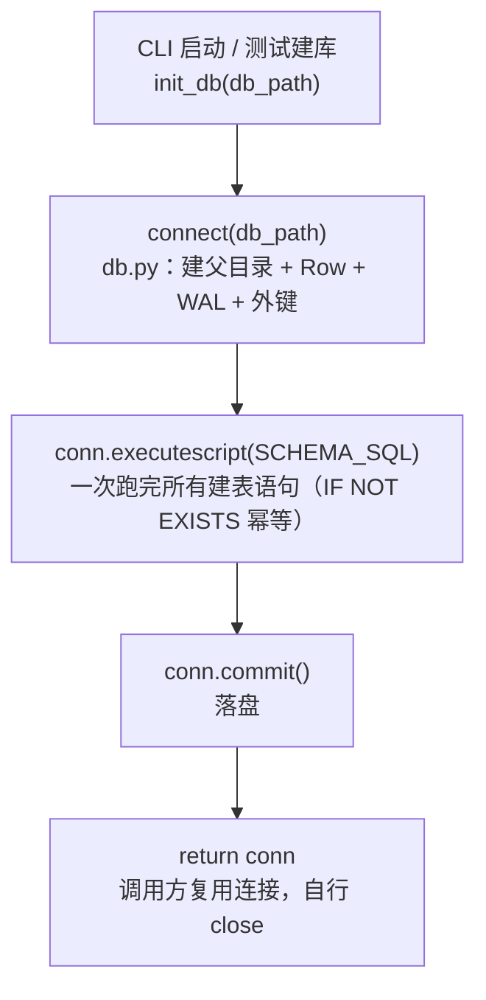

# persistence/bootstrap.py — bootstrap.py

> **文件路径**: `backend/packages/harness/agentflow/persistence/bootstrap.py`
> **目录位置**: persistence → bootstrap.py
> **职责**: 幂等建表

## 📑 目录

- [📋 结构图](#📋-结构图)
- [📤 关键导出](#📤-关键导出)
- [💡 设计思想](#💡-设计思想)
- [🎯 实用场景](#🎯-实用场景)
- [📊 顺序执行链流程图](#📊-顺序执行链流程图)
- [🧩 代码解析（成块对照 bootstrap.py）](#🧩-代码解析成块对照-bootstrappy)
- [❓ Q&A / 知识点](#❓-qa--知识点)
- [⚠️ 风险点](#⚠️-风险点)

## 📋 结构图

```text
┌──────────────────────────────────────────────┐
│ init_db(db_path)                             │
│   ① connect(db_path)  （db.py 统一配置）      │
│   ② executescript(SCHEMA_SQL) 建表           │
│   ③ commit                                   │
│   ④ return conn（调用方可继续使用）           │
│   └── 幂等: CREATE TABLE IF NOT EXISTS       │
│       重复调用不会报错                        │
└──────────────────────────────────────────────┘
```

## 📤 关键导出

**函数**

- `init_db()`

## 💡 设计思想

1. 建表集中一处（schema.py），bootstrap 只负责执行 + 提交。
2. 幂等设计：启动/测试多次调用不报错（IF NOT EXISTS）。
3. init_db(":memory:") 内存库跑测试（无文件污染）。

## 🎯 实用场景

1. 启动建表：sessions/session_messages + checkpoint 表，幂等（已存在跳过）
2. 测试便利：init_db(":memory:") 内存库跑测试

## 📊 顺序执行链流程图（init_db 被调用时）

```text
CLI 启动 / 测试建库（request: init_db(db_path)）
│
▼
connect(db_path)              ← 委托 db.py：自动建父目录 + Row 工厂 + WAL + 外键
│                              （bootstrap 自己不开 sqlite3.connect，统一走连接配置）
▼
conn.executescript(SCHEMA_SQL) ← 一次脚本执行全部建表语句（sessions/session_messages/
│                                memories/knowledge_docs/knowledge_chunks）
│                                CREATE TABLE IF NOT EXISTS → 重复执行不报错（幂等）
▼
conn.commit()                 ← 落盘（建表是写操作，必须提交才持久化）
│
▼
return conn                   ← 返回已建表的连接给调用方（CLI 复用，自己负责 close）
```

**Mermaid 版（GitHub / 飞书渲染；VSCode 需装插件）**：



## 🧩 代码解析（成块对照 bootstrap.py）

> 读法：每块先贴**完整代码**，再看块下方的整块解析。代码与文件一致，仅省略头部规范注释。

### 块 1：imports —— 只依赖连接与建表 SQL 两处

```python
from __future__ import annotations

import sqlite3

from agentflow.persistence.db import connect
from agentflow.persistence.schema import SCHEMA_SQL
```

**整块解析**：bootstrap 自己**不开连接、也不写建表 SQL**，它只是一个"编排者"——`connect`（db.py）负责带项目级默认配置打开连接，`SCHEMA_SQL`（schema.py）是唯一的表定义来源。`sqlite3` 仅用于类型标注（返回 `sqlite3.Connection`）。这种"建表 SQL 与执行分离"让加表只改 schema.py，本文件一行不动。

### 块 2：`init_db` 签名 + docstring —— 职责声明

```python
def init_db(db_path: str) -> sqlite3.Connection:
    """初始化数据库（建表）并返回连接。

    参数:
        db_path: 数据库文件路径

    返回:
        已建表的连接（cli 等调用方直接复用）

    设计说明: 所有表定义集中在 schema.py，此处只执行——
    以后加表（M3 记忆表 / M5 任务表）只需改 schema.py，不动这里。
    """
```

**整块解析**：签名只有一个入参 `db_path`（传 `":memory:"` 即内存库，跑测试无污染）。返回值不是"成功/失败"标志，而是**建好表的连接对象本身**——CLI 拿到后可继续在同一连接上做业务读写，不必再开新连接。docstring 里的"设计说明"明确了演进路径：未来加 M3/M5 的表只动 schema.py。

### 块 3：函数体 —— 四步编排

```python
    conn = connect(db_path)      # ① 统一连接配置
    conn.executescript(SCHEMA_SQL)  # ② 一次执行全部建表语句
    conn.commit()                 # ③ 落盘
    return conn                   # ④ 返回给调用方
```

**整块解析**：四步各司其职——① `connect` 拿到配置好的连接（Row/WAL/外键）；② `executescript` 把整段 SCHEMA_SQL（含多条 `CREATE TABLE IF NOT EXISTS` 与 `CREATE INDEX`）一次脚本执行完；③ `commit` 把 DDL 落盘；④ 返回连接。幂等的关键在 schema.py 的 `IF NOT EXISTS`——重复 `init_db` 不会因表已存在而报错，所以 CLI 每次启动都可安全调用。

## ❓ Q&A / 知识点

### 为什么 bootstrap 不自己 `sqlite3.connect`，而是调 `connect`？

**一句话**：连接配置（Row 工厂、WAL、外键开关）必须全局唯一，所有连接走 db.py 一处，避免各模块各自开连接导致配置漂移。

如果 bootstrap 自己 `sqlite3.connect(db_path)`，就会漏设 `row_factory=Row`、`PRAGMA journal_mode=WAL`、`PRAGMA foreign_keys=ON`——尤其是外键，SQLite 默认 OFF，不开则 `session_messages.session_id REFERENCES sessions(id)` 形同虚设。统一委托 `connect` 等于"开连接"这个动作只有一份标准答案。

### `executescript` 和逐条 `execute` 建表有什么区别？

**一句话**：`executescript` 一次执行整段多语句 SQL（SCHEMA_SQL 里有多张表 + 索引），天然适合"一把建库"；且它在执行前会隐式提交挂起事务。

SCHEMA_SQL 含 5 张表 + 2 个索引，用 `executescript` 一把跑完，bootstrap 不必关心里面具体几张表——表增删全在 schema.py 维护。建完后这里再显式 `commit()` 落盘。

## ⚠️ 风险点

1. 改 schema.py 的表结构后，旧库不自动迁移（M 后期补 migration）
2. 返回的 conn 由调用方负责 close（CLI 进程退出自动释放）

---
_自动生成于 doc-code 规范落地（2026-09-28）。来源：bootstrap.py 头部注释 + 顶层符号。_
_2026-09-30 补齐：目录 + 顺序执行链流程图 + 成块代码解析（+Q&A）。_
