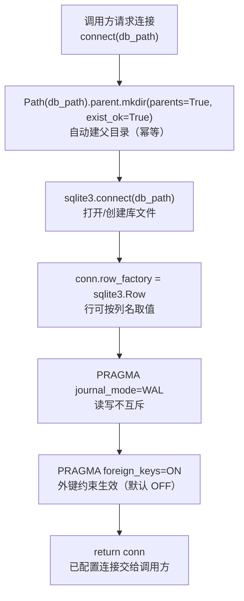

# persistence/db.py — db.py

> **文件路径**: `backend/packages/harness/agentflow/persistence/db.py`
> **目录位置**: persistence → db.py
> **职责**: SQLite 连接管理

## 📑 目录

- [📋 结构图](#📋-结构图)
- [📤 关键导出](#📤-关键导出)
- [💡 设计思想](#💡-设计思想)
- [🎯 实用场景](#🎯-实用场景)
- [📊 顺序执行链流程图](#📊-顺序执行链流程图)
- [🧩 代码解析（成块对照 db.py）](#🧩-代码解析成块对照-dbpy)
- [❓ Q&A / 知识点](#❓-qa--知识点)
- [⚠️ 风险点](#⚠️-风险点)

## 📋 结构图

```text
┌──────────────────────────────────────────────┐
│ connect(db_path) → sqlite3.Connection        │
│   ① 自动创建父目录（mkdir parents=True）      │
│   ② row_factory = Row（行可按列名取值）       │
│   ③ PRAGMA journal_mode=WAL（读写不互斥）     │
│   ④ PRAGMA foreign_keys=ON（外键约束生效）    │
└──────────────────────────────────────────────┘
```

## 📤 关键导出

**函数**

- `connect()`

## 💡 设计思想

1. 业务库连接入口 = persistence/：业务 repo 的连接走这里，
   统一配置（Row/WAL/外键）。框架 checkpoint 和 M6 observability 使用各自存储入口。
2. WAL 模式：读写并发不互斥，未来 gateway 多连接友好。

## 🎯 实用场景

1. 数据库连接管理：SQLite 连接创建/复用

## 📊 顺序执行链流程图（connect 被调用时）

```text
调用方请求连接（request: connect(db_path)）
│
▼
Path(db_path).parent.mkdir(...)  ← data/ 父目录不存在先创建（parents=True 递归，exist_ok 幂等）
│
▼
sqlite3.connect(db_path)        ← 打开/创建 SQLite 文件（":memory:" 则走内存库）
│
▼
conn.row_factory = sqlite3.Row  ← 行工厂：fetchone() 结果可按列名取值 row["列名"]
│
▼
PRAGMA journal_mode=WAL         ← 写不阻塞读、读不阻塞写（每次连接都要设，不持久化）
│
▼
PRAGMA foreign_keys=ON           ← 开启外键约束（SQLite 默认 OFF；sessions↔messages 靠它）
│
▼
return conn                     ← 已配置好的连接交给调用方
```

**Mermaid 版（GitHub / 飞书渲染；VSCode 需装插件）**：



## 🧩 代码解析（成块对照 db.py）

> 读法：每块先贴**完整代码**，再看块下方的整块解析。代码与文件一致，仅省略头部规范注释。

### 块 1：imports —— 标准库足矣

```python
from __future__ import annotations

import sqlite3
from pathlib import Path
```

**结构简析**：不依赖任何第三方包——`sqlite3` 是标准库自带的 SQLite 驱动，`pathlib.Path` 用来安全地取「数据库文件所在目录」并创建它。

**补充**：本文件是整个 persistence 层最底层的连接入口，越底层越要零重依赖。

### 块 2：`connect` 签名 + docstring —— 三个关键配置的说明书

```python
def connect(db_path: str) -> sqlite3.Connection:
    """打开 SQLite 连接（带项目级默认配置）。

    参数:
        db_path: 数据库文件路径（如 项目根/data/agentflow.db）

    返回:
        已配置好的 sqlite3.Connection

    细节说明:
        - WAL 模式: 读不阻塞写、写不阻塞读（长任务场景友好）
        - Row 工厂: fetchone() 返回的对象支持 row["列名"] 访问（dict 化方便）
        - 外键: sessions 表与 session_messages 表的 REFERENCES 约束需要它生效
    """
```

**结构简析**：函数只有一个入参 `db_path`，docstring 把三个「项目级默认配置」讲清楚了——WAL（并发读写）、Row 工厂（行可按列名访问）、外键（REFERENCES 生效的前提）。这三点就是本文件存在的理由：别的地方开连接会漏掉它们。

**`connect()` 参数逐条解释**：

| 参数 | 类型 | 默认值 | 含义 |
|---|---|---|---|
| `db_path` | `str` | 必填 | 数据库文件路径（如 项目根/data/agentflow.db）；传 `":memory:"` 走内存库 |

### 块 3：自动建目录 + 打开连接 + 行工厂

```python
    # ① 自动建目录：data/ 不存在时先创建（幂等）
    Path(db_path).parent.mkdir(parents=True, exist_ok=True)

    # ② 连接 + 行工厂
    conn = sqlite3.connect(db_path)
    conn.row_factory = sqlite3.Row
```

**结构简析**：三步——① `mkdir(parents=True, exist_ok=True)`：连父目录一起递归建，已存在也不报错（幂等），避免首次运行因 `data/` 不存在而失败；② `sqlite3.connect` 打开（不存在则创建）库文件；③ `row_factory = sqlite3.Row` 让后续 `fetchone()` 返回的行支持 `row["列名"]` 取值，而不只是下标 `row[0]`，业务代码可读得多。

**落库要点/补充**：本块无新增参数，沿用块 2 的 `db_path`。

### 块 4：PRAGMA 配置 + 返回

```python
    # ③④ PRAGMA（每次连接都要设置，不持久化到文件）
    conn.execute("PRAGMA journal_mode=WAL")
    conn.execute("PRAGMA foreign_keys=ON")
    return conn
```

**结构简析**：两条 PRAGMA 各管一件事——`journal_mode=WAL` 把日志模式切到 WAL，读写并发不互斥（未来 gateway 多连接友好）；`foreign_keys=ON` 显式打开外键约束（SQLite 编译默认 OFF）。

**落库要点/补充**：**PRAGMA 不持久化到数据库文件，必须每次开连接都重设**（尤其 `foreign_keys` 是连接级）——这也是为什么全项目连接都收敛到这一处，任何绕过 `connect()` 直接 `sqlite3.connect` 的代码都会丢外键约束。本块无新增参数。

## ❓ Q&A / 知识点

### 1. 为什么 PRAGMA 要每次连接都重新设置？

**一句话**：`journal_mode`、`foreign_keys` 这类 PRAGMA 是**连接级**（或文件级但需逐连接确认）设置，不随数据库文件永久保存——新开一个连接就是默认值，外键又回到 OFF。

| PRAGMA | 持久化？ | 后果 |
|---|---|---|
| `journal_mode=WAL` | 持久化到文件 | 一次设置后保留，但仍建议每次显式设 |
| `foreign_keys=ON` | **连接级，不持久化** | 每个新连接都必须重开，否则 REFERENCES 不生效 |

正因如此，"开连接"被收口到 `connect()` 一处——任何绕过它直接 `sqlite3.connect` 的代码都会丢外键约束。

### 2. WAL 模式为什么"读写不互斥"？

**一句话**：WAL（Write-Ahead Logging）把写操作先追加到 `-wal` 日志文件而非直接改主库，读仍从主库快照读，于是读不阻塞写、写不阻塞读。

代价是目录里会多出 `-wal` / `-shm` 两个辅助文件（已列入风险点，git 需忽略、勿手动删）。对 M7 gateway 这种"一个连接写、另一个连接读"的场景是刚需。

## ⚠️ 风险点

1. WAL 会产生 -wal/-shm 文件（git 需忽略；数据库目录勿手动删）
2. 外键约束默认 OFF，本文件显式开启——其他连接方式会丢约束

---
_自动生成于 doc-code 规范落地（2026-09-28）。来源：db.py 头部注释 + 顶层符号。_
_2026-09-30 补齐：目录 + 顺序执行链流程图 + 成块代码解析（+Q&A）。_
_2026-10-03 重构：代码解析段按「结构简析 + 参数逐条表格 + 落库要点」规范化（代码块零改动）。_
