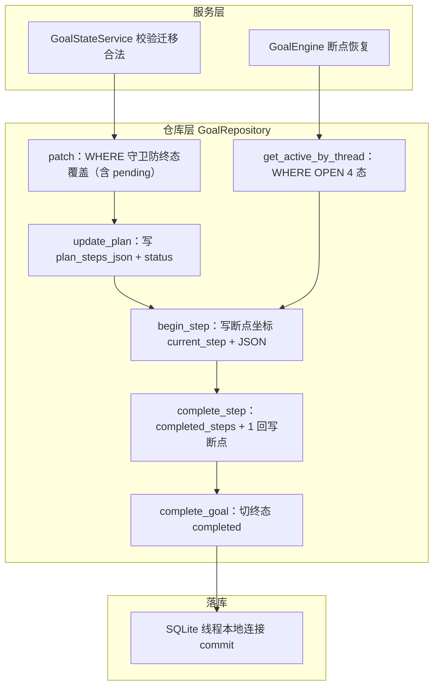

# persistence/goal_repositories.py — goal_repositories.py

> **文件路径**: `backend/packages/harness/agentflow/persistence/goal_repositories.py`
> **目录位置**: persistence → goal_repositories.py
> **职责**: 长任务（goal）数据访问（goals 表，步骤计划 JSON 同行，M5）

## 📑 目录

- [📋 结构图](#📋-结构图)
- [📤 关键导出](#📤-关键导出)
- [💡 设计思想](#💡-设计思想)
- [🎯 实用场景](#🎯-实用场景)
- [📊 顺序执行链流程图](#📊-顺序执行链流程图)
- [🧩 代码解析（成块对照 goal_repositories.py）](#🧩-代码解析成块对照-goal_repositoriespy)
- [❓ Q&A / 知识点](#❓-qa--知识点)
- [⚠️ 风险点](#⚠️-风险点)

## 📋 结构图

```text
┌────────────────────────────────────────────────────────────┐
│ GoalRepository(BaseRepository)                              │
│   table_name → "goals"                                      │
│   create(goal_id, thread_id, goal_text, ...)  初始 pending  │
│   get(goal_id) → 目标行                                      │
│   get_active_by_thread(thread_id) → 未完成目标（恢复键）     │
│   update_plan(goal_id, plan_steps_json, status)             │
│   patch(goal_id, **fields) —— 防终态覆盖（原子 UPDATE）     │
│   begin_step(goal_id, current_step, plan_steps_json)        │
│   complete_step(goal_id, current_step, plan_steps_json)     │
│       → completed_steps+1 / current_step / 回写 JSON        │
│   complete_goal(goal_id, summary, outcome) → 终态 completed │
│   delete(goal_id)                                           │
└────────────────────────────────────────────────────────────┘
```

## 📤 关键导出

**类**

- `GoalRepository`（继承 `BaseRepository`，走 db_path 线程本地连接模式 P-018）

## 💡 设计思想

1. **repo 只做原语（SQL），状态迁移合法性由服务层守卫**：`plans/service.GoalStateService`
   先校验迁移合法（如 complete_step 要求 executing），再调 repo 落库。
2. **patch() 带 WHERE 守卫防终态覆盖**：`WHERE goal_status IN PATCHABLE_GOAL_STATUSES`
   （全部非终态，**含 pending**）——终态行不允许被原子补丁覆写；pending 必须可 patch，
   否则 `service.begin_planning()`（pending→planning）命中 0 行静默无写入。
3. **断点坐标三件套** = `current_step` + `plan_steps_json`（每步 status）+ `completed_steps`；
   消息历史交 checkpointer，SQL 只管业务坐标（R3：先 invoke 落消息再写 SQL）。

## 🎯 实用场景

1. **建长任务**：`cli/main.py:342` 装配 `GoalRepository(db_path=db_path)`，
   `create()` 落一行 pending goal。
2. **断点恢复**：`agents/goal/goal_loop.py:139` `get_active_by_thread(thread_id)`
   定位未完成目标，续跑。
3. **步骤推进**：`goal_loop` 每步 `begin_step` → 跑完 `service.complete_step` →
   `repo.complete_step` 写断点坐标。

## 📊 顺序执行链流程图

**调用方**：
- `GoalRepository` ← `plans/service.GoalStateService`（patch/update_plan/complete_step/complete_goal）
- `GoalRepository` ← `agents/goal/goal_loop.GoalEngine`（get_active_by_thread/begin_step）
- `GoalRepository` ← `cli/main.py:368`（启动时 get_active_by_thread 恢复）

```text
service.GoalStateService（先校验迁移合法）
│
├─ begin_planning / 状态迁移 → repo.patch(goal_id, status=..., **fields)
│       WHERE goal_status IN (PATCHABLE 含 pending) AND goal_id=?
│
├─ plan_done → repo.update_plan(goal_id, plan_steps_json, status="planned")
│
├─ complete_step(校验 executing) → repo.complete_step(goal_id, step_ref, json)
│       UPDATE completed_steps=completed_steps+1, current_step=?, plan_steps_json=?
│
└─ finish_goal → repo.complete_goal(goal_id, summary, outcome)
        UPDATE ... goal_status='completed'
│
goal_loop.GoalEngine
├─ 恢复 → repo.get_active_by_thread(thread_id)  WHERE goal_status IN (OPEN 4态)
└─ 开跑 → repo.begin_step(goal_id, current_step, plan_steps_json)
```

**Mermaid 版（GitHub / 飞书渲染）**：



## 🧩 代码解析（成块对照 goal_repositories.py）

> 读法：每块先贴**完整代码**，再看块下方的整块解析。代码与文件一致。

### 块 1：imports + 两个 IN 子句片段

```python
from __future__ import annotations

import sqlite3

from agentflow.agents.goal.goal_state import OPEN_GOAL_STATUSES, PATCHABLE_GOAL_STATUSES
from agentflow.persistence.repositories import BaseRepository
from agentflow.persistence.timestamps import now_utc_iso

# IN 子句片段：patch 守卫 = 全部非终态（含 pending）；恢复定位 = 4 态可恢复态
_PATCHABLE_IN = "(" + ", ".join(f"'{s}'" for s in sorted(PATCHABLE_GOAL_STATUSES)) + ")"
_OPEN_IN = "(" + ", ".join(f"'{s}'" for s in sorted(OPEN_GOAL_STATUSES)) + ")"
```

**结构简析**：从 `goal_state.py` import 两个状态集合——`PATCHABLE_GOAL_STATUSES`（patch 守卫，
全部非终态**含 pending**：pending/planning/planned/executing/paused）与 `OPEN_GOAL_STATUSES`
（恢复定位 4 态：planning/planned/executing/paused，**不含 pending**）；模块级预拼两个 IN 子句
字符串 `( 'pending', 'planned', ... )`，后续 SQL 用 f-string 嵌入。

**函数参数逐条解释**：本块无函数，仅定义两个模块级常量 `_PATCHABLE_IN` / `_OPEN_IN`。

**落库要点**：两个集合**不是同一个**——patch 守卫含 pending（`begin_planning` 要把刚 create 的
pending 行迁到 planning，排除会命中 0 行静默无写入），恢复定位不含 pending（pending 无步骤可恢复，
`plan_steps_json` 还是 `"[]"`）。

### 块 2：类声明 + table_name + `create`

```python
class GoalRepository(BaseRepository):
    """goals 表数据访问（长任务 = goal 行 + 步骤计划 JSON 同行）。"""

    @property
    def table_name(self) -> str:
        return "goals"

    # ---------- CRUD ----------
    def create(
        self,
        goal_id: str,
        thread_id: str,
        goal_text: str,
        goal_status: str = "pending",
        plan_steps_json: str = "[]",
        max_steps: int = 12,
        completed_steps: int = 0,
    ) -> None:
        """建一条长任务行（初始 pending，由 service.begin_planning 迁到 planning）。"""
        now = now_utc_iso()
        self._execute(
            "INSERT INTO goals ("
            "goal_id, thread_id, goal_text, goal_status, current_step, "
            "plan_steps_json, max_steps, completed_steps, "
            "last_error, stop_reason, summary, outcome, created_at, updated_at"
        ") VALUES (?, ?, ?, ?, ?, ?, ?, ?, ?, ?, ?, ?, ?, ?)",
            (
                goal_id,
                thread_id,
                goal_text,
                goal_status,
                "",  # current_step：尚未开始
                plan_steps_json,
                max_steps,
                completed_steps,
                "",  # last_error
                "",  # stop_reason
                "",  # summary
                "",  # outcome
                now,
                now,
            ),
        )
```

**结构简析**：继承 `BaseRepository`，`table_name` 返回 `"goals"`；`create` 落一行长任务——
初始 `goal_status="pending"`、`current_step=""`（尚未开始）、`plan_steps_json` 默认 `"[]"`、
`max_steps=12`。14 列全填，空字段用 `""` 占位。

**`create()` 参数逐条解释**：

| 参数 | 类型 | 默认值 | 含义 |
|---|---|---|---|
| `goal_id` | `str` | 必填 | 任务唯一 ID（调用方生成，如 `"g_" + os.urandom(6).hex()`）；`WHERE goal_id = ?` 定位行 |
| `thread_id` | `str` | 必填 | 会话 thread ID；同一 thread 下可能多 goal，恢复时按它 `get_active_by_thread` 定位最新一条 |
| `goal_text` | `str` | 必填 | 用户原始长任务描述；落 `goal_text` 列，后续 `_build_summary` 截前 40 字做标题 |
| `goal_status` | `str` | `"pending"` | 初始状态；pending 行由 `service.begin_planning()` 迁到 planning（靠块 4 `patch`） |
| `plan_steps_json` | `str` | `"[]"` | 步骤计划 JSON；建任务时还没规划，默认空数组 |
| `max_steps` | `int` | `12` | 步数上限；`_run` 守卫①据此判定 `completed_steps >= max_steps` 熔断 paused |
| `completed_steps` | `int` | `0` | 已完成步数计数；建任务时为 0 |

**落库要点**：`current_step` 硬编码 `""`（尚未开始）、`last_error`/`stop_reason`/`summary`/`outcome`
硬编码 `""` 占位；`created_at`/`updated_at` 都取 `now_utc_iso()`。

### 块 3：`get` + `get_active_by_thread` + `delete`

```python
    def get(self, goal_id: str) -> sqlite3.Row | None:
        """按 goal_id 取目标行。"""
        return self._fetch_one("SELECT * FROM goals WHERE goal_id = ?", (goal_id,))

    def get_active_by_thread(self, thread_id: str) -> sqlite3.Row | None:
        """按会话取未完成目标（断点恢复定位键）。

        可恢复态 = OPEN_GOAL_STATUSES（planning/planned/executing/paused；
        pending 无步骤可恢复，不算）；多行时取最新一条。
        """
        return self._fetch_one(
            f"SELECT * FROM goals WHERE thread_id = ? "
            f"AND goal_status IN {_OPEN_IN} "
            f"ORDER BY created_at DESC LIMIT 1",
            (thread_id,),
        )

    def delete(self, goal_id: str) -> None:
        """删除一条目标行（测试清理用）。"""
        self._execute("DELETE FROM goals WHERE goal_id = ?", (goal_id,))
```

**结构简析**：三个读/删原语——`get` 按主键取一行；`get_active_by_thread` 是断点恢复定位键
（WHERE 用 `_OPEN_IN` 4 态，多行取最新一条）；`delete` 测试清理用。

**`get()` 参数逐条解释**：

| 参数 | 类型 | 默认值 | 含义 |
|---|---|---|---|
| `goal_id` | `str` | 必填 | 目标行主键；`SELECT * FROM goals WHERE goal_id = ?`，返回 `sqlite3.Row`（None 安全，未命中返回 None） |

**`get_active_by_thread()` 参数逐条解释**：

| 参数 | 类型 | 默认值 | 含义 |
|---|---|---|---|
| `thread_id` | `str` | 必填 | 会话 thread ID；`WHERE thread_id = ? AND goal_status IN {_OPEN_IN} ORDER BY created_at DESC LIMIT 1`——只认 OPEN 4 态（不含 pending，pending 无步骤可恢复），多行取最新一条 |

**`delete()` 参数逐条解释**：

| 参数 | 类型 | 默认值 | 含义 |
|---|---|---|---|
| `goal_id` | `str` | 必填 | 目标行主键；`DELETE FROM goals WHERE goal_id = ?`——注释标明测试清理用 |

**落库要点**：`get_active_by_thread` 的集合与块 4 `patch` 守卫**不是同一个**——恢复只认 4 个可恢复态，
patch 守卫含 pending；勿混用。

### 块 4：`update_plan` + `patch` —— 计划落库 + 防终态覆盖原子补丁

```python
    def update_plan(self, goal_id: str, plan_steps_json: str, status: str) -> None:
        """落步骤计划 JSON 并切目标状态（planning → planned，服务层校验后调用）。"""
        self._execute(
            "UPDATE goals SET plan_steps_json = ?, goal_status = ?, updated_at = ? "
            "WHERE goal_id = ?",
            (plan_steps_json, status, now_utc_iso(), goal_id),
        )

    def patch(self, goal_id: str, **fields) -> None:
        """原子打补丁（防终态覆盖）：只当 goal_status ∈ 非终态时才允许 UPDATE。

        可写态 = PATCHABLE_GOAL_STATUSES（全部非终态，含 pending）——
        pending 行必须可 patch，否则 service.begin_planning()（pending→planning）
        命中 0 行静默无写入（M5 实测 bug）。
        调用方用 `status=...` 关键字（自动映射到列 goal_status）；
        其余字段名与表列同名（current_step/plan_steps_json/last_error/
        stop_reason/summary/outcome/completed_steps/max_steps）。
        """
        if not fields:
            return
        data = dict(fields)
        if "status" in data:  # 关键字别名 → 真实列名 goal_status
            data["goal_status"] = data.pop("status")
        sets = [f"{col} = ?" for col in data]
        sets.append("updated_at = ?")
        params: list = list(data.values())
        params.append(now_utc_iso())
        params.append(goal_id)
        self._execute(
            f"UPDATE goals SET {', '.join(sets)} "
            f"WHERE goal_status IN {_PATCHABLE_IN} "
            f"AND goal_id = ?",
            tuple(params),
        )
```

**结构简析**：`update_plan` 落步骤计划 JSON 并切状态（planning→planned，服务层校验后调用）；
`patch` 是**防终态覆盖的原子补丁**——动态拼 `col = ?` 赋值列表，WHERE 带 `_PATCHABLE_IN` 守卫。

**`update_plan()` 参数逐条解释**：

| 参数 | 类型 | 默认值 | 含义 |
|---|---|---|---|
| `goal_id` | `str` | 必填 | 目标行主键；`WHERE goal_id = ?` |
| `plan_steps_json` | `str` | 必填 | 拓扑排序后的步骤 JSON（`steps_to_json(steps)`）；写 `plan_steps_json` 列 |
| `status` | `str` | 必填 | 切到的目标状态；服务层 `finalize_plan` 传 `"planned"`（planning→planned） |

**`patch()` 参数逐条解释**：

| 参数 | 类型 | 默认值 | 含义 |
|---|---|---|---|
| `goal_id` | `str` | 必填 | 目标行主键；`WHERE goal_status IN {_PATCHABLE_IN} AND goal_id = ?`——守卫要求行当前处于非终态（含 pending） |
| `**fields` | `dict`（关键字） | 空 | 要更新的列：① 空 fields 直接 return；② `status=` 关键字别名自动映射到真实列 `goal_status`；③ 其余字段名与表列同名（current_step/plan_steps_json/last_error/stop_reason/summary/outcome/completed_steps/max_steps）；强制补 `updated_at = now_utc_iso()` |

**落库要点**：patch 守卫 `WHERE goal_status IN {_PATCHABLE_IN}`（含 pending）——终态行
（completed/failed/cancelled）命中 0 行静默不写；pending 必须可 patch，否则 `begin_planning()`
pending→planning 会命中 0 行（M5 实测 bug）。写终态必须走 `complete_goal`/`fail_task` 专用方法
（它们不走这个守卫）。

### 块 5：`begin_step` + `complete_step` + `complete_goal` —— 断点坐标三件套

```python
    def begin_step(self, goal_id: str, current_step: str, plan_steps_json: str) -> None:
        """开始执行一步：写断点坐标 current_step + 回写该步 executing 的计划 JSON。"""
        self._execute(
            "UPDATE goals SET current_step = ?, plan_steps_json = ?, updated_at = ? "
            "WHERE goal_id = ?",
            (current_step, plan_steps_json, now_utc_iso(), goal_id),
        )

    def complete_step(self, goal_id: str, current_step: str, plan_steps_json: str) -> None:
        """完成一步：completed_steps+1、current_step 更新、回写 completed 后的 JSON。"""
        self._execute(
            "UPDATE goals SET completed_steps = completed_steps + 1, "
            "current_step = ?, plan_steps_json = ?, updated_at = ? WHERE goal_id = ?",
            (current_step, plan_steps_json, now_utc_iso(), goal_id),
        )

    def complete_goal(self, goal_id: str, summary: str, outcome: str) -> None:
        """目标整体完工：写 summary/outcome 并切终态 completed。"""
        self._execute(
            "UPDATE goals SET summary = ?, outcome = ?, goal_status = 'completed', "
            "updated_at = ? WHERE goal_id = ?",
            (summary, outcome, now_utc_iso(), goal_id),
        )
```

**结构简析**：三个方法都在写**断点坐标三件套**——`current_step`（当前步标识）+
`plan_steps_json`（每步 status 的 JSON）+ `completed_steps`（已完成步数计数）；
消息历史交 checkpointer，goals 表只存业务坐标。

**`begin_step()` 参数逐条解释**：

| 参数 | 类型 | 默认值 | 含义 |
|---|---|---|---|
| `goal_id` | `str` | 必填 | 目标行主键；`WHERE goal_id = ?` |
| `current_step` | `str` | 必填 | 刚开跑的步骤 ref（如 `"s2"`）；写 `current_step` 列——开跑坐标 |
| `plan_steps_json` | `str` | 必填 | 该步标记为 executing 后的步骤 JSON（`steps_to_json(steps)`）；回写 `plan_steps_json` 列 |

**`complete_step()` 参数逐条解释**：

| 参数 | 类型 | 默认值 | 含义 |
|---|---|---|---|
| `goal_id` | `str` | 必填 | 目标行主键；`WHERE goal_id = ?` |
| `current_step` | `str` | 必填 | 刚完成的步骤 ref；UPDATE 时 `completed_steps = completed_steps + 1`（SQL 侧自增，不读出来再加）+ 更新 `current_step` |
| `plan_steps_json` | `str` | 必填 | 该步标记为 completed 后的步骤 JSON；回写 `plan_steps_json` 列 |

**`complete_goal()` 参数逐条解释**：

| 参数 | 类型 | 默认值 | 含义 |
|---|---|---|---|
| `goal_id` | `str` | 必填 | 目标行主键；`WHERE goal_id = ?` |
| `summary` | `str` | 必填 | 完工汇总字符串（`_build_summary` 产物）；写 `summary` 列 |
| `outcome` | `str` | 必填 | 终态结果（如 `"done"`）；写 `outcome` 列 |

**落库要点**：`complete_goal` 硬切 `goal_status='completed'`（终态专用，不走 patch——patch 的 WHERE
会把终态挡掉，所以终态必须用专用方法写）。R3 写序：完成态须先 `agent.invoke` 落消息、再
`complete_step` 写坐标；`begin_step` 开跑坐标在 invoke 之前（那是"开跑坐标"不是"完成坐标"）。

## ❓ Q&A / 知识点

### 1. patch 守卫为什么含 pending（PATCHABLE_GOAL_STATUSES）？

**一句话**：`service.begin_planning()` 第一步就是把刚 create 的 pending 行迁到 planning——
如果 patch 守卫不含 pending，这次 UPDATE 命中 0 行静默无写入，goal 永远卡在 pending。

源码 docstring 记录了这个 M5 实测 bug：守卫最初只放 planning/planned/executing/paused 四个"活跃态"，
漏掉 pending，导致 begin_planning 打补丁静默失效。修正后 `PATCHABLE_GOAL_STATUSES`
明确含 pending——守卫的语义是"防终态覆盖"，不是"只允许活跃态"。

### 2. 断点坐标三件套是什么？

**一句话**：`current_step`（当前步标识）+ `plan_steps_json`（每步 status 的 JSON）+
`completed_steps`（已完成步数计数）——三者合起来定位"长任务跑到哪一步"。

消息历史（对话上下文）不存这里，交 LangGraph checkpointer；goals 表只存**业务坐标**。
恢复时 `get_active_by_thread` 找到行，读这三个字段就知道从哪步续跑。
对应 R3：完成态须先 `agent.invoke` 落消息、再 `complete_step` 写坐标（begin_step 开跑坐标在 invoke 前，见下）。

### 3. 为什么 R3 是"完成态先 invoke 后写 SQL"，而 begin_step 却在 invoke 前面？

**一句话**：R3 约束的是"消息落库"与"步完成状态落库"的次序——恢复坐标靠 SQL，消息靠 checkpointer，二者分工；`begin_step` 落的是"开跑坐标"不是"完成坐标"。

容易混淆：源码 `goal_loop.py` 里 `begin_step`（写 executing 开跑坐标）确实在 `agent.invoke` **之前**（:178 在 :185 前）。但 R3 约束的是**完成态写序**——步完成时必须先 invoke（让 checkpointer 把这一轮消息落进历史），再 `service.complete_step`（:212）写 completed。
这样恢复时：SQL 的 completed_steps/current_step 是"进度坐标"，checkpointer 的消息链是"对话历史"，二者不互相覆盖。若先写 SQL 完成再 invoke，进程崩在中间就会出现"SQL 说完成了但消息没落"的不一致。

补一刀恢复兜底：进程可能在 `begin_step` 之后、`complete_step` 之前被 SIGKILL，此时该步 SQL 里是 executing——`_run` 开头会把残留 executing 的步重置回 pending 再重跑（代价是这步可能多跑一次，幂等可接受）。

### 4. patch() 的"WHERE 守卫"到底是怎么工作的？（通俗版）

**一句话**：`patch()` 发的不是"按 id 直接改"，而是"按 id + 状态条件 一起改"——
只有 goal 当前状态在可写态集合里才生效；不满足条件的行，SQLite 不报错但一行都不改（静默）。

```sql
-- patch(goal_id, status="planning") 实际发出的 SQL：
UPDATE goals SET goal_status = ?, updated_at = ?
WHERE goal_status IN ('pending','planning','planned','executing','paused')  -- 守卫
  AND goal_id = ?
```

**三个关键点拆开看**：

1. **"命中 0 行静默无写入"是什么感觉？**
   不报错、不抛异常、`execute` 正常返回——就是 UPDATE 影响了 0 行，什么都没变。
   可怕在"静默"：调用方以为成功了，实际状态纹丝不动，后面流程全卡死还查不出原因。

2. **为什么终态必须挡？**
   completed / failed / cancelled 是"盖棺定论"（summary/outcome/stop_reason 是最终裁决）。
   若允许任意 patch 覆写，续跑机制误触发就可能把 completed 改回 executing，长任务"诈尸复活"，
   状态机的不可逆性就破了。**终态只能进不能出**——写终态必须走专用方法
   `complete_goal` / `fail_task`（它们不走这个守卫）。

3. **为什么 pending 必须放行？（M5 实测 bug）**
   新建 goal 行初始状态就是 pending，`begin_planning()` 要把它迁到 planning。
   若守卫不含 pending：这次 UPDATE 命中 0 行 → 状态永远停在 pending → 规划/执行全卡死。
   所以守卫语义是**"防终态覆盖"**，不是"只允许活跃态"——pending 是流程起点，必须能打补丁。

**类比**：像公文流程"草稿 → 审核 → 归档"。归档后禁止修改（防终态覆盖）；
但草稿阶段必须能改（pending 可 patch），否则连"提交审核"这一步都做不了。

**与 OPEN_GOAL_STATUSES 的区别（勿混用）**：
| 集合 | 内容 | 用途 |
|---|---|---|
| PATCHABLE（可写态） | 5 态：pending/planning/planned/executing/paused | 防覆盖守卫：允许被补丁改写的状态 |
| OPEN（可恢复态） | 4 态：不含 pending | 断点恢复定位：还能续跑的 goal（pending 无断点） |

### 5. 为什么 pending 行会被迁移（begin_planning 是干什么的）？

**一句话**：pending 只是"任务刚登记"的占位状态，长任务必须往前推进——
`begin_planning()` 就是推进的第一步（pending → planning，"开始生成步骤计划"）。

完整启动链（goal_loop.start）：
```
① create(..., goal_status="pending")   ← 先占一行（任务登记：goal_id/goal_text/max_steps）
② begin_planning(goal_id)              ← pending → planning（开闸）
③ 调模型生成计划 JSON（preamble → parse_steps_json → topo_sort）
④ finalize_plan(goal_id, json)         ← planning → planned（计划落库）
⑤ begin_execution(goal_id)             ← planned → executing（M5 自动授权）
⑥ _run() 逐步执行
```

为什么 create 不直接写成 planning：
1. create 那一刻还没调模型/没生成计划——必须区别于"正在规划中"，
   否则"刚建行未开工"和"规划中"混为一个状态，恢复/审计/监控分不清；
2. 状态机语义 = 边界推进：每个迁移标志一个阶段的开始，planning 之后才有计划产物；
3. 类比下单：已下单（pending）→ 备货（planning）→ 备货完（planned）→ 发货（executing）→ 完成。

为什么靠 patch 迁：begin_planning 走 `_transition()` = 先 `_assert_can` 校验迁移合法、
再 `repo.patch(status="planning")`——所有状态变更统一走"校验 → 守卫落库"通道，
不让任何代码裸 UPDATE；patch 守卫放行 pending（防的是终态覆盖），故迁移成功。

## ⚠️ 风险点

1. **patch WHERE 守卫含 pending**：防的是终态覆盖，不是拒绝 pending；勿把 pending 从
   PATCHABLE_GOAL_STATUSES 移除（否则 begin_planning 静默失效）。
2. **两个状态集合勿混用**：patch 守卫（含 pending）≠ 恢复定位 OPEN（不含 pending）。
3. **写终态必须用专用方法**：`complete_goal` 硬切 completed；patch 的 WHERE 会把终态挡掉，
   别想靠 patch 写终态。
4. **表列名与 M5 DDL 逐字对齐**：勿改列名（current_step/plan_steps_json/completed_steps 等）。

---
_2026-10-02 新建：M5 文档（目录 + 流程图 + 成块代码解析 + Q&A）。_
_2026-10-03 重构：代码解析段按「结构简析 + 参数逐条表格 + 落库要点」规范化（代码块零改动）。_
