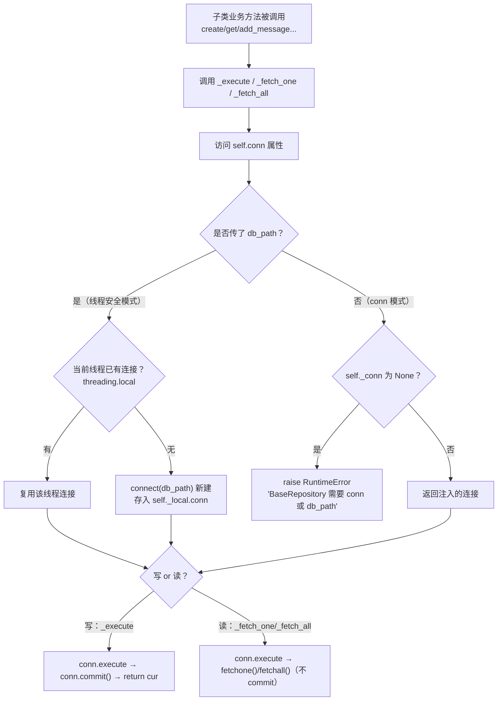

# persistence/repositories.py — repositories.py

> **文件路径**: `backend/packages/harness/agentflow/persistence/repositories.py`
> **目录位置**: persistence → repositories.py
> **职责**: Repository 基类

## 📑 目录

- [📋 结构图](#📋-结构图)
- [📤 关键导出](#📤-关键导出)
- [💡 设计思想](#💡-设计思想)
- [🎯 实用场景](#🎯-实用场景)
- [📊 顺序执行链流程图](#📊-顺序执行链流程图)
- [🧩 代码解析（成块对照 repositories.py）](#🧩-代码解析成块对照-repositoriespy)
- [❓ Q&A / 知识点](#❓-qa--知识点)
- [⚠️ 风险点](#⚠️-风险点)

## 📋 结构图

```text
┌──────────────────────────────────────────────┐
│ BaseRepository（抽象基类）                    │
│   └─ 约束子类实现 4 个方法:                   │
│      table_name / create / get / delete      │
│   _execute(...) 统一执行 SQL + commit        │
│      （所有写操作都 commit，读操作不 commit） │
│   _fetch_one / _fetch_all 统一查询           │
│                                              │
│ 使用方: SessionRepository（session_          │
│         repositories.py）                    │
└──────────────────────────────────────────────┘
```

## 📤 关键导出

**类**

- `BaseRepository`

## 💡 设计思想

1. 基类收拢"执行 SQL + commit + 查询"样板，子类只写业务 SQL。
2. 写操作统一 commit：漏 commit 是 SQLite 最常见 bug，集中处理。

## 🎯 实用场景

1. 检查点/业务表 SQL 的底层封装（原版分层思想）

## 📊 顺序执行链流程图（子类业务方法被调用时）

```text
子类业务方法被调用（request: 如 SessionRepository.create / get / add_message）
│
▼
方法内调用 self._execute / self._fetch_one / self._fetch_all
│
▼
访问 self.conn 属性               ← 决定用哪条连接
│
├─ 传了 db_path？（线程安全模式）
│     │
│     ▼
│   getattr(线程本地, "conn") 有？ ← threading.local 按线程隔离
│     ├─ 有 → 直接复用该线程已建连接
│     └─ 无 → connect(db_path) 新建 → 存进 self._local.conn
│
└─ 传了 conn？（主线程模式）
      │
      └─ self._conn 为 None？→ raise RuntimeError("BaseRepository 需要 conn 或 db_path")
         否则 → 直接返回注入连接
│
▼
拿到连接后分流
│
├─ 写操作：_execute → conn.execute(sql) → conn.commit() → return cur
└─ 读操作：_fetch_one / _fetch_all → conn.execute(...).fetchone()/fetchall()（不 commit）
```

**Mermaid 版（GitHub / 飞书渲染；VSCode 需装插件）**：



## 🧩 代码解析（成块对照 repositories.py）

> 读法：每块先贴**完整代码**，再看块下方的整块解析。代码与文件一致，仅省略头部规范注释。

### 块 1：imports —— ABC + 线程本地 + 连接入口

```python
from __future__ import annotations

import sqlite3
import threading
from abc import ABC, abstractmethod

from agentflow.persistence.db import connect
```

**整块解析**：四个依赖各有分工——`sqlite3`（类型标注）、`threading.local`（线程隔离连接的关键）、`abc.ABC`/`abstractmethod`（把基类变成"约束子类实现哪些方法"的抽象模板）、`connect`（复用语境：新线程建连接时仍走 db.py 的统一配置）。注意子类在 db_path 模式下新建连接时，调的也是这个 `connect`——保证 WAL/外键/Row 不丢。

### 块 2：`BaseRepository` 类 docstring + `__init__` —— 双连接策略

```python
class BaseRepository(ABC):
    """数据访问基类：统一 SQL 执行入口。

    连接策略（P-018 修复）:
        - 传 conn: 主线程用（CLI 会话 repo 等，简单场景）
        - 传 db_path: 线程本地连接（LangGraph 工具在后台线程跑 SQL，
          SQLite 连接不能跨线程共用——每次执行从当前线程取/建连接）
    """

    def __init__(self, conn: sqlite3.Connection | None = None, db_path: str | None = None):
        """注入连接（主线程）或数据库路径（线程安全模式）。"""
        self._conn = conn
        self._db_path = db_path
        self._local = threading.local()
```

**整块解析**：构造器接受二选一——`conn`（主线程直接复用已建好的连接）或 `db_path`（交给基类按线程建连接）。`self._local = threading.local()` 是线程安全的核心：它是一个"每个线程各有独立属性槽"的对象，后续 db_path 模式下把每个线程的连接存在里面，互不串线。这是 P-018 修复的产物——SQLite 连接不能跨线程共用，而 LangGraph 工具在后台线程跑 SQL。

### 块 3：`conn` 属性 —— 按当前线程取连接

```python
    @property
    def conn(self) -> sqlite3.Connection:
        """取当前线程可用的连接。

        - db_path 模式: 每个线程各自建/复用连接（SQLite 线程安全标准做法）
        - conn 模式: 直接用注入的连接（调用方保证单线程使用）
        """
        if self._db_path:
            c = getattr(self._local, "conn", None)
            if c is None:
                c = connect(self._db_path)  # 复用 db.connect 统一配置（WAL/外键/Row）
                self._local.conn = c
            return c
        if self._conn is None:
            raise RuntimeError("BaseRepository 需要 conn 或 db_path")
        return self._conn
```

**整块解析**：这是"连接归属"的裁决处——① 若走 db_path 模式：先从 `threading.local` 取当前线程的连接，取不到才 `connect()` 新建并存回，实现"每线程一连接、复用不重建"；② 否则走 conn 模式，若既没 db_path 又没注入 conn，直接 `raise RuntimeError` 明确报错（而不是悄悄开个坏连接）。所有子类写 SQL 时都通过这个属性拿连接，线程安全因此被收口在一处。

### 块 4：抽象 `table_name` + 统一执行器 —— 写 commit / 读不 commit

```python
    @property
    @abstractmethod
    def table_name(self) -> str:
        """子类声明自己管理哪张表。"""

    # ---- 统一执行器 ----
    def _execute(self, sql: str, params: tuple = ()) -> sqlite3.Cursor:
        """执行 SQL 并提交（只用于写操作）。"""
        cur = self.conn.execute(sql, params)
        self.conn.commit()
        return cur

    def _fetch_one(self, sql: str, params: tuple = ()) -> sqlite3.Row | None:
        """查询单行（不提交——读操作不写库）。"""
        return self.conn.execute(sql, params).fetchone()

    def _fetch_all(self, sql: str, params: tuple = ()) -> list[sqlite3.Row]:
        """查询多行（不提交）。"""
        return self.conn.execute(sql, params).fetchall()
```

**整块解析**：三件套收拢样板——`_execute` 专管写，执行后**统一 commit**（"漏 commit 是 SQLite 最常见 bug"，集中处理就不会漏）；`_fetch_one`/`_fetch_all` 专管读，**不 commit**（读不该触发写事务）。`table_name` 是抽象 property，强制子类声明自己管哪张表。子类业务方法只写业务 SQL，把执行/commit/查询都委托给这三个方法。

### 块 5：抽象 CRUD —— 约束子类必须实现的接口

```python
    # ---- 子类必须实现的 CRUD ----
    @abstractmethod
    def create(self, **kwargs): ...  # 新增一行（子类如 SessionRepository.create）

    @abstractmethod
    def get(self, row_id: str) -> sqlite3.Row | None: ...  # 按主键取一行

    @abstractmethod
    def delete(self, row_id: str) -> None: ...  # 按主键删除
```

**整块解析**：三个 `@abstractmethod` 是 ABC 的硬约束——子类不实现 `create`/`get`/`delete` 就**无法实例化**（实例化即报错），从机制上保证"每张表的 repo 至少有这三个基本操作"。方法体用 `...`（Ellipsis）占位，具体 SQL 由子类（如 SessionRepository）填写。

## ❓ Q&A / 知识点

### 为什么 db_path 模式要用 `threading.local`，而不是共享一条连接？

**一句话**：SQLite 连接不能跨线程共用；`threading.local` 让"每个后台线程持有自己的连接"，既线程安全又能复用（同线程不重复建连）。

| 做法 | 后果 |
|---|---|
| 所有线程共用一条 conn | SQLite 默认禁止跨线程用连接 → 报错/数据竞争 |
| 每次 SQL 都新建连接 | 安全但开销大，频繁开关库 |
| **threading.local 每线程一连接** ✅ | 各线程独立、同线程复用，标准做法 |

这也是为什么构造器同时支持 `conn`（主线程简单场景直接注入）与 `db_path`（后台线程自动建连）两种模式。

### 为什么读操作（_fetch_one/_fetch_all）不 commit？

**一句话**：commit 是把"写事务"落盘；纯 SELECT 不修改数据库，commit 它既无意义又徒增一次写开销。

写路径 `_execute` 执行后紧跟 `self.conn.commit()`——这是刻意把"漏 commit"这个 SQLite 最常见 bug 收进基类统一兜底；读路径只 `execute().fetchone()/fetchall()`，不碰 commit。子类若想做只读查询，应调用 `_fetch_*` 而非 `_execute`（风险点 2）。

## ⚠️ 风险点

1. 抽象方法未实现时子类实例化报错（ABC 机制），勿删 abstractmethod
2. _execute 默认 commit；只读操作别用它（避免无谓写）

---
_自动生成于 doc-code 规范落地（2026-09-28）。来源：repositories.py 头部注释 + 顶层符号。_
_2026-09-30 补齐：目录 + 顺序执行链流程图 + 成块代码解析（+Q&A）。_
