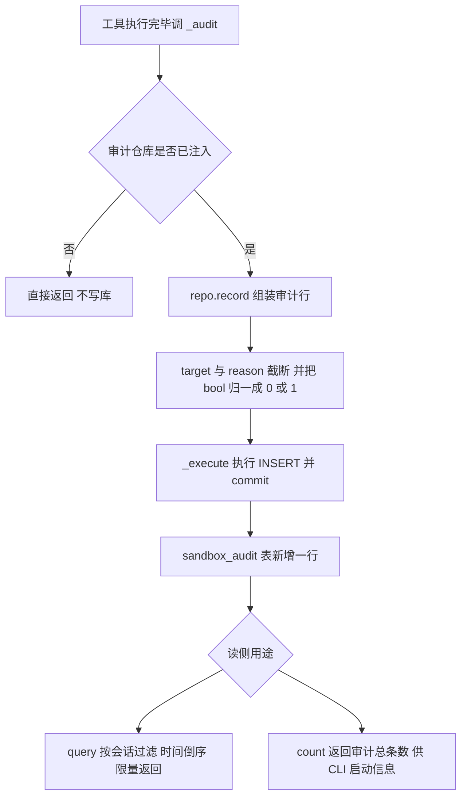

# persistence/sandbox_audit_repositories.py — sandbox_audit_repositories.py

> **文件路径**: `backend/packages/harness/agentflow/persistence/sandbox_audit_repositories.py`
> **目录位置**: persistence → sandbox_audit_repositories.py
> **职责**: 沙箱审计数据访问（M4 新增，sandbox_audit 表）

## 📑 目录

- [📋 结构图](#📋-结构图)
- [📤 关键导出](#📤-关键导出)
- [💡 设计思想](#💡-设计思想)
- [🎯 实用场景](#🎯-实用场景)
- [📊 顺序执行链流程图](#📊-顺序执行链流程图)
- [🧩 代码解析（成块对照 sandbox_audit_repositories.py）](#🧩-代码解析成块对照-sandbox_audit_repositoriespy)
- [❓ Q&A / 知识点](#❓-qa--知识点)
- [⚠️ 风险点](#⚠️-风险点)

## 📋 结构图

```text
┌────────────────────────────────────────────────────────┐
│ SandboxAuditRepository(BaseRepository)                │
│   table_name → "sandbox_audit"                        │
│                                                       │
│   业务方法:                                            │
│   record(action, target, allowed, reason="",          │
│          thread_id="", subagent_name="") → 写一条审计 │
│   query(thread_id=None, limit=100) → 最近审计（倒序）  │
│   count() → 审计总条数（CLI 启动信息/测试断言用）       │
│                                                       │
│   BaseRepository 抽象契约实现:                         │
│   create(**kwargs) → record 的字典化包装               │
│   get(row_id) → 按主键取一条                          │
│   delete(row_id) → 按主键删一条                        │
│                                                       │
│ _now_iso() → 当前 UTC 时间（ISO 秒精度）              │
│   表: sandbox_audit（schema.py:88 定义）              │
└────────────────────────────────────────────────────────┘
```

## 📤 关键导出

**类**

- `SandboxAuditRepository` —— 沙箱审计数据访问（继承 `BaseRepository`）

**模块级私有函数**

- `_now_iso()` —— UTC ISO 秒级时间戳

## 💡 设计思想

1. 每次沙箱操作（放行/拦截）都落库——"谁在什么时候对什么做了什么"全程可追溯
   （M4 验收点 4 的证明：拦截有据可查）。
2. 用 `db_path` 模式（P-018）：工具在后台线程跑 SQL，线程本地连接，
   避免 SQLite 跨线程报错。
3. `allowed` 用 INTEGER 而非 BOOLEAN：SQLite 无布尔类型，0/1 直读。
4. M4 新增，无对标原版——沙箱审计是 M4 验收点 4 的可追溯性配套。

## 🎯 实用场景

1. 工具侧落审计：`terminal_tool._audit` / `file_tools._audit` 调 `record(...)`，
   放行/拦截都记。
2. CLI 启动信息：`cli/main.py:228` 打印 `审计: {sandbox_audit.count()} 条`。
3. 追溯/排查：`query(thread_id=...)` 按会话过滤、按时间倒序拉最近审计，
   配合 `limit` 防全表拉取。

## 📊 顺序执行链流程图（一次沙箱写审计的落库链路）

```text
terminal_run / read_file / write_file 执行后（request: 调 _audit(...)）
│
▼
_audit(action, target, allowed, reason)          ← 工具层私有函数
├─ _audit_repo is None（未注入）→ 直接 return（不阻塞工具）
│
└─ 已注入 SandboxAuditRepository 实例
     │
     ▼
   repo.record(action=..., target=..., allowed=..., reason=..., subagent_name=...)
     │
     ▼
   INSERT INTO sandbox_audit (thread_id, subagent_name, action, target, allowed, reason, created_at)
     参数: target[:500] 截断；1 if allowed else 0；reason[:300]；created_at=_now_iso()
     │
     ▼
   self._execute(sql, params)   ← BaseRepository 统一执行器：当前线程取连接 + commit
     │
     ▼
（读侧）repo.query(thread_id=None, limit=100)
   SELECT * FROM sandbox_audit [WHERE thread_id=?] ORDER BY id DESC LIMIT ?
   → [dict(r) for r in rows]   ← Row 转 dict
（计数）repo.count() → SELECT COUNT(*) AS n → int(row["n"]) or 0
```

**Mermaid 版（GitHub / 飞书渲染；VSCode 需装插件）**：



## 🧩 代码解析（成块对照 sandbox_audit_repositories.py）

> 读法：每块先贴**完整代码**，再看块下方的整块解析。代码与文件一致，仅省略头部规范注释。

### 块 1：imports + 类声明 + `table_name` —— 继承基类契约

```python
from __future__ import annotations

from agentflow.persistence.repositories import BaseRepository


class SandboxAuditRepository(BaseRepository):
    """沙箱审计数据访问（sandbox_audit 表）。"""

    @property
    def table_name(self) -> str:
        return "sandbox_audit"
```

**结构简析**：只引 `BaseRepository`——继承它拿统一连接管理（`conn` 属性：db_path 模式走线程本地连接，conn 模式直接用注入连接）与三个执行器（`_execute` 写+commit、`_fetch_one`/`_fetch_all` 读不 commit）。

**`table_name` property 参数逐条解释**：无参数，直接返回 `"sandbox_audit"`（基类 ABC 强制要求的抽象属性；该表由 schema.py `CREATE TABLE IF NOT EXISTS sandbox_audit` 建）。

### 块 2：`record` —— 写一条审计（放行/拦截都记）

```python
    def record(
        self,
        action: str,
        target: str,
        allowed: bool,
        reason: str = "",
        thread_id: str = "",
        subagent_name: str = "",
    ) -> None:
        """写一条沙箱审计记录（放行/拦截都记）。"""
        self._execute(
            f"INSERT INTO {self.table_name}"
            " (thread_id, subagent_name, action, target, allowed, reason, created_at)"
            " VALUES (?, ?, ?, ?, ?, ?, ?)",
            (
                thread_id,
                subagent_name,
                action,
                target[:500],  # 命令/路径截断防脏数据
                1 if allowed else 0,
                reason[:300],
                _now_iso(),
            ),
        )
```

**结构简析**：审计主写入方法——六个业务字段全参数化 `?` 占位防注入；走 `self._execute`（基类自动 commit）。

**`record()` 参数逐条解释**：

| 参数 | 类型 | 默认值 | 含义 |
|---|---|---|---|
| `action` | `str` | 必填 | 操作类型：terminal_run / read_file / write_file / ... |
| `target` | `str` | 必填 | 目标（命令或路径）；落库前 `target[:500]` 截断防脏数据撑大表 |
| `allowed` | `bool` | 必填 | 放行/拦截；落库时 `1 if allowed else 0` 归一化为 SQLite INTEGER（SQLite 无原生 BOOLEAN） |
| `reason` | `str` | `""` | 拦截原因/备注；落库前 `reason[:300]` 截断 |
| `thread_id` | `str` | `""` | 来源会话（thread_id）；默认空串 |
| `subagent_name` | `str` | `""` | 操作方（子代理名/工具名）；默认空串 |

**落库要点/补充**：`created_at` 由 `_now_iso()` 现场生成（UTC、秒精度）。

### 块 3：`query` / `count` —— 读侧

```python
    def query(self, thread_id: str | None = None, limit: int = 100) -> list[dict]:
        """最近审计记录（可过滤会话；按时间倒序）。"""
        sql = f"SELECT * FROM {self.table_name}"
        params: tuple = ()
        if thread_id:
            sql += " WHERE thread_id = ?"
            params = (thread_id,)
        sql += " ORDER BY id DESC LIMIT ?"
        rows = self._fetch_all(sql, params + (limit,))
        return [dict(r) for r in rows]

    def count(self) -> int:
        """审计总条数（CLI 启动信息 / 测试断言用）。"""
        row = self._fetch_one(f"SELECT COUNT(*) AS n FROM {self.table_name}")
        return int(row["n"]) if row else 0
```

**结构简析**：`query` 的 SQL 动态拼接——传了 `thread_id` 才加 `WHERE thread_id = ?`（空串/None 不过滤）；统一 `ORDER BY id DESC LIMIT ?`（id 自增 ≈ 时间序，倒序拿最新），`limit=100` 防全表拉取；结果 `[dict(r) for r in rows]` 把 `sqlite3.Row` 转普通 dict 方便消费。`count` 用 `SELECT COUNT(*) AS n`，空结果兜底 `0`。

**`query()` 参数逐条解释**：

| 参数 | 类型 | 默认值 | 含义 |
|---|---|---|---|
| `thread_id` | `str \| None` | `None` | 按会话过滤；None/空串则不加 WHERE（全表倒序） |
| `limit` | `int` | `100` | 最多返回条数，防全表拉取；要更多需显式传大值 |

**`count()` 参数逐条解释**：无参数，直接 `SELECT COUNT(*) AS n` 取审计总条数（CLI 启动信息 / 测试断言用）。

### 块 4：BaseRepository 抽象契约实现 —— `create` / `get` / `delete`

```python
    # ---- BaseRepository 抽象契约实现（CRUD） ----
    def create(self, **kwargs) -> None:
        """通用创建入口（record 的字典化包装，满足基类契约）。"""
        self.record(
            action=str(kwargs.get("action", "")),
            target=str(kwargs.get("target", "")),
            allowed=bool(kwargs.get("allowed", True)),
            reason=str(kwargs.get("reason", "")),
            thread_id=str(kwargs.get("thread_id", "")),
            subagent_name=str(kwargs.get("subagent_name", "")),
        )

    def get(self, row_id: str) -> object | None:
        """按主键取一条审计记录。"""
        return self._fetch_one(
            f"SELECT * FROM {self.table_name} WHERE id = ?", (row_id,)
        )

    def delete(self, row_id: str) -> None:
        """按主键删除审计记录（清理用）。"""
        self._execute(f"DELETE FROM {self.table_name} WHERE id = ?", (row_id,))
```

**结构简析**：基类 `BaseRepository` 是 ABC，强制子类实现 `create/get/delete` 三个抽象方法（外加 `table_name`）。`create(**kwargs)` **不是真在写 SQL**，而是把 kwargs 拆包转调 `record(...)`（`allowed=bool(...)` 默认 `True`）——为满足抽象契约的「字典化包装」；`get(row_id)` 按自增主键 `id` 取一条；`delete(row_id)` 按主键删（清理用，走 `_execute` 自动 commit）。

**`create(**kwargs)` 参数逐条解释**：

| 参数 | 类型 | 默认值 | 含义 |
|---|---|---|---|
| `**kwargs` | `dict` | `{}` | 接受 `action/target/allowed/reason/thread_id/subagent_name`；逐项 `str()`/`bool()` 转后透传给 `record`（`allowed` 缺省 `True`） |

**`get(row_id)` 参数逐条解释**：

| 参数 | 类型 | 默认值 | 含义 |
|---|---|---|---|
| `row_id` | `str` | 必填 | 自增主键 `id`；`SELECT * WHERE id = ?`，返回行对象或 None |

**`delete(row_id)` 参数逐条解释**：

| 参数 | 类型 | 默认值 | 含义 |
|---|---|---|---|
| `row_id` | `str` | 必填 | 按主键删除审计记录（清理用） |

**落库要点/补充**：业务主入口其实是 `record`，`create` 只是契约适配层——真实业务请直接调 `record`。

### 块 5：`_now_iso` —— UTC 时间戳（函数内懒 import）

```python
def _now_iso() -> str:
    """当前 UTC 时间（ISO 秒精度，对齐 timestamps 惯例）。"""
    from datetime import UTC, datetime

    return datetime.now(UTC).isoformat(timespec="seconds")
```

**结构简析**：模块级私有时间戳函数。`from datetime import ...` **写在函数体内**（懒 import），返回 `datetime.now(UTC).isoformat(timespec="seconds")`——UTC、秒精度、ISO 格式，对齐 timestamps 模块惯例。

**`_now_iso()` 参数逐条解释**：无参数，直接返回当前 UTC 时间（ISO 秒精度）。

**补充**：与 `record` 的 `created_at`、session_repositories 的时间写法保持一致。

## ❓ Q&A / 知识点

### 1. 审计 allowed 为什么用 0/1 整数？（2026-10-01 用户提问）

**一句话**：SQLite **没有独立的 BOOLEAN 存储类**，布尔只能用 INTEGER 0/1 表达；schema 与代码两侧都按 0/1 对齐。

**两侧证据**：

| 侧 | 代码 | 说明 |
|---|---|---|
| 建表（schema.py:94） | `allowed INTEGER NOT NULL,  -- 1=放行 0=拦截` | 表列直接声明 INTEGER，注释写明 1=放行 / 0=拦截 |
| 写入（本文件 record） | `1 if allowed else 0` | 把 Python bool（`True/False`）归一化成整数再落库 |

**为什么不直接存 bool**：SQLite 的类型系统只有 NULL/INTEGER/REAL/TEXT/BLOB 五种存储类，`BOOLEAN` 只是开发者约定的"类型亲和"别名，底层仍是 INTEGER。所以 Python 侧用 bool（语义清晰：`allowed=True/False`），落库时显式 `1 if allowed else 0` 转成整数，读回时 SQLite 返回 0/1。两边不混存，避免"有时存 True 有时存 1"的脏数据。

### 2. 为什么 target / reason 要截断？

**一句话**：`target[:500]`、`reason[:300]` 是防脏数据闸门——命令行参数/路径/异常信息可能很长（比如一条超长管道命令），不截断会把 `sandbox_audit` 表撑爆，也让 `query` 倒序拉记录时塞满无用文本。截断是写库前的固定动作，调用方无需自己管长度。

### 3. 这个 repo 和 SessionRepository 是什么关系？

**一句话**：两者平级，都继承同一个 `BaseRepository`——各自管理一张表（`sessions` vs `sandbox_audit`），共享基类的连接管理与 `_execute/_fetch_one/_fetch_all` 执行器。CLI 用 `db_path` 模式实例化（`cli/main.py:177` `SandboxAuditRepository(db_path=db_path)`），与 MemoryRepository/KnowledgeRepository 一样走 P-018 线程本地连接。

## ⚠️ 风险点

1. `record` 是写操作（`_execute` 自动 commit）——审计写失败会被工具层 `except: pass` 吞掉，不阻塞工具，但排查时可能"该记的没记"。
2. `query` 按 `thread_id` 过滤 + 时间倒序，`limit` 默认 100 防全表拉取——要更多记录需显式传 `limit`。
3. `create` 只是 `record` 的字典化包装（满足基类契约），真实业务请直接调 `record`。

---
_2026-10-01 M4 补齐：目录 + 顺序执行链流程图 + 成块代码解析（+Q&A）。_
_2026-10-03 重构：代码解析段按「结构简析 + 参数逐条表格 + 落库要点」规范化（代码块零改动）。_
