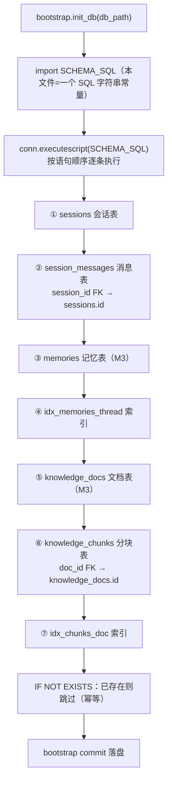

# persistence/schema.py — schema.py

> **文件路径**: `backend/packages/harness/agentflow/persistence/schema.py`
> **目录位置**: persistence → schema.py
> **职责**: 表结构定义

## 📑 目录

- [📋 结构图](#📋-结构图)
- [📤 关键导出](#📤-关键导出)
- [💡 设计思想](#💡-设计思想)
- [🎯 实用场景](#🎯-实用场景)
- [📊 顺序执行链流程图](#📊-顺序执行链流程图)
- [🧩 代码解析（成块对照 schema.py）](#🧩-代码解析成块对照-schemapy)
- [❓ Q&A / 知识点](#❓-qa--知识点)
- [⚠️ 风险点](#⚠️-风险点)

## 📋 结构图

```text
┌────────────────────────────────────────────────┐
│ SCHEMA_SQL（唯一表定义处）                     │
│   sessions         会话表                      │
│     id PK / created_at / updated_at / title    │
│   session_messages 消息表                      │
│     id PK / session_id FK→sessions             │
│     role / content / created_at               │
│   └── 为什么拆表: 会话元信息与消息分开，       │
│       未来查询各取所需（M7 前端会话列表）       │
└────────────────────────────────────────────────┘
```

## 📤 关键导出

**常量**

- `SCHEMA_SQL`

## 💡 设计思想

1. 表定义唯一权威来源：bootstrap 直接 executescript(SCHEMA_SQL)。
2. 拆表设计：会话元信息与消息分开，列表查询不拖消息内容。

## 🎯 实用场景

1. 表结构定义：sessions/session_messages 字段的唯一权威来源

## 📊 顺序执行链流程图（SCHEMA_SQL 被 bootstrap 执行时）

```text
bootstrap.init_db(db_path)（request）
│
▼
from agentflow.persistence.schema import SCHEMA_SQL  ← 本文件只是一个 SQL 字符串常量
│
▼
conn.executescript(SCHEMA_SQL)  ← 按字符串内语句顺序逐条执行
│
├─ ① CREATE TABLE IF NOT EXISTS sessions            ← 会话表（id PK / created_at / updated_at / title）
├─ ② CREATE TABLE IF NOT EXISTS session_messages    ← 消息表（session_id 外键 → sessions.id）
├─ ③ CREATE TABLE IF NOT EXISTS memories            ← M3 记忆表
├─ ④ CREATE INDEX idx_memories_thread               ← 按 thread_id 查记忆
├─ ⑤ CREATE TABLE IF NOT EXISTS knowledge_docs       ← M3 知识库文档表
└─ ⑥ CREATE TABLE IF NOT EXISTS knowledge_chunks    ← M3 分块表（doc_id 外键 → knowledge_docs.id）
       CREATE INDEX idx_chunks_doc                  ← 按 doc_id 查分块
│
▼
全部 IF NOT EXISTS → 表/索引已存在则跳过（幂等）
│
▼
bootstrap commit 落盘 → 返回连接
```

**Mermaid 版（GitHub / 飞书渲染；VSCode 需装插件）**：



## 🧩 代码解析（成块对照 schema.py）

> 读法：每块先贴**完整代码**，再看块下方的整块解析。代码与文件一致，仅省略头部规范注释。
> 本文件核心就是一个 `SCHEMA_SQL` 三引号字符串，下面按"表"切块逐段对照。

### 块 1：`SCHEMA_SQL` 开头 + `sessions` 会话表

```python
SCHEMA_SQL = """
-- 会话表：一条记录 = 一个会话（thread）
CREATE TABLE IF NOT EXISTS sessions (
    id          TEXT PRIMARY KEY,        -- 会话 id（对应 LangGraph thread_id）
    created_at  TEXT NOT NULL,           -- 创建时间（UTC ISO，timestamps.now_utc_iso）
    updated_at  TEXT NOT NULL,           -- 最后更新时间
    title       TEXT DEFAULT ''          -- 会话标题（M2 标题中间件自动生成后写入）
);
```

**整块解析**：整个文件唯一导出就是这个 `SCHEMA_SQL` 字符串。`sessions` 表一条记录 = 一个会话（thread）：`id` 是 TEXT 主键，对应 LangGraph 的 `thread_id`；`created_at`/`updated_at` 存 UTC ISO 字符串（来自 timestamps.now_utc_iso）；`title` 有默认空串，由 M2 标题中间件后续写入。`IF NOT EXISTS` 保证重复执行不报错。

### 块 2：`session_messages` 消息表 —— 外键指向会话

```python
-- 消息表：明文消息副本（checkpointer 存的是图状态，这里是业务记录）
CREATE TABLE IF NOT EXISTS session_messages (
    id          INTEGER PRIMARY KEY AUTOINCREMENT,  -- 自增主键
    session_id  TEXT NOT NULL REFERENCES sessions(id),  -- 外键 → 会话
    role        TEXT NOT NULL,           -- user / assistant / tool
    content     TEXT NOT NULL,           -- 消息内容
    created_at  TEXT NOT NULL            -- 创建时间
);
```

**整块解析**：与 sessions 拆表——这里存**业务明文消息副本**（checkpointer 存的是图状态二进制，二者互补）。`session_id TEXT NOT NULL REFERENCES sessions(id)` 是外键：指向 sessions.id，约束生效依赖 db.py 显式 `PRAGMA foreign_keys=ON`。`id` 用 `INTEGER PRIMARY KEY AUTOINCREMENT` 自增，`role` 取值 user/assistant/tool。

### 块 3：`memories` 记忆表（M3）+ 索引

```python
-- 记忆表（M3）：一条记录 = 一条沉淀下来的用户事实
CREATE TABLE IF NOT EXISTS memories (
    id          INTEGER PRIMARY KEY AUTOINCREMENT,  -- 自增主键
    thread_id   TEXT NOT NULL,           -- 来源会话（thread_id）
    content     TEXT NOT NULL,           -- 事实内容（如"用户叫小王"）
    source_role TEXT NOT NULL DEFAULT 'user',  -- 来源角色（user/assistant）
    created_at  TEXT NOT NULL,           -- 沉淀时间
    updated_at  TEXT NOT NULL            -- 更新时间
);
CREATE INDEX IF NOT EXISTS idx_memories_thread ON memories (thread_id);
```

**整块解析**：M3 预留的记忆表——一条记录 = 一条沉淀的用户事实（如"用户叫小王"）。`thread_id` 记录来源会话，`source_role` 默认 `'user'`。紧跟一条 `idx_memories_thread` 索引：按 thread_id 查某会话沉淀的记忆会高频发生，索引避免全表扫。

### 块 4：`knowledge_docs` / `knowledge_chunks` 知识库表（M3）+ 索引

```python
-- 知识库文档表（M3）：一条记录 = 一个导入的文档
CREATE TABLE IF NOT EXISTS knowledge_docs (
    id          INTEGER PRIMARY KEY AUTOINCREMENT,  -- 自增主键
    title       TEXT NOT NULL,           -- 文档标题
    source      TEXT DEFAULT '',         -- 来源（文件名/URL）
    created_at  TEXT NOT NULL            -- 导入时间
);

-- 知识库分块表（M3）：一条记录 = 一个分块 + 其向量
CREATE TABLE IF NOT EXISTS knowledge_chunks (
    id          INTEGER PRIMARY KEY AUTOINCREMENT,  -- 自增主键
    doc_id      INTEGER NOT NULL REFERENCES knowledge_docs(id),  -- 外键 → 文档
    content     TEXT NOT NULL,           -- 分块文本
    embedding   BLOB,                    -- 向量（JSON 序列化 float 列表）
    created_at  TEXT NOT NULL            -- 分块时间
);
CREATE INDEX IF NOT EXISTS idx_chunks_doc ON knowledge_chunks (doc_id);
"""
```

**整块解析**：M3 知识库两张表——`knowledge_docs` 一个导入文档一行；`knowledge_chunks` 是其分块，`doc_id` 外键指向文档，`embedding BLOB` 存向量（JSON 序列化的 float 列表）。索引 `idx_chunks_doc` 按 doc_id 反查某文档的所有分块。两张表提前建好（IF NOT EXISTS），M3 业务代码落地时直接可用，无需改 bootstrap。

## ❓ Q&A / 知识点

### 为什么时间字段用 TEXT，而不是 SQLite 的日期类型？

**一句话**：SQLite 没有真正的 DATETIME 类型，本项目统一存 **UTC ISO 字符串**（如 `2026-09-28T15:00:00.123456`），由 timestamps.now_utc_iso 唯一产出。

存 TEXT ISO 的好处：① 字符串可直接 `ORDER BY created_at` 排序（ISO 字典序 = 时间序）；② 全库一个格式，无时区/格式漂移；③ 显示时由前端转本地时区。代价：不能用 SQLite 内置日期函数做运算，但当前业务用不到。

### 为什么会话（sessions）和消息（session_messages）要拆成两张表？

**一句话**：会话元信息（id/title/时间）与消息正文分开，列表查询不拖消息内容。

M7 前端要渲染会话列表——若消息和会话挤在一张表，列出 N 个会话就得扫描 N×M 条消息；拆开后列表只查 sessions 一张轻表，点进某个会话再按 `session_id` 查 session_messages，各取所需。两者通过 `session_messages.session_id → sessions.id` 外键关联。

## ⚠️ 风险点

1. 改表结构 = 破坏性变更：旧库不迁移，需手动重建或写 migration
2. session_messages.session_id 外键 → sessions.id（外键约束依赖 db.py 开启）

---
_自动生成于 doc-code 规范落地（2026-09-28）。来源：schema.py 头部注释 + 顶层符号。_
_2026-09-30 补齐：目录 + 顺序执行链流程图 + 成块代码解析（+Q&A）。_
