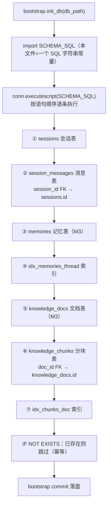

# persistence/schema.py — schema.py

> **文件路径**: `backend/packages/harness/agentflow/persistence/schema.py`
> **目录位置**: persistence → schema.py
> **职责**: 表结构定义

## 📑 目录

- [📋 结构图](#📋-结构图)
- [📤 关键导出](#📤-关键导出)
- [💡 设计思想](#💡-设计思想)
- [🎯 实用场景](#🎯-实用场景)
- [📊 顺序执行链流程图](#📊-顺序执行链流程图)
- [🧩 代码解析（成块对照 schema.py）](#🧩-代码解析成块对照-schemapy)
- [❓ Q&A / 知识点](#❓-qa--知识点)
- [⚠️ 风险点](#⚠️-风险点)

## 📋 结构图

```text
┌────────────────────────────────────────────────┐
│ SCHEMA_SQL（唯一表定义处）                     │
│   sessions         会话表                      │
│     id PK / created_at / updated_at / title    │
│   session_messages 消息表                      │
│     id PK / session_id FK→sessions             │
│     role / content / created_at               │
│   └── 为什么拆表: 会话元信息与消息分开，       │
│       未来查询各取所需（M7 前端会话列表）       │
└────────────────────────────────────────────────┘
```

**M4 追加（sandbox_audit 沙箱审计表）**：

```text
│   sandbox_audit     沙箱审计表（M4）            │
│     id PK / thread_id / subagent_name          │
│     action / target / allowed(1放行0拦截)       │
│     reason / created_at                        │
│   └── idx_sandbox_audit_thread：按 thread_id    │
│       反查某会话的沙箱放行/拦截记录             │
```

**M5 追加（goals / automations / automation_runs 三表 + 索引）**：

```text
│   goals            长任务表（M5）              │
│     goal_id PK / thread_id / goal_text        │
│     goal_status / current_step / plan_steps_json
│     max_steps / completed_steps / summary / outcome
│   ├── idx_goals_thread：按 thread_id 反查长任务 │
│   └── idx_goals_status：按 goal_status 扫待办   │
│   automations      定时任务定义表（M5）         │
│     task_id PK / name / prompt / schedule      │
│     schedule_type / status / run_count / last_run
│   └── idx_automations_status：扫 active 任务    │
│   automation_runs  定时执行历史表（M5，唯一事件历史）
│     id PK / task_id / run_id / started_at      │
│     finished_at / status / output / duration_seconds
│   └── idx_automation_runs_task：按 task_id 查历史│
```

## 📤 关键导出

**常量**

- `SCHEMA_SQL`
  - M4：字符串内新增 `sandbox_audit` 建表语句 + `idx_sandbox_audit_thread` 索引；无新顶层符号，文件仍唯一导出 `SCHEMA_SQL`。
  - M5：字符串内新增 `goals`（+ `idx_goals_thread` / `idx_goals_status`）、`automations`（+ `idx_automations_status`）、`automation_runs`（+ `idx_automation_runs_task`）三张建表语句；无新顶层符号，文件仍唯一导出 `SCHEMA_SQL`。

## 💡 设计思想

1. 表定义唯一权威来源：bootstrap 直接 executescript(SCHEMA_SQL)。
2. 拆表设计：会话元信息与消息分开，列表查询不拖消息内容。

## 🎯 实用场景

1. 表结构定义：sessions/session_messages 字段的唯一权威来源

## 📊 顺序执行链流程图（SCHEMA_SQL 被 bootstrap 执行时）

```text
bootstrap.init_db(db_path)（request）
│
▼
from agentflow.persistence.schema import SCHEMA_SQL  ← 本文件只是一个 SQL 字符串常量
│
▼
conn.executescript(SCHEMA_SQL)  ← 按字符串内语句顺序逐条执行
│
├─ ① CREATE TABLE IF NOT EXISTS sessions            ← 会话表（id PK / created_at / updated_at / title）
├─ ② CREATE TABLE IF NOT EXISTS session_messages    ← 消息表（session_id 外键 → sessions.id）
├─ ③ CREATE TABLE IF NOT EXISTS memories            ← M3 记忆表
├─ ④ CREATE INDEX idx_memories_thread               ← 按 thread_id 查记忆
├─ ⑤ CREATE TABLE IF NOT EXISTS knowledge_docs       ← M3 知识库文档表
└─ ⑥ CREATE TABLE IF NOT EXISTS knowledge_chunks    ← M3 分块表（doc_id 外键 → knowledge_docs.id）
       CREATE INDEX idx_chunks_doc                  ← 按 doc_id 查分块
│
▼
全部 IF NOT EXISTS → 表/索引已存在则跳过（幂等）
│
▼
bootstrap commit 落盘 → 返回连接
```

**Mermaid 版（GitHub / 飞书渲染；VSCode 需装插件）**：



**M4 追加：executescript 还多跑两条语句**

```text
├─ ⑦ CREATE TABLE IF NOT EXISTS sandbox_audit      ← M4 沙箱审计表（一次沙箱操作一行）
└─ ⑧ CREATE INDEX idx_sandbox_audit_thread           ← 按 thread_id 查审计
```

**M5 追加：executescript 再跑七条语句（三表 + 三索引）**

```text
├─ ⑨ CREATE TABLE IF NOT EXISTS goals               ← M5 长任务表（goal + 步骤计划 JSON 同行）
├─ ⑩ CREATE INDEX idx_goals_thread                    ← 按 thread_id 反查长任务（--thread 恢复定位键）
├─ ⑪ CREATE INDEX idx_goals_status                   ← 按 goal_status 扫待办（planning/executing/…）
├─ ⑫ CREATE TABLE IF NOT EXISTS automations          ← M5 定时任务定义表（一行 = 一条 automation）
├─ ⑬ CREATE INDEX idx_automations_status             ← 按 status 扫 active 任务（tick 线程只读这里）
├─ ⑭ CREATE TABLE IF NOT EXISTS automation_runs      ← M5 定时执行历史表（M5 唯一保留的事件历史）
└─ ⑮ CREATE INDEX idx_automation_runs_task           ← 按 task_id 反查某任务的全部运行历史
```

## 🧩 代码解析（成块对照 schema.py）

> 读法：每块先贴**完整代码**，再看块下方的整块解析。代码与文件一致，仅省略头部规范注释。
> 本文件核心就是一个 `SCHEMA_SQL` 三引号字符串，下面按"表"切块逐段对照。

### 块 1：`SCHEMA_SQL` 开头 + `sessions` 会话表

```python
SCHEMA_SQL = """
-- 会话表：一条记录 = 一个会话（thread）
CREATE TABLE IF NOT EXISTS sessions (
    id          TEXT PRIMARY KEY,        -- 会话 id（对应 LangGraph thread_id）
    created_at  TEXT NOT NULL,           -- 创建时间（UTC ISO，timestamps.now_utc_iso）
    updated_at  TEXT NOT NULL,           -- 最后更新时间
    title       TEXT DEFAULT ''          -- 会话标题（M2 标题中间件自动生成后写入）
);
```

**结构简析**：整个文件唯一导出就是这个 `SCHEMA_SQL` 三引号字符串；本块定义 `sessions` 会话表——一条记录 = 一个会话（thread）。`id` 是 TEXT 主键，对应 LangGraph 的 `thread_id`；`created_at`/`updated_at` 存 UTC ISO 字符串（来自 timestamps.now_utc_iso）；`title` 有默认空串，由 M2 标题中间件后续写入。

**落库要点/补充**：`IF NOT EXISTS` 保证重复执行不报错（幂等）；时间字段统一 TEXT ISO（字典序 = 时间序，可直接 ORDER BY）。

### 块 2：`session_messages` 消息表 —— 外键指向会话

```python
-- 消息表：明文消息副本（checkpointer 存的是图状态，这里是业务记录）
CREATE TABLE IF NOT EXISTS session_messages (
    id          INTEGER PRIMARY KEY AUTOINCREMENT,  -- 自增主键
    session_id  TEXT NOT NULL REFERENCES sessions(id),  -- 外键 → 会话
    role        TEXT NOT NULL,           -- user / assistant / tool
    content     TEXT NOT NULL,           -- 消息内容
    created_at  TEXT NOT NULL            -- 创建时间
);
```

**结构简析**：与 sessions 拆表——这里存**业务明文消息副本**（checkpointer 存的是图状态二进制，二者互补）。`session_id TEXT NOT NULL REFERENCES sessions(id)` 是外键指向 sessions.id；`id` 用 `INTEGER PRIMARY KEY AUTOINCREMENT` 自增；`role` 取值 user/assistant/tool。

**落库要点/补充**：外键约束生效依赖 db.py 显式 `PRAGMA foreign_keys=ON`（SQLite 默认 OFF）。

### 块 3：`memories` 记忆表（M3）+ 索引

```python
-- 记忆表（M3）：一条记录 = 一条沉淀下来的用户事实
CREATE TABLE IF NOT EXISTS memories (
    id          INTEGER PRIMARY KEY AUTOINCREMENT,  -- 自增主键
    thread_id   TEXT NOT NULL,           -- 来源会话（thread_id）
    content     TEXT NOT NULL,           -- 事实内容（如"用户叫小王"）
    source_role TEXT NOT NULL DEFAULT 'user',  -- 来源角色（user/assistant）
    created_at  TEXT NOT NULL,           -- 沉淀时间
    updated_at  TEXT NOT NULL            -- 更新时间
);
CREATE INDEX IF NOT EXISTS idx_memories_thread ON memories (thread_id);
```

**结构简析**：M3 预留的记忆表——一条记录 = 一条沉淀的用户事实（如「用户叫小王」）。`thread_id` 记录来源会话，`source_role` 默认 `'user'`。

**落库要点/补充**：紧跟一条 `idx_memories_thread` 索引——按 thread_id 查某会话沉淀的记忆会高频发生，索引避免全表扫。

### 块 4：`knowledge_docs` / `knowledge_chunks` 知识库表（M3）+ 索引

```python
-- 知识库文档表（M3）：一条记录 = 一个导入的文档
CREATE TABLE IF NOT EXISTS knowledge_docs (
    id          INTEGER PRIMARY KEY AUTOINCREMENT,  -- 自增主键
    title       TEXT NOT NULL,           -- 文档标题
    source      TEXT DEFAULT '',         -- 来源（文件名/URL）
    created_at  TEXT NOT NULL            -- 导入时间
);

-- 知识库分块表（M3）：一条记录 = 一个分块 + 其向量
CREATE TABLE IF NOT EXISTS knowledge_chunks (
    id          INTEGER PRIMARY KEY AUTOINCREMENT,  -- 自增主键
    doc_id      INTEGER NOT NULL REFERENCES knowledge_docs(id),  -- 外键 → 文档
    content     TEXT NOT NULL,           -- 分块文本
    embedding   BLOB,                    -- 向量（JSON 序列化 float 列表）
    created_at  TEXT NOT NULL            -- 分块时间
);
CREATE INDEX IF NOT EXISTS idx_chunks_doc ON knowledge_chunks (doc_id);
"""
```

**结构简析**：M3 知识库两张表——`knowledge_docs` 一个导入文档一行；`knowledge_chunks` 是其分块，`doc_id` 外键指向文档，`embedding BLOB` 存向量（JSON 序列化的 float 列表）。

**落库要点/补充**：索引 `idx_chunks_doc` 按 doc_id 反查某文档的所有分块；两张表提前建好（IF NOT EXISTS），M3 业务代码落地时直接可用，无需改 bootstrap。

### 块 5：`sandbox_audit` 沙箱审计表（M4）+ 索引

```python
-- 沙箱审计表（M4）：一条记录 = 一次沙箱操作（放行/拦截）
CREATE TABLE IF NOT EXISTS sandbox_audit (
    id          INTEGER PRIMARY KEY AUTOINCREMENT,  -- 自增主键
    thread_id   TEXT NOT NULL DEFAULT '',           -- 来源会话（thread_id）
    subagent_name TEXT NOT NULL DEFAULT '',         -- 操作方（子代理名/工具名）
    action      TEXT NOT NULL,                      -- 操作类型: terminal_run/read_file/write_file/...
    target      TEXT NOT NULL,                      -- 目标（命令或路径）
    allowed     INTEGER NOT NULL,                   -- 1=放行 0=拦截
    reason      TEXT NOT NULL DEFAULT '',           -- 拦截原因/备注
    created_at  TEXT NOT NULL                       -- 记录时间
);
CREATE INDEX IF NOT EXISTS idx_sandbox_audit_thread ON sandbox_audit (thread_id);
```

**结构简析**：M4 新增的沙箱审计表——一条记录 = 一次沙箱操作（放行或拦截），由 `SandboxAuditRepository` 在 CLI 装配时注入 terminal_run / read_file / write_file 工具，每次沙箱操作落一行。字段：`thread_id`（来源会话，默认空串）、`subagent_name`（操作方子代理名/工具名）、`action`（操作类型 terminal_run/read_file/write_file/…）、`target`（目标命令或路径）、`allowed` 用 INTEGER 0/1（1=放行 0=拦截）、`reason`（拦截原因/备注）。

**落库要点/补充**：SQLite 无原生 BOOLEAN，`allowed` 存取均走整数；索引 `idx_sandbox_audit_thread` 按 thread_id 反查某会话的全部沙箱记录，供审计回看。

### 块 6：`goals` / `automations` / `automation_runs` 三表（M5）+ 索引

```python
-- 长任务表（M5）：一行 = 一个长任务尝试（goal + 步骤计划 JSON 同行）
CREATE TABLE IF NOT EXISTS goals (
    goal_id          TEXT PRIMARY KEY,           -- g_ + urandom(6).hex()
    thread_id        TEXT NOT NULL,              -- 归属会话（--thread 恢复定位键）
    goal_text        TEXT NOT NULL,              -- 用户原始长任务描述
    goal_status      TEXT NOT NULL DEFAULT 'pending',
        -- pending/planning/planned/executing/paused/completed/failed/cancelled
    current_step     TEXT NOT NULL DEFAULT '',   -- 正在执行的 step.ref（断点坐标）
    plan_steps_json  TEXT NOT NULL DEFAULT '[]', -- JSON 数组[PlanStep]（含每步 status）
    max_steps        INTEGER NOT NULL DEFAULT 12,
    completed_steps  INTEGER NOT NULL DEFAULT 0,
    last_error       TEXT NOT NULL DEFAULT '',
    stop_reason      TEXT NOT NULL DEFAULT '',   -- max_steps/judge_fallback/...
    summary          TEXT NOT NULL DEFAULT '',   -- 最终汇总报告（complete 时写）
    outcome          TEXT NOT NULL DEFAULT '',   -- done/failed/...
    created_at       TEXT NOT NULL,
    updated_at       TEXT NOT NULL
);
CREATE INDEX IF NOT EXISTS idx_goals_thread ON goals (thread_id);
CREATE INDEX IF NOT EXISTS idx_goals_status ON goals (goal_status);

-- 定时任务定义表（M5）：一行 = 一条 automation
CREATE TABLE IF NOT EXISTS automations (
    task_id        TEXT PRIMARY KEY,             -- t_ + urandom(6).hex()
    name           TEXT NOT NULL DEFAULT '',
    prompt         TEXT NOT NULL,                -- 到点投递的提示词
    schedule       TEXT NOT NULL,                -- 归一化后 cron 5 字段 "m h dom mon dow"
    schedule_type  TEXT NOT NULL DEFAULT 'recurring',  -- recurring | once
    scheduled_at   TEXT,                         -- once 型目标时间（ISO）
    status         TEXT NOT NULL DEFAULT 'active',     -- active | paused
    once_fired     INTEGER NOT NULL DEFAULT 0,
    last_run       TEXT,
    last_status    TEXT NOT NULL DEFAULT '',
    run_count      INTEGER NOT NULL DEFAULT 0,
    created_at      TEXT NOT NULL,
    updated_at      TEXT NOT NULL
);
CREATE INDEX IF NOT EXISTS idx_automations_status ON automations (status);

-- 定时任务执行历史表（M5，M5 唯一保留的事件历史）
CREATE TABLE IF NOT EXISTS automation_runs (
    id               INTEGER PRIMARY KEY AUTOINCREMENT,
    task_id          TEXT NOT NULL,
    run_id           TEXT NOT NULL,
    started_at       TEXT NOT NULL,
    finished_at      TEXT,
    status           TEXT NOT NULL DEFAULT 'running',  -- running|success|failed
    output           TEXT NOT NULL DEFAULT '',
    error            TEXT NOT NULL DEFAULT '',
    duration_seconds REAL
);
CREATE INDEX IF NOT EXISTS idx_automation_runs_task ON automation_runs (task_id);
```

**结构简析**（M5 增量）：一次建三张表，分别支撑「长任务」与「定时任务」两条新业务线——

- **`goals` 长任务表**：一行 = 一个长任务尝试，**goal 文本与步骤计划同行**（不像 messages 拆表），断点续跑全靠它。`goal_id` 主键（`g_` + 6 字节随机 hex）；`thread_id` 是 `--thread` 恢复定位键；`goal_status` 是状态机（pending→planning→planned→executing→paused→completed/failed/cancelled）；`current_step` 记录正在执行的 `step.ref`（断点坐标）；`plan_steps_json` 把整个 `[PlanStep]` 计划**以 JSON 文本整列存**（含每步 status），`completed_steps` 记已完成步数——恢复时从 `completed_steps+1` 续跑，不重跑已完成步。
- **`automations` 定时任务定义表**：一行 = 一条 automation。`task_id` 主键（`t_` + 6 字节 hex）；`prompt` 是到点投递的提示词；`schedule` 存**归一化后的 cron 5 字段**（自然语言先经 `normalize_schedule` 归一）；`schedule_type` 区分 recurring / once，once 型用 `scheduled_at` 记目标时间、`once_fired` 防重复触发；`status` active/paused，`run_count`/`last_run`/`last_status` 是回显统计。
- **`automation_runs` 执行历史表**：一行 = 一次定时触发的运行记录，是 **M5 唯一保留的事件历史**。`task_id` 关联定义（无外键约束，delete 任务时 runs 保留）；`status` running/success/failed，`output`/`error` 存结果摘要，`duration_seconds REAL` 记耗时。

**落库要点/补充**：三条索引——`idx_goals_thread` 按会话反查长任务（断点恢复入口）、`idx_goals_status` 按状态扫待办、`idx_automations_status` 供 tick 线程只扫 active 任务、`idx_automation_runs_task` 按 task_id 反查运行历史。`plan_steps_json` 是 TEXT 列存 JSON，SQLite 不做 schema 校验，读写全靠 GoalEngine 自行 json.dumps/loads。

## ❓ Q&A / 知识点

### 1. 为什么时间字段用 TEXT，而不是 SQLite 的日期类型？

**一句话**：SQLite 没有真正的 DATETIME 类型，本项目统一存 **UTC ISO 字符串**（如 `2026-09-28T15:00:00.123456`），由 timestamps.now_utc_iso 唯一产出。

存 TEXT ISO 的好处：① 字符串可直接 `ORDER BY created_at` 排序（ISO 字典序 = 时间序）；② 全库一个格式，无时区/格式漂移；③ 显示时由前端转本地时区。代价：不能用 SQLite 内置日期函数做运算，但当前业务用不到。

### 2. 为什么会话（sessions）和消息（session_messages）要拆成两张表？

**一句话**：会话元信息（id/title/时间）与消息正文分开，列表查询不拖消息内容。

M7 前端要渲染会话列表——若消息和会话挤在一张表，列出 N 个会话就得扫描 N×M 条消息；拆开后列表只查 sessions 一张轻表，点进某个会话再按 `session_id` 查 session_messages，各取所需。两者通过 `session_messages.session_id → sessions.id` 外键关联。

## ⚠️ 风险点

1. 改表结构 = 破坏性变更：旧库不迁移，需手动重建或写 migration
2. session_messages.session_id 外键 → sessions.id（外键约束依赖 db.py 开启）
3. sandbox_audit.allowed 用 INTEGER 0/1 而非布尔：SQLite 无原生 BOOLEAN，存取均走整数（1=放行 0=拦截）
4. goals.plan_steps_json 存 JSON 文本（TEXT 列）：步骤计划以 JSON 数组整列存库，SQLite 不做 schema 校验，读写全靠 GoalEngine 自行 json.dumps/loads，PlanStep 字段结构漂移需代码侧兜底
5. automation_runs 是 M5 唯一保留的事件历史：automations 定义可 pause/delete，但 delete 任务不级联清 runs（CLI delete 帮助即"runs 历史保留"），长期运行历史表只增不减，后续需定期归档

---
_自动生成于 doc-code 规范落地（2026-09-28）。来源：schema.py 头部注释 + 顶层符号。_
_2026-09-30 补齐：目录 + 顺序执行链流程图 + 成块代码解析（+Q&A）。_
_2026-10-01 M4 补齐：目录 + 顺序执行链流程图 + 成块代码解析（+Q&A）。_
_2026-10-02 M5 补齐：目录 + 顺序执行链流程图 + 成块代码解析（+Q&A）。_
_2026-10-03 重构：代码解析段按「结构简析 + 参数逐条表格 + 落库要点」规范化（代码块零改动）。_
