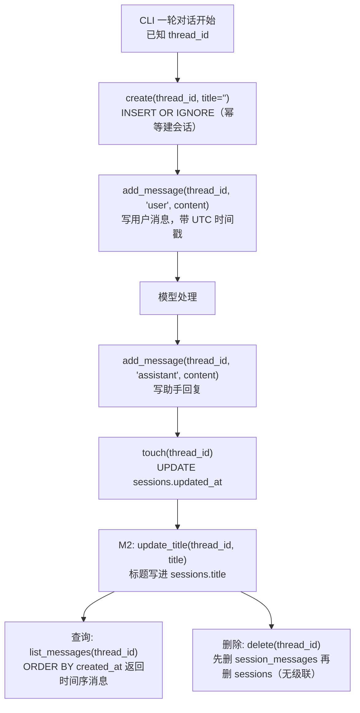

# persistence/session_repositories.py — session_repositories.py

> **文件路径**: `backend/packages/harness/agentflow/persistence/session_repositories.py`
> **目录位置**: persistence → session_repositories.py
> **职责**: 会话数据访问

## 📑 目录

- [📋 结构图](#📋-结构图)
- [📤 关键导出](#📤-关键导出)
- [💡 设计思想](#💡-设计思想)
- [🎯 实用场景](#🎯-实用场景)
- [📊 顺序执行链流程图](#📊-顺序执行链流程图)
- [🧩 代码解析（成块对照 session_repositories.py）](#🧩-代码解析成块对照-session_repositoriespy)
- [❓ Q&A](#❓-qa)
- [⚠️ 风险点](#⚠️-风险点)

## 📋 结构图

```text
┌────────────────────────────────────────────────────┐
│ SessionRepository(BaseRepository)                  │
│   table_name → "sessions"                          │
│   create(thread_id, title="") → 建会话            │
│   get(thread_id) → 会话行                         │
│   delete(thread_id) → 删会话                      │
│   add_message(session_id, role, content)          │
│       → 写入 session_messages（带时间戳）          │
│   list_messages(session_id) → 按时间序消息        │
│   touch(thread_id) → 更新 updated_at              │
│   update_title(thread_id, title) → 改标题（M2）   │
└────────────────────────────────────────────────────┘
```

## 📤 关键导出

**类**

- `SessionRepository`

## 💡 设计思想

1. 会话业务记录与检查点互补：检查点存图状态二进制（恢复对话用），
   本 repo 存业务明文（会话列表/消息展示用）。
2. create 用 INSERT OR IGNORE：重复建会话幂等（不覆盖已存在会话）。
3. update_title 由 CLI 首轮后调用（M2 标题落库链路终点）。

## 🎯 实用场景

1. 会话业务记录：create/get/delete/touch/update_title
2. 消息记录：add_message/list_messages（明文，与检查点二进制互补）
3. CLI 标题落库：update_title 写 sessions.title

## 📊 顺序执行链流程图（一轮对话落库链路）

```text
CLI 开始一轮对话（request: 已知 thread_id）
│
▼
repo.create(thread_id, title="")   ← INSERT OR IGNORE 建会话；已存在则跳过（幂等，不覆盖）
│
▼
repo.add_message(thread_id, "user", content)   ← 写用户消息（created_at = datetime.now(UTC).isoformat()）
│
▼
模型处理 → repo.add_message(thread_id, "assistant", content)  ← 写助手回复
│
▼
repo.touch(thread_id)              ← UPDATE sessions.updated_at = 当前 UTC 时间
│
▼
(M2) repo.update_title(thread_id, title)  ← 标题中间件把生成标题写进 sessions.title
│
▼
查询：repo.list_messages(thread_id) ← SELECT ... ORDER BY created_at，按时间序返回消息
│
▼
删除：repo.delete(thread_id)        ← 先 DELETE session_messages，再 DELETE sessions
                                     （外键 ON DELETE 未级联，需手动两步）
```

**Mermaid 版（GitHub / 飞书渲染；VSCode 需装插件）**：



## 🧩 代码解析（成块对照 session_repositories.py）

> 读法：每块先贴**完整代码**，再看块下方的整块解析。代码与文件一致，仅省略头部规范注释。

### 块 1：imports —— 继承基类 + 自带时间戳

```python
from __future__ import annotations

import sqlite3
from datetime import UTC, datetime

from agentflow.persistence.repositories import BaseRepository
```

**整块解析**：只引三样——`sqlite3`（类型标注 `sqlite3.Row`）、`UTC`/`datetime`（本文件内联生成时间戳）、`BaseRepository`（继承它拿统一执行器 `_execute`/`_fetch_one`/`_fetch_all` 与连接管理）。注意：这里**直接用 `datetime.now(UTC).isoformat()`** 而不是 timestamps.now_utc_iso——时间格式与 timestamps 模块一致（UTC ISO），但调用点写在本文件里。

### 块 2：类 docstring + `table_name` —— 职责边界

```python
class SessionRepository(BaseRepository):
    """sessions / session_messages 两张表的数据访问。

    职责边界:
        - 这里存"业务记录"（会话 + 明文消息）
        - 图状态（ThreadState）由 checkpointer 管（另一个文件）
        - 两者通过 thread_id 关联，各管各的，不混淆
    """

    @property
    def table_name(self) -> str:
        return "sessions"
```

**整块解析**：继承 `BaseRepository`，并实现抽象属性 `table_name` 返回 `"sessions"`（基类 ABC 强制要求）。docstring 划清边界：本 repo 存**业务明文**（会话列表/消息展示用），图状态二进制归 checkpointer，两者靠 thread_id 关联但不混淆。

### 块 3：会话 CRUD —— create / get / delete

```python
    # ---------- 会话 CRUD ----------
    def create(self, thread_id: str, title: str = "") -> None:
        """创建会话（thread_id 即 LangGraph thread_id）。"""
        now = datetime.now(UTC).isoformat()
        self._execute(
            "INSERT OR IGNORE INTO sessions (id, created_at, updated_at, title) "
            "VALUES (?, ?, ?, ?)",
            (thread_id, now, now, title),  # INSERT OR IGNORE: 已存在则跳过（幂等）
        )

    def get(self, thread_id: str) -> sqlite3.Row | None:
        """按 thread_id 取会话。"""
        return self._fetch_one("SELECT * FROM sessions WHERE id = ?", (thread_id,))

    def delete(self, thread_id: str) -> None:
        """删除会话（同时清掉其消息——外键 ON DELETE 未级联，需手动）。"""
        self._execute("DELETE FROM session_messages WHERE session_id = ?", (thread_id,))
        self._execute("DELETE FROM sessions WHERE id = ?", (thread_id,))
```

**整块解析**：三个抽象方法的具体实现——`create` 用 `INSERT OR IGNORE`，重复建会话不覆盖已存在记录（幂等），`created_at`/`updated_at` 都填同一个 now；`get` 走 `_fetch_one` 读（不 commit）；`delete` **手动两步**：先删该会话的消息、再删会话本身——因为 schema 里外键没写 `ON DELETE CASCADE`，不先删消息会留下孤儿消息行。所有写都经 `_execute`（基类自动 commit）。

### 块 4：`touch` / `update_title` —— 更新类写操作

```python
    def touch(self, thread_id: str) -> None:
        """刷新会话更新时间（每次对话结束时调用）。"""
        now = datetime.now(UTC).isoformat()
        self._execute("UPDATE sessions SET updated_at = ? WHERE id = ?", (now, thread_id))

    def update_title(self, thread_id: str, title: str) -> None:
        """更新会话标题（M2 标题中间件写这里）。"""
        self._execute("UPDATE sessions SET title = ? WHERE id = ?", (title, thread_id))
```

**整块解析**：两个 UPDATE——`touch` 每次对话结束刷新 `updated_at`（用于会话列表排序"最近活跃"）；`update_title` 是 M2 标题落库链路的终点，由标题中间件把生成的标题写进 `sessions.title`。两者都经 `_execute`，参数化 `?` 占位防注入。

### 块 5：消息读写 —— `add_message` / `list_messages`

```python
    # ---------- 消息 ----------
    def add_message(self, session_id: str, role: str, content: str) -> None:
        """追加一条消息记录（user/assistant/tool）。"""
        now = datetime.now(UTC).isoformat()
        self._execute(
            "INSERT INTO session_messages (session_id, role, content, created_at) "
            "VALUES (?, ?, ?, ?)",
            (session_id, role, content, now),
        )

    def list_messages(self, session_id: str) -> list[sqlite3.Row]:
        """按时间顺序列出会话全部消息。"""
        return self._fetch_all(
            "SELECT * FROM session_messages WHERE session_id = ? ORDER BY created_at",
            (session_id,),
        )
```

**整块解析**：`add_message` 追加一条明文消息（role 取 user/assistant/tool），时间戳内联生成；`list_messages` 按 `created_at` 升序返回该会话全部消息（走 `_fetch_all`，读不 commit）。注意这里参数名叫 `session_id`，实际传入的就是 thread_id——sessions.id 与 session_messages.session_id 同值关联。

## ❓ Q&A

**Q: 和检查点（checkpointer）什么关系？**

A: 检查点存图状态二进制（恢复对话用）；session_repositories 存业务明文（列表展示用），两者互补

**Q: 消息存明文安全吗？**

A: 本地单机调试够用；M7 gateway 上线前需考虑脱敏

## ⚠️ 风险点

1. INSERT OR IGNORE 幂等：重复 create 不会覆盖原会话
2. 消息明文存储：本地单机调试够用；M7 gateway 上线前考虑脱敏

---
_自动生成于 doc-code 规范落地（2026-09-28）。来源：session_repositories.py 头部注释 + 顶层符号。_
_2026-09-30 补齐：目录 + 顺序执行链流程图 + 成块代码解析（+Q&A）。_
