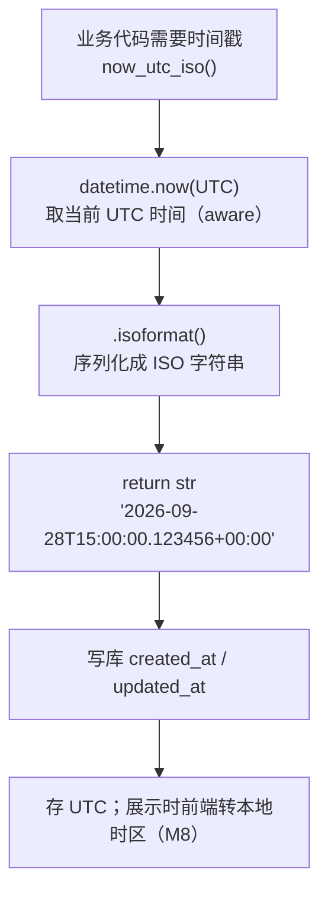

# persistence/timestamps.py — timestamps.py

> **文件路径**: `backend/packages/harness/agentflow/persistence/timestamps.py`
> **目录位置**: persistence → timestamps.py
> **职责**: 统一时间戳

## 📑 目录

- [📋 结构图](#📋-结构图)
- [📤 关键导出](#📤-关键导出)
- [💡 设计思想](#💡-设计思想)
- [🎯 实用场景](#🎯-实用场景)
- [📊 顺序执行链流程图](#📊-顺序执行链流程图)
- [🧩 代码解析（成块对照 timestamps.py）](#🧩-代码解析成块对照-timestampspy)
- [❓ Q&A / 知识点](#❓-qa--知识点)
- [⚠️ 风险点](#⚠️-风险点)

## 📋 结构图

```text
┌──────────────────────────────────────────────┐
│ now_utc_iso() → str                          │
│   datetime.now(timezone.utc)                 │
│     .isoformat() → "2026-09-28T15:00:00.123Z"│
└──────────────────────────────────────────────┘
```

## 📤 关键导出

**函数**

- `now_utc_iso()`

## 💡 设计思想

1. 全库统一 UTC ISO 字符串，避免各模块自己格式化（时区/格式漂移）。
2. 存 UTC，显示时由展示层转本地时区（M8 前端处理）。

## 🎯 实用场景

1. 统一时间戳：ISO 格式 + UTC，避免各文件各写各的

## 📊 顺序执行链流程图（now_utc_iso 被调用时）

```text
业务代码需要写入时间戳（request: now_utc_iso()）
│
▼
datetime.now(UTC)               ← 取当前 UTC 时间（带 +00:00 时区信息的 aware datetime）
│
▼
.isoformat()                    ← 序列化成 ISO 字符串
│                                 形如 "2026-09-28T15:00:00.123456+00:00"
▼
return str                      ← 业务层拿去写库（created_at / updated_at）
│
▼
存的是 UTC；展示时由前端转本地时区（M8）
```

**Mermaid 版（GitHub / 飞书渲染；VSCode 需装插件）**：



## 🧩 代码解析（成块对照 timestamps.py）

> 读法：每块先贴**完整代码**，再看块下方的整块解析。代码与文件一致，仅省略头部规范注释。

### 块 1：imports —— 只引 datetime 两样

```python
from __future__ import annotations

from datetime import UTC, datetime
```

**结构简析**：`UTC` 是 Python 3.11+ 提供的时区常量（等价于 `timezone.utc`），`datetime` 是日期时间类。

**补充**：本文件不引任何业务模块——它是最底层的工具，被各处 persistence 代码反向依赖，自身必须零业务依赖。

### 块 2：`now_utc_iso` —— 全库唯一时间戳来源

```python
def now_utc_iso() -> str:
    """返回当前 UTC 时间的 ISO 字符串（全库唯一时间戳来源）。

    注意: 存 UTC，显示时由展示层转本地时区（M8 前端处理）。
    """
    return datetime.now(UTC).isoformat()
```

**结构简析**：整个文件就这一个函数。`datetime.now(UTC)` 拿到**带时区信息**的当前 UTC 时间，`.isoformat()` 转成标准 ISO 字符串（形如 `2026-09-28T15:00:00.123456+00:00`）。

**`now_utc_iso()` 参数逐条解释**：无参数，直接返回 `datetime.now(UTC).isoformat()`。

**落库要点/补充**：它是「全库唯一时间戳来源」——业务表的 `created_at`/`updated_at` 都应从这里取，避免各模块自己格式化导致时区/格式漂移；存 UTC、显示转本地，职责切在存储层与展示层之间（M8 前端处理）。

## ❓ Q&A / 知识点

### 1. 为什么用 `datetime.now(UTC)` 而不是 `datetime.utcnow()`？

**一句话**：`datetime.utcnow()` 返回的是**不带时区**的 naive datetime（且在 Python 3.12 已废弃）；`datetime.now(UTC)` 返回带 `+00:00` 时区的 aware datetime，语义明确、不易错。

| 写法 | 返回 | 时区信息 | 状态 |
|---|---|---|---|
| `datetime.utcnow()` | naive datetime | 无 | 3.12 起 deprecated |
| **`datetime.now(UTC)`** | aware datetime | 带 +00:00 | ✅ 推荐写法 |

带时区的时间序列化出来天然是 UTC，不会混入本地时区，全库时间口径一致。

### 2. 为什么全库要收敛到一个时间戳函数？

**一句话**：时间格式一旦各写各的，就会出现"有的存本地时间、有的存 UTC、有的带毫秒有的不带"——排序、展示、对比全部失真。

收敛到 `now_utc_iso()` 一个出口：① 格式统一（永远 ISO、永远 UTC）；② `ORDER BY created_at` 字典序即时间序；③ 将来要改时间口径（如加毫秒精度、改时区策略）只改这一个函数。

## ⚠️ 风险点

1. 一律 UTC：不要在函数里改回本地时间，显示层负责转换

---
_自动生成于 doc-code 规范落地（2026-09-28）。来源：timestamps.py 头部注释 + 顶层符号。_
_2026-09-30 补齐：目录 + 顺序执行链流程图 + 成块代码解析（+Q&A）。_
_2026-10-03 重构：代码解析段按「结构简析 + 参数逐条表格 + 落库要点」规范化（代码块零改动）。_
