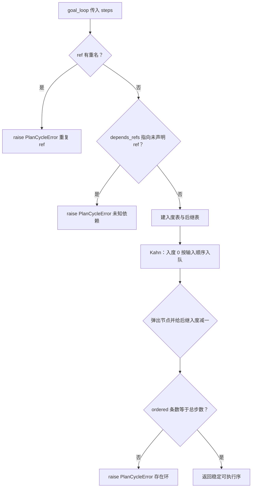

# plans/resolver.py — plans/resolver.py

> **文件路径**: `backend/packages/harness/agentflow/plans/resolver.py`
> **目录位置**: plans → resolver.py
> **职责**: 步骤计划拓扑排序与就绪步选取（M5 新增，纯函数不碰 DB）

## 📑 目录

- [📋 结构图](#📋-结构图)
- [📤 关键导出](#📤-关键导出)
- [💡 设计思想](#💡-设计思想)
- [🎯 实用场景](#🎯-实用场景)
- [📊 顺序执行链流程图](#📊-顺序执行链流程图)
- [🧩 代码解析（成块对照 resolver.py）](#🧩-代码解析成块对照-resolverpy)
- [❓ Q&A / 知识点](#❓-qa--知识点)
- [⚠️ 风险点](#⚠️-风险点)

## 📋 结构图

```text
┌──────────────────────────────────────────────────────────┐
│ PlanCycleError(ValueError)                               │
│   环 / 未知 ref / 重名 ref 统一抛此异常                   │
│                                                         │
│ topo_sort(steps) -> list[PlanStep]                       │
│   Kahn 入度法；同层按输入顺序（稳定拓扑）                 │
│                                                         │
│ next_ready_step(steps) -> PlanStep | None                │
│   pending 且 depends 全部 completed 的第一步             │
│   None = 无就绪步（全部完成 / 被阻塞）                   │
└──────────────────────────────────────────────────────────┘
```

**调用链（Grep 自 agentflow. 核实）**：

- **谁调用它**：`agents/goal/goal_loop.py` —— `topo_sort`（start 首转计划校验排序）、
  `next_ready_step`（`_run` 每圈 while 取下一可执行步）、`PlanCycleError`（start 的 except 捕获）。
- **它调用谁**：只 `from agentflow.plans.types import PlanStep`（类型标注用）；不碰 DB/模型。

## 📤 关键导出

**异常**

- `PlanCycleError`

**函数**

- `topo_sort()`
- `next_ready_step()`

## 💡 设计思想

1. Kahn 入度法做拓扑排序：入度为 0 的节点先进队，同层节点保持输入顺序入队——
   稳定拓扑意味着"落库顺序 = 可复现的执行顺序"，不随 dict 遍历漂移。
2. `next_ready_step` 是纯函数：不看 DB，只看 steps 列表里每步的 `status`。
   resume 时直接对恢复出来的 steps 数组调用，已 completed 的步自动跳过。
3. 非法计划（环/未知依赖/重名）在**计划期** `topo_sort` 一次性拦住；恢复后 JSON
   视为受信任，`next_ready_step` 不重复校验。

## 🎯 实用场景

1. 计划校验：start 拿到 `parse_steps_json` 结果后立刻 `topo_sort`，环/悬空依赖当场
   抛 `PlanCycleError`，goal_loop 捕获后置 failed。
2. 逐步驱动：`_run` 每圈 `next_ready_step` 找下一个 pending 且前置全完成的步；
   返回 None 即全部走完，转汇总完工。

## 📊 顺序执行链流程图（topo_sort 校验并排序计划）

```text
goal_loop.start() 传入 parse_steps_json 得到的 steps（request：计划合法性 + 执行序）
│
▼
重名校验：set(refs) 长度 != len(refs) -> raise PlanCycleError（重复 ref）
│
▼
悬空依赖校验：每个 dep 都必须在 index(ref 表)里
│   dep 不存在 -> raise PlanCycleError（依赖了不存在的 ref）
▼
建入度表 indeg + 后继表 dependents（dep -> 依赖它的步）
│
▼
Kahn：入度 0 的步按输入顺序入 ready 队
│
▼
while 队非空：弹出一步入 ordered，其后继入度 -1，归零则入队
│
▼
ordered 条数 != steps 条数 -> raise PlanCycleError（存在环）
│
▼
返回 ordered（稳定可执行序）；goal_loop 落库后开始逐步执行
```

**Mermaid 版（GitHub / 飞书渲染；VSCode 需装插件）**：



## 🧩 代码解析（成块对照 resolver.py）

> 读法：每块先贴**完整代码**，再看块下方的整块解析。代码与文件逐字一致。

### 块 1：import + PlanCycleError 异常

```python
from __future__ import annotations

from agentflow.plans.types import PlanStep


class PlanCycleError(ValueError):
    """步骤计划非法：存在循环依赖 / 依赖指向不存在的 ref / ref 重名。"""
```

**结构简析**：唯一外部依赖是 `plans.types.PlanStep`（仅类型标注）。`PlanCycleError` 继承 `ValueError`——这是有意为之：goal_loop 的 start 用 `except (ValueError, PlanCycleError)` 一把兜住，解析错误（ValueError）和拓扑错误（PlanCycleError）走同一个 fail_task 分支。三种非法情况（环/未知 ref/重名）统一归这个异常，调用方只判类型不看消息。

**落库要点**：纯函数模块不碰 DB。异常消息里仍带具体原因（"重复 ref"/"依赖了不存在的 ref: xxx"/"存在循环依赖"），便于调试。

### 块 2：`topo_sort` —— Kahn 拓扑排序 + 三重校验

```python
def topo_sort(steps: list[PlanStep]) -> list[PlanStep]:
    """对步骤做 Kahn 拓扑排序，返回可执行顺序。

    校验:
        - ref 重名 → PlanCycleError
        - depends_refs 指向未声明 ref → PlanCycleError
        - 存在环 → PlanCycleError
    """
    refs = [s.ref for s in steps]
    if len(set(refs)) != len(refs):
        raise PlanCycleError("存在重复的步骤 ref")
    index = {s.ref: i for i, s in enumerate(steps)}
    for s in steps:
        for dep in s.depends_refs:
            if dep not in index:
                raise PlanCycleError(f"步骤 {s.ref} 依赖了不存在的 ref: {dep}")

    indeg = {s.ref: 0 for s in steps}
    dependents: dict[str, list[str]] = {s.ref: [] for s in steps}
    for s in steps:
        for dep in s.depends_refs:
            indeg[s.ref] += 1
            dependents[dep].append(s.ref)

    # 稳定队列：按输入顺序入队，保持拓扑序可复现
    ready = [ref for ref in indeg if indeg[ref] == 0]
    ordered: list[PlanStep] = []
    head = 0
    while head < len(ready):
        ref = ready[head]
        head += 1
        ordered.append(steps[index[ref]])
        for child in dependents[ref]:
            indeg[child] -= 1
            if indeg[child] == 0:
                ready.append(child)

    if len(ordered) != len(steps):
        raise PlanCycleError("步骤计划存在循环依赖")
    return ordered
```

**结构简析**：Kahn 入度法做拓扑排序 + 三重校验。①前置校验：`set` 长度比对查重名 ref；建 `index` 映射后逐个查 `dep in index` 拦悬空依赖。②建图：`indeg` 记每步入度，`dependents` 记"谁依赖我"。③Kahn：`ready` 初始为所有入度 0 的步（按 dict 构造时的输入顺序，这是稳定拓扑的关键），用 `head` 下标手滚队列保持同层输入顺序。

**`topo_sort()` 参数逐条解释**：

| 参数 | 类型 | 默认值 | 含义 |
|---|---|---|---|
| `steps` | `list[PlanStep]` | 必填 | 待排序步骤列表；先校验重名 ref 与悬空依赖，再建入度图做 Kahn，返回可直接按序执行的 ordered |

**落库要点**：纯函数不碰 DB。最后 `len(ordered) != len(steps)` 说明有节点从未入队=成环，抛 `PlanCycleError("步骤计划存在循环依赖")`；同层按输入顺序保证落库执行序可复现（依赖 Python 3.7+ dict 保插入序）。

### 块 3：`next_ready_step` —— 纯函数取下一就绪步

```python
def next_ready_step(steps: list[PlanStep]) -> PlanStep | None:
    """返回下一个可执行步：status=pending 且 depends_refs 全部 completed 的第一步。

    None = 没有就绪步（全部完成 / 被阻塞）。
    """
    by_ref = {s.ref: s for s in steps}
    for s in steps:
        if s.status != "pending":
            continue
        if all(
            dep in by_ref and by_ref[dep].status == "completed"
            for dep in s.depends_refs
        ):
            return s
    return None
```

**结构简析**：纯函数取下一就绪步。先建 `by_ref` 查表，再顺序扫描 steps——跳过非 pending 步，对每个 pending 步用 `all(...)` 判断它的所有 dep 是否都存在且 `completed`，命中第一个就返回。

**`next_ready_step()` 参数逐条解释**：

| 参数 | 类型 | 默认值 | 含义 |
|---|---|---|---|
| `steps` | `list[PlanStep]` | 必填 | 当前步骤列表；顺序扫描返回第一个 `status=pending` 且 `depends_refs` 全部 `completed` 的步；都不满足则返回 `None` |

**落库要点**：不碰 DB、不抛错。返回 `None` 有两种含义：全部 completed（完工）或被未完成依赖永久阻塞——goal_loop 统一走"汇总完工"分支。`dep in by_ref` 对未知依赖返回 False，该步永不就绪，靠"计划期已 topo_sort 校验过"这一前提兜底。

## ❓ Q&A / 知识点

### 1. 为什么环 / 未知 ref / 重名 ref 三种错误统一抛 PlanCycleError？

**一句话**：它们都是"计划本身不合法、没法执行"的同一类错误，调用方只需一种处理：放弃计划、goal=failed。

goal_loop 的 start 是 `except (ValueError, PlanCycleError) as exc: fail_task(...)`——它不关心
是哪种非法，只关心"这计划不能跑"。把三种情况收敛成一个异常类型，调用方少写分支，错误消息里
仍带具体原因（"重复 ref"/"依赖了不存在的 ref: xxx"/"存在循环依赖"）。继承 ValueError 还能和
parse_steps_json 的解析错误共用同一个 except 元组。

### 2. next_ready_step 为什么用返回 None 表示"没有就绪步"，而不是抛错或返回哨兵？

**一句话**：None 是控制信号不是错误——"没有可执行步"在 while 闭环里意味着完工，不是异常。

goal_loop 的 `_run` 是 `while True: step = next_ready_step(steps); if step is None: 完工返回`。
把"全部完成"建模成正常返回值（None），闭环才能自然退出走 `_build_summary`。如果这里抛异常，
完工就得用异常当控制流，可读性和调试都差。真正的非法计划（环/悬空依赖）已经在计划期
topo_sort 拦掉了，所以恢复阶段 next_ready_step 遇到 None 基本等价于"跑完了"。

## ⚠️ 风险点

1. `next_ready_step` 不校验未知依赖：若 steps 来自未经 topo_sort 的脏数据，悬空依赖会让该步
   永久 pending、且永不报错（靠"计划期已 topo_sort"前提兜底）。
2. 稳定拓扑依赖 dict 构造顺序：Python 3.7+ dict 保插入序，换实现若不保证顺序，落库执行序会漂移。
3. 成环判定靠 `len(ordered) != len(steps)`：环里的节点被静默丢弃后计数，消息只说"存在环"，
   不指出具体哪几个 ref 成环（调试时需自行画图）。

---
_2026-10-02 新建：M5 文档（目录 + 流程图 + 成块代码解析 + Q&A）。_

_2026-10-03 重构：代码解析段按「结构简析 + 参数逐条表格 + 落库要点」规范化（代码块零改动）。_
