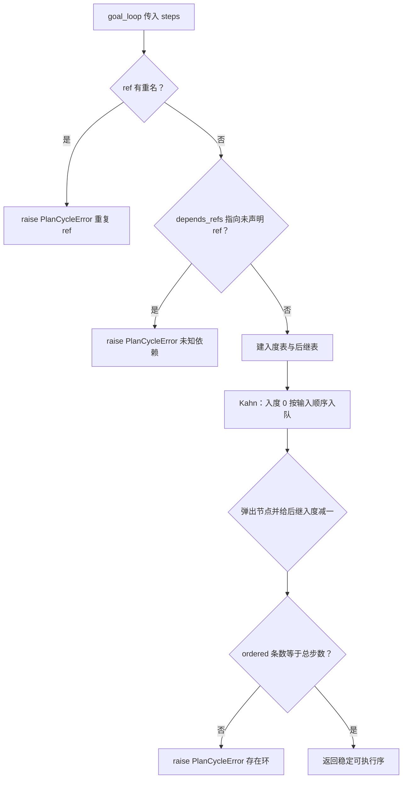

# plans/resolver.py — plans/resolver.py

> **文件路径**: `backend/packages/harness/agentflow/plans/resolver.py`
> 1.定义PlanCycleError 
> 2.拓扑排序 topo_sort
> 3.next_ready_step() 下一步要执行的 step 对象本身
> **目录位置**: plans → resolver.py
> **职责**: 步骤计划拓扑排序与就绪步选取（M5 新增，纯函数不碰 DB）
> resolver: 解析器，负责按照规则查找 匹配，解析，决断

## 📑 目录

- [📋 结构图](#📋-结构图)
- [📤 关键导出](#📤-关键导出)
- [💡 设计思想](#💡-设计思想)
- [🎯 实用场景](#🎯-实用场景)
- [📊 顺序执行链流程图](#📊-顺序执行链流程图)
- [🧩 代码解析（成块对照 resolver.py）](#🧩-代码解析成块对照-resolverpy)
- [❓ Q&A / 知识点](#❓-qa--知识点)
- [⚠️ 风险点](#⚠️-风险点)

## 📋 结构图

```text
┌──────────────────────────────────────────────────────────┐
│ PlanCycleError(ValueError)                               │
│   环 / 未知 ref / 重名 ref 统一抛此异常                   │
│                                                         │
│ topo_sort(steps) -> list[PlanStep]                       │
│   Kahn 入度法；同层按输入顺序（稳定拓扑）                 │
│                                                         │
│ next_ready_step(steps) -> PlanStep | None                │
│   pending 且 depends 全部 completed 的第一步             │
│   None = 无就绪步（全部完成 / 被阻塞）                   │
└──────────────────────────────────────────────────────────┘
```

**调用链（Grep 自 agentflow. 核实）**：

- **谁调用它**：`agents/goal/goal_loop.py` —— `topo_sort`（start 首转计划校验排序）、
  `next_ready_step`（`_run` 每圈 while 取下一可执行步）、`PlanCycleError`（start 的 except 捕获）。
- **它调用谁**：只 `from agentflow.plans.types import PlanStep`（类型标注用）；不碰 DB/模型。

## 📤 关键导出

**异常**

- `PlanCycleError`

**函数**

- `topo_sort()`
- `next_ready_step()`

## 💡 设计思想

1. Kahn 入度法做拓扑排序：入度为 0 的节点先进队，同层节点保持输入顺序入队——
   稳定拓扑意味着"落库顺序 = 可复现的执行顺序"，不随 dict 遍历漂移。
2. `next_ready_step` 是纯函数：不看 DB，只看 steps 列表里每步的 `status`。
   resume 时直接对恢复出来的 steps 数组调用，已 completed 的步自动跳过。
3. 非法计划（环/未知依赖/重名）在**计划期** `topo_sort` 一次性拦住；恢复后 JSON
   视为受信任，`next_ready_step` 不重复校验。

## 🎯 实用场景

1. 计划校验：start 拿到 `parse_steps_json` 结果后立刻 `topo_sort`，环/悬空依赖当场
   抛 `PlanCycleError`，goal_loop 捕获后置 failed。
2. 逐步驱动：`_run` 每圈 `next_ready_step` 找下一个 pending 且前置全完成的步；
   返回 None 即全部走完，转汇总完工。

## 📊 顺序执行链流程图（topo_sort 校验并排序计划）

```text
goal_loop.start() 传入 parse_steps_json 得到的 steps（request：计划合法性 + 执行序）
│
▼
重名校验：set(refs) 长度 != len(refs) -> raise PlanCycleError（重复 ref）
│
▼
悬空依赖校验：每个 dep 都必须在 index(ref 表)里
│   dep 不存在 -> raise PlanCycleError（依赖了不存在的 ref）
▼
建入度表 indeg + 后继表 dependents（dep -> 依赖它的步）
│
▼
Kahn：入度 0 的步按输入顺序入 ready 队
│
▼
while 队非空：弹出一步入 ordered，其后继入度 -1，归零则入队
│
▼
ordered 条数 != steps 条数 -> raise PlanCycleError（存在环）
│
▼
返回 ordered（稳定可执行序）；goal_loop 落库后开始逐步执行
```

**Mermaid 版（GitHub / 飞书渲染；VSCode 需装插件）**：



## 🧩 代码解析（成块对照 resolver.py）

> 读法：每块先贴**完整代码**，再看块下方的整块解析。代码与文件逐字一致。

### 块 1：import + PlanCycleError 异常

```python
from __future__ import annotations

from agentflow.plans.types import PlanStep


class PlanCycleError(ValueError):
    """步骤计划非法：存在循环依赖 / 依赖指向不存在的 ref / ref 重名。"""
```

**结构简析**：唯一外部依赖是 `plans.types.PlanStep`（仅类型标注）。`PlanCycleError` 继承 `ValueError`——这是有意为之：goal_loop 的 start 用 `except (ValueError, PlanCycleError)` 一把兜住，解析错误（ValueError）和拓扑错误（PlanCycleError）走同一个 fail_task 分支。三种非法情况（环/未知 ref/重名）统一归这个异常，调用方只判类型不看消息。

**落库要点**：纯函数模块不碰 DB。异常消息里仍带具体原因（"重复 ref"/"依赖了不存在的 ref: xxx"/"存在循环依赖"），便于调试。

### 块 2：`topo_sort` —— Kahn 拓扑排序 + 三重校验

```python
def topo_sort(steps: list[PlanStep]) -> list[PlanStep]:
    """对步骤做 Kahn 拓扑排序，返回可执行顺序。

    校验:
        - ref 重名 → PlanCycleError
        - depends_refs 指向未声明 ref → PlanCycleError
        - 存在环 → PlanCycleError
    """
    refs = [s.ref for s in steps]
    if len(set(refs)) != len(refs):
        raise PlanCycleError("存在重复的步骤 ref")
    index = {s.ref: i for i, s in enumerate(steps)}
    for s in steps:
        for dep in s.depends_refs:
            if dep not in index:
                raise PlanCycleError(f"步骤 {s.ref} 依赖了不存在的 ref: {dep}")

    indeg = {s.ref: 0 for s in steps}
    dependents: dict[str, list[str]] = {s.ref: [] for s in steps}
    for s in steps:
        for dep in s.depends_refs:
            indeg[s.ref] += 1
            dependents[dep].append(s.ref)

    # 稳定队列：按输入顺序入队，保持拓扑序可复现
    ready = [ref for ref in indeg if indeg[ref] == 0]
    ordered: list[PlanStep] = []
    head = 0
    while head < len(ready):
        ref = ready[head]
        head += 1
        ordered.append(steps[index[ref]])
        for child in dependents[ref]:
            indeg[child] -= 1
            if indeg[child] == 0:
                ready.append(child)

    if len(ordered) != len(steps):
        raise PlanCycleError("步骤计划存在循环依赖")
    return ordered
```

**结构简析**：Kahn 入度法做拓扑排序 + 三重校验。①前置校验：`set` 长度比对查重名 ref；建 `index` 映射后逐个查 `dep in index` 拦悬空依赖。②建图：`indeg` 记每步入度，`dependents` 记"谁依赖我"。③Kahn：`ready` 初始为所有入度 0 的步（按 dict 构造时的输入顺序，这是稳定拓扑的关键），用 `head` 下标手滚队列保持同层输入顺序。

**逐步推演（拿一个 4 步带分叉的例子，把每一行跑一遍）**：

假设模型吐出 4 步（s2/s3 都等 s1，s4 等 s2 和 s3 都完成）：

```text
s1: depends_refs = []          ← 无依赖
s2: depends_refs = ["s1"]      ← 等 s1
s3: depends_refs = ["s1"]      ← 等 s1（与 s2 分叉，同层）
s4: depends_refs = ["s2","s3"] ← 等两个都完成（汇合）
```

**第 1 关——查重名**：

```text
refs = ["s1","s2","s3","s4"]；set(refs) 长度 = 4 == len(refs) ✓
（若两个步骤都叫 "s1"，set 变 3 ≠ 4 → 抛 PlanCycleError，图里分不清谁是谁）
```

**第 2 关——查悬空依赖**：

```text
index = {"s1":0, "s2":1, "s3":2, "s4":3}
逐个查 depends_refs 里的 dep 在不在 index：
  s2→"s1" ✓   s3→"s1" ✓   s4→"s2","s3" ✓
（若某步写 depends_refs=["s9"]，s9 不在 index → 抛 PlanCycleError）
```

**第 3 关——建图（算每步的"入度"）**：

```text
入度 = 有多少步挡在我前面（我依赖了几个还没执行的步骤）

初始 indeg = {"s1":0, "s2":0, "s3":0, "s4":0}
dependents = {"s1":[], "s2":[], "s3":[], "s4":[]}   ← "谁依赖我"的反向表

遍历 steps：
  s1 无依赖        → indeg["s1"] 保持 0
  s2 依赖 s1       → indeg["s2"]=1，dependents["s1"].append("s2")
  s3 依赖 s1       → indeg["s3"]=1，dependents["s1"].append("s3")
  s4 依赖 s2、s3   → indeg["s4"]=2，dependents["s2"]=["s4"]，dependents["s3"]=["s4"]

最终：indeg={"s1":0, "s2":1, "s3":1, "s4":2}   ← s4 前面挡了 2 个
      dependents={"s1":["s2","s3"], "s2":["s4"], "s3":["s4"], "s4":[]}
```

**Kahn 主循环（谁入度 0 谁先走，走完给后面的人解锁）**：

```text
ready = ["s1"]                ← 入度 0 的只有 s1，先进队
ordered = []

第 1 轮：出队 "s1" → ordered=[s1]
   s1 的 dependents 是 ["s2","s3"]：
     indeg["s2"] 1→0，入队；indeg["s3"] 1→0，入队
   ready = ["s2","s3"]

第 2 轮：出队 "s2" → ordered=[s1,s2]
   s2 的 dependents 是 ["s4"]：indeg["s4"] 2→1（还没到 0，不满足入队）
   ready = ["s3"]

第 3 轮：出队 "s3" → ordered=[s1,s2,s3]
   s3 的 dependents 是 ["s4"]：indeg["s4"] 1→0，入队
   ready = ["s4"]

第 4 轮：出队 "s4" → ordered=[s1,s2,s3,s4]

len(ordered)=4 == len(steps)=4 ✓ → 返回 [s1, s2, s3, s4]
```

**如果存在环会怎样**（如 s1 依赖 s2、s2 依赖 s1）：

```text
两步入度都是 1，谁都没有 0 → ready 一开始就是空 → 主循环一次都不转
ordered 空，len=0 ≠ 2 → 抛 PlanCycleError("步骤计划存在循环依赖")
```

一句话总结：**入度 = 我前面还挡着几个没做完的步骤；Kahn = 把入度 0 的拿出来执行，执行完把它挡着的人入度减 1，减到 0 就解锁，直到全部出队；出队人数不够 = 有环**。

**`topo_sort()` 参数逐条解释**：

| 参数 | 类型 | 默认值 | 含义 |
|---|---|---|---|
| `steps` | `list[PlanStep]` | 必填 | 待排序步骤列表；先校验重名 ref 与悬空依赖，再建入度图做 Kahn，返回可直接按序执行的 ordered |

**落库要点**：纯函数不碰 DB。最后 `len(ordered) != len(steps)` 说明有节点从未入队=成环，抛 `PlanCycleError("步骤计划存在循环依赖")`；同层按输入顺序保证落库执行序可复现（依赖 Python 3.7+ dict 保插入序）。

### 块 3：`next_ready_step` —— 纯函数取下一就绪步

```python
def next_ready_step(steps: list[PlanStep]) -> PlanStep | None:
    """返回下一个可执行步：status=pending 且 depends_refs 全部 completed 的第一步。

    None = 没有就绪步（全部完成 / 被阻塞）。
    """
    by_ref = {s.ref: s for s in steps}
    for s in steps:
        if s.status != "pending":
            continue
        if all(
            dep in by_ref and by_ref[dep].status == "completed"
            for dep in s.depends_refs
        ):
            return s
    return None
```

**结构简析**：纯函数取下一就绪步。先建 `by_ref` 查表，再顺序扫描 steps——跳过非 pending 步，对每个 pending 步用 `all(...)` 判断它的所有 dep 是否都存在且 `completed`，命中第一个就返回。

**逐步推演（3 个场景，把每一行跑一遍）**：

**场景 A：正常推进（3 步链）**

```text
初始：s1 pending（无依赖）, s2 pending（等 s1）, s3 pending（等 s2）

第 1 次调用：s1 无依赖 → all() 空集 = True → 返回 s1
执行 s1 → status = completed

第 2 次调用：s1 跳过（非 pending）；s2 的依赖 s1 completed ✓ → 返回 s2
执行 s2 → completed

第 3 次调用：s1/s2 跳过；s3 的依赖 s2 completed ✓ → 返回 s3
执行 s3 → completed

第 4 次调用：三个都跳过 → 没有 pending → 返回 None（完工）
```

**场景 B：分叉汇合（s4 要等 s2 和 s3 都完成）**

```text
状态：s1 completed, s2 pending（等 s1）, s3 pending（等 s1）, s4 pending（等 s2+s3）

第 1 次调用 → s2 就绪，返回 s2（s3 其实也就绪，但按输入顺序先给 s2）
执行 s2 → completed

第 2 次调用 → s3 就绪，返回 s3
执行 s3 → completed

第 3 次调用 → s4 检查：s2 completed ✓ 且 s3 completed ✓ → all() True → 返回 s4
（若此刻 s3 还是 pending，s4 的 all() 是 False → 不返回，继续等）
```

**场景 C：悬空依赖导致永不就绪（仅脏数据路径，正常流程不会发生）**

```text
状态：s2 pending，depends_refs=["s9"]（s9 在 steps 里不存在）

调用 → s2 扫描到：all() 里 dep="s9"，"s9" in by_ref？ False → all() False
      → 不返回；没有其它 pending → 返回 None
```

**注意：源码里步骤永远不会被置为 `failed`**（goal_loop 只设 pending/executing/completed，
执行失败是"回落 pending + 熔断 paused / invoke 异常 → paused 断点"），所以"前置 failed 卡死"
不是真实场景。且 `goal_loop._run` 对 `step is None` **无条件**走"全部走完 → complete_task(done)"
（源码 `_run` 162-169 行），不区分"完工"与"被阻塞"——正常流程里悬空依赖已在计划期被
topo_sort 拦截，所以 None 基本等价于跑完了；仅脏数据（绕过 topo_sort）会让悬空依赖步
永久 pending 且仍被当完工处理，这是已知权衡（见风险点 1）。

**`next_ready_step()` 参数逐条解释**：

| 参数 | 类型 | 默认值 | 含义 |
|---|---|---|---|
| `steps` | `list[PlanStep]` | 必填 | 当前步骤列表；顺序扫描返回第一个 `status=pending` 且 `depends_refs` 全部 `completed` 的步；都不满足则返回 `None` |

**落库要点**：不碰 DB、不抛错。返回 `None` 有两种含义：全部 completed（完工）或被未完成依赖永久阻塞——goal_loop 统一走"汇总完工"分支。`dep in by_ref` 对未知依赖返回 False，该步永不就绪，靠"计划期已 topo_sort 校验过"这一前提兜底。

### 5. next_ready_step 返回的就是"下一步要执行的 step 对象"吗？

**是。** 它返回 steps 里**第一个** `status=="pending"` 且 `depends_refs` 全部 `completed`
的 **PlanStep 对象本身**（含 ref / name / description / depends_refs / status 全部字段），
不是 ref 字符串、不是下标；没有就绪步则返回 `None`。

**和 topo_sort 区分**：

| | topo_sort | next_ready_step |
|---|---|---|
| 返回 | 排好序的**整个列表** | **单个 PlanStep 对象**（下一步）或 None |
| 定位 | 谁先谁后的顺序 | 现在执行谁 |

goal_loop 拿到该对象后：`step.status = executing` → 用 `step` 拼 nudge 提示词 →
invoke → 判定 verdict 决定 `completed` 收步还是回落 `pending` 重试。

## ❓ Q&A / 知识点

### 1. 为什么环 / 未知 ref / 重名 ref 三种错误统一抛 PlanCycleError？

**一句话**：它们都是"计划本身不合法、没法执行"的同一类错误，调用方只需一种处理：放弃计划、goal=failed。

goal_loop 的 start 是 `except (ValueError, PlanCycleError) as exc: fail_task(...)`——它不关心
是哪种非法，只关心"这计划不能跑"。把三种情况收敛成一个异常类型，调用方少写分支，错误消息里
仍带具体原因（"重复 ref"/"依赖了不存在的 ref: xxx"/"存在循环依赖"）。继承 ValueError 还能和
parse_steps_json 的解析错误共用同一个 except 元组。

### 2. next_ready_step 为什么用返回 None 表示"没有就绪步"，而不是抛错或返回哨兵？

**一句话**：None 是控制信号不是错误——"没有可执行步"在 while 闭环里意味着完工，不是异常。

goal_loop 的 `_run` 是 `while True: step = next_ready_step(steps); if step is None: 完工返回`。
把"全部完成"建模成正常返回值（None），闭环才能自然退出走 `_build_summary`。如果这里抛异常，
完工就得用异常当控制流，可读性和调试都差。真正的非法计划（环/悬空依赖）已经在计划期
topo_sort 拦掉了，所以恢复阶段 next_ready_step 遇到 None 基本等价于"跑完了"。

### 3. 什么是"入度"？什么是 Kahn 拓扑排序？为什么它能排出执行顺序？

**入度（indegree）**：指向该节点的箭头数。放到计划语境 = "我依赖了几个还没执行的步骤"。
入度 0 就是"没人挡着我，现在就能执行"；入度 2 就是"前面还挡着 2 步"。

**拓扑排序**：把"有依赖关系的步骤"排成一条**谁先谁后**的顺序——保证排在前面的步，
它的所有前置都排在更前面。有环（s1 等 s2、s2 等 s1）就永远排不出来。

**Kahn 算法（入度法）** 三步走：

1. 算每个节点的入度；
2. 把所有入度 0 的节点放进队列（它们没有前置，可以先做）；
3. 循环：从队列取一个节点输出，把"它挡着的人"入度减 1；谁减到 0 就进队列。重复到队列空。

| 概念 | 计划语境里的对应 |
|---|---|
| 节点 | 一个步骤 PlanStep |
| 边（箭头） | depends_refs（s2 依赖 s1 → s1→s2 一条边） |
| 入度 | 该步 depends_refs 的长度（有几个前置） |
| 出度/后继 | dependents 表（谁依赖我） |
| 队列 | 所有"现在就能执行"的步骤 |

**为什么能排出执行顺序**：入度 0 = 前置全做完 = 此刻可执行；执行完就把依赖它的步骤的入度
减 1，等于"我做完了一个前置"，它的前置数自然少一个，减到 0 就轮到它了——这就是"逐步解锁"。
本例推演见块 2 的**逐步推演**小节。

### 4. `topo_sort` 和 `next_ready_step` 都处理依赖，有什么区别？为什么两个都要？

**一句话**：topo_sort 是"开工前排一次队"，next_ready_step 是"执行中每轮决定现在做哪步"——一个是静态校验，一个是动态推进。

| 维度 | `topo_sort` | `next_ready_step` |
|---|---|---|
| 时机 | **计划期**：start 拿到模型计划后调用一次 | **运行期**：goal_loop 每轮 while 调用一次 |
| 看什么 | 只看 `depends_refs`（**静态**依赖图） | 看 `status`（**动态**进度：哪些已 completed） |
| 输出 | 排好序的**完整列表** | 单个步或 None |
| 出错 | 非法计划（环/悬空/重名）→ **抛 PlanCycleError** | **永不抛错**，未知依赖当"未完成" |
| 用几次 | 一次（结果落库） | 每执行完一步就再调一次 |

**为什么要两个**：

```text
topo_sort（开工前）：
  1. 合法性检查——模型吐的计划可能是垃圾（有环、引用了不存在的 ref）
  2. 排出可复现的执行顺序（落库 = 以后 resume 的执行顺序）

next_ready_step（执行中）：
  1. 计划已经合法，不需要再查环/悬空
  2. 只看"这一步做完没有"——completed 的跳过，前置全 completed 的 pending 步就是下一个
  3. resume 场景：从库里恢复 steps（带 status）后直接调它，自动接着断点往下走
```

**为什么不只用一个**：topo_sort 排完就完事，它不更新 status；执行中每步状态在变，
必须有个函数每次现算"当前该做谁"——这就是 next_ready_step。反过来只用 next_ready_step
也不行：它不查环/悬空，垃圾计划会在执行中静默卡死（永不报错）。

## ⚠️ 风险点

1. `next_ready_step` 不校验未知依赖：若 steps 来自未经 topo_sort 的脏数据，悬空依赖会让该步
   永久 pending、且永不报错（靠"计划期已 topo_sort"前提兜底）。
2. 稳定拓扑依赖 dict 构造顺序：Python 3.7+ dict 保插入序，换实现若不保证顺序，落库执行序会漂移。
3. 成环判定靠 `len(ordered) != len(steps)`：环里的节点被静默丢弃后计数，消息只说"存在环"，
   不指出具体哪几个 ref 成环（调试时需自行画图）。

---
_2026-10-02 新建：M5 文档（目录 + 流程图 + 成块代码解析 + Q&A）。_

_2026-10-03 重构：代码解析段按「结构简析 + 参数逐条表格 + 落库要点」规范化（代码块零改动）。_

_2026-10-05 追加：块 2 新增逐步推演（4 步分叉例逐行跑 + 环示例）；Q&A 3（入度/Kahn 概念 + 表）。_

_2026-10-05 追加：块 3 新增逐步推演（正常推进/分叉汇合/悬空依赖 3 场景）；Q&A 4（topo_sort vs next_ready_step 对比表）。_

_2026-10-05 修正：场景 C 由"前置 failed"更正为"悬空依赖"（源码步骤从不置 failed，goal_loop 对 None 无条件完工，见块 3）。_

_2026-10-05 追加：Q&A 5（next_ready_step 返回下一步 PlanStep 对象本身，含 topo_sort 对比表）。_
