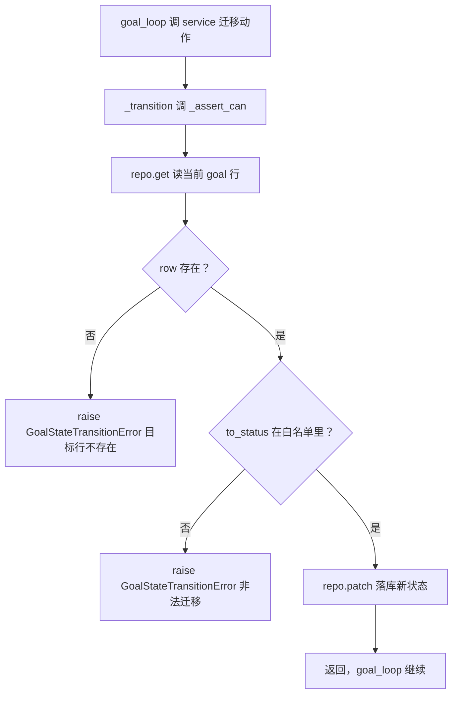

# plans/service.py — plans/service.py

> **文件路径**: `backend/packages/harness/agentflow/plans/service.py`
> **目录位置**: plans → service.py
> **职责**: 长任务 goal 状态迁移守卫（M5）——所有 goal_status 变更的唯一合法入口

## 📑 目录

- [📋 结构图](#📋-结构图)
- [📤 关键导出](#📤-关键导出)
- [💡 设计思想](#💡-设计思想)
- [🎯 实用场景](#🎯-实用场景)
- [📊 顺序执行链流程图](#📊-顺序执行链流程图)
- [🧩 代码解析（成块对照 service.py）](#🧩-代码解析成块对照-servicepy)
- [❓ Q&A / 知识点](#❓-qa--知识点)
- [⚠️ 风险点](#⚠️-风险点)

## 📋 结构图

```text
┌────────────────────────────────────────────────────────────┐
│ ALLOWED_TRANSITIONS（goal 级迁移白名单，from -> to 集合）   │
│ GoalStateTransitionError(RuntimeError)                     │
│                                                            │
│ GoalStateService(goal_repo)                                │
│   _assert_can / _transition   内部守卫                      │
│   begin_planning   pending  -> planning                    │
│   finalize_plan    planning -> planned（落计划 JSON）       │
│   begin_execution  planned  -> executing（自动授权）       │
│   complete_step    executing（走 repo.complete_step 原语）  │
│   pause_task       executing -> paused（断点）             │
│   resume_task      paused    -> executing                  │
│   fail_task        planning/executing -> failed            │
│   complete_task    executing -> completed（写汇总）        │
└────────────────────────────────────────────────────────────┘
```

**调用链（Grep 自 agentflow. 核实）**：

- **谁调用它**：`agents/goal/goal_loop.py` —— `GoalEngine.__init__` 在 service 缺省时自动
  `GoalStateService(goal_repo)` 构造（line 96），随后 start/_run/resume 全部经 service 走迁移；
  测试 `tests/test_goal_graph.py` 显式注入 service。
- **它调用谁**：`agentflow.persistence.goal_repositories.GoalRepository`（TYPE_CHECKING 导入，
  运行期调 `get/patch/update_plan/complete_step/complete_goal` 等原语）。

## 📤 关键导出

**常量**

- `ALLOWED_TRANSITIONS`

**异常**

- `GoalStateTransitionError`

**类**

- `GoalStateService`

## 💡 设计思想

1. 分层：service 做守卫（"能不能迁"），repo 做原语（"怎么写 SQL"）。goal_loop 一律经
   service 走迁移，不直接裸改 goal_status——白名单校验集中在一处。
2. 8 态迁移白名单照 M5 设计文档 §3：pending→planning/planned/executing/cancelled；
   planning→planned/failed/cancelled；planned→executing/planning/cancelled；
   executing→paused/completed/failed/cancelled；paused→executing/cancelled；
   failed→executing/cancelled；completed/cancelled 是终态（空集合）。
3. M5 自动授权：planned→executing 不再等人二次确认，长任务从计划到开跑一口气走完。

## 🎯 实用场景

1. 状态机收口：任何 goal_status 变化都先过 `_assert_can`，非法迁移当场抛
   `GoalStateTransitionError`，杜绝"completed 行被改回 executing"这类错乱。
2. 断点与恢复：pause_task（executing→paused）/resume_task（paused→executing）是
   `--thread` 断点续跑的状态依据。

## 📊 顺序执行链流程图（一次迁移动作的内部流程）

```text
goal_loop 调 service.begin_execution(goal_id)（request：planned -> executing）
│
▼
_transition(goal_id, "executing")
│
▼
_assert_can(goal_id, "executing")
│   repo.get(goal_id) 读当前行；row 为 None -> raise GoalStateTransitionError
│   current = row["goal_status"]
▼
查 ALLOWED_TRANSITIONS[current] 是否含 "executing"
│   不含 -> raise GoalStateTransitionError（非法迁移: current -> executing）
▼
校验通过 -> repo.patch(goal_id, status="executing", **附带字段) 落库
│
▼
返回；goal_loop 继续下一步（failed_task 等带 last_error 字段同理）
```

**Mermaid 版（GitHub / 飞书渲染；VSCode 需装插件）**：



## 🧩 代码解析（成块对照 service.py）

> 读法：每块先贴**完整代码**，再看块下方的整块解析。代码与文件逐字一致。

### 块 1：imports + TYPE_CHECKING 延迟导入 GoalRepository

```python
from __future__ import annotations

from typing import TYPE_CHECKING

if TYPE_CHECKING:
    from agentflow.persistence.goal_repositories import GoalRepository
```

**结构简析**：`GoalRepository` 只在类型标注里出现（`goal_repo: "GoalRepository"`），用 `TYPE_CHECKING` 守卫做**延迟导入**——运行期不真正 import persistence 层，避免 service ↔ repo 的循环导入，同时给 IDE/mypy 完整类型提示。运行时 service 拿到的 repo 是鸭子类型对象，只要有 `get/patch/...` 方法即可。

**落库要点**：本块只是导入，不落库；鸭子类型意味着测试可注入 fake repo。

### 块 2：ALLOWED_TRANSITIONS 迁移白名单

```python
# goal 级状态迁移白名单（from → 允许的 to 集合）
ALLOWED_TRANSITIONS: dict[str, frozenset[str]] = {
    "pending": frozenset({"planning", "planned", "executing", "cancelled"}),
    "planning": frozenset({"planned", "failed", "cancelled"}),
    "planned": frozenset({"executing", "planning", "cancelled"}),
    "executing": frozenset({"paused", "completed", "failed", "cancelled"}),
    "paused": frozenset({"executing", "cancelled"}),
    "failed": frozenset({"executing", "cancelled"}),
    "completed": frozenset(),  # 终态
    "cancelled": frozenset(),  # 终态
}
```

**结构简析**：8 个态，每个态映射到一个 `frozenset`（不可变集合，防运行期被改）。终态 `completed`/`cancelled` 映射空集合——任何 to 都不在空集里，这两个态从白名单层面物理封死、再也迁不出去。`failed` 可回 `executing`（resume 后重试），`paused` 也回 `executing`，正是断点续跑的两个合法入口。

**落库要点**：白名单用字符串字面量（service.py 里裸写 `"executing"`）而非 goal_state 常量，与 `goal_state.py` 常量存在漂移风险；`_assert_can` 查 `ALLOWED_TRANSITIONS.get(current, frozenset())`，未知 current 按空集处理。

### 块 3：GoalStateTransitionError + _current_status

```python
class GoalStateTransitionError(RuntimeError):
    """非法的 goal 状态迁移（当前态不在白名单允许路径上）。"""


def _current_status(row) -> str:
    """从 repo 行（sqlite3.Row）取 goal_status。"""
    if row is None:
        raise GoalStateTransitionError("目标行不存在")
    return str(row["goal_status"])
```

**结构简析**：异常继承 `RuntimeError`（与 resolver 的 ValueError 体系区分开——非法迁移是运行期状态机错误，不是数据解析错误）。`_current_status` 是私有小工具，把"读状态+空值检查"收口一处。

**`_current_status()` 参数逐条解释**：

| 参数 | 类型 | 默认值 | 含义 |
|---|---|---|---|
| `row` | `sqlite3.Row` / `None` | 必填 | repo.get 返回的 goal 行；为 None 直接 `raise GoalStateTransitionError("目标行不存在")`，否则统一 `str(row["goal_status"])` |

**落库要点**：被 `_assert_can` 与 `complete_step` 复用；它只负责取状态字符串，不含迁移规则。

### 块 4：GoalStateService.__init__ + 内部守卫 _assert_can / _transition

```python
class GoalStateService:
    """长任务状态迁移器：所有 goal_status 变更的唯一合法入口。"""

    def __init__(self, goal_repo: "GoalRepository"):
        self._repo = goal_repo

    # ---------- 内部守卫 ----------
    def _assert_can(self, goal_id: str, to_status: str) -> str:
        """校验 goal 可迁到 to_status，返回当前状态；否则 raise GoalStateTransitionError。"""
        row = self._repo.get(goal_id)
        current = _current_status(row)
        allowed = ALLOWED_TRANSITIONS.get(current, frozenset())
        if to_status not in allowed:
            raise GoalStateTransitionError(
                f"非法迁移: goal={goal_id} {current} → {to_status}"
            )
        return current

    def _transition(self, goal_id: str, to_status: str, **patch_fields) -> None:
        """校验后落库：状态 + 附带字段（stop_reason/last_error 等）。"""
        self._assert_can(goal_id, to_status)
        self._repo.patch(goal_id, status=to_status, **patch_fields)
```

**结构简析**：`__init__` 只持有 repo。`_assert_can` 是唯一的校验点：读当前态→查白名单→不在允许集就抛；`_transition` 把"校验+落库"绑成原子两步。凡是走标准 patch 的迁移动作都复用这两个私有方法。

**`__init__()` 参数逐条解释**：

| 参数 | 类型 | 默认值 | 含义 |
|---|---|---|---|
| `goal_repo` | `GoalRepository`（TYPE_CHECKING 延迟导入，运行期鸭子类型） | 必填 | 注入的 goal 仓储；service 经它 `get/patch/update_plan` 等原语落库 |

**`_assert_can()` 参数逐条解释**：

| 参数 | 类型 | 默认值 | 含义 |
|---|---|---|---|
| `goal_id` | `str` | 必填 | 目标 goal 唯一 ID；`repo.get(goal_id)` 读当前行 |
| `to_status` | `str` | 必填 | 想迁入的目标态；不在 `ALLOWED_TRANSITIONS[current]` 白名单则抛 GoalStateTransitionError；校验通过后返回 current 当前态 |

**`_transition()` 参数逐条解释**：

| 参数 | 类型 | 默认值 | 含义 |
|---|---|---|---|
| `goal_id` | `str` | 必填 | 目标 goal ID；先 `_assert_can` 校验再落库 |
| `to_status` | `str` | 必填 | 迁入的目标态字符串 |
| `**patch_fields` | `dict` | `{}` | 顺带写的附加字段（如 `stop_reason`/`last_error`），透传为 `repo.patch(goal_id, status=to_status, **patch_fields)` |

**落库要点**：`_assert_can` 抛错消息带 `goal_id/current/to`（如"非法迁移: goal=… planning → executing"），便于调试；`**patch_fields` 让 pause/fail 能顺带写 `stop_reason`/`last_error`。

### 块 5：8 个公开迁移动作

```python
    # ---------- 迁移动作 ----------
    def begin_planning(self, goal_id: str) -> None:
        """pending → planning：开始生成步骤计划。"""
        self._transition(goal_id, "planning")

    def finalize_plan(self, goal_id: str, plan_steps_json: str) -> None:
        """planning → planned：拓扑校验通过，落计划 JSON。"""
        self._assert_can(goal_id, "planned")
        self._repo.update_plan(goal_id, plan_steps_json=plan_steps_json, status="planned")

    def begin_execution(self, goal_id: str) -> None:
        """planned → executing：M5 自动授权，不等用户二次确认。"""
        self._transition(goal_id, "executing")

    def complete_step(self, goal_id: str, step_ref: str, plan_steps_json: str) -> None:
        """一步执行完毕：要求目标处于 executing；走 repo.complete_step 原语。"""
        row = self._repo.get(goal_id)
        if _current_status(row) != "executing":
            raise GoalStateTransitionError(
                f"complete_step 需要 executing，当前={_current_status(row)}"
            )
        self._repo.complete_step(goal_id, current_step=step_ref, plan_steps_json=plan_steps_json)

    def pause_task(self, goal_id: str, stop_reason: str = "") -> None:
        """executing → paused：熔断/空回复/异常/步数上限等断点。"""
        self._transition(goal_id, "paused", stop_reason=stop_reason)

    def resume_task(self, goal_id: str) -> None:
        """paused → executing：--thread 恢复断点续跑。"""
        self._transition(goal_id, "executing")

    def fail_task(self, goal_id: str, last_error: str = "") -> None:
        """planning/executing → failed：计划生成失败等致命错误。"""
        self._transition(goal_id, "failed", last_error=last_error)

    def complete_task(self, goal_id: str, summary: str, outcome: str = "done") -> None:
        """executing → completed：全部步骤走完，写汇总报告。"""
        self._assert_can(goal_id, "completed")
        self._repo.complete_goal(goal_id, summary=summary, outcome=outcome)
```

**结构简析**：8 个动作分两类——①走 `_transition`（begin_planning/begin_execution/pause_task/resume_task/fail_task）：标准"校验+patch"；②走特殊 repo 原语（finalize_plan→`update_plan`、complete_step→`complete_step`、complete_task→`complete_goal`）：这三个要顺带写计划 JSON/步坐标/汇总，不适合通用 patch，所以单独调 repo 原语，但**仍先 `_assert_can`** 做白名单校验。

**`begin_planning()` 参数逐条解释**：

| 参数 | 类型 | 默认值 | 含义 |
|---|---|---|---|
| `goal_id` | `str` | 必填 | 目标 goal ID；`_transition(goal_id, "planning")`，pending → planning |

**`finalize_plan()` 参数逐条解释**：

| 参数 | 类型 | 默认值 | 含义 |
|---|---|---|---|
| `goal_id` | `str` | 必填 | 目标 goal ID；先 `_assert_can(goal_id, "planned")` |
| `plan_steps_json` | `str` | 必填 | 拓扑校验通过后的步骤计划 JSON 文本；`repo.update_plan(goal_id, plan_steps_json=..., status="planned")`，planning → planned |

**`begin_execution()` 参数逐条解释**：

| 参数 | 类型 | 默认值 | 含义 |
|---|---|---|---|
| `goal_id` | `str` | 必填 | 目标 goal ID；`_transition(goal_id, "executing")`，planned → executing（M5 自动授权，不等用户二次确认） |

**`complete_step()` 参数逐条解释**：

| 参数 | 类型 | 默认值 | 含义 |
|---|---|---|---|
| `goal_id` | `str` | 必填 | 目标 goal ID；额外要求当前态必须 executing（比白名单更严的业务守卫，否则抛错） |
| `step_ref` | `str` | 必填 | 刚完成步的 ref；透传为 `repo.complete_step(current_step=step_ref, ...)` |
| `plan_steps_json` | `str` | 必填 | 更新后的步骤 JSON（带该步 completed 进度） |

**`pause_task()` 参数逐条解释**：

| 参数 | 类型 | 默认值 | 含义 |
|---|---|---|---|
| `goal_id` | `str` | 必填 | 目标 goal ID；executing → paused |
| `stop_reason` | `str` | `""` | 断点原因（熔断/空回复/异常/步数上限），随 `_transition(..., stop_reason=stop_reason)` 落库 |

**`resume_task()` 参数逐条解释**：

| 参数 | 类型 | 默认值 | 含义 |
|---|---|---|---|
| `goal_id` | `str` | 必填 | 目标 goal ID；`_transition(goal_id, "executing")`，paused → executing（`--thread` 恢复断点续跑） |

**`fail_task()` 参数逐条解释**：

| 参数 | 类型 | 默认值 | 含义 |
|---|---|---|---|
| `goal_id` | `str` | 必填 | 目标 goal ID；planning/executing → failed |
| `last_error` | `str` | `""` | 致命错误信息（计划生成失败等），随 transition 落库 |

**`complete_task()` 参数逐条解释**：

| 参数 | 类型 | 默认值 | 含义 |
|---|---|---|---|
| `goal_id` | `str` | 必填 | 目标 goal ID；先 `_assert_can(goal_id, "completed")` |
| `summary` | `str` | 必填 | 全部步骤走完的汇总报告；`repo.complete_goal(summary=summary, ...)`，executing → completed |
| `outcome` | `str` | `"done"` | 完工结果码；透传给 `complete_goal` |

**落库要点**：`finalize_plan/complete_step/complete_task` 走特殊 repo 原语而非 `_transition`，只过了 `_assert_can` 没过统一 patch——改 repo 原语时别破坏这层前置校验；`complete_step` 额外要求 executing 是比白名单更严的业务守卫。

## ❓ Q&A / 知识点

### 1. service 与 repo 为什么分层？为什么不让 goal_loop 直接改 goal_status？

**一句话**：service 管"能不能迁"（守卫/白名单），repo 管"怎么写 SQL"（原语），分层后状态机规则只此一处。

如果 goal_loop 各处直接 `patch(status=...)`，8 条合法迁移路径就散落在业务代码里，漏一处就可能
把 completed 行改回 executing。收敛到 service 后，所有迁移先过 `_assert_can` 查白名单，规则
集中可审；repo 只提供 get/patch/update_plan 等无状态 SQL 原语，不含任何业务规则。这也解释了
为什么 `GoalEngine.__init__` 在 service 缺省时自动包一个——它强制"必须经 service"。

### 2. M5 为什么 planned→executing 要自动授权、不等用户确认？

**一句话**：长任务是无人值守的闭环，CLI 同步主循环里等人会卡死 REPL；计划已拓扑校验，开跑即安全。

`begin_execution` 注释明说"M5 自动授权，不等用户二次确认"。原型版本可能想在计划生成后让用户
过目再批准，但 CLI 是同步单线程，一旦等人输入就阻塞整个对话循环；而 `topo_sort` 已经保证计划
无环无悬空依赖，此时直接开跑风险可控，断点（pause_task）反而承担"人介入"的出口角色。

### 3. patch 守卫为什么要含 pending？PATCHABLE 与 OPEN 两个集合有什么区别？

**一句话**：PATCHABLE=SQL 层"哪些态可被原子补丁覆写"（含 pending，否则 begin_planning 写不进去）；
OPEN=业务层"哪些态算未完成、可被 get_active_by_thread 恢复"（不含 pending）。

`PATCHABLE_GOAL_STATUSES` 含 pending：因为刚 create 的 goal 是 pending，`begin_planning`
要把它 patch 成 planning——若 WHERE 守卫把 pending 排除，这条迁移会命中 0 行静默失败。
`OPEN_GOAL_STATUSES`（可恢复态）不含 pending：pending 时 plan_steps_json 还是 `"[]"`，
没有步骤可恢复，恢复它没意义。两个集合一个面向"写"、一个面向"恢复"，语义不同所以分开定义。

## ⚠️ 风险点

1. 双保险叠加：repo.patch() 自带"开放态 WHERE 守卫"（防终态覆盖），本 service 再叠白名单——
   即使绕过 service 裸调 repo.patch，终态行也写不动；但两层规则若改不同步会互相牵制。
2. `finalize_plan/complete_step/complete_task` 走特殊 repo 原语而非 `_transition`，
   只过了 `_assert_can` 没过统一 patch——改 repo 原语时别破坏这层前置校验。
3. 白名单用字符串字面量而非 goal_state 常量（service.py 里裸写 "executing"），
   与 goal_state.py 的常量存在漂移风险。

---
_2026-10-02 新建：M5 文档（目录 + 流程图 + 成块代码解析 + Q&A）。_

_2026-10-03 重构：代码解析段按「结构简析 + 参数逐条表格 + 落库要点」规范化（代码块零改动）。_
