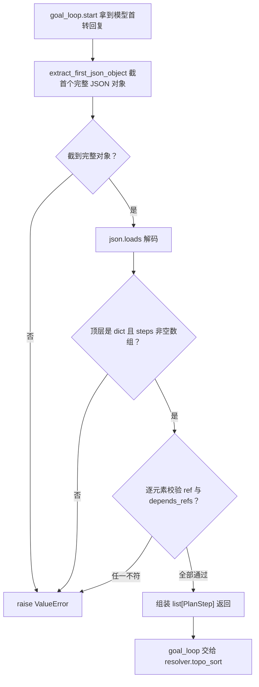

# plans/types.py — plans/types.py

> **文件路径**: `backend/packages/harness/agentflow/plans/types.py`
> **目录位置**: plans → types.py
> **职责**: 步骤计划数据模型 + 模型回复 JSON 容错解析（M5）

## 📑 目录

- [📋 结构图](#📋-结构图)
- [📤 关键导出](#📤-关键导出)
- [💡 设计思想](#💡-设计思想)
- [🎯 实用场景](#🎯-实用场景)
- [📊 顺序执行链流程图](#📊-顺序执行链流程图)
- [🧩 代码解析（成块对照 types.py）](#🧩-代码解析成块对照-typespy)
- [❓ Q&A / 知识点](#❓-qa--知识点)
- [⚠️ 风险点](#⚠️-风险点)

## 📋 结构图

```text
┌──────────────────────────────────────────────────────────┐
│ PlanStep(dataclass)                                       │
│   ref / short_name / description / depends_refs[]          │
│   status: pending|executing|completed|failed               │
│                                                           │
│ extract_first_json_object(text) -> str                    │
│   按花括号配平容错截取首个完整 {...}（judge 也复用）        │
│ parse_steps_json(text) -> list[PlanStep]                  │
│   截 JSON -> json.loads -> 逐元素校验 -> PlanStep          │
│ steps_to_json / steps_from_json                           │
│   落库 plan_steps_json 与断点恢复的双向序列化               │
└──────────────────────────────────────────────────────────┘
extract： 抽取
parse： 解析 剖析
```

**调用链（Grep 自 agentflow. 核实）**：

- **谁调用它**：`agents/goal/goal_loop.py` 调 `parse_steps_json`（首转解析计划）、`steps_to_json`（落计划/步状态）、`steps_from_json`（resume 恢复 steps）；`agents/goal/goal_judge.py` 调 `extract_first_json_object`（判定模型回复同样容错截 JSON）。
- **它调用谁**：仅标准库 `json` + `dataclasses`；不碰 DB、不碰模型。

## 📤 关键导出

**数据类**

- `PlanStep`

**函数**

- `extract_first_json_object()`
- `parse_steps_json()`
- `steps_to_json()`
- `steps_from_json()`

## 💡 设计思想

1. 模型吐 JSON 时常带前后废话（"好的，计划如下：```json …```"），解析器先用
   `extract_first_json_object` 按花括号配平截取首个完整 `{...}`，再 `json.loads`——
   容错是为"模型输出不规范"这件常态事兜底。
2. 步骤用 `ref`（如 `"s1"`）做稳定标识，`depends_refs` 互相引用 ref，而不是数组下标——
   拓扑排序/恢复后数组顺序会变，下标引用会错位，ref 引用才稳定。
3. 解析失败一律 `raise ValueError`（含缺 steps / 缺 ref / 类型错误），由 goal_loop
   捕获后置 goal=failed，本模块不做"悄悄吞错返回空表"。

## 🎯 实用场景

1. 长任务首转：goal_loop 把模型首段回复喂给 `parse_steps_json` 得到结构化步骤。
2. 落库往返：`steps_to_json` 写 `goals.plan_steps_json`，`steps_from_json` 在
   `resume` 时把这段文本还原回 `PlanStep` 列表继续跑。
3. 判定器复用：`goal_judge` 用同一个 `extract_first_json_object` 剥判定模型回复。

## 📊 顺序执行链流程图（goal_loop 首转解析计划时）

```text
goal_loop.start() 拿到模型首转回复 last_ai_text（request：preamble 引导吐 JSON 计划）
│
▼
blob = extract_first_json_object(last_ai_text)
│   find('{') 定位起点；花括号 depth 配平（字符串内括号忽略）截首个完整 {...}
│   找不到起点 / 未闭合 -> raise ValueError
▼
data = json.loads(blob)
│   解码失败 -> raise ValueError（含原 JSONDecodeError）
▼
校验 data 是 dict 且 steps 是非空 list
│   任一不符 -> raise ValueError
▼
逐元素：item 必须是 dict、ref 必须是非空字符串、depends_refs 必须是数组
│   任一不符 -> raise ValueError
▼
组装 list[PlanStep]（status 默认 pending）返回
│   goal_loop 再把它交给 resolver.topo_sort 做拓扑校验
```

**Mermaid 版（GitHub / 飞书渲染；VSCode 需装插件）**：



## 🧩 代码解析（成块对照 types.py）

> 读法：每块先贴**完整代码**，再看块下方的整块解析。代码与文件逐字一致。

### 块 1：imports + PlanStep 数据类

```python
from __future__ import annotations

import json
from dataclasses import dataclass


@dataclass
class PlanStep:
    """单个计划步骤（与 goals.plan_steps_json 数组元素逐字段对齐）。"""

    ref: str  # 步骤唯一编号（如 "s1"）
    short_name: str  # 短名（终端展示用）
    description: str  # 步骤详细描述（nudge 提示词用）
    depends_refs: list[str]  # 前置步骤 ref 列表（空 = 无依赖）
    status: str = "pending"  # pending/executing/completed/failed
```

**结构简析**：依赖极薄——只要 `json`（序列化）和 `@dataclass`。`PlanStep` 是单个计划步骤的数据类，五个字段与 `goals.plan_steps_json` 数组元素逐一对齐（落库/恢复都靠这个形状）；`status` 默认 `"pending"`，四种取值构成步骤级状态机，与 goal 级状态分层。

**`PlanStep()` 字段逐条解释**：

| 参数 | 类型 | 默认值 | 含义 |
|---|---|---|---|
| `ref` | `str` | 必填 | 步骤唯一编号（如 `"s1"`），稳定主键；resolver 按它查重、建依赖图 |
| `short_name` | `str` | 必填 | 短名，终端展示用 |
| `description` | `str` | 必填 | 步骤详细描述，作为 nudge 提示词喂给 agent |
| `depends_refs` | `list[str]` | 必填 | 前置步骤 ref 字符串列表；空 list = 无依赖 |
| `status` | `str` | `"pending"` | 步骤级状态机：`pending`/`executing`/`completed`/`failed` |

**落库要点**：五字段形状即 `_step_to_dict` 序列化出的 dict 形状，落库 `goals.plan_steps_json` 与断点恢复靠它严格对称。

### 块 2：`extract_first_json_object` —— 容错截取首个完整 JSON 对象

```python
def extract_first_json_object(text: str) -> str:
    """从模型回复里容错截取首个完整 JSON 对象文本（按花括号配平，忽略字符串内括号）。

    找不到 / 未闭合 → raise ValueError。
    """
    raw = str(text or "")
    start = raw.find("{")
    if start == -1:
        raise ValueError("回复中找不到 JSON 对象起点 '{'")
    depth = 0
    in_str = False
    esc = False
    for i in range(start, len(raw)):
        ch = raw[i]
        if in_str:
            if esc:
                esc = False
            elif ch == "\\":
                esc = True
            elif ch == '"':
                in_str = False
            continue
        if ch == '"':
            in_str = True
        elif ch == "{":
            depth += 1
        elif ch == "}":
            depth -= 1
            if depth == 0:
                return raw[start : i + 1]
    raise ValueError("JSON 对象未闭合（花括号不匹配）")
```

**结构简析**：手写一个花括号配平扫描器，从模型回复里剥出首个完整 `{...}`。关键在 `in_str`/`esc` 两个状态位——遇到 `"` 进入字符串态，字符串里的 `{}` 不再计数，遇到 `\\` 还要跳过转义引号，这样 `"{"` 这类字符串内容不会误触发 depth。judge 复用同一函数，"模型回复剥 JSON"只有一处实现。

**`extract_first_json_object()` 参数逐条解释**：

| 参数 | 类型 | 默认值 | 含义 |
|---|---|---|---|
| `text` | `str` | 必填 | 模型原始回复文本；先经 `str(text or "")` 兜底 None/空串，再 `find("{")` 定位起点 |

**落库要点**：纯函数不碰 DB。找不到 `{` 起点或扫完花括号未配平均 `raise ValueError`（"找不到起点"/"未闭合"），不吞错。

### 块 3：`parse_steps_json` —— 解析成 PlanStep 列表

```python
def parse_steps_json(text: str) -> list[PlanStep]:
    """把模型首转回复解析成 PlanStep 列表。

    期望 JSON 形状: {"steps": [{"ref":"s1","short_name":...,"description":...,
                               "depends_refs":[...]}, ...]}
    解析失败（无 JSON / 结构不符 / 缺必填 ref）→ raise ValueError。
    """
    blob = extract_first_json_object(text)
    try:
        data = json.loads(blob)
    except json.JSONDecodeError as exc:
        raise ValueError(f"JSON 解码失败: {exc}") from exc
    if not isinstance(data, dict):
        raise ValueError("JSON 顶层必须是对象")  # noqa: TRY004
    raw_steps = data.get("steps")
    if not isinstance(raw_steps, list) or not raw_steps:
        raise ValueError("缺少非空 'steps' 数组")
    steps: list[PlanStep] = []
    for item in raw_steps:
        if not isinstance(item, dict):
            raise ValueError("steps 元素必须是对象")  # noqa: TRY004
        ref = item.get("ref")
        if not isinstance(ref, str) or not ref.strip():
            raise ValueError("每个步骤必须有非空字符串 ref")
        deps = item.get("depends_refs", [])
        if not isinstance(deps, list):
            raise ValueError("depends_refs 必须是数组")  # noqa: TRY004
        steps.append(
            PlanStep(
                ref=ref.strip(),
                short_name=str(item.get("short_name", "") or ""),
                description=str(item.get("description", "") or ""),
                depends_refs=[str(d) for d in deps],
            )
        )
    return steps
```

**结构简析**：三段式校验——①先截 blob 再 `json.loads`（解码失败包成 ValueError）；②顶层必须是 dict 且 `steps` 为非空 list；③逐元素校验 item 是 dict、`ref` 非空字符串、`depends_refs` 是 list。宽松处在于 short_name/description 缺省补空串、deps 逐项 `str()` 强转。

**`parse_steps_json()` 参数逐条解释**：

| 参数 | 类型 | 默认值 | 含义 |
|---|---|---|---|
| `text` | `str` | 必填 | 模型首转回复；内部先过 `extract_first_json_object` 截首个完整 JSON 对象再 `json.loads` |

**落库要点**：纯函数不碰 DB。只校验 `ref` 存在，**不校验 deps 指向的 ref 是否真存在**——未知依赖的校验下放给 `resolver.topo_sort`（职责分离）；任一步不符即 `raise ValueError`，由 goal_loop 捕获后置 goal=failed。

### 块 4：`steps_to_json` / `steps_from_json` / `_step_to_dict` 序列化往返

```python
def steps_to_json(steps: list[PlanStep]) -> str:
    """PlanStep 列表 → JSON 字符串（落库 plan_steps_json 用）。"""
    return json.dumps([_step_to_dict(s) for s in steps], ensure_ascii=False)


def steps_from_json(blob: str) -> list[PlanStep]:
    """plan_steps_json 文本 → PlanStep 列表（断点恢复用）。"""
    data = json.loads(blob or "[]")
    out: list[PlanStep] = []
    for item in data:
        out.append(
            PlanStep(
                ref=item["ref"],
                short_name=item.get("short_name", ""),
                description=item.get("description", ""),
                depends_refs=list(item.get("depends_refs", [])),
                status=item.get("status", "pending"),
            )
        )
    return out


def _step_to_dict(s: PlanStep) -> dict:
    return {
        "ref": s.ref,
        "short_name": s.short_name,
        "description": s.description,
        "depends_refs": list(s.depends_refs),
        "status": s.status,
    }


# field 占位：避免 dataclass 未用 import 告警（保持显式）
__all__ = [
    "PlanStep",
    "extract_first_json_object",
    "parse_steps_json",
    "steps_from_json",
    "steps_to_json",
]
```

**结构简析**：PlanStep 列表与 JSON 文本的双向序列化往返。`steps_to_json` 走 `_step_to_dict` 把状态一起序列化（落库的是"带进度"的 steps，不是裸计划）；`steps_from_json` 反向还原。双向形状必须严格对称——这是断点恢复能"从 SQL 里把进度读回来"的契约。

**`steps_to_json()` 参数逐条解释**：

| 参数 | 类型 | 默认值 | 含义 |
|---|---|---|---|
| `steps` | `list[PlanStep]` | 必填 | 待序列化步骤列表；逐个经 `_step_to_dict` 转 dict 后 `json.dumps(..., ensure_ascii=False)`，中文直接可读 |

**`steps_from_json()` 参数逐条解释**：

| 参数 | 类型 | 默认值 | 含义 |
|---|---|---|---|
| `blob` | `str` | 必填 | `plan_steps_json` 文本；`blob or "[]"` 兜住空串/None（刚 create 的 goal 是 `"[]"`），逐元素还原 PlanStep，`status` 缺省回 `"pending"` |

**`_step_to_dict()` 参数逐条解释**：

| 参数 | 类型 | 默认值 | 含义 |
|---|---|---|---|
| `s` | `PlanStep` | 必填 | 单个步骤；转 dict 时连 `status` 一起序列化（ref/short_name/description/depends_refs/status 五键） |

**落库要点**：`steps_to_json` 写 `goals.plan_steps_json`，`steps_from_json` 在 resume 时把这段文本还原回 `PlanStep` 列表继续跑；`steps_from_json` 直接 `item["ref"]` 取键，落库损坏（缺 ref）会 KeyError，依赖"计划期已 topo_sort 校验过"这一前提。

## ❓ Q&A / 知识点

### 1. parse_steps_json 为什么要先容错截取首个 JSON 对象，而不是直接 json.loads 整段回复？

**一句话**：模型首转几乎从不只吐纯 JSON，前后一定有废话/markdown 围栏，整段 loads 必崩。

模型回复典型长这样：`"好的，计划如下：\n```json\n{\"steps\":[...]}\n```"`。直接
`json.loads` 会把前面的"好的，计划如下"和后面的围栏一起喂进去直接抛错。`extract_first_json_object`
按花括号配平把中间那个 `{...}` 精准切出来再解码，等于给"模型输出不规范"这个常态打了个不挑剔的
补丁。代价是只认**第一个** JSON 对象——模型要是先吐一段示例 JSON 再吐真计划，会截错（风险点 2）。

### 2. 步骤间依赖为什么用 ref（"s1"）而不是数组下标引用？

**一句话**：拓扑排序和断点恢复都会改变数组顺序，下标会错位，字符串 ref 引用才稳定。

如果依赖写成 `[0, 2]`（指向第 0、2 步），一旦 `topo_sort` 把数组重排成可执行顺序，或者
恢复后数组被追加/重置，"第 0 个元素"指的步骤就变了，依赖关系全乱。用 `depends_refs=["s1"]`
这种**按名字引用**，无论数组怎么排，`by_ref` 查表都能定位到同一步。这也是 `PlanStep.ref`
被 `topo_sort` 强制要求唯一的原因。

### 3. `depends_refs` 里到底填什么字符串？具体怎么写？

**填的是"同计划内其它步骤的 `ref` 编号"**——不是步骤描述、不是自然语言、不是数组下标。

每个步骤自己有一个唯一 `ref`（模型生成计划 JSON 时定义，如 `"s1"`/`"s2"`）；
`depends_refs` 就是把"我依赖谁"写成"那几步的 ref"的列表。

一个 3 步计划实例（模型吐出的 JSON）：

```json
{
  "steps": [
    {"ref": "s1", "short_name": "调研", "description": "收集需求", "depends_refs": []},
    {"ref": "s2", "short_name": "写方案", "description": "产出方案文档", "depends_refs": ["s1"]},
    {"ref": "s3", "short_name": "评审", "description": "评审并定稿", "depends_refs": ["s2"]}
  ]
}
```

逐行读法：

| 步骤 | depends_refs | 含义 |
|---|---|---|
| s1 | `[]` | 无前置依赖，可最先执行 |
| s2 | `["s1"]` | s1 **完成后**才能开始（s1 的 ref 就是 "s1"） |
| s3 | `["s2"]` | s2 完成后才能开始，形成链 s1→s2→s3 |

执行时 `resolver` 的 `topo_sort` 按这张依赖表排可执行顺序：先 s1 → 再 s2 → 最后 s3。

两点关键细节：

1. **谁负责填**：模型生成计划时自己写 `ref` 和 `depends_refs`（ref 即它起的名）；
   `parse_steps_json` 只校验"是字符串列表"，**不查 ref 是否真实存在**——指向未声明的 ref
   （如 `["s9"]`）由 `resolver.topo_sort` 抛 `PlanCycleError` 拦截（见块 3 与风险点 2）。
2. **为什么用 ref 不用下标**：`topo_sort` 会把步骤数组重排成可执行顺序，若依赖写
   `[0, 2]`（下标），重排后"第 0 个"就指错了步骤；用 `["s1"]` 按名字引用，
   无论数组怎么排都能定位到同一步（即上方 Q&A 2 的完整解释）。

## ⚠️ 风险点

1. `extract_first_json_object` 只截**第一个** `{...}`：模型若先输出示例 JSON 再输出真计划，
   会截到错误对象（parse_steps_json 失败 -> goal=failed）。
2. `parse_steps_json` 不校验 `depends_refs` 指向的 ref 是否存在——非法引用靠
   `resolver.topo_sort` 拦截，两者必须配套使用，单独调 parse 会漏。
3. `steps_from_json` 直接 `item["ref"]` 取键，不落库损坏（缺 ref）会 KeyError；恢复路径
   依赖"计划期已 topo_sort 校验过"这一前提。
4. 解析失败一律 raise，goal_loop 捕获后置 failed——本模块不吞错，调用方必须 try。

---
_2026-10-02 新建：M5 文档（目录 + 流程图 + 成块代码解析 + Q&A）。_

_2026-10-03 重构：代码解析段按「结构简析 + 参数逐条表格 + 落库要点」规范化（代码块零改动）。_

_2026-10-05 追加：Q&A 3（depends_refs 填什么——同计划内其它步骤的 ref 编号 + 3 步实例 + 未知 ref 由 topo_sort 拦截）。_
